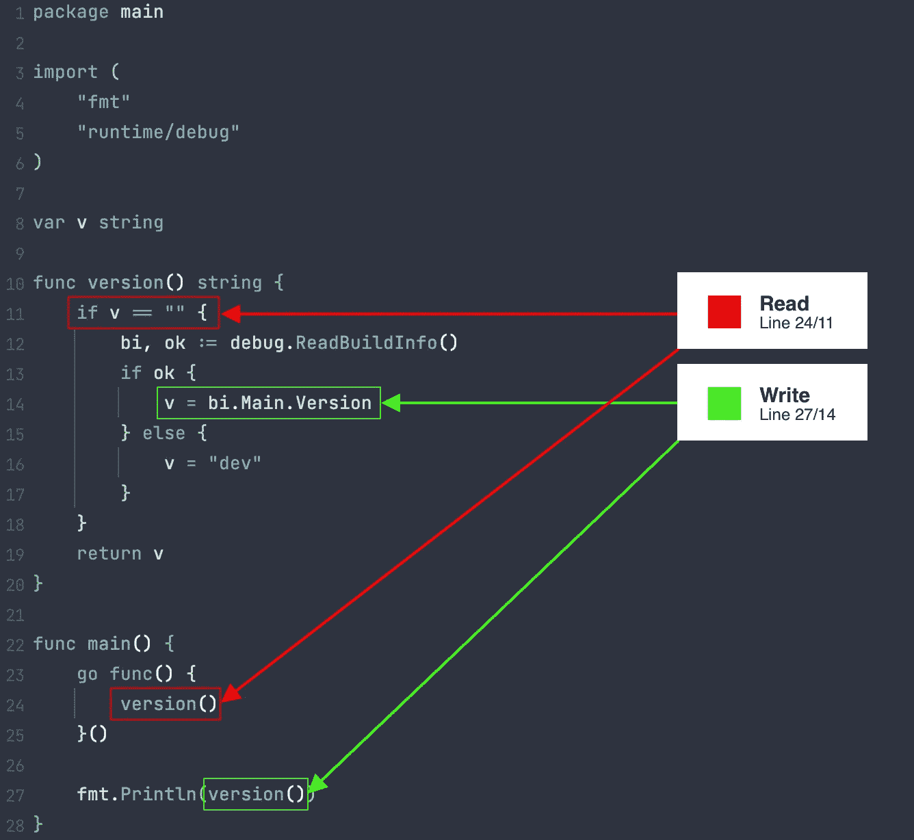

# 围棋中的并发很难

> 原文：<https://blog.devgenius.io/concurrency-in-go-is-hard-57500304650?source=collection_archive---------0----------------------->

我知道这个标题可能有些混乱，因为 Go 通常以对并发性的良好内置支持而闻名。但是，我不一定认为在 Go 中写并发软件很容易。让我告诉你我的意思。

# 使用全局变量

第一个例子是我们在一个项目中遇到的事情。直到最近， [sarama](https://github.com/Shopify/sarama) 库(Apache Kafka 的 Go 库)包含以下代码段(在`sarama/version.go`):

```
package sarama

import "runtime/debug"

var v string

func version() string {
    if v == "" {
        bi, ok := debug.ReadBuildInfo()
        if ok {
            v = bi.Main.Version
        } else {
            v = "dev"
        }
    }
    return v
}
```

乍一看，这看起来很好，对不对？如果版本不是全局设置的，它要么基于构建信息，要么分配给一个静态值(`dev`)。否则，版本按原样返回。当我们运行这段代码时，它看起来像预期的那样工作。

然而，当并发调用`version`函数时，全局变量`v`可能会被多个 goroutines 同时访问，从而导致潜在的数据竞争。这些问题很难追踪，因为它们只在运行时的正确条件下发生。

## 解决方案

这个问题在 [#2171](https://github.com/Shopify/sarama/pull/2171) 中通过使用`sync.Once`得到了修复，根据文档，它是“一个只执行一个动作的对象”这意味着我们可以用它来设置一次版本，这样对`version`函数的后续调用就会返回结果。修复如下所示:

```
package sarama

import (
    "runtime/debug"
    "sync"
)

var (
    v     string
    vOnce sync.Once
)

func version() string {
    vOnce.Do(func() {
        bi, ok := debug.ReadBuildInfo()
        if ok {
           v = bi.Main.Version
        } else {
           v = "dev"
        }
    })
    return v
}
```

虽然我认为在这种情况下，它也可以不使用`sync`包，通过使用`init`函数设置变量`v`一次来修复。由于变量`v`在 Go 运行`init`函数后不会改变，所以应该没问题。

## 如何预防

如果您只想启动应用程序，可以在测试期间或使用`go run`时使用[数据竞争检测器](https://go.dev/doc/articles/race_detector)(从 Go 1.1 开始可用[)。当它检测到潜在的数据竞争时，它将打印一个警告。为了展示这是如何工作的，我稍微修改了一下代码，以触发数据竞争:](https://go.dev/blog/race-detector)

```
package mainimport (
    "fmt"
    "runtime/debug"
)var v stringfunc version() string {
    if v == "" {
        bi, ok := debug.ReadBuildInfo()
        if ok {
            v = bi.Main.Version
        } else {
            v = "dev"
        }
    }
    return v
}func main() {
    go func() {
        version()
    }() fmt.Println(version())
}
```

现在我们可以用`-race`标志运行它来启用竞争检测器:

```
➜ go run -race .                               
==================
WARNING: DATA RACE
Write at 0x000104a16b90 by main goroutine:
  main.version()
      main.go:14 +0x78
  main.main()
      main.go:27 +0x30Previous read at 0x000104a16b90 by goroutine 7:
  main.version()
      main.go:11 +0x2c
  main.main.func1()
      main.go:24 +0x24Goroutine 7 (finished) created at:
  main.main()
      main.go:23 +0x2c
==================
(devel)
Found 1 data race(s)
exit status 66
```

如您所见，检测到了数据竞争。如果我们分析输出，我们可以看到我们同时读写了`v`变量。这就是我们所说的数据竞赛。这被称为数据竞争，因为两个 goroutines 都在“竞争”访问相同的数据。



竞争检测器输出的可视化表示

# 从同步包中复制结构

我确实在 GitHub 上找到了一些真实世界的例子，但是没有一个值得在这里提及。相反，我将根据我制作的一个示例来解释这一点。所以是这样的:

```
package mainimport "sync"type User struct {
    lock sync.RWMutex
    Name string
}func doSomething(u User) {
    u.lock.RLock()
    defer u.lock.RUnlock() // do something with `u`
}func main() {
    u := User{Name: "John"} doSomething(u)
}
```

结构包含两个属性:一个读/写锁和一个字符串。当调用`doSomething`函数时，变量`u`被复制到堆栈上(也称为通过值传递)，包括它的字段。这是一个问题，因为正如 sync 包的文档所述:

> 包同步提供了基本的同步原语，如互斥锁。除了 Once 和 WaitGroup 类型之外，大多数类型都是供低级库例程使用的。更高级别的同步最好通过信道和通信来完成。
> 
> **不应复制包含此包中定义的类型的值。**

当对`doSomething`函数求值时，运行`RLock` / `RUnlock`不会影响`User`结构中的原始锁，使其无效。

## 解决方案

请改用指向锁的指针。指针将被复制并指向相同的值。更新后的版本如下所示:

```
type User struct {
    lock *sync.RWMutex
    Name string
}
```

## 如何预防

当从`sync`封装中复制类型时，使用 [copylock analyzer](https://pkg.go.dev/golang.org/x/tools/go/analysis/passes/copylock) 显示警告。最简单的方法是在发布代码之前运行`go vet`。对原始代码运行此命令会产生以下输出:

```
➜ go vet .
# data-synchronization
./main.go:10:20: doSomething passes lock by value: data-synchronization.User contains sync.RWMutex
./main.go:20:14: call of doSomething copies lock value: data-synchronization.User contains sync.RWMutex
```

# 利用时间。在...之后

在 GitHub 上搜索时，我在 Hashicorp (一种分布式共识算法)的 [Raft 实现中发现了一个](https://github.com/hashicorp/raft) [pull 请求](https://github.com/hashicorp/raft/pull/484)，我们可以用它来演示下面的问题。让我们从显示代码开始(在`api.go`):

```
var timer <-chan time.Time
if timeout > 0 {
    timer = time.After(timeout)
}

// Perform the restore.
restore := &userRestoreFuture{
    meta:   meta,
    reader: reader,
}
restore.init()
select {
case <-timer:
    return ErrEnqueueTimeout
case <-r.shutdownCh:
    return ErrRaftShutdown
case r.userRestoreCh <- restore:
    // If the restore is ingested then wait for it to complete.
    if err := restore.Error(); err != nil {
        return err
    }
}
```

这段代码来自于`Restore`方法。select 语句等待下列情况之一:计时器(用于定义超时时间)、关闭通道或还原操作完成时。这很简单，那么问题是什么呢？

`time.After`函数看起来像这样:

```
func After(d Duration) <-chan Time {
    return NewTimer(d).C
}
```

所以它只不过是`time.NewTimer,`的简写，但是它“泄露”了计时器(因为没有对`timer.Stop`的调用)。文档对此做了如下描述:

> 之后等待持续时间过去，然后在返回的信道上发送当前时间。它等效于 NewTimer(d).C。在计时器触发之前，垃圾收集器不会恢复基础计时器。如果效率是一个问题，请使用 NewTimer 并调用 Timer。如果不再需要计时器，请停止。

我真的不明白一个故意“泄露”计时器的函数(导致潜在的长期分配，取决于持续时间)怎么会出现在标准库中…

## 解决方案

我们可以手动创建定时器，而不是使用`time.After`。看起来是这样的:

```
var timerCh <-chan time.Time
if timeout > 0 {
    timer := time.NewTimer(timeout)
    defer timer.Stop()
    timerCh = timer.C
}// Perform the restore.
restore := &userRestoreFuture{
    meta:   meta,
    reader: reader,
}
restore.init()
select {
case <-timerCh:
    return ErrEnqueueTimeout
case <-r.shutdownCh:
    return ErrRaftShutdown
case r.userRestoreCh <- restore:
    // If the restore is ingested then wait for it to complete.
    if err := restore.Error(); err != nil {
        return err
    }
}
```

当函数完成时，即使定时器没有触发，它也会被清除。

## 如何预防

我不会在任何代码库中使用`time.After`。除了节省一两行代码之外，并没有什么真正的好处，尽管它可能会带来一些问题，主要是在代码的热路径中使用时。

# 结论

利用 Go 内置的对并发的支持，可以快速编写并发软件。然而，它让用户来确保数据正确同步，并且标准库中的工具按预期使用。这一点，再加上 Go 的简单性，使得编写稳定、无错误的并发软件变得困难。