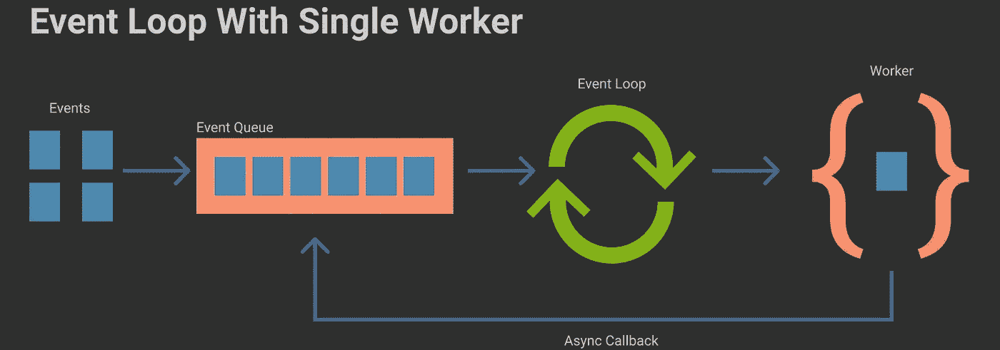
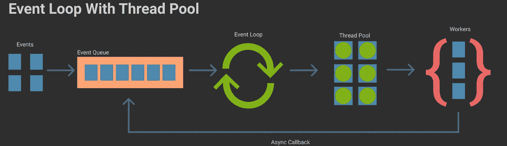

# 并发、多线程、多处理、异步编程和事件循环

> 原文：<https://blog.devgenius.io/concurrency-multi-threading-multi-processing-asynchronous-programming-and-event-loop-1b8df9fa6c20?source=collection_archive---------1----------------------->

像`concurrency`、`multi-threading`、`multi-processing`、`asynchronous programming`和`event loop`这样的概念之间的关系可能会混淆。尤其是哪些技法可以达到`concurrency`。这篇文章试图用简单直观的方式来解释它们。

首先，`concurrency`是一个人有能力处理多项任务`out-of-order`的概念。这里`out-of-order`是关键，不代表它们同时处理，也不代表它们同时开始或结束。这捕获了可以实现`concurrency`的各种各样的技术，包括`multi-threading`、`multi-processing`和`asynchronous programming`。

现在我们来看看什么是`multi-threading`和`multi-processing`。我将它们分组是因为它们与`asynchronous programming`和`event loop`相似。从文字中可以很清楚地看出，它们允许同时使用多个`threads`或`processes`来执行任务。它们是实现`concurrency`的不同技术，区别不在本文讨论范围之内。你可以参考参考书来了解详情。

`Asynchronous programming`是一种将某些任务推迟到以后，并允许主线程处理其他任务的技术。最常见的例子是`node.js`使用的异步 I/O。在`node.js`中，它将 I/O 操作交给 OS 内核，并将 I/O 操作的回调推迟到以后。这允许`node.js`在 I/O 操作移交给操作系统后立即处理其他任务，而不需要等到操作系统完成 I/O 任务。这是`node.js`的`concurrency`的核心部分。你可能知道，`Javascript`和`node.js`是单线程的。这向您展示了即使是单线程系统也可以有`concurrency`。有些人可能会说`asynchronous programming`没有提供`concurrency`，这取决于`task`的定义是什么。如果人们把`callbacks`定义为独立的`tasks`，那么他们是正确的。因为正如您将在后面的图表中看到的，当我们讨论`event loop`时，`callbacks`只不过是被推到事件队列中的任务。在这个定义中，`tasks`没有被执行`out-of-order`。按照惯例，大多数人将`callbacks`视为推迟到以后完成的原始任务的一部分。所以他们考虑将这个任务分成几个部分，在其他任务中执行`out-of-order`，这就形成了这样的系统`concurrent`。我同意`asynchronous programming`提供`concurrency`的说法。

最后我们来看`event loop`。`Event loop`是一种在系统中等待和调度事件的设计模式。当它与`Asynchronous programming`和`multi-processing`等技术一起使用时，它也为系统提供了`concurrency`。而`event loop`通常由一个队列(例如 FIFO 队列)、一个循环和工人构成。让我们看一个简单的`event loop`，图中只显示了一个工人。事件被推送到事件队列中，`event loop`从事件队列中取出事件，并将它们分派给 worker。在这种情况下，让我们假设队列是 FIFO 队列，在这样的系统中，事件是逐个处理的，没有`concurrency`。如果我们将`Asynchronous programming`添加到图片中，正如您可以在底部看到的行，worker 将`callback`事件添加回事件队列。这提供了`concurrency`，即使只有一个工作者或线程。这就是你调用`setTimeout(myCallback, 100)`时的情况。在场景后面，工作人员在 100ms 后将`myCallback`推到事件队列中。现在你明白为什么传递给`setTimeout()`的`myCallback`不会正好在 100ms 后被调用了吧？这是因为在`myCallback`之前，队列中可能还有其他事件需要处理。100ms 是`myCallback`执行前需要等待的最短时间。现在你也明白人们为什么用`setTimeout(myCallback, 0)`了吧。这并不意味着 0ms 后会立即调用`myCallback`的意思。这是一种释放主工作者(线程)来处理队列中的其他事件并将`myCallback`推迟到以后的技术。

`Event loop`也可以用`multi-threading`。用户可以简单地在系统中添加更多的工人和线程轮询，如下图所示。唯一的区别是，现在可以从事件队列中取出多个事件，并由不同线程中的不同工作者同时处理。

一个人可以很有创造力，在他们认为合适的时候扩展`event loop`。以`node.js`为例，它将整个`event loop`分为多个阶段，每个阶段本身就像一个更小的`event loop`。如果想了解更多，可以参考最后的参考。