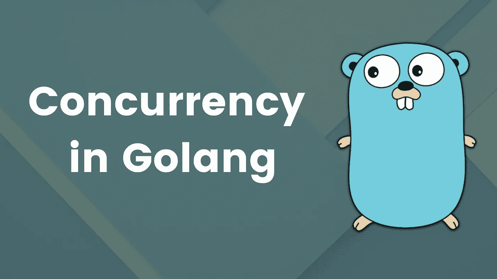
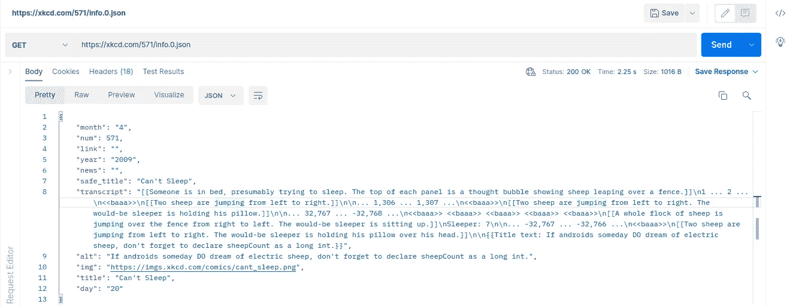

# Golang 中的并发性[示例项目]

> 原文：<https://blog.devgenius.io/concurrency-with-sample-project-in-golang-297400beb0a4?source=collection_archive---------1----------------------->



我来自 PHP 背景，在检查了语法并用它构建小项目后，我立刻爱上了 Go。对我来说最突出的是 Go 中低级操作的简单方法，从引用和指针到并发。

在本文中，我将借助一个小工具来分享我在并发性方面的经验。该程序从 xkcd comics 网站获取问题，并下载每个 URL 来建立离线 JSON 索引。在撰写本文时，有超过 2500 个漫画(网址)可供下载。

# 为什么是并发？

关于 Go 的并发特性已经写了很多，所以我将分享我的经验，我知道它对这个项目有什么帮助。如前所述，xkcd 网站有超过 2500 部漫画可供下载。要按顺序执行此操作(即一次一个)，需要很长时间(可能几个小时)。如果你碰巧非常有耐心，由于网站上的限速功能等因素，操作失败的可能性仍然很高。顺序下载这个资源没有任何意义(相信我，我已经试过了)。

通过使用并发模型，我能够实现一个 Worker pool(稍后解释)来一次处理多个 HTTP 请求，保持连接活动并在很短的时间内获得多个结果。

这个并发模型是什么？在 Go 中，它只是创建多个 goroutines 来处理部分流程。一个 [goroutine](https://go.dev/tour/concurrency/1) 是 Go 实现并发的方式。它们是与其他功能同时运行的功能。一个 goroutine 可以比作一个轻量级线程(虽然它不是一个线程，因为许多 go routine 可以在一个线程上工作),这使得它更轻，更快，更可靠。您可以在一个程序中创建多达一百万个 goroutines。当两个或多个 goroutines 运行时，它们需要一种相互通信的方式。这就是**频道**的用武之地。

为了构建这个程序，我们很大程度上依赖于 goroutines 和 channels，为了保持本文的重点，我将在下面留下一些链接来更好地解释这些基本概念。

# 规划和设计

xkcd 网站有一个 JSON 接口，允许外部服务使用它们的 API。我们将从这个界面下载数据来构建我们的离线索引。



问题#571 的样本请求

基于上面的输出，我们可以设计我们的结构。这个结构将被用作我们想要提取哪些数据用于 JSON 处理的模型:

# 拿漫画

现在，在我们进入并发之前，我们想建立一个服务于应用程序核心目的的函数——获取漫画。该功能必须独立于我们的架构，并为整个程序的重用提供空间。我将在下面解释每个步骤:

首先，我们创建一个定制的 HTTP 客户端，并将超时设置为 5 秒。在使用 strings 包连接字符串之后，我们创建一个新的请求，并使用之前创建的客户机发送它。如果请求成功，我们将来自 JSON 的数据解码成本地结构。然后我们关闭响应体并返回一个指向结构体的指针。

# 确认它有效

到目前为止，我们已经实现了应用程序的核心结构。让我们运行这一部分，以确保我们的代码按预期工作。以下是目前为止完整的代码:

标题的预期输出是“Bill Nye”，这是第 200 期的标题。您可以更改问题编号以进一步验证。

# 频道设置

如前所述，我们将创建一个工作线程池来并发处理这些操作。为此，我们必须建立缓冲通道。缓冲通道只是一个具有特定容量的通道。对于缓冲通道，当缓冲区已满时，发送操作被阻塞，当缓冲区为空时，接收操作被阻塞。我们需要这个特性，因为在工人池中，我们将多个工作分配给许多工人，并且我们希望确保以有组织的方式处理这些工作。一个例子:

```
ch := make(chan int, 6)
```

如果我们的工人池中有 6 个工人，这个缓冲通道将确保在每个时间点，最多有 6 个作业分配给这 6 个工人。

在创建了缓冲通道并设置了最终结果变量之后，我们创建了一个向作业通道分配作业的函数。正如所料，当 i = 100 时，这个函数将被阻塞，这意味着在 worker 收到一个作业之前，不会添加新的作业。分配完所有可用作业后，作业通道将关闭，以避免进一步的写入。

# 创建工人池

一个 worker pool 维护多个线程(或者在我们的例子中是 goroutines ),并等待分配给它们的任务(作业)。例如，假设我们有 1000 份工作。我们创建了一个工人池，产生了 100 名工人。如果作业通道的缓冲容量为 100，那么工人接收这 100 个作业，随着一些作业的处理完成，新的作业被分配给工人，以此类推。

我们的 worker pool 将利用 Go 的 [WaitGroup](https://pkg.go.dev/sync#WaitGroup) ，这是一个同步原语(类型)，它告诉主 goroutine 等待一个 Go routine 集合完成。

这个项目有一个简单的实现:

在代码中，我们首先定义一个工人函数。工作线程从分配的作业通道获取作业，处理结果，并将值传递给结果通道。在 createWorkerPool 函数中，我们使用 WaitGroup 原语来设置一个工作池。工作组。Add(1) call 使 WaitGroup 计数器递增。如果程序要停止运行，计数器必须为零(这就是为什么我们有 wg。Wait()调用)。工作组。worker 函数中的 Done()调用使计数器递减，如果所有操作都完成了，控制将返回到主 goroutine，结果通道将关闭以防止进一步的写操作。

# 得到结果

结果将被添加到我们创建的结果频道中。但是，它是缓冲的，一次只能接受 100 个。我们需要一个单独的 goroutine 来检索结果，并为其他结果留出空间。我们是这样做的:

如果来自结果通道的结果是有效的，我们将它追加到结果集合中。我们有一个名为“done”的布尔通道；我们将使用它来检查是否所有的结果都经过了整理。

# 把所有的放在一起

我们有一堆函数、变量和类型声明，但是我们如何把它们放在一起呢？首先执行哪个函数，为什么？在这最后一部分，我们将看到这一切是如何结合在一起的。

下面是主函数的代码:

首先，我们分配工作。我们使用 3000 是因为在写作时，xkcd 有超过 2500 期漫画，我们想确保我们得到所有的漫画。

> ***练习*** : *创建一个小程序，告诉你 xkcd 网站上到底有多少期，这样就不需要估计了。*

*   为了分配，我们启动了一个 goroutine。请注意，一旦有 100 个作业添加到通道中，这个 goroutine 就会阻塞。它将等待另一个 goroutine 读取 jobs 频道。
*   我们开始收集结果。为什么现在这么做？结果频道目前是空的。试图从中读取数据将阻塞例程，直到数据被写入通道。
*   这使得 2 个 goroutines 被阻塞并等待读写操作。
*   我们创建工人池。这产生了许多工人(在我们的例子中有 100 人)，他们从作业通道中读取数据，并向结果通道中写入数据。
*   这开始满足我们之前的两个阻塞的 goroutines。
*   我们获取“done”布尔通道的值，以确保收集了所有结果。
*   然后我们转换成 JSON，并将数据写入文件。

# 完全码

以下是该项目的完整代码:

在这里举办:[https://github.com/joshuaetim/xkcd](https://github.com/joshuaetim/xkcd)

你可以改变你要下载的漫画(作业)数量，或者改变工人数量，看看对速度的影响。作为一个练习，考虑一个具有慢速互联网连接的设备。如何避免超时错误？

这使我们结束了这次旅行。我希望你学到了更多关于 Go 中并发工作的知识。如果你有兴趣了解更多，我在这篇文章的底部附上了一些链接。

# 有用的链接

[](https://golangbot.com/buffered-channels-worker-pools/) [## Go-golangbot.com 中的缓冲通道和工作池

### 欢迎来到 Golang 教程系列第 23 号教程。我们在上一个教程中讨论的所有通道都是…

golangbot.com](https://golangbot.com/buffered-channels-worker-pools/) [](https://en.wikipedia.org/wiki/Thread_pool) [## 线程池-维基百科

### 在计算机编程中，线程池是一种软件设计模式，用于在线程池中实现并发执行

en.wikipedia.org](https://en.wikipedia.org/wiki/Thread_pool)  [## Go 之旅——并发游乐场

### 编辑描述

go.dev](https://go.dev/tour/concurrency/1)