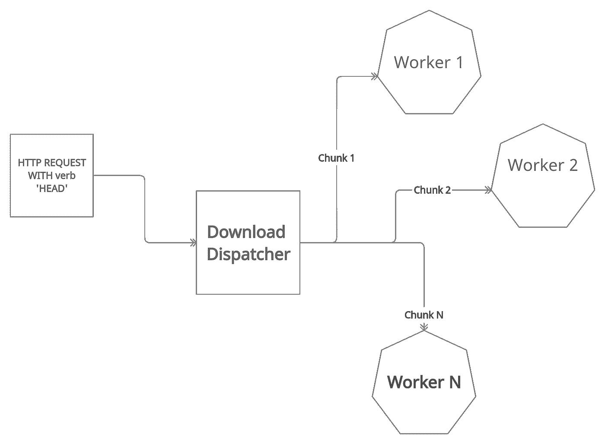
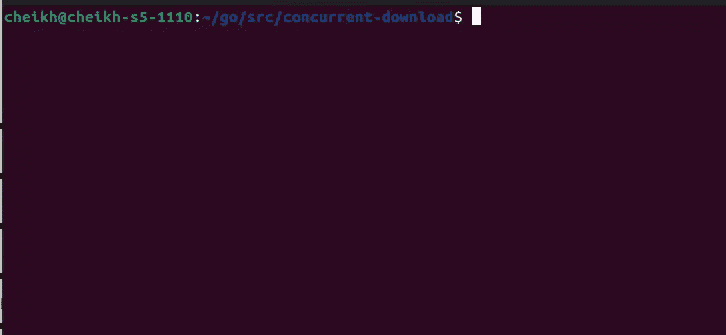

# Go 并发文件下载。

> 原文：<https://blog.devgenius.io/concurrent-file-download-with-go-495d7b946492?source=collection_archive---------2----------------------->

## 我下载数据并合并的方法。

图片由 [Shuaib Khokhar](https://unsplash.com/@shuaibk) 通过 unsplash 提供。

独立的下载管理器在 21 世纪初很流行。这是由于缓慢和不稳定的互联网。一般来说，下载管理器允许用户暂停下载。一个内置浏览器下载选项后来被采用。独立的下载管理器也更擅长处理网络错误，因为你可以从下载停止的地方继续下载。近年来，浏览器开始内置下载管理器，导致独立的下载管理器不再流行。在这篇文章中，我将尝试构建一个并发文件下载程序。目的是创建一个下载工具，它可以处理错误，而无需重新启动整个下载。这将通过分块下载文件来实现。因为我是成块下载的，所以让它并发是很自然的。

# 这个想法

我的想法是从用动词`HEAD`向下载 URL 发出 HTTP 请求开始的。在某些服务器上，返回的头之一是`Content-Length`。这个文件头以字节为单位指定了文件的大小。一旦知道了文件大小，我将分派多个 Goroutines，每个 Goroutines 都分配有一个要下载的数据范围。Goroutine 将使用动词`GET`对 URL 执行 HTTP 请求，以执行下载。该请求将具有报头`Range`。这个头将告诉服务器要返回多少文件。在 Goroutine 完成下载后，数据将通过 channel 发送回来。一旦所有的 Goroutines 都完成了，我将连接数据并写出文件。下图说明了下载是如何分派的:

# 代码

首先，我将为工具定义常量变量。以下是我的常数:

接下来，我将定义一个结构类型。我将使用这个结构作为通道类型。该结构将有两个字段。一个用于存放数据，另一个指定其在最终文件中的位置。这种类型的定义如下:

我将继续定义一个“字节数组”的数组。这个数组将存放我的文件的不同部分。我用固定长度来定义它。接下来，我将导入`net/http`来执行初始请求。该请求将有动词`HEAD`，因为我只是试图获取文件的信息。一旦请求完成，我将检查名为`Content-Length`的头，如果头不存在，程序将出错退出。如果头文件存在，我将用文件大小除以工作线程数。得到的数字将是一个块的大小。下面是执行此操作的代码:

为了执行实际的下载，我将添加一个名为`download`的函数。该函数将有 3 个参数:

*   `index int`:指定该函数将下载文件的哪一部分。
*   `size int`:文件块的大小。
*   `c chan Part`:用于将数据返回给调用 Goroutine 的线程的通道。

该函数将在下载请求中添加标题`Range`。这个头文件将指定获取文件的哪些部分。一旦 HTTP 请求完成，数据就被写入通过函数调用传递的通道。下面是功能`download`的代码:

回到主线程，我将用一个循环启动 workers。发送后，我会读取发送到频道的数据。返回的数据将有字段`Index`。该字段将指定数据在最终文件中的位置。在通道写入数等于工作线程数后，我将停止读取数据。以下是执行这些任务的代码:

循环结束后我会收集数据。我将通过初始化一个字节数组来做到这一点。这个数组将作为一个缓冲器。为了写入这个缓冲区，我将遍历数组`parts`。我将使用内置函数`append`将数据写入“缓冲区”一旦合并完成，我将把缓冲区的字节写入一个文件。下面是执行此操作的代码:

为了测试是否有数据丢失，我会将这个程序生成的文件与用 chrome 下载的相同文件进行比较。如果文件不同，该命令将输出一条消息说明这一点。下面是实际运行的代码:

# 好处

并发下载的好处之一是提高了容错能力。它通过增加多个故障点来提高容错能力。对于遇到的每个错误，下载不需要从头开始。需要注意的一点是，这个解决方案并不是一直都有效。您下载的服务器必须提供头文件`Content-Length`。服务器还必须能够解析请求头`Range`。提供的 URL 也必须是指向该文件的直接链接。你可以在下面找到这篇文章中使用的代码。

# 附加链接

 [## medium _ examples/concurrent-在 main cheikh shift/medium _ examples 下载

### 中型文章的代码示例。在 GitHub 上创建一个帐户，为 cheikhshift/medium_examples 开发做贡献。

github.com](https://github.com/cheikhshift/medium_examples/tree/main/concurrent-download)