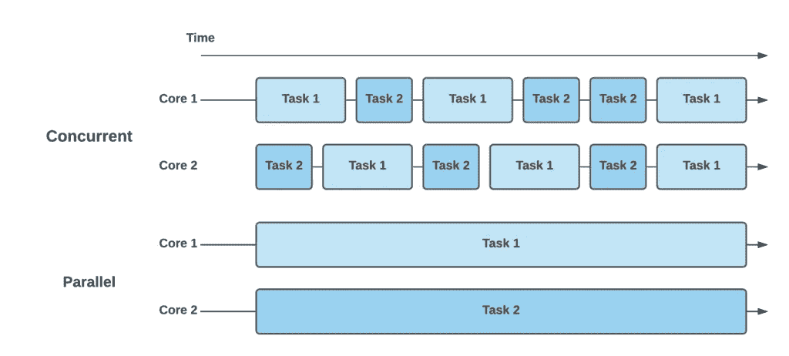

# Golang 中的并发编程

> 原文：<https://blog.devgenius.io/concurrent-programming-with-golang-2a4edb2552b1?source=collection_archive---------2----------------------->

大家好！在这篇文章中，我将讨论我们需要知道的基本结构，以便在 Go 语言中实现同步，也就是说，在同一时间完成多个任务。首先让我们简单了解一下并发和并行的区别。



让我们通过上面的例子来看看并发性和并行性是如何工作的。我们可以看到，有两个核心和两个任务。在并发方法中，每个内核通过随时间切换来执行两个任务。相比之下，并行方法不在任务之间切换，而是随着时间的推移并行执行它们。

# 戈鲁廷斯

多亏了 goroutines，我们可以在 go 程序中同时完成多项任务。换句话说，goroutine 的概念可以概括为同时完成的每项工作。

每个 go 程序基本上都有一个主 goroutine，它与 main 函数一起形成。然而，在某些情况下，仅靠主要的 goroutine 可能是不够的。例如，假设我们有 *save()* 和 *calculate()* 函数，它们将花费很长时间。如果这些函数没有自己的 goroutine，它们会使用主 goroutine，并让其他使用相同 goroutine 的进程等待。这种情况会降低程序的运行速度，并产生性能问题。为了防止这种情况，我们可以通过创建它们自己的 goroutines 来并发运行作业。

首先，我们借助一个例子来考察问题；

```
----------------Output----------------:Saving... 
The record has been saved - It took 5.0018482 
Calculating... 
The calculation result:8 - It took 2.0019639 Total time: 7.0038452
```

从上面的输出中可以看出，save 函数在 5 秒钟后开始工作并完成。之后，计算功能开始工作，并在 2 秒内完成。但是我们看一下，calculate 函数等待 save 函数 5 秒，工作 2 秒，所以总共用了 7 秒。

go 编程语言使用 go 关键字创建一个 goroutine，并使用 Go 关键字为每个作业创建一个单独的 goroutine。

让我们试一试。

```
----------------Output----------------:Total time: 0
```

一个令人惊讶的结果是，总时间为 0。这是因为我们的 go 程序为 save 和 calculate 函数创建了不同的 goroutines，但是没有等待它们完成就直接终止了程序。

如果我们将主函数的执行延迟到其他例程完成之后；

```
----------------Output 1----------------:AAAAAAAAAAAAAAAAAAAAAAAAAAAAAAAAAAAAAAAAAAAAAAAAAA
Saving...
Calculating...
The calculation result:8 - It took 2.0119652
The record has been saved - It took 5.0112932
Total time: 5.0112932----------------Output 2----------------:AAAASaving...
AAAAAAAAAAAAAAAAAAAAAAAAAAAAAAAAAAAAAAAAAAAAAA
Calculating...
The calculation result:8 - It took 2.017128
The record has been saved - It took 5.0123579
Total time: 5.0123579
```

***在输出 1 中，*** 首先 printA 功能工作并完成。然后保存和计算功能同时工作。calculate 函数在 2 秒内完成了它的工作，save 函数在 3 秒后完成了它的工作。

***在输出 2 中，*** 首先 printA 功能工作，但尚未完成。然后保存功能同时工作。然后 printA 函数完成，calculate 函数开始工作。

***我们程序的总运行时间等于运行时间最长的 goroutine 的时间。***

如果我们仔细检查输出，会发现两个不同的问题。

产出是不同的，因为我们不知道事情将按什么顺序完成。所以我们无法控制不同程序之间的转换。

我们怎么知道哪个过程需要多长时间？我们如何确保工作完成？

由于上述问题，单独使用 goroutines 是不够的。

**我将解释解决这些问题所需的等待组和通道的概念。**

# 等待组:

它的主要用途是确保一个 goroutine 已经完成了它的工作。等待组有 3 个基本功能，如 Add()、Done()、Wait()

# 频道:

通道是一种结构，我们可以放入任何类型的数据并同时读取这些数据。那么我们为什么要使用它呢？我们用它在两个不同的 goroutines 之间移动数据。同时，**通道还保证一个例程发送给另一个例程的值在被使用之前可用**。

例如，我们不允许在 goroutine 函数中放置 return 关键字。我们永远不能将程序在主 goroutine 上的进度绑定到另一个 goroutine 的值上。因为我们得到了一个错误，因为使用它可能没有返回值。

**这就是我们使用渠道的原因。我们传递该值，并在另一个 goroutine 中读取该值。**

```
//to write a value into channelchannel <- value//to read a value from the channelvalue <- channel
```

用法示例

需要注意的是，您只能读取由其他 goroutines 编写的通道中的值。所以你不能同时在一个通道里写和读。因为通道使用锁定机制。

关于这个主题，我其实有很多要说的，但我认为这是一篇足够长的文章。谢谢你给我时间。我希望我是有帮助的。下一篇文章再见:)