# Tableau 桌面快速提示:有条件地格式化 Tableau 视觉效果

> 原文：<https://blog.devgenius.io/conditionally-format-tableau-visuals-dd890b077dc6?source=collection_archive---------10----------------------->

我们希望在商业智能方面不花什么力气就能创造出像样的商业洞察力。自动化是减少分析业务洞察力工作的关键部分。在本文中，我们将利用数据可视化工具 Tableau Desktop 来帮助我们创建一个可以自动更新其值的可视化工具。

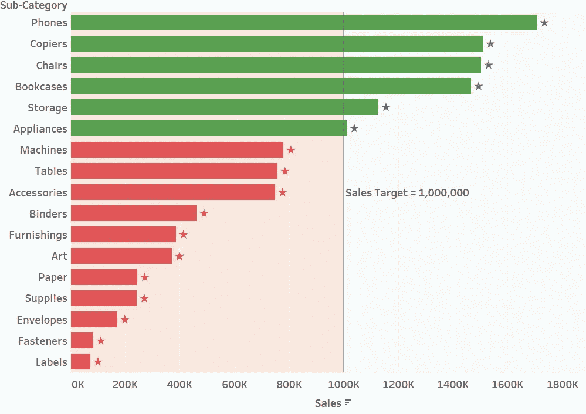

# 目录

> [问题陈述](#6351)
> 
> [带参考线的条形图](#a9fd)
> 
> [彩条有条件](#e452)
> 
> [在条上添加“*”](#e196)
> 
> [条件格式标签](#b9fb)
> 
> [最终结果](#b9cf)
> 
> [视频教程](#159c)

# 问题陈述

假设你有一家零售店，里面有多种产品类别。我们希望创建一个图表来监控每个产品子类别的性能。为了实现这一点，我们将创建一个改变颜色的条形图，如果命中目标，则为绿色；否则为红色。我们还想在每个条的顶部显示一个“*”图标，它还会根据指定的条件改变其颜色。事不宜迟，让我们开始学习教程。

# 带参考线的条形图

首先，在条形图中添加一条参考线。

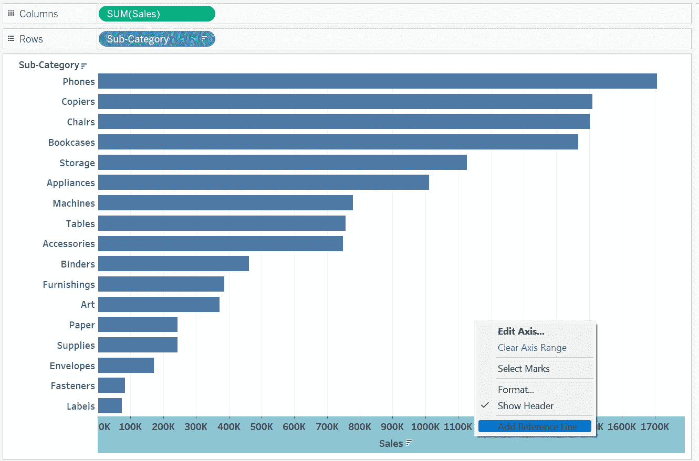

按照下面的设置创建参考线。

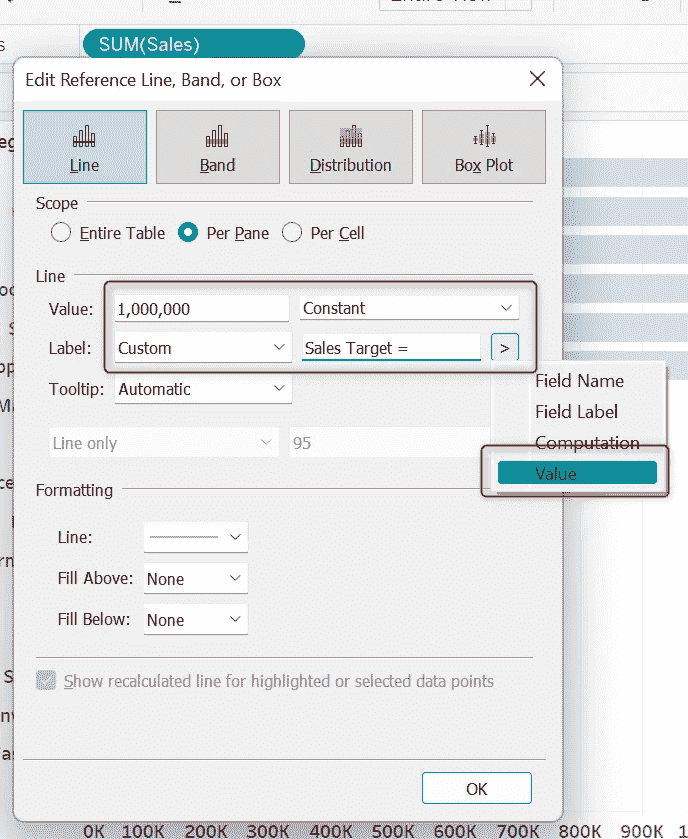

注意，我们给参考线标签添加了一个<value>参数。所以当我们改变值的时候，标签会自动改变。</value>

接下来，让我们将标签格式化到视图的中心。

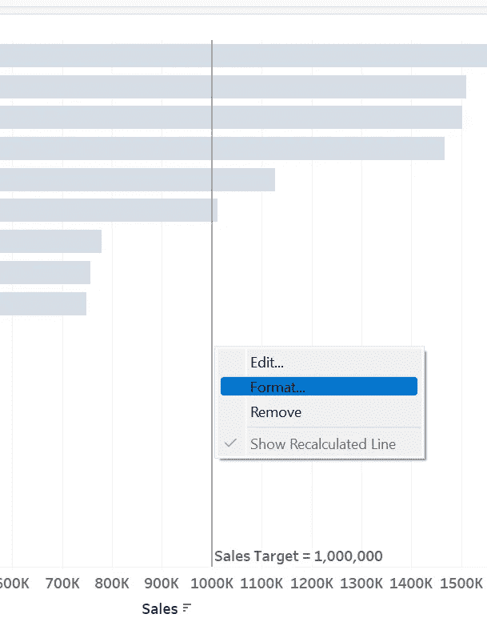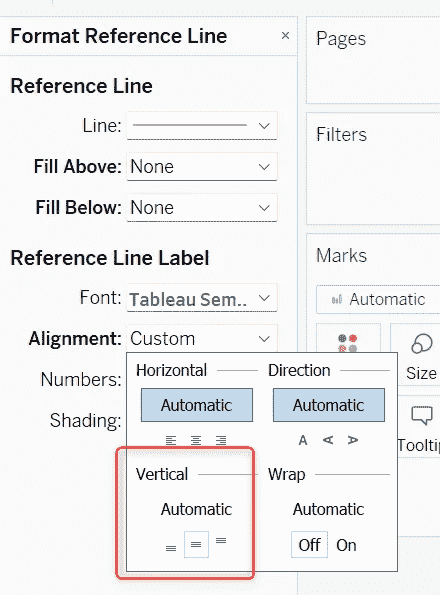

# 有条件的颜色条

我们可以通过创建一个简单的 if…else 函数来实现。

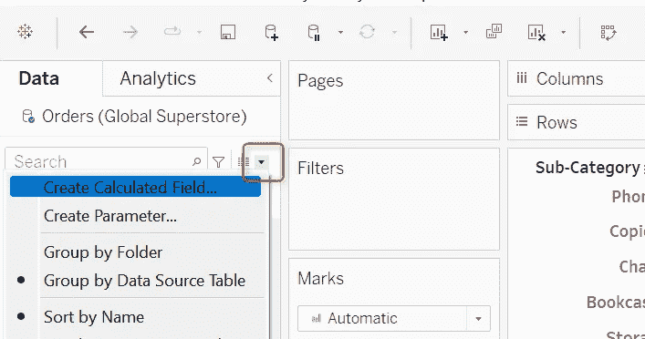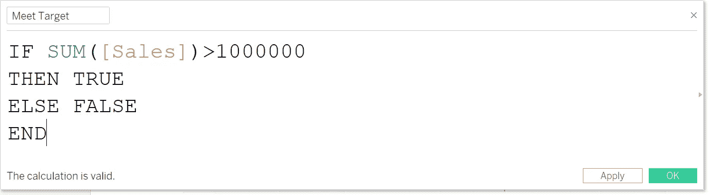

然后将该字段拖到色卡中。

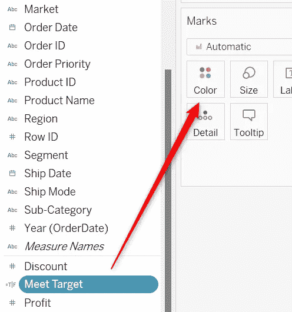

现在我们有了一个根据我们指定的条件改变颜色的条形图。现在让我们把颜色改成我们想要的颜色。

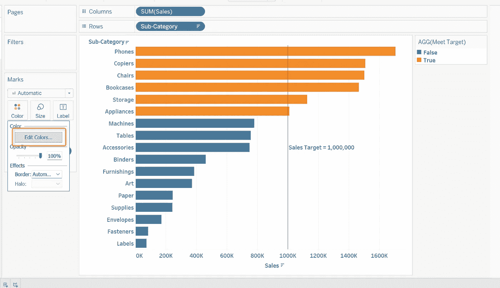

请注意，在选择颜色之前，您需要选择类别。

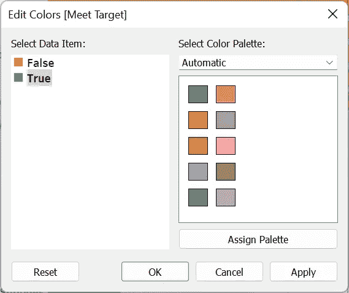

# 在横条上添加“*”

添加一个条的诀窍是标签。是的，星星是我们通过标签展示的一串。但是首先，您需要创建一个计算字段。

请记住，当子类别达到销售目标时,[达到目标]将返回“真”,因此该字段自动为布尔值。

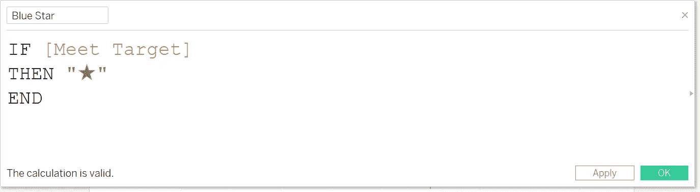

“*”号复制自本[网站](https://coolsymbol.com/)。我选择了一颗星星，但你总是可以选择你喜欢的那颗。

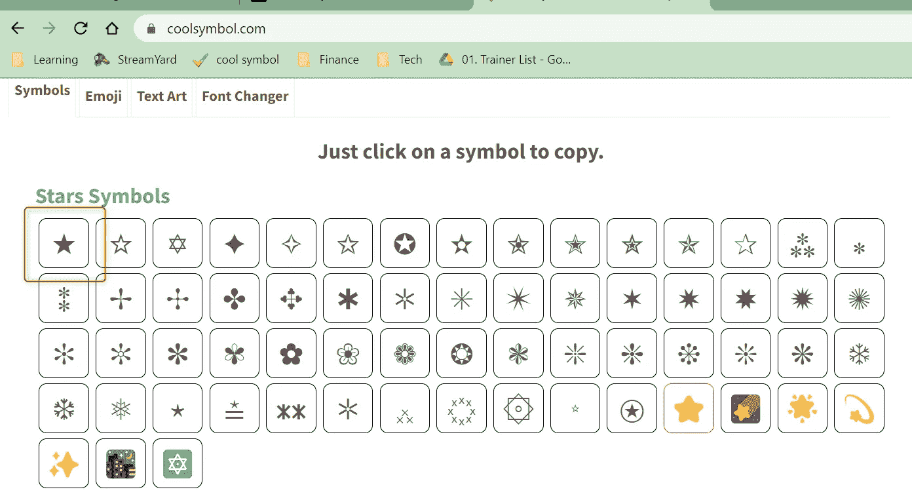

另外，请注意，您需要将图标括在" "中，以便 Tableau 知道它是一个字符串。

然后，我们将把字段拖到标签中。

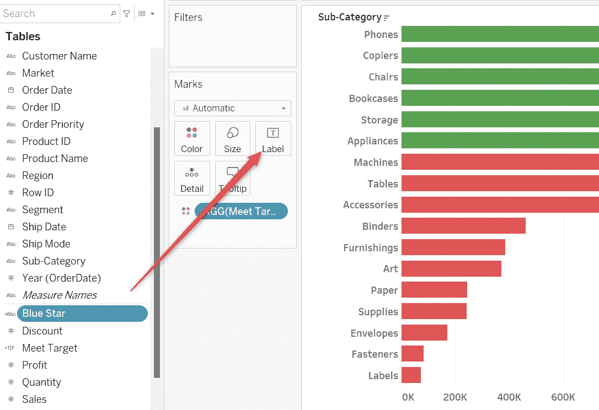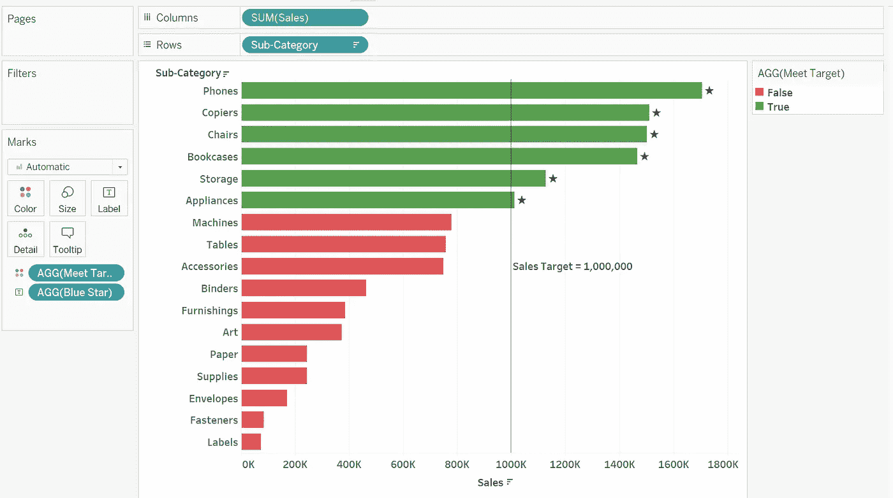

等等…为什么底部的星星没有出现？

# 条件格式标签

我是故意的。我们需要给那些没有达到销售目标的人贴上另一个标签。

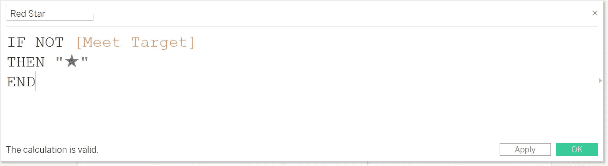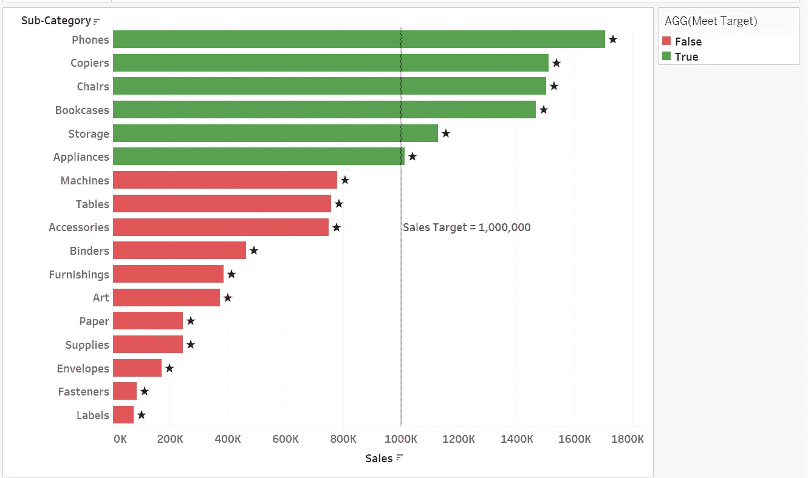

但是为什么要创建两个计算字段呢？我们这样做是为了给星星涂上不同的颜色。现在让我们编辑标签来格式化星星。

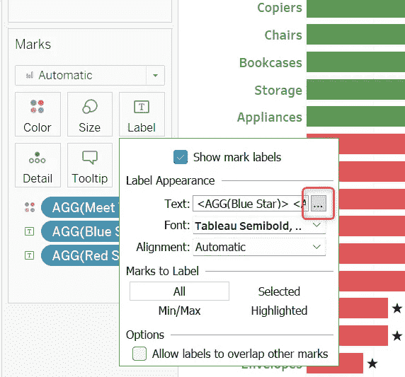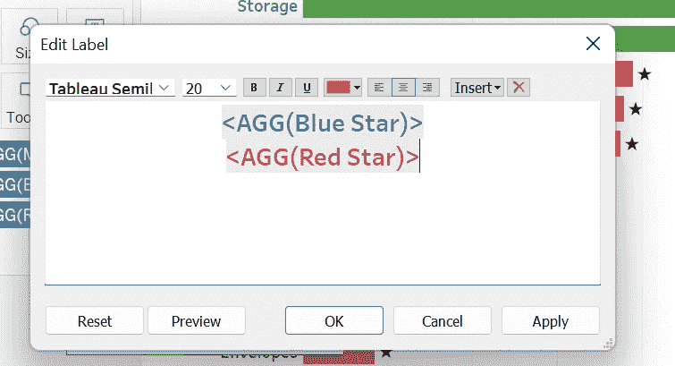

请注意，标签垂直堆叠。我们希望将它们并排放置。

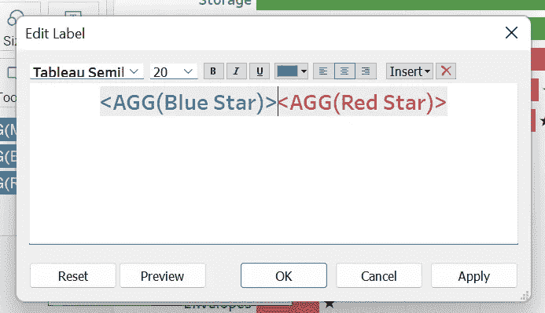

这一点非常重要，因为当你的字体变大时，底部的星号不会显示出来，因为蓝色的星号虽然没有出现，却占据了空间，即使它是一个空值。

# 最后结局

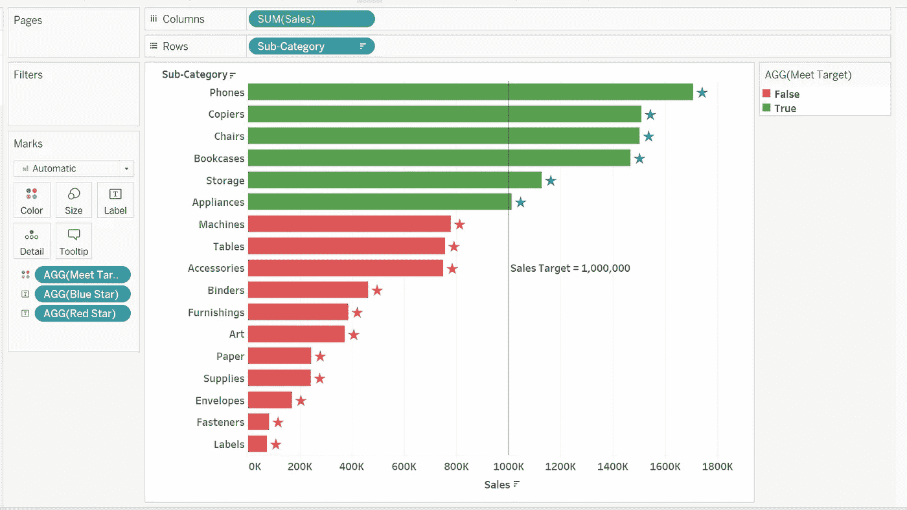

这是一个简单的教程，可以有条件地格式化你的视觉效果。如果你认为这篇文章能帮助你的朋友提高技能，请与他们分享。

此外，如果你想有一个视频教程，请查看我的 Youtube 视频。

# 视频教程

直到下一次，再见！