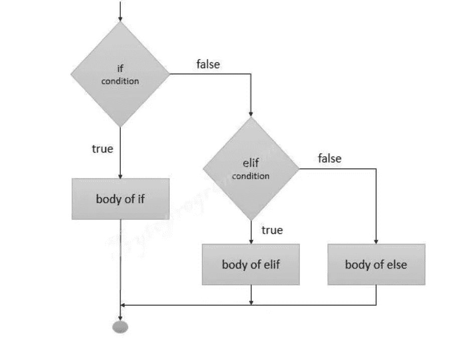

# Python 中的条件、布尔、循环和迭代

> 原文：<https://blog.devgenius.io/conditionals-booleans-loops-and-iterations-in-python-ce2ff2d06040?source=collection_archive---------7----------------------->

**如果在 Python 中 else**

如果用 Python 中的 else 来做决策，那么当我们想只在满足某个条件的情况下执行一个代码时，就需要用到它。

```
value = 'apple'
if value == 'apple':
    print('True')
else:
    print('False')
Output- 
True
```

elif 是 else if 的缩写。它允许我们检查多个表达式。

```
value = 'apple'
if value == 'apple':
    print('True')
elif value == 'Grapes':
    print('Green')
else:
    print('False')
Output- 
True
```

Python 中 If、Else 和 elif 的流程图。



**操作员**

```
# Equal to  ==
# Not Equal to !=
# Grater than >
# Less than <
# Grater than Equal to >=
# Less than Equal to <=

a = 1
b = 1
if(a == b):
    print('True')
a = 1
b = 2
if(a != b):
    print('True')
a = 10
b = 1
if (a > b):
    print('True')
a = 1
b = 10
if (a < b):
    print('True')
list = [1,2,3]
list1 = [1,2,3]Output - 
True
True
True
True
```

**是运算符和 id()函数**

Python id()函数返回一个对象的标识。这是一个保证唯一的整数。此函数接受一个对象的参数，并返回一个表示身份的唯一整数。
是用来比较两个对象是否相同的运算符，如果匹配则返回 true。

```
list = [1,2,3]
list1 = [1,2,3]
if (a is b):
    print('True')
else:
    print('False')
# This will Print False as list and list1 both are separate list and created on different memory location.
# It will compare the identity and return the result.# if(a is b) and if(id(a) == id(b)) both are same and compare the identity of the objects.Output- 
False
```

**逻辑运算符**

Python 有三个逻辑运算符。

and 运算符检查这两个条件是否同时为`True`。如果两个条件都是`True`，则返回`True`。如果任一条件为`False`，则返回`False`。

与`and`操作器类似，`or`操作器检查多个条件。但是当一个或两个单独的条件都是`True.`时，它返回`True`

该`not`运算符适用于一种情况。并且它反转该条件的结果，`True`变成`False`并且`False`变成`True`。

```
a = 5
if a > 5 and a < 10:
    print('True')
else:
    print('False')

if a > 5 or a < 10:
    print('True')
else:
    print('False')

if a != 5:
    print('True')
else:
    print('False')
Output- False
True
False
```

**Python 中的假值**

下面是在条件中返回 False 的值的列表。

```
# False
# Zero
# None
# Any Empty Sequence like - Empty list, Set , String
# Any Empty Mapping like {}

# In all scenarios if condition will not execute as in all cases its returning False

a = False
if a:
    print('True')
else:
    print('False')

a = 0
if a:
    print('True')
else:
    print('False')

a = ''
if a:
    print('True')
else:
    print('False')

a = {}
if a:
    print('True')
else:
    print('False')Output -
False
False
False
False
```

**While 循环**

Python while 循环允许执行部分代码，直到给定条件返回 false。

```
a = 5
while a < 10:
    print(a)
    a += 1
```

**中断并继续语句**

当遇到 break 语句时，它将控制带出循环，当遇到 continue 语句时，控制转移到循环的开始。

```
a = 1
while a < 10:
    a += 1
    if(a == 6):
        continue
    elif(a == 8):
        break
    print(a)
Output -
2
3
4
5
7
```