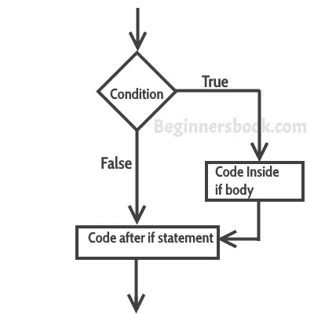
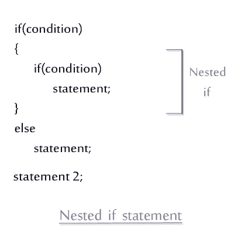

# 情况

> 原文：<https://blog.devgenius.io/conditions-c6e94050d388?source=collection_archive---------32----------------------->

## C++基础

## 条件语句是理解起来非常有趣的概念。


条件是破坏关系或有时建立关系的东西。人们需要了解一些情况。条件是许多关系赖以存在的东西。当我还是个孩子的时候，我常常在作品中加入一些条件。假设我躺在床上，想着明天我要去上学，那么我会设置一些条件，例如，如果明天开始下雨，那么我就不去上学，否则我肯定会去上学。

我想解释的要点是，如果某件事是真的，我会去做，否则我不会去做。

在计算机中，我们可以看到与条件相关的相同场景。当我们关注计算机语言时。我们需要使用条件，为此我们需要理解条件语句。

## 什么是条件语句？

条件语句是根据可能性来决定某事的语句。条件语句有两种情况。**真**或**假**。

**例:**我们有一个整数。我们必须决定它是否是偶数。如果是偶数，表示条件为真，如果不是偶数，则条件为假。

有一些类型的条件语句。 **if — else** 语句和 **switch** 语句。我现在要讨论 if-else 语句。还有一种其他类型的 if — else 语句，其中 if **嵌套 if — else** 语句。

**语法:**

> if(条件){
> 
> //语句；
> 
> }否则{
> 
> //语句；
> 
> }

**例:**假设我们要借助计算机来判断数字是否为偶数，那么我们需要声明一个变量，然后使用 if 语句和 put 条件。正如我们所知，偶数是那些能被 2 整除的数，或者它们的模数等于零，如下所示。



> Int a = 10
> 
> if ( a % 2 == 0) {
> 
> cout << “Even”;
> 
> }else {
> 
> cout << “Odd”;
> 
> }

> Nested if — else

Nested if — else is a type of way using if — else statement. In nested if we use if within if statement. Nested if — else if so useful trick in any programming language especially in C++.

> Flow-chart



Example :

> int num = 2
> 
> if( num % 2== 0){
> 
> if(num == 2){
> 
> cout << “Number is even and prime”;
> 
> }else
> 
> return 0 ;

In the flow chart we can clearly see that structure or syntax of nested if. In the example we are finding if the number is even as well as prime. So in the outer if — statement we use even number condition where in the inner if — statement we use prime number logic as we know 2 is prime number so if the number is equal to 2 than it would be prime number. Else it would return nothing.

**问题/答案:**

*   大多数人会问 if-statement 是否是强有力的工具，而不是为什么我们需要学习其他工具。

答案很简单。如果空气是地球的重要组成部分，那么我们为什么需要水和食物。我们需要学习每一种工具来成为最好的程序员。尽可能多地学习。学习新东西真的很有趣。

> 问

现在我要解决一个相当高级的问题，以便更好地理解条件语句。让我们阅读并理解任务的陈述。

*   *写一个取三个数的程序，打印哪个数大。*

```
#include <iostream>
using namespace std;
int main ()
{
   int first_Number = 0, second_Number = 0,third Number = 0 ;
    cout <<"Enter first number";
    cin >> first_Number;   //Taking first number.
    cout <<"Enter second number";
    cin >> second_Number; //Taking second number.
    cout <<"Enter third number";
    cin >> third_Number; //Taking third number.

    if (first_Number > second_Number) //If 1st number is greater.
       { if (first_Number > third_Number)
          cout <<"Greater number = " + first_Number; }
    else if (second_Number >first_Number)//If 2nd number is greater.
       { if(second_Number > third_Number)
          cout <<"Greater number = " + second_Number; }
    else if (third_Number > first_Number)//If 3rd number is greater.
        { if(third_Number > second_Number)     
          cout <<"Greater number = " + third_Number; }
        else //In-case of all equal number.
            cout <<"All equal";
```

**步骤 1 :** 用名字 first_Number，second_Number，third_Number 声明三个变量。

**第二步:**用输入流(cin)取值存储在变量中。

**第三步:**使用嵌套 if 语句。

生活中充满了各种情况，如果你是程序员，那么你必须擅长处理各种情况。这实际上是程序员做的事情。