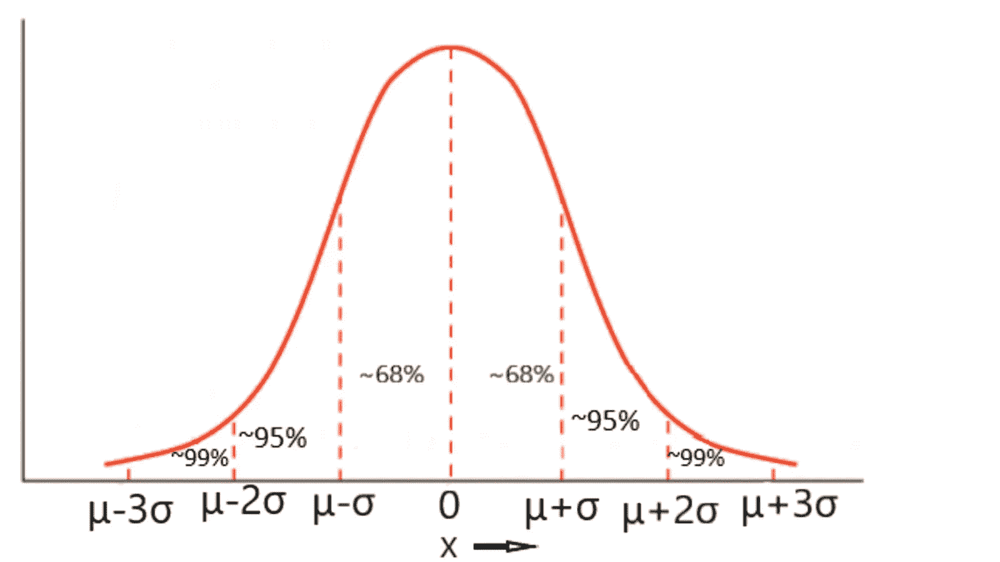
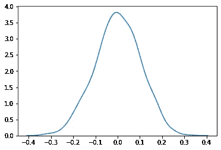
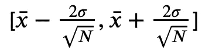
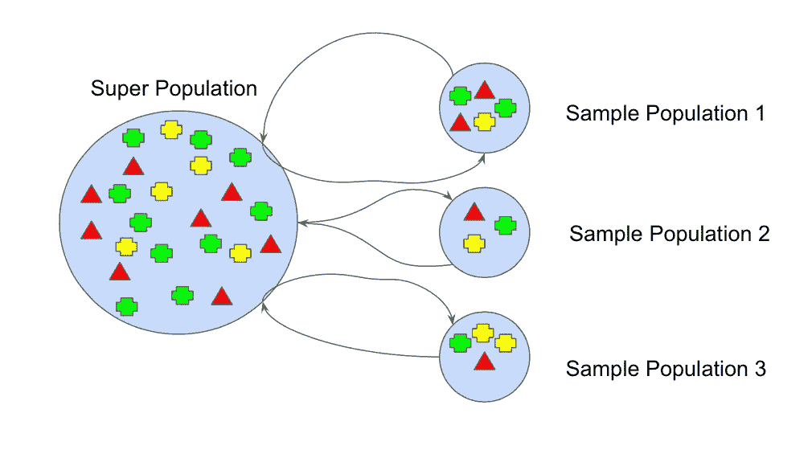
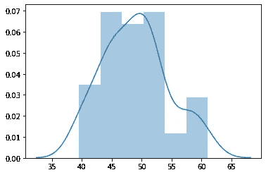

# 置信区间(CLT 和自举):-非常强大的统计分析技术-用 Python 和 Numpy 解释

> 原文：<https://blog.devgenius.io/confidence-intervals-clt-and-bootstrapping-phenomenally-powerful-techniques-towards-statistical-390aee590d38?source=collection_archive---------5----------------------->

# 了解置信区间

> 通常，很难确定大总体分布的统计参数。因此，我们进行抽样，从人群中抽取样本。
> 
> 此后，我们假设:
> *总体均值=样本均值=* μ

这种类型的估计称为点估计。然而，它是有偏见的，我们永远也不会知道群体集合的正确平均值。

所以我们提出了**置信区间。**

这里，我们以 95%的置信度或概率估计区间
【𝜇−𝜃,𝜇+𝜃】中的平均值。我们考虑的是 95%,而不是 100%或 80%,因为我们只是估计，而不是确切地说。然而，这是一个有争议的话题，主要是 95%的考虑。

这种表示比点估计更丰富，能提供更多的信息。

## 当分布为高斯分布时确定置信区间

利用均值和标准差，高斯分布被分成 68%、95%和 99%的块



所以这里 95%概率的置信区间是
【𝜇−2𝜎,𝜇+2𝜎】

```
import numpy as np
import seaborn as sns
mu, sigma = 0, 0.1
s = np.random.normal(mu, sigma, 1000)
sns.kdeplot(s)
```



对于上面的图，95%的置信度将是
[0–2*0.1，0+2* 0.1] = [-0.2，0.2]

## 分布未知时确定置信区间

当分布不是高斯分布时，有各种方法可以找到 95%的置信区间。最受欢迎的是，

> 中心极限定理(CLT)
> 
> 引导方法
> 
> 最大似然法
> 
> 假设检验

在这个博客中，我们将讨论中心极限定理(CLT)和引导方法。

在我的下一篇博客中，我将介绍最大似然法和假设检验。

## 1.具有中心极限定理的置信区间

> 定理指出，对于有限均值和有限方差，当绘制抽样分布的样本均值时，该分布非常接近高斯分布

你可以参考我的这篇[博文](https://medium.com/@pritul.dave/central-limit-theorum-with-simplest-implementation-and-explaination-749a6f3568f9https://medium.com/@pritul.dave/central-limit-theorum-with-simplest-implementation-and-explaination-749a6f3568f9)来更深入地理解中心极限定理。

因此，这里我们考虑两个参数

1.  样本数量(N)
2.  高斯分布

现在，高斯分布 95%概率的置信区间的平均值是，

[𝜇−2𝜎,𝜇+2𝜎]

这里，如果我们考虑样本大小(N ),那么它变成，



其中 x(bar)是样本大小的平均值，N 是样本大小，sigma 是总体的标准差。

这代表一个 95%概率置信区间，我们的总体均值在这个范围内。

让我们用 numpy 来理解和推导这个概念，通过考虑 100 个随机数，也就是我们的总体。

```
arr = (np.random.random([1000])*100).astype(int)
```

现在，上述人口的平均值是

```
>>> np.mean(arr)48.492
```

让我们用 95%置信度的中心极限定理来推导这个平均值。

```
sample_array = np.random.choice(arr,30)
>>> sample_array>>> array([93, 64, 58, 24, 64, 56, 73, 87, 16, 92, 36, 38, 33, 41, 34,  1, 15,
       97,  3, 97, 25, 40, 29, 50, 68, 67, 31, 76, 75, 56])sample_mean = np.mean(sample_array)
population_std = np.std(arr)
sample_size = sample_array.shape[0] 
print("Sample Mean",sample_mean)
print("Population Standard Deviaition",population_std)
print("Sample Size",sample_size)>>> Sample Mean 51.3
>>> Population Standard Deviaition 28.16217207532118
>>> Sample Size 30lower_range = sample_mean - (2*population_std/np.sqrt(sample_size))upper_range = sample_mean + (2*population_std/np.sqrt(sample_size))print("Lower Range",round(lower_range,2))
print("Upper Range",round(upper_range,2))>>> Lower Range 41.02
>>> Upper Range 61.58
```

> 因此，正如你在这里看到的，使用中心极限定理，我们正确地确定了一个范围[41.02，61.58]，在这个范围内，我们的总体平均值为 48.492。

因此，这是非常强大的技术，但前提是人们应该知道总体的标准偏差。

如果我们不知道总体的标准差，我们可以用假设检验或自举方法。

## 2.自举方法

这是估计人口统计参数的另一种强有力的技术。唯一的问题是计算量很大。

这种技巧也是从中心极限定理的概念中推导出来的。
**“*只要访问我的*** [***中枢极限 theorum 贴子***](https://medium.com/@pritul.dave/central-limit-theorum-with-simplest-implementation-and-explaination-749a6f3568f9) ***就很容易理解了。”***



让我们使用 Numpy 一步步理解自举

1.  生成大小为 1000 的数组
    *我正在 CLT 重用生成的数组*

```
arr.shape>>> (1000,)
```

2.重复生成大小为 30 的采样数组 50 次。

```
sampled_array_list = []
for i in range(50):
    sampled_array_list.append(np.random.choice(arr,30))
```

3.现在我们确定这个样本数组的平均值

```
sampled_array_mean = []
for i in range(50):
    sampled_array_mean.append(np.mean(sampled_array_list[i]))
```

4.我们对平均值进行排序，并考虑 95%的区间

```
bootstraped_mean = np.sort(sampled_array_mean)
N = 50
range_ = [N-N*0.95,N+N*0.95]print(range_)>>> [2.5, 97.5]
```

让我们想象一下这个 95%的置信区间

```
bootstraped_mean = bootstraped_mean[int(range_[0]):int(range_[1])]sns.distplot(bootstraped_mean)
```



4.求这个靴带平均值的平均值

```
np.mean(bootstraped_mean)>>> 48.982638888888886
```

> 我们的人口平均数是 48.492(T19)，我们的引导平均数是 48.982(T21)。你可以看到这是一个多么强大的技术，它给出了非常接近和精确的人口平均值。

我们可以重复使用这种技术，并可以找到中位数或分位数或任何统计参数。

此外，它的美妙之处在于它是非参数化的技术，并且不对分布做任何假设。

只要评论下来，任何问题，我将很乐意帮助。如果你喜欢这个帖子，请鼓掌。这会激励我写更多。

感谢您阅读我的帖子😊