# 使用文件资源管理器和局域网配置文件共享

> 原文：<https://blog.devgenius.io/configure-file-sharing-using-file-explorer-and-using-lan-1da0b20b6dd9?source=collection_archive---------5----------------------->

# 使用文件资源管理器共享文件

这种方法具有更大的灵活性，因为它并不局限于新的电脑:使用这种方法的共享文件和文件夹将可以被本地网络上的设备访问。这意味着，举例来说，你可以共享一个文件夹中的图片，并在 Mac 上查看它们，甚至在 Android 平板电脑上查看，只要它们连接到同一个网络。以下是步骤。

*   进入**控制面板**，然后进入**网络和共享中心**

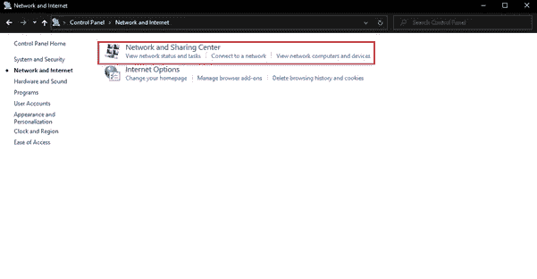

*   然后进入**更改高级共享设置** > **所有网络** > **密码保护共享**

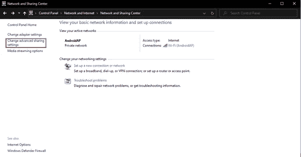

*   然后更改**关闭密码保护共享**按钮

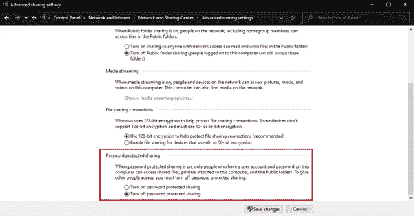

*   然后单击保存更改。
*   使用**文件浏览器**(位于任务栏上)导航到您想要共享的项目。

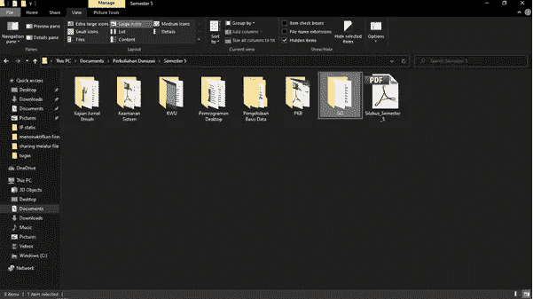

*   右键单击您想要共享或分享的项目

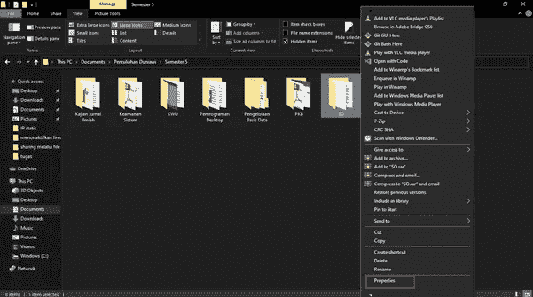

*   在“属性”窗口中，单击“共享”选项卡。
*   找到并点击**高级共享**按钮。

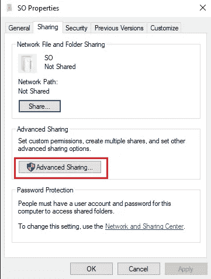

*   在顶部，选中写着**共享该文件夹**的框
*   在底部你会看到几个勾选框，允许**或**拒绝用户的共享访问**。**
*   勾选单词**允许**下的复选框，然后点击 OK 按钮授予所有权限。

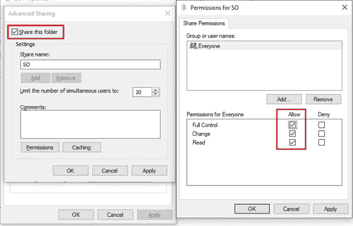

# 使用局域网配置文件共享

局域网电缆本身由直电缆、交叉电缆和翻转电缆组成。这三种电缆有各自的功能和用途，要将文件和文件夹共享给其他电脑或将文件共享给打印机，您可以使用直电缆。

要传输文件，您需要先创建一个局域网，然后才能同时在多台电脑上共享文件。您可以根据三种电缆各自的功能将它们组合在一起。此外，如果网络由 3 台或更多计算机组成，您还需要一个集线器或交换机作为连接介质。

*   打开**控制面板**
*   导航至网络和互联网，然后**网络和共享中心。**
*   在左侧菜单中，选择选项**更改适配器设置**

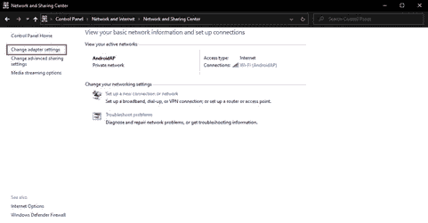

*   右键单击您正在使用的一个网络适配器(无论是 WiFi 还是以太网连接)。然后点击**属性**。

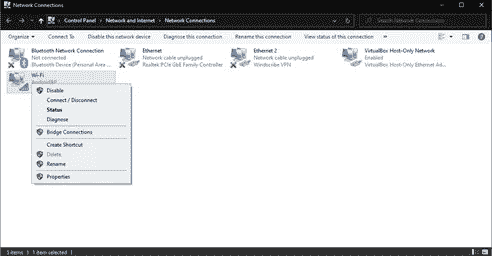

*   双击**互联网协议版本 4 (TCP/IPv4)** 选项

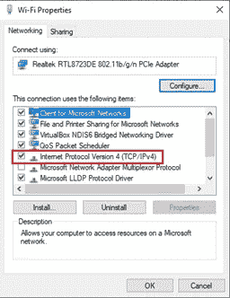

*   进行如下图的设置

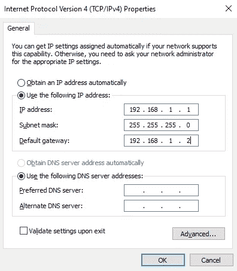

*   接下来，请打开第二台计算机/笔记本电脑，然后按照之前的方式进行操作，而对于 TCP/IPv4 的设置，我们可以按照下图进行设置

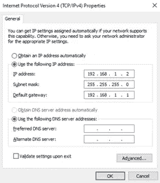

*   请再次进入网络和共享中心，然后单击“更改高级共享设置”。

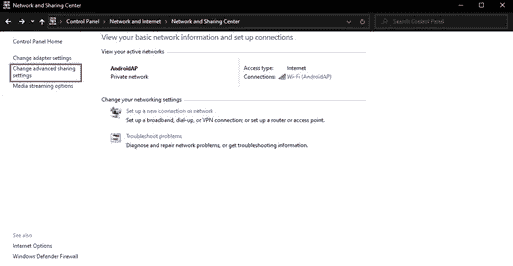

*   进行以下设置。

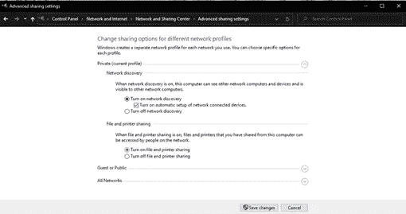

*   之后点击**保存更改**。在两台计算机上执行此步骤

完成设置文件共享配置后，准备要共享的文件夹。举个例子，这里我想把文件从计算机一共享到计算机二。请打开计算机一，然后按照这个方法。

*   右键单击所需的文件夹，然后单击**属性**

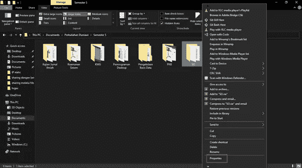

*   进入**分享**选项卡，然后点击**分享**

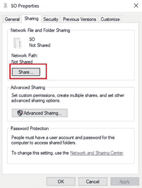

*   在菜单栏中选择**所有人**然后点击**添加**

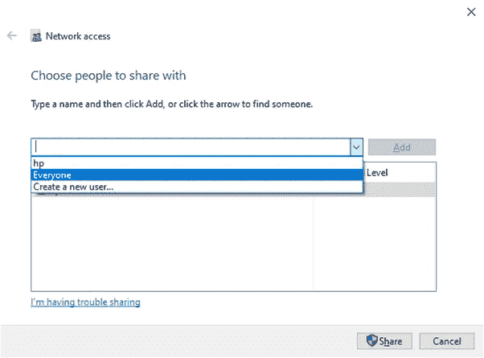

*   如果是，将共享规则更改为**读/写**，然后点击**共享**

在设置了计算机 1 的共享设置之后，现在计算机 2 可以访问先前由计算机 1 共享的文件夹。下面是访问它的方法。

*   在第一台计算机上，单击 **Windows 键+ R** 然后键入第二台计算机的 IP **//192.168.1.2** 然后单击确定

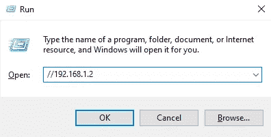

*   然后会出现一个新窗口，其中检测到一台计算机上的共享文件夹。
*   之后，我们可以将文件夹复制到所需的位置。