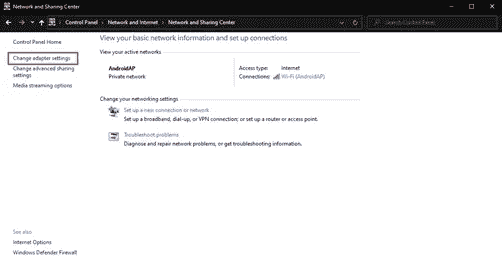
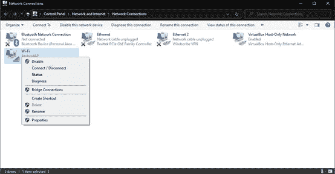
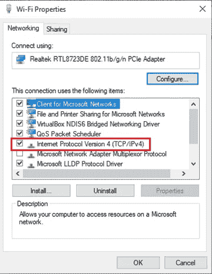
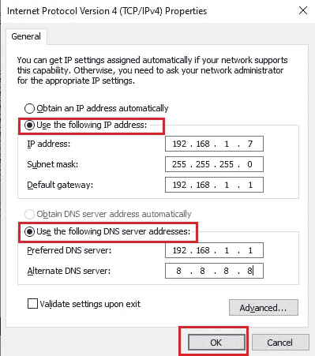
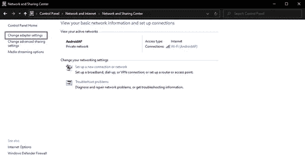
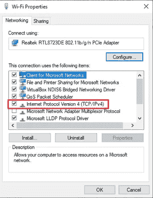
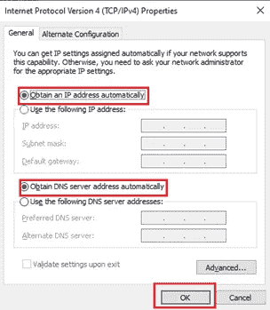
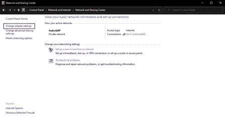
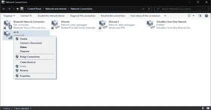
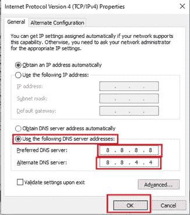

# 在 Windows 10 上配置静态 IP 地址、静态到动态 IP 地址和 DNS 服务器

> 原文：<https://blog.devgenius.io/configure-static-ip-address-static-to-dynamic-ip-address-and-dns-server-on-windows-10-b5ae17af4792?source=collection_archive---------0----------------------->

在 Windows 10 中，配置静态 IP 地址在许多方面都很重要。例如，如果您想要在打印机或本地网络上共享文件，或者当您想要配置端口转发时。

因为默认情况下，连接到网络的设备通常使用一个动态 IP 地址(通常发生在你连接到 WiFi 的时候)，当你重启笔记本电脑或者动态 IP 过期时，IP 就会发生变化。通过配置静态 IP 地址，您可以确保设备上 IP 地址的一致性。以下是静态 IP 地址配置。

# 静态 IP 地址配置

*   打开**控制面板**
*   导航到网络和互联网，然后导航到网络和共享中心
*   在左侧菜单中，选择选项**更改适配器设置**

*   在网络适配器上，右击并选择**属性**

*   双击**互联网协议版本 4 (TCP/IPv4)** 选项

*   单击使用以下 IP 地址选项，并根据您面临的情况输入 IP 地址(例如 192.168.1.7)
*   子网掩码(通常用于本地连接用户)是 255.255.255.0。
*   默认网关通常是路由器上使用的 IP 地址。(如 192.168.1.1)
*   在 DNS 服务器菜单上，单击**使用以下 DNS 服务器地址**选项，并输入首选 DNS 服务器地址，该地址通常与默认网关的 IP 地址相同。
*   如果无法连接到主 DNS 服务器，您可以填写备用 DNS 服务器作为另一个选项，例如，您可以输入 Google DNS (8.8.8.8)。但是，这是可选的(即，您可以填写，也可以不填写)。

*   单击确定保存更改

# **将 IP 地址从静态配置为动态**

尽管最终用户强烈建议使用静态 IP 地址，因为配置永远不会改变。但是，如果您想要一个可变的 IP 配置，那么动态 IP 地址可以是一个选项。

如果您当前使用的是静态 IP 地址，并希望将其更改为动态 IP 地址。那你就很容易做到了，其中一个就是通过控制面板。下面介绍如何将 IP 地址配置从静态设置为动态:

*   打开**控制面板**
*   导航至网络和互联网，然后导航至网络和共享中心。
*   在左侧窗格中，单击**更改适配器设置**。选择权

*   右键单击您正在使用的一个网络适配器(无论是 WiFi 还是以太网连接)。然后点击**属性**。

*   双击**互联网协议版本 4 (TCP/IPv4)** 选项

*   点击**自动获取 IP 地址**和**自动获取以下 DNS 服务器地址**选项。如果您点击了**确定**选项。

*   单击确定保存更改

# DNS 服务器配置

前情提要对于那些不了解 DNS 服务器的人来说。简而言之，DNS(域名系统)是一个服务器，它具有将网站的域名转换为 IP 地址的功能，反之亦然。通过使用 DNS，您只需键入网站名称就可以轻松打开网页，而无需输入网站的 IP 地址。

回到最初的讨论，当您连接到互联网时，默认情况下，您将使用 ISP(互联网服务提供商)提供的 DNS 服务器，例如 MyRepublic、IndiHome、MNC Play 等。但有时，来自 ISP 的 DNS 服务器会经历缓慢的响应，所以它会让网络感觉有点长。要解决这个问题，您可以使用替代的第三方 DNS 服务器，例如使用 Google DNS 或 OpenDNS。这是 DNS 服务器的配置。

*   打开**控制面板**
*   导航至网络和互联网，然后**网络和共享中心**。
*   在左侧窗格中，单击**更改适配器设置**。选择权

*   右键单击您正在使用的一个网络适配器(无论是 WiFi 还是以太网连接)。然后点击**属性**。

*   双击**互联网协议版本 4 (TCP/IPv4)** 选项

*   然后单击**使用以下 DNS 服务器地址**选项，以便您可以手动输入 DNS，然后输入所需的 DNS 服务器，例如 Google 的 DNS 服务器。完成后，点击**确定**保存更改。

*   点击**确定**保存更改