# 使用 Ansible(动态清单)在 EC2 实例上配置 Web 服务器 Docker 容器

> 原文：<https://blog.devgenius.io/configure-web-server-docker-container-on-ec2-instance-using-ansible-dynamic-inventory-82b659bed494?source=collection_archive---------3----------------------->

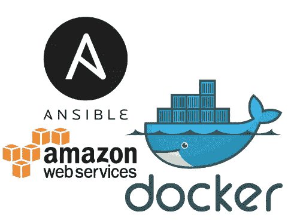

# 供应 AWS EC2 实例，并使用 Ansible Playbook 和动态清单在 Docker 容器中配置 HTTPD 服务器。

— — — — — — — — — — — — — — — — — — — — — — — — — — — — — —

## **✅涵盖的话题有:-**

1.  使用 Ansible 预配 AWS EC2 实例。
2.  使用动态清单检索实例的 IP 地址以进行进一步配置。
3.  通过配置存储库安装 Docker。
4.  使用 Ansible 拉出并启动 web 服务器容器。

— — — — — — — — — — — — — — — — — — — — — — — — — — — — — —

**🔹在直接跳到 Ansible-Playbook 之前，我们先来了解一下 Ansible &到底有什么用，它到底是怎么工作的！！**

— — — — — — — — — — — — — — — — — — — — — — — — — — — — — —

## **🔰什么是 Ansible？**

假设您必须配置 10 个不同的操作系统，它们的功能与其他操作系统略有不同。因此，如果你的任务是在这些系统上配置一个 HTTPD 软件&你不知道要安装什么命令，例如(Red hat Linux 使用 Yum 进行安装，而 Ubuntu 使用 apt-get &等等)。这可能是学习和安装的正确方法，但不是有效的方法，因为在 DevOps 的世界里，每件事都需要尽可能自动化。

因此，最好的和成熟的工具来了，叫做 **Ansible** ，它根据命令&模块来配置每一件事情，我们将进一步看到。

Ansible 是一个非常简单的 IT 自动化引擎，它自动化了[云供应](https://www.ansible.com/provisioning?hsLang=en-us)、[配置管理](https://www.ansible.com/configuration-management?hsLang=en-us)、[应用部署](https://www.ansible.com/application-deployment?hsLang=en-us)、[内部服务编排](https://www.ansible.com/orchestration?hsLang=en-us)以及许多其他 IT 需求。

Ansible 从第一天起就为多层部署而设计，它通过描述所有系统之间的相互关系来模拟您的 IT 基础设施，而不仅仅是一次管理一个系统。

它不使用代理和额外的定制安全基础设施，因此易于部署，最重要的是，它使用非常简单的语言(YAML，以可翻译剧本的形式)，允许您以接近简单英语的方式描述您的自动化作业。

— — — — — — — — — — — — — — — — — — — — — — — — — — — — — —

**🔹既然我们已经很好地了解了 Ansible 是什么，现在让我们来看看这个工具的工作基础设施！！**

— — — — — — — — — — — — — — — — — — — — — — — — — — — — — —

## **🔰Ansible 如何工作:**

🔹因为这个工具是用于配置管理的，所以它将管理操作系统，但是它将如何验证要配置的系统呢？

🔹这里第一个库存的概念开始发挥作用，库存只不过是一个普通的文件。txt 或者。yaml/。yml 作为扩展取决于您的使用。参考下图以供参考

🔹Ansible 清单文件位置:/etc/ansible/hosts 或者您可以在任何目录中创建，然后在配置文件中指定位置(。cfg)。

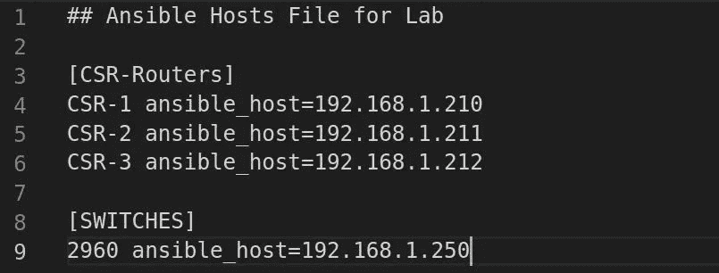

🔹在这里，主机只是要配置的系统的 IP 地址。CSR -1、2、3 是主机的名称， **ansible_host= < IP 地址>** 是写入 IP 地址时必须遵循的语法。除了 IP 地址，3 个同样重要的关键字是 **(ansible_connection)** ，它指定了您将使用哪个协议连接到系统&还有 **(ansible_ssh_pass)** ，它指定了系统的密码&**(ansible _ user)**表示 ansi ble 将使用哪个用户 id 与服务器通信。因此，将这些参数组合在一起后，这就是库存的样子。

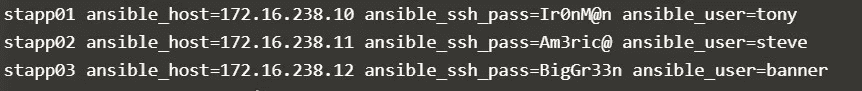

🔹最后，如果您想在一个行动手册中一起配置所有系统，而不是分别为每个系统配置。我们通过在[方括号]内的 IP 组顶部添加一个组名来创建 IP 组，因此在这种情况下，CSR-1、2、3 将位于[CSR-路由器]下，而[交换机]只有一个 IP 地址。

🔹以上盘点在。txt 格式&如果你想写的话。yaml 格式，这就是它的样子！！

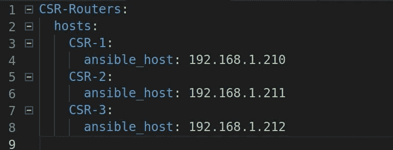

— — — — — — — — — — — — — — — — — — — — — — — — — — — — — —

## 🔰**最后，您将如何使用剧本中的这些 IP 地址？**

— — — — — — — — — — — — — — — — — — — — — — — — — — — — — —

🔹为此，这里有一个使用 Ping 测试/模块检查连通性的 Ansible 行动手册的简单示例。

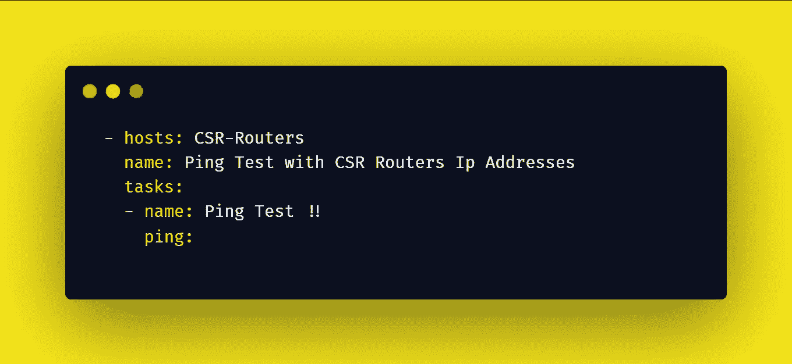

🔹这是 **yaml** 语法，其中前三个模块 hosts =指定 IP 组，然后 name=不是必需的，但作为一种良好的做法，只是为了说明我们为什么要运行本行动手册或特定任务。最后，任务=根据需求执行哪些任务。

— — — — — — — — — — — — — — — — — — — — — — — — — — — — — —

# 🔰注意:

🔹对于 Ansible 来说，几乎每个 YAML 文件都是以列表开始的。列表中的每一项都是一个键/值对列表，通常称为**“哈希”或“字典”**。所以，我们需要知道如何在 YAML 写列表和字典。

🔹YAML 还有一个小怪癖。所有 YAML 文件(不管它们是否与 Ansible 关联)都可以选择以`---`开始，以`...`结束。这是 YAML 格式的一部分，表示文档的开始和结束。

🔹列表的所有成员都是从相同缩进层次开始的行，以`"- "`(一个破折号和一个空格)开始:

🔹字典以简单的`key: value`形式表示(冒号后面必须跟一个空格):

🔹更复杂的数据结构是可能的，例如字典列表、其值是列表的字典或者两者的混合:

— — — — — — — — — — — — — — — — — — — — — — — — — — — — — —

## 🔹配置“ansible.cfg”文件:

现在我们需要配置我们的 Ansible 配置文件。

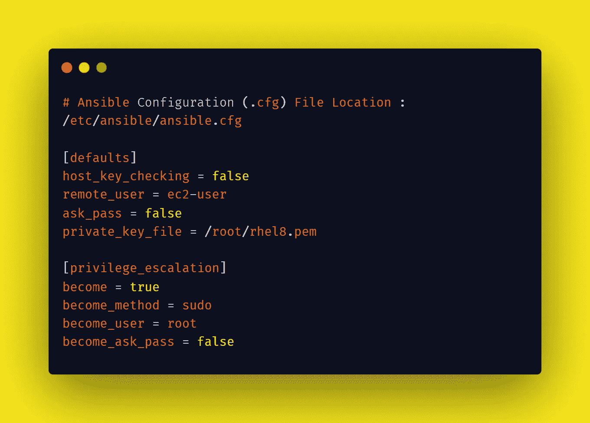

— — — — — — — — — — — — — — — — — — — — — — — — — — — — — —

## 🔰**主机 _ 钥匙 _ 检查:**

🔹Ansible 默认启用主机密钥检查。检查主机密钥**可以防止服务器欺骗和中间人攻击**，但是它确实需要一些维护。如果主机被重新安装，并且在“known_hosts”中具有不同的密钥，这将导致一条错误消息，直到得到纠正。

🔹默认情况下，主机密钥检查是打开的。如果您愿意，可以通过在/etc/ansible/ansible 的[default]部分添加 host_key_checking=False 来禁用它。 **cfg 或~/ansible。** **cfg 或通过导出 ansi ble _ HOST _ KEY _ CHECKING = False**。

— — — — — — — — — — — — — — — — — — — — — — — — — — — — — —

## 🔰远程用户:

🔹正如我们在。txt inventory 部分，我们提到 ansible_user 来指定 ansible 将通过哪个用户访问。

🔹remote_user 是登录到机器的账户**(ssh vagger @ tmp _ ansi ble _ test _ VM 将把 vagger 作为远程用户)。**如果该用户要以 root 或其他用户身份执行任务，则应具有 sudo 权限(即，添加到 Red Hat Linux 上的 sudoers 文件或 CentOS 上的 wheel 组等)。****

— — — — — — — — — — — — — — — — — — — — — — — — — — — — — —

## 🔰提问 _ 通过:

🔹Ask_pass 是可翻译剧本中的**控制模块。这控制了剧本执行时的密码提示。默认情况下，它总是设置为 True。如果您使用 SSH 密钥进行身份验证，那么您根本不需要更改这个设置。但是不要每次都干涉，因为我们会在操作系统之前验证每一件事，然后我们会将它设置为 False。**

— — — — — — — — — — — — — — — — — — — — — — — — — — — — — —

## 🔰私有密钥文件:

🔹当您必须使用 ssh 协议连接到本地系统时，情况并非如此，但是当访问这些在线实例时，我们使用私钥来代替密码，并指定私钥的位置。pem)放在配置文件中。

## 🔰注意:**确保您的工作区中有“pem”格式的 AWS 密钥对。&您可以在此部分创建私钥**

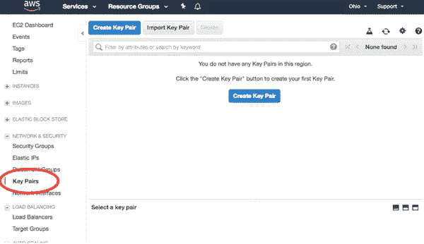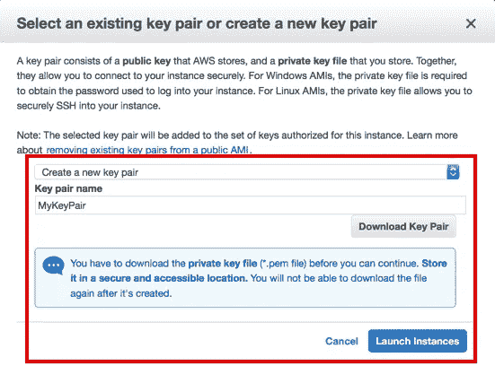

— — — — — — — — — — — — — — — — — — — — — — — — — — — — — —

## 🔰最后一个同样重要的部分是[特权升级]:

🔹Ansible 允许您“成为”另一个用户，不同于登录到机器的用户(远程用户)。这是通过使用现有的特权提升工具完成的，您可能已经使用或配置了这些工具，如 sudo、su、pfexec、doas、pbrun、dzdo、ksu 等。

— — — — — — — — — — — — — — — — — — — — — — — — — — — — — —

## [特权 _ 升级]
成为=真
成为 _ 方法= sudo
成为 _ 用户= root
成为 _ 询问 _ 通过=假

— — — — — — — — — — — — — — — — — — — — — — — — — — — — — —

🔹所以在这里，**变得=真**表示是，**变得方法= sudo** 表示我们希望将 sudo(管理)权限授予我们将使用的用户，**变得 _ 用户= root** 表示使用 sudo 方法的用户的管理权限将由 root 帐户授予，最后**变得 _ask_pass = false** 表示我们不希望通过询问密码来干扰正在运行的剧本，因为我们是经过身份验证的用户。

— — — — — — — — — — — — — — — — — — — — — — — — — — — — — —

## 🔰现在，有了这些知识就足以开始编写一个剧本来供应 AWS EC2 实例，并使用 Ansible 剧本和动态库存在 Docker 容器中配置 HTTPD 服务器。

— — — — — — — — — — — — — — — — — — — — — — — — — — — — — —

🔹剧本是**编写可译代码的文件**。剧本是用 YAML 格式写的。YAML 代表另一种标记语言。剧本是 Ansible 的核心特性之一，它告诉 Ansible 应该执行什么。它们就像 Ansible 的一个包含任务列表的待办事项列表。

— — — — — — — — — — — — — — — — — — — — — — — — — — — — — —

# 🔰设置 EC2 实例:

🔹AWS 是一个全球知名的云计算平台，提供多种服务。在这些服务中，我们将使用亚马逊弹性计算云(Amazon EC2 ),它提供了最广泛、最深入的计算平台，拥有超过 500 个实例和最新处理器、存储、网络、操作系统和购买模式的选择，可帮助您最好地满足工作负载的需求。我们是第一家支持英特尔、AMD 和 Arm 处理器的主要云提供商，也是唯一拥有按需 EC2 Mac 实例的云，以及唯一拥有 400 Gbps 以太网网络的云。我们为机器学习培训提供最佳性价比，以及云中每推理实例的最低成本。在 AWS 上运行的 SAP、高性能计算(HPC)、ML 和 Windows 工作负载比任何其他云都多。

— — — — — — — — — — — — — — — — — — — — — — — — — — — — — —

## ✅安装 Boto3 Python 库:

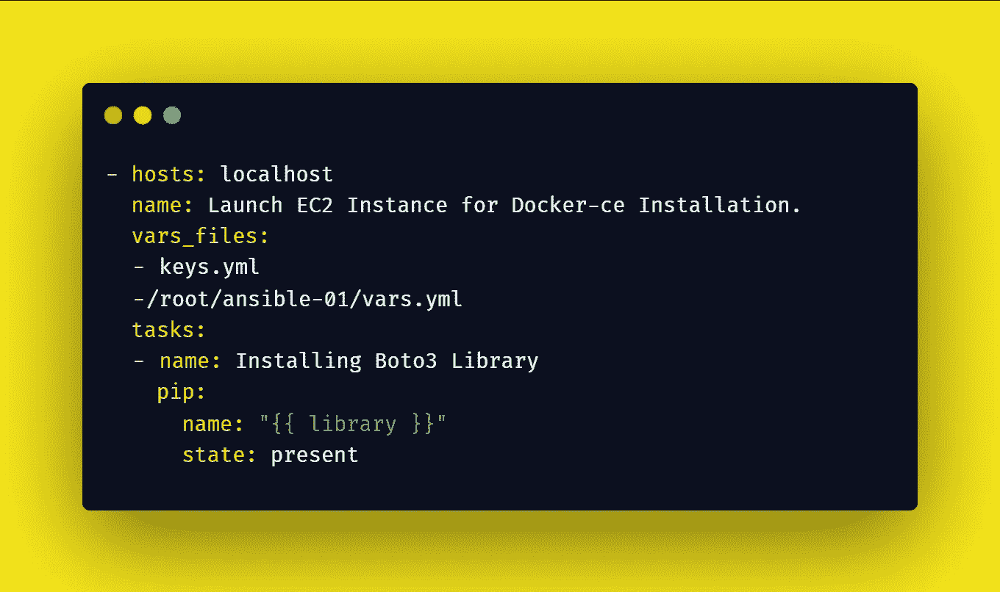

🔹这里介绍两个新模块:

# 🔰**变量 _ 文件:**

🔹 *vars_file* 指令只能在定义一个指定变量文件时使用。这些文件中的变量包含在行动手册中。由于**用于播放**的开始，这很可能意味着其他播放(在此播放之前)创建了这些 vars 文件，或者它们是在运行配置之前静态创建的；意味着它们是这出戏的配置变量。

🔹**如果这些文件与剧本在同一个目录中，则可以直接提及，或者通过指定 var 文件所在的完整路径来提及。**

— — — — — — — — — — — — — — — — — — — — — — — — — — — — — — —

# 🔰pip:

🔹该模块是`ansible-core`的一部分，包含在所有 Ansible 安装中。在大多数情况下，即使没有指定`collections:`关键字，也可以使用短模块名`pip`。但是，我们建议您使用 FQCN 来轻松链接到模块文档，并避免与可能具有相同模块名称的其他集合冲突。

🔹这里，pip 模块的名称在 vars.yml 文件中提到。如果你想使用 yml 文件中的变量，你必须使用 **"{{ <变量> }}"** 语法& state = present 表示我们希望模块已经安装，这也意味着已经存在于远程系统中。

— — — — — — — — — — — — — — — — — — — — — — — — — — — — — —

## ✅创建安全组:

🔹因为我们正在创建一个定制的操作系统。因此，我们还需要创建一个安全组，就像阻止操作系统上各种攻击/活动的防火墙。

— — — — — — — — — — — — — — — — — — — — — — — — — — — — — —

## ✅在此使用 ec2_group 模块，该模块具有以下参数:

— — — — — — — — — — — — — — — — — — — — — — — — — — — — — — —

# 🔰名称:

🔹这个名字和我们平时在 Playbook 开头用的不一样。这里在 SG 模块中使用的名称是您提供给安全组的名称，并且将在供应 E2 实例时进一步使用。

# 🔰描述:

🔹这只是为了给安全组一个有意义的身份。

# 🔰地区:

🔹这些是数据中心所在的 AWS 上可用的区域&我们的操作系统以及其他设置将被调配。

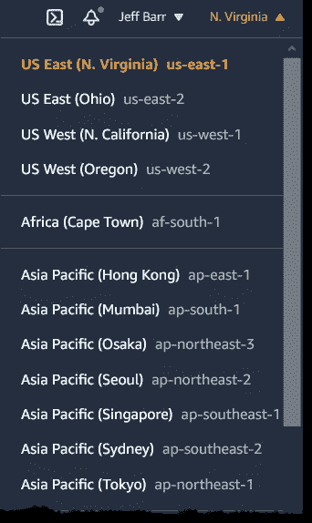

# 🔰aws_access & aws_secret 密钥:

🔹如果您仔细注意，在开始时，我们看到我们创建了一个清单，其中存储了 IP 地址以及连接类型和用户、密码。但是，我们并没有从拥有组/主机 IP 名称开始我们的行动手册。

🔹这是因为要连接到 AWS 云服务，我们需要在本地主机上安装 boto3 库，我们按照指定使用了 local host。但是 AWS 云在互联网上，ansible 如何连接到 AWS 云？

# 🔰这里，API 开始发挥作用:

🔹API 是应用程序编程接口的首字母缩写，它是一个软件中介，允许两个应用程序相互通信。每次你使用脸书这样的应用程序，发送即时消息，或者在手机上查看天气，你都在使用 API。

🔹**API 的一个例子是什么？**

当您使用手机上的应用程序时，该应用程序会连接到互联网并将数据发送到服务器。然后，服务器检索这些数据，对其进行解释，执行必要的操作，并将其发送回您的手机。然后，应用程序解释这些数据，并以可读的方式向您提供您想要的信息。这就是 API——所有这些都是通过 API 实现的。

🔹因此，我们有了一个连接 AWS 的方法，但是在连接之后，ansible 如何知道要为安全组配置哪个用户 ID，因为有数百万的 AWS 用户？

# 🔰这里需要 aws_access & aws_secret 密钥，但是如何创建它呢？

**🔹转到搜索栏，键入 IAM 并点击角色**

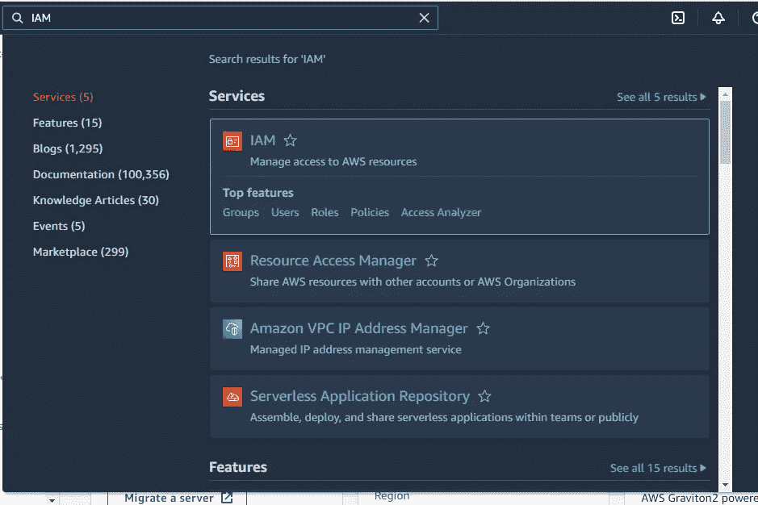

**🔹最初没有添加用户，所以单击右上角的添加用户。**

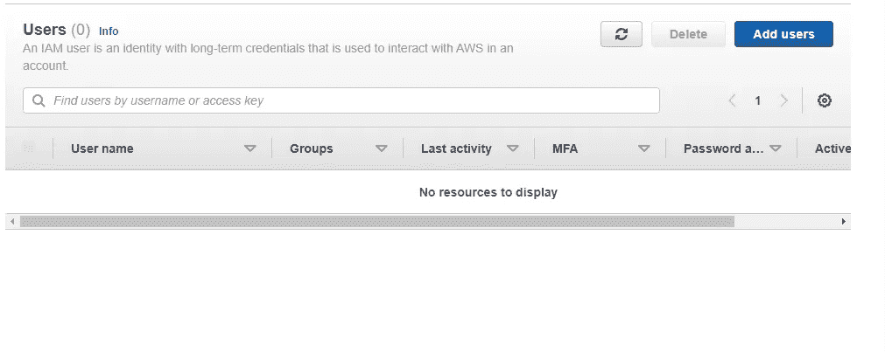

**🔹根据我们在 ec2 模块中的要求，提供用户名和访问密钥。**

**🔹现在给出您想要给用户的策略(访问)。**

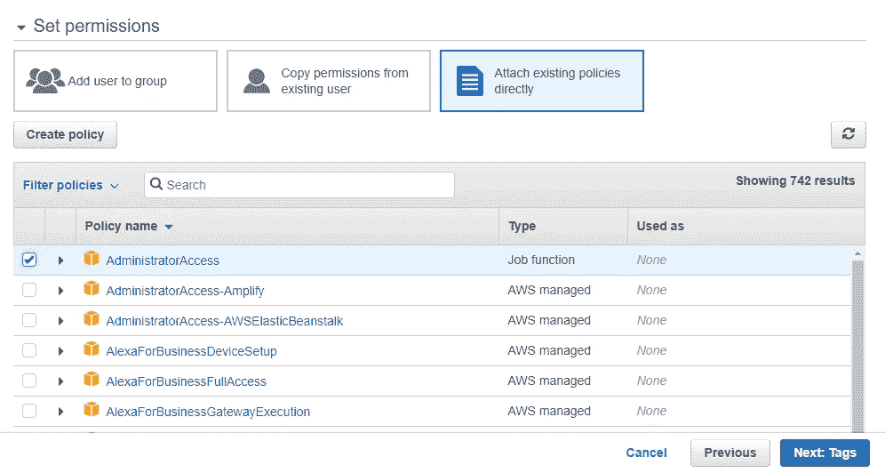

**🔹此页面是可选的，对于配置安全组和启动 EC2 实例来说并不太需要，因此单击 Next: Review。**

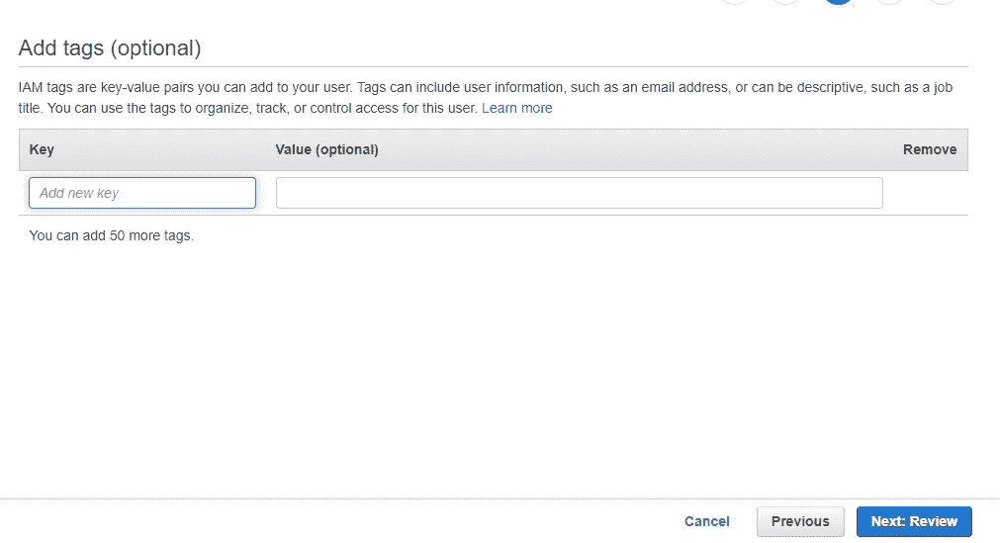

**🔹这是创建用户的最后一步。**

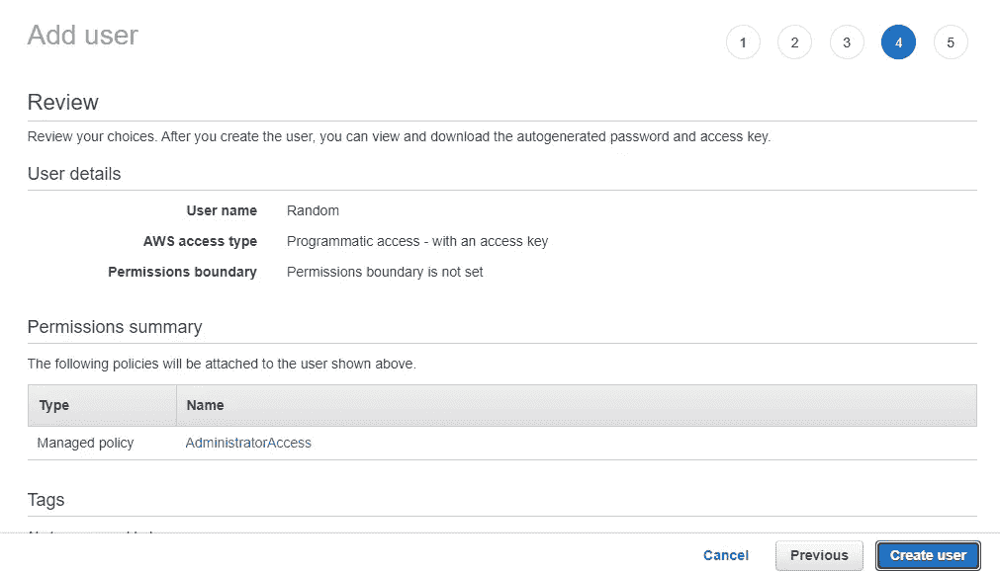

**🔹我们已经成功地创建了访问密钥和秘密密钥。**

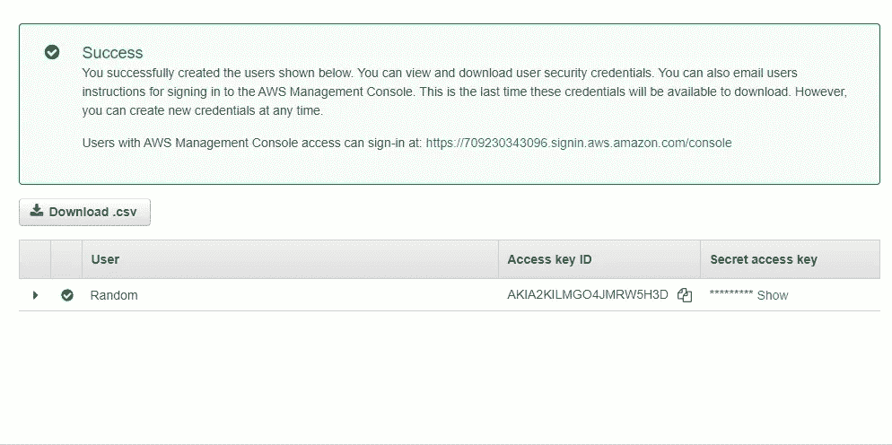

**🔹在这里，您可以看到用户被添加到列表中。**

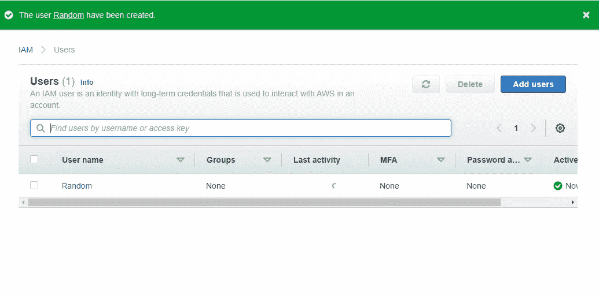

— — — — — — — — — — — — — — — — — — — — — — — — — — — — — —

## ✅注意:正如你在倒数第二张图中看到的，秘密访问密钥是隐藏的，这表明这个密钥是多么重要，它可以多么容易地被用来访问 AWS 资源。因此，将该文件存储在普通变量文件中并不是一个好的做法。所以在这里，拱顶扮演着重要的角色。

— — — — — — — — — — — — — — — — — — — — — — — — — — — — — — —

# 🔰要创建 Vault 文件，请执行以下操作:

**语法:**

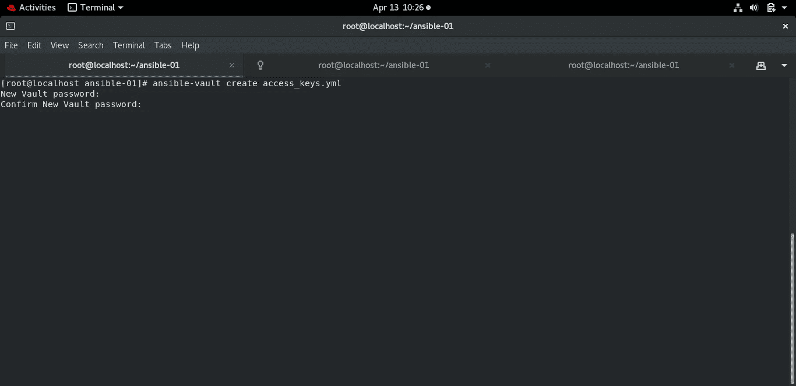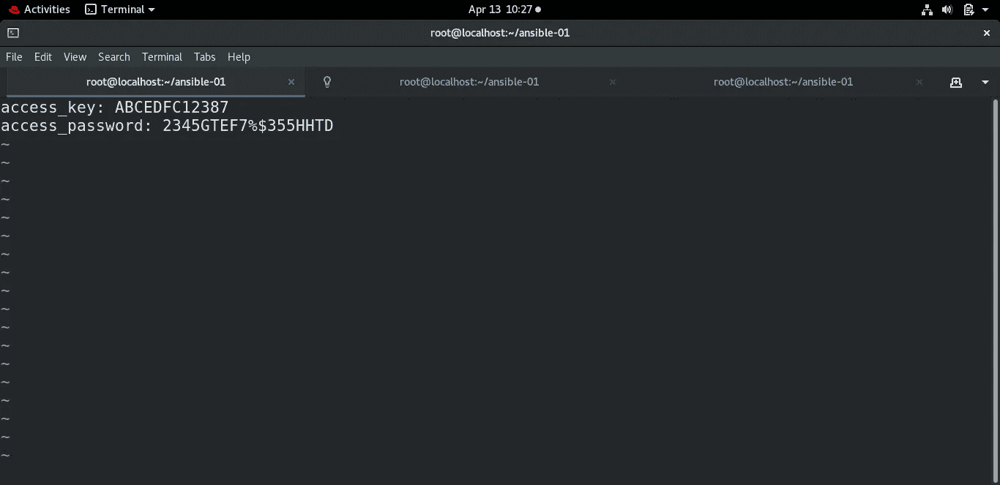

**🔹要在剧本中使用这个文件，只需在剧本的开头指定 var 文件。**

— — — — — — — — — — — — — — — — — — — — — — — — — — — — — — —

# 🔰故回奏本:

**🔹**最后要使用的部分是规则，这意味着您希望允许哪些防火墙端口进行访问。这里我们有两个规则，第一个规则指定协议是 TCP，from-to 端口是指所有流量的端口号范围，从 0 到 65535。**但是这里我们将它保持为 22，因为 ssh 协议要求相同，并允许端口 80 上的所有流量，因为我们将部署一个每个人都可以访问的网页。**

**🔹** Rules_egress 表示如果没有提供，则采用默认的全输出规则。如果提供了空列表，将不会启用任何出站规则。版本 2.4 中添加了规则出口源列表支持。在 2.5 版本中，增加了对规则描述的支持。

**🔹最后一个**vars:ansible _ python _ interpreter:/bin/python 3**是可选的，因为它只是指定 ansi ble 应该使用哪个 python 解释器，但如果您的操作系统有不同版本的 python，这是强制性的，因此您应该指定使用哪个以避免错误。**

— — — — — — — — — — — — — — — — — — — — — — — — — — — — — — —

# 🔰预配 EC2 实例:

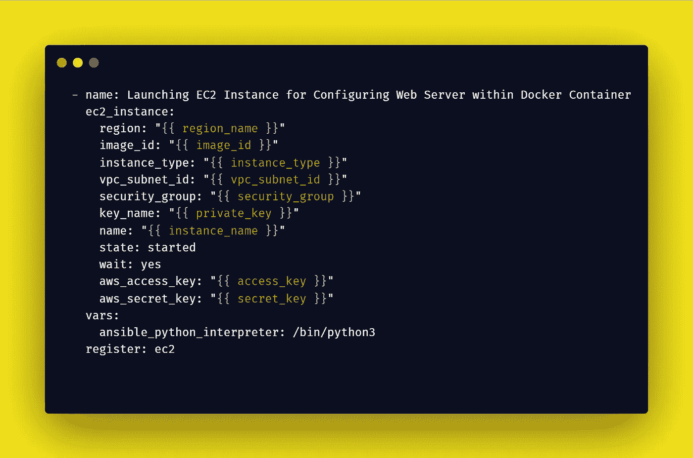

**🔹因为我们有 ec2_group 来创建安全组，所以类似地，我们有 ec2_instance 来启动 AWS EC2 服务上的新实例。让我们看看它需要的参数。这里我们只讨论那些我们不熟悉的参数。**

— — — — — — — — — — — — — — — — — — — — — — — — — — — — — — —

# 🔰图像 ID:

**🔹转到 EC2 服务&根据要求选择映像的 ID，因此单击启动实例。**

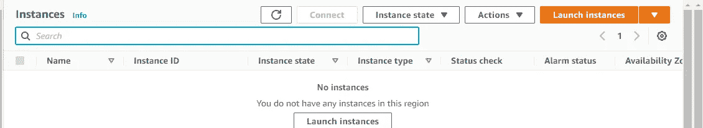

**🔹选择操作系统映像的映像 ID**

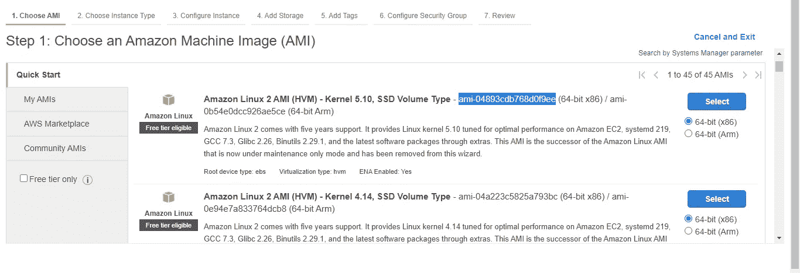

— — — — — — — — — — — — — — — — — — — — — — — — — — — — — — —

# 🔰实例类型:

**🔹实例类型是指资源，即(RAM & CPU ),我们将与这个实例&一起使用，随后根据使用情况收费。但是有一个名为 t2.micro 的符合自由层条件的类型，对于我们的使用情形来说已经足够了，因此我们将使用这个。**

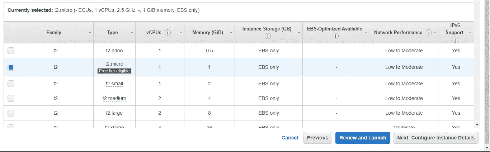

— — — — — — — — — — — — — — — — — — — — — — — — — — — — — — —

# 🔰VPC 子网 ID:

**🔹**启动实例的子网 ID(VPC)如果没有提供，则 [amazon.aws.ec2 实例](https://docs.ansible.com/ansible/latest/collections/amazon/aws/ec2_instance_module.html)将选择默认 VPC 的默认区域。

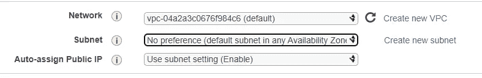

— — — — — — — — — — — — — — — — — — — — — — — — — — — — — — —

# 🔰私钥:

**🔹**这与我们在开始时看到的如何创建的私钥相同，只需指定密钥对的名称。

— — — — — — — — — — — — — — — — — — — — — — — — — — — — — — —

**🔹该名称就是您希望为实例指定的名称，启动状态意味着 EC2 实例在启动后应该成功运行，并等待 EC2 状态检查报告 OK，如果 wait= yes(true)意味着等待操作系统完全启动。最后，我们使用注册模块，该模块存储 Ansible 在启动实例时收集的所有信息，包括 IP 地址、MAC 地址、DNS 服务器名称等，我们将使用这些信息检索 IP 以使用动态清单。**

— — — — — — — — — — — — — — — — — — — — — — — — — — — — — — —

# 🔰现在是进行动态清点的时候了，我们将通过检索最近启动的实例的 IP 地址来连接到该实例:

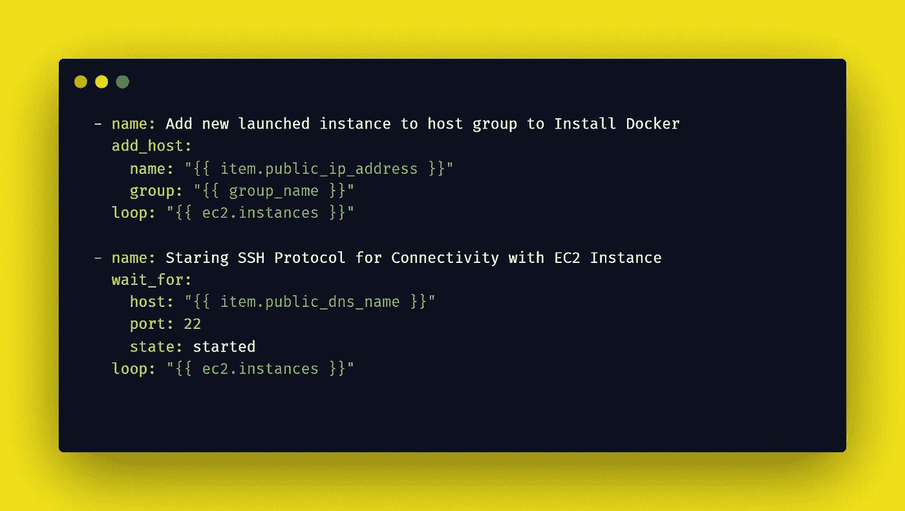

**🔹add_host —将主机(或者组)添加到 ansible-playbook 内存清单中。**根据记忆，这意味着组名只会保留到剧本运行时。您可以将此称为[ <组名> ]，这是我们在库存概念开始时看到的。

**🔹此外，在“{{ }}”内的循环模块中指定的 ec2.instances 不是来自 vars(变量文件)**。如上所述，注册模块存储 Ansible 在启动实例时收集的所有信息，包括 IP 地址、MAC 地址、DNS 服务器名称等。这就是它在内部存储的方式，我们必须从这个信息中检索 IP，这个信息被称为 ***可回答的事实*。**

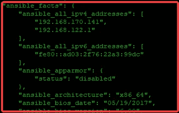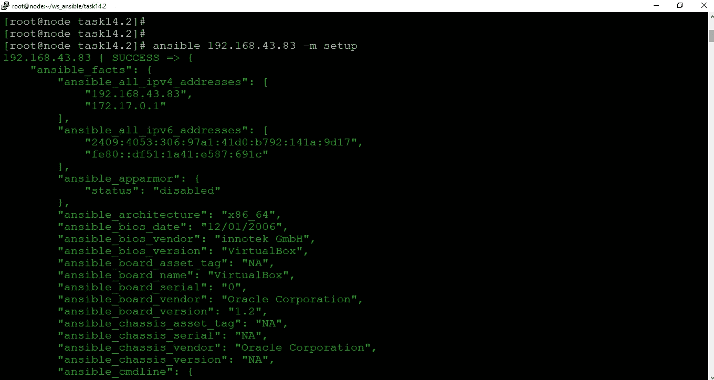

**🔹因此，从这些事实中检索 IP 的语法是**

**🔹对于 wait_for 模块，我们也是这样做的，我们等待 SSH 协议启动，否则 Ansible 将无法与 EC2 实例建立连接。**

**🔹这里更重要的一点是，当你在循环中使用任何变量时(如果我们有多个实例和** **的话，这将获取启动的 IP 地址实例，然后将它们的公共 IP 放在一个名为“hostname”的变量中)，在这种情况下是 ec2.instances，对于其余的游戏/任务，该变量被视为 item，因此 item.public_ip_address 是 noting，但 ec2 . Instances . public _ IP _ address 和 public_dns_name 是相同的。**

— — — — — — — — — — — — — — — — — — — — — — — — — — — — — — —

# 🔰现在，与 EC2 的连接将会成功建立，因此现在是时候进入我们的最后一步，即安装和配置 Docker:

**🔹让我们首先设置 Yum 存储库:**

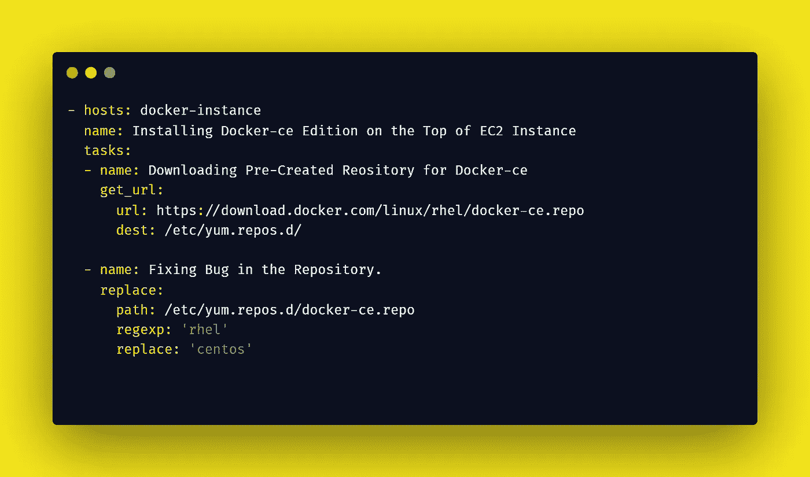

**🔹该主机现在已更改为由 add_host 模块创建的主机组。**

**🔹get_url 将下载预先创建的存储库，dest:将从 url 下载的 repo 存储在指定的位置，即/etc/yum.repos.d**

**🔹第二个被替换的模块是我特意使用的，以防我们下载的库可能已经过时，或者可能无法在我们的实例中安装 Docker，因此我们使用替换模块来指定要被替换的文件的路径。然后是 regexp:“rhel”是将被替换为“centos”的字符串。**

— — — — — — — — — — — — — — — — — — — — — — — — — — — — — — —

🔰安装 Docker 就像我们详细讨论的 Docker & Container 一样简单，你可以通过 [**点击这里**](https://www.linkedin.com/posts/swaroop--shinde_vimaldaga-righteducation-educationredefine-activity-6862244416606801920-8x-r?utm_source=linkedin_share&utm_medium=member_desktop_web) 来检查，因为所有的任务都与我们在命令行中使用的命令完全相同。

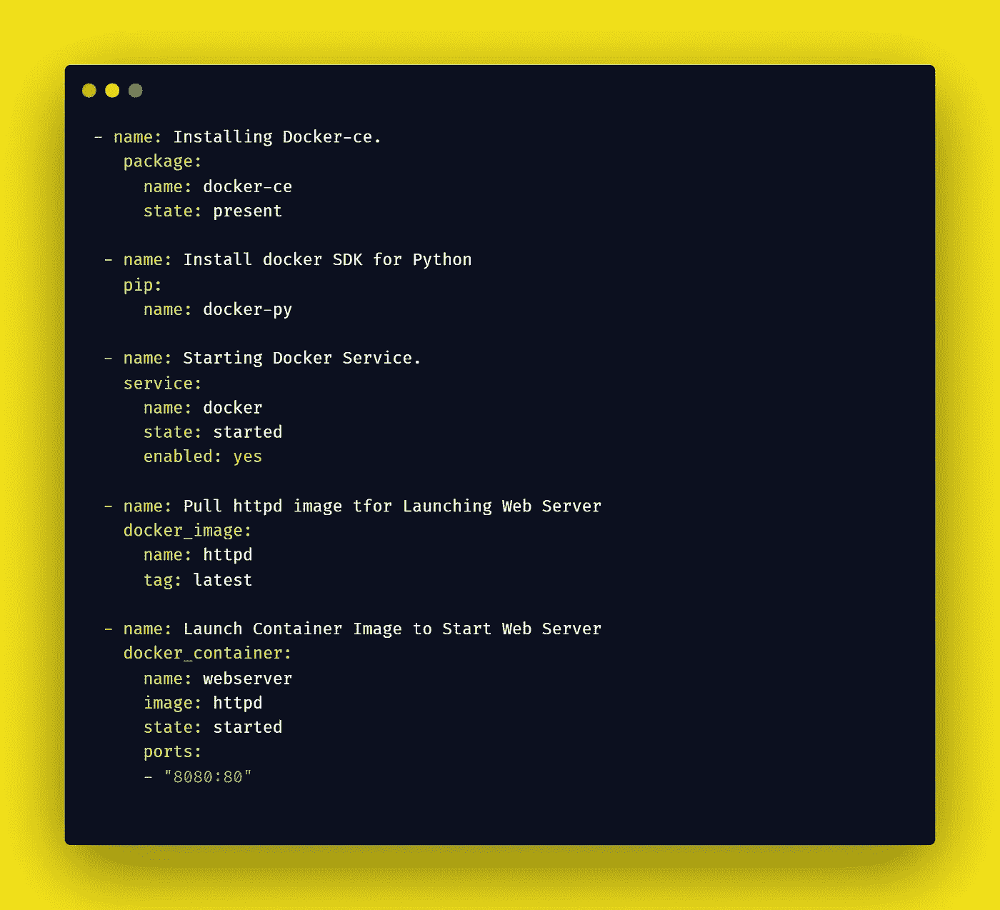

**🔹这里唯一重要的一点是，在最后一个任务中，我们从 httpd 映像启动名为 webserver 的容器映像，状态是 started，因为我们希望在启动容器后立即启动网页服务，并且在命令行中指定为-p 的端口是“8080:80”，这意味着本地主机的 8080 端口号将被重定向到容器的 80 端口，这是 httpd 服务的默认值。**

— — — — — — — — — — — — — — — — — — — — — — — — — — — — — — —

# 🔰现在，使用以下命令运行剧本

**🔹ask-vault-pass 将询问您存储凭证的 access_key 和 private_key 文件的密码！**

— — — — — — — — — — — — — — — — — — — — — — — — — — — — — — —

# 🔰这是没有任何错误的输出。

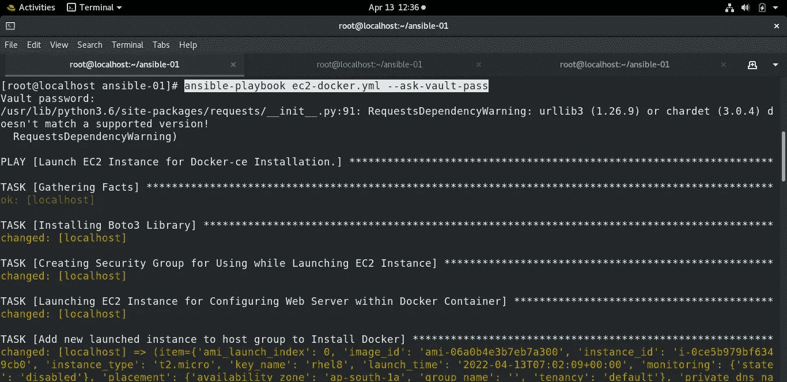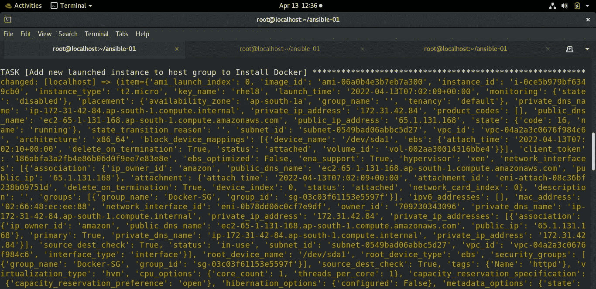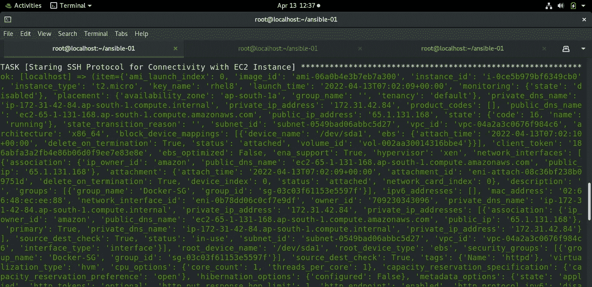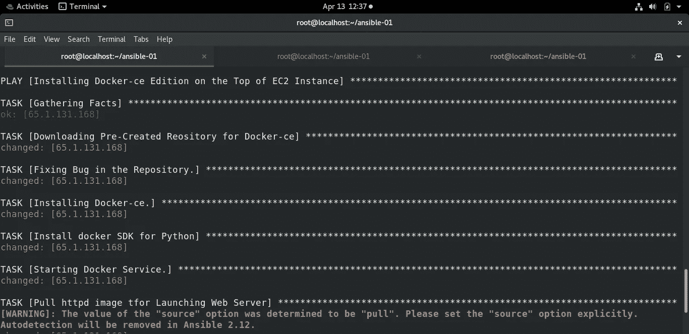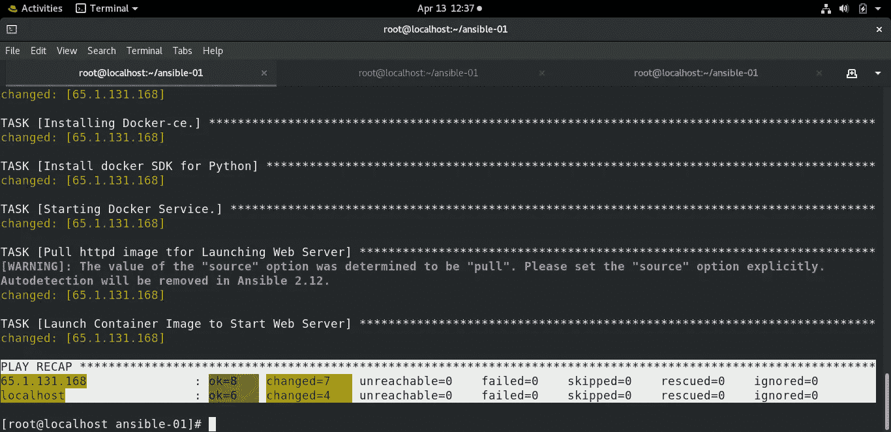

**🔹剧本已经成功执行，如你所见，我们已经获得了新启动的 EC2 实例的 IP 地址，现在让我们看看网页是否工作**

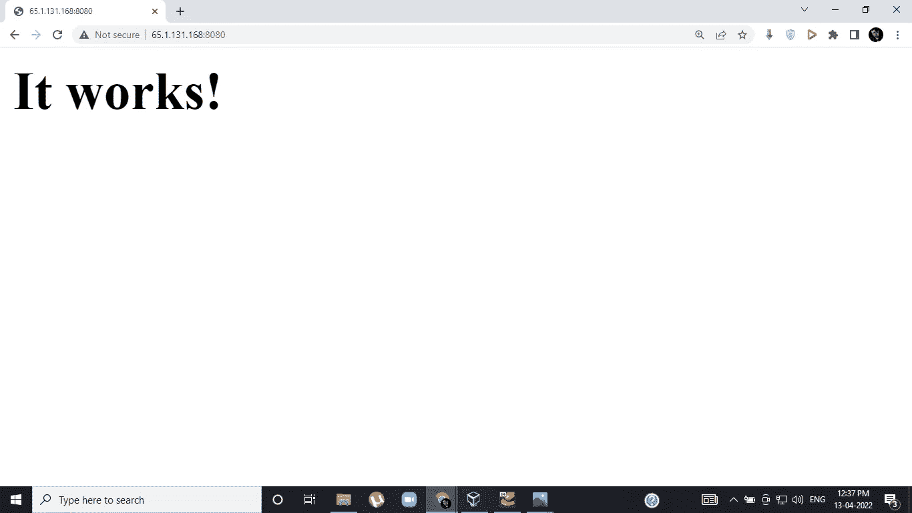

**🔹正如您在 8080 端口上看到的那样，web 服务器已经启动了！！**

**🔹此外，如果我们看一下 AWS 控制台，您可以看到实例运行良好！！**

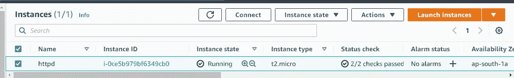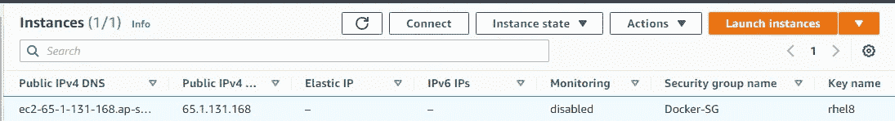

— — — — — — — — — — — — — — — — — — — — — — — — — — — — — —

# 🔰从这篇博客中，我们学习了如何使用 ansi ble Playbook & Dynamic Inventory 配置 AWS EC2 实例以及在 Docker 容器中配置 HTTPD 服务器。

— — — — — — — — — — — — — — — — — — — — — — — — — — — — — —