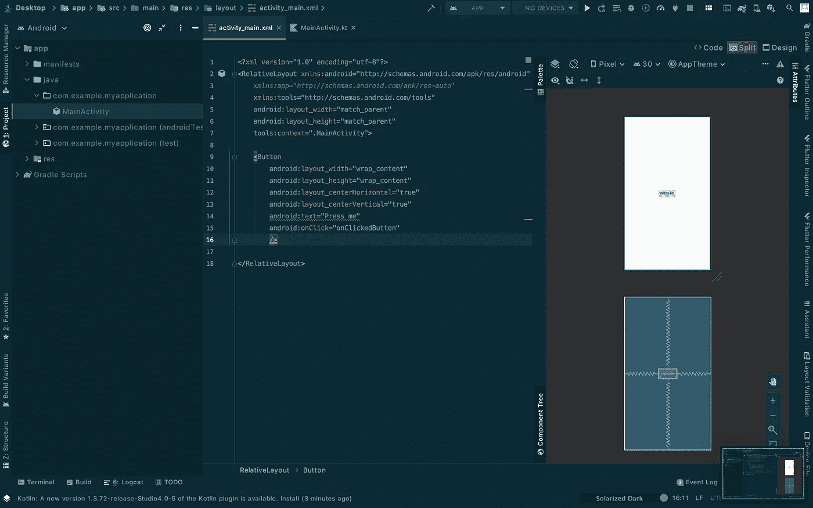

# 将 Flutter 连接到您的原生 Android 项目

> 原文：<https://blog.devgenius.io/connect-flutter-to-your-native-android-project-ae6abfd1a73c?source=collection_archive---------1----------------------->


在本文中，我们将解决将 Flutter 连接到您的原生 Android 项目的问题。

我知道你们有些人认为这是不可能的，但现在，这是可能的！此外，您也可以将它连接到您现有的项目！

吉普的 AGT

我们都知道重新编码整个应用程序是不切实际的。对于这些情况，Flutter 可以集成到您的 Android 和 iOS 原生项目中。

你需要的东西:

*   原生 Android 项目(新的或现有的项目)
*   摆动
*   仿真器或实际设备
*   IDE/s (Android Studio 和 VS 代码)

# 原生 Android 项目

1.  创建一个项目。
2.  让我们在主活动中添加按钮



我们添加了一个按钮，将它的宽度和高度设置为文本的长度，将它放在屏幕的中间，并设置它的 onClicked 标识符来触发按钮的功能。

3.让我们添加按钮的功能。


如你所见，我在 MainActivity.kt 中添加了***onClickedButton()***来实现我们从 XML 创建的按钮的功能。

如果你在模拟器或设备上运行这个。你可以看到这样的东西。


从右侧看，这是初始屏幕，从左侧看，您可以看到吐司，因为我们按了按钮。

4.接下来，我们将为 Flutter 实现添加第二个屏幕。所以要做到这一点。

右键单击可以找到 MainActivity.kt 的文件夹，然后选择 ***新建*** ，进入 ***活动*** ，选择 ***空活动***


接下来，添加一些活动名称(您可以提供)并点击 finish。


如您所见，它添加了另一个 Kotlin 和 XML 文件。


5.接下来是从主要活动导航到次要活动。只要回到 MainActivity.kt


如你所见，我们声明了变量 intent 并将其设置为 ***intent(from: current，to: next)。*** 之后，我们添加 startActivity 来触发下一个屏幕的意图。


右侧是第一个屏幕，当您按下按钮时，它将导航到第二个屏幕，即右侧的图像

下一步是为本地项目创建和抖动模块。

# 创建一个颤振模块，并将其连接到项目。

因此，让我们打开或导航到 Android Studio 的终端并键入`flutter create -t module <name-of-the-module>`

下面是一个例子:


现在，您在文件夹项目中创建了一个 flutter 模块。


正如你所看到的，它在原生 Android 项目中添加了一个颤振模块。

我们要做的第一件事是转到 *build.gradle* 并进入 android，我们需要添加编译选项和 java8(这是必需的)并点击 sync。

```
compileOptions{
    sourceCompatibility 1.8
    targetCompatibility 1.8
}
```


接下来要做的是将 create flutter 模块移出原生项目，转到 *settings.gradle，将这段代码添加到其中，然后点击 sync now。*

```
setBinding(new Binding([gradle: this]))evaluate(new File(
        settingsDir.parentFile,
        'your-flutter-module-name/.android/include_flutter.groovy'
))
```


我们将 flutter_demo 项目从原生项目中移出


在第一张照片中，我们添加了代码，第二张照片是同步的照片。这将自动添加包含和项目代码。

下一步是返回 build.gradle，在依赖项中添加 flutter 实现，然后立即同步。

`implementation project(‘:flutter’)`


添加并同步

# 实现代码的抖动

现在，我们可以把主要活动集中在颤振上。

因此，让我们打开 MainActivity.kt，并移除 *onClickedButton 内部的意图。*


*如您所见，我们添加了 Flutter activity . createdefaultintent(this ),因为我们想从 MainActivity 导航到 Flutter 模块。*

*接下来是去 AndroidManifest。我们应该给它添加 flutter 活动。*

```
<activity
    android:name="io.flutter.embedding.android.FlutterActivity"
   android:configChanges="orientation|keyboardHidden|keyboard|uiMode|density|screenLayout|locale|screenSize|layoutDirection|fontScale"
    android:hardwareAccelerated="true"
    android:windowSoftInputMode="adjustResize" 
/>
```


因此，我们将 Flutter 活动添加到清单中，如果我们运行它，应该会得到这样的结果。


现在，您可以编辑和更改 Flutter 模块，并将其重新运行到您的项目中！

感谢你阅读这篇文章，我希望你今天能学到一些新东西！:D

下一篇文章，将 Flutter 连接到您的原生 iOS 项目！

[https://giphy.com/gifs/finally-atlast-itsover-Oarp36ygIEw6c](https://giphy.com/gifs/finally-atlast-itsover-Oarp36ygIEw6c)