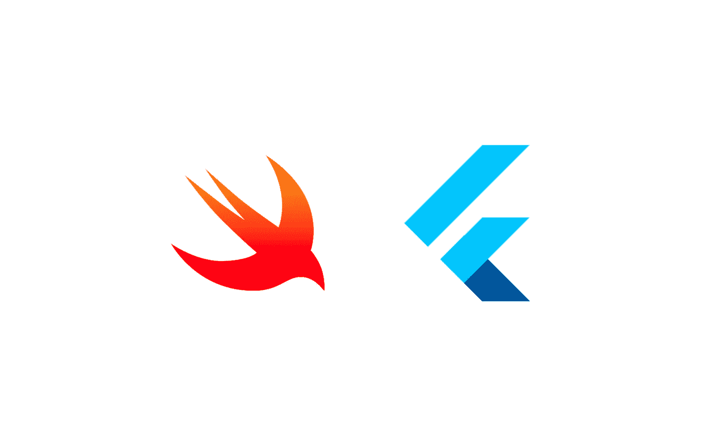
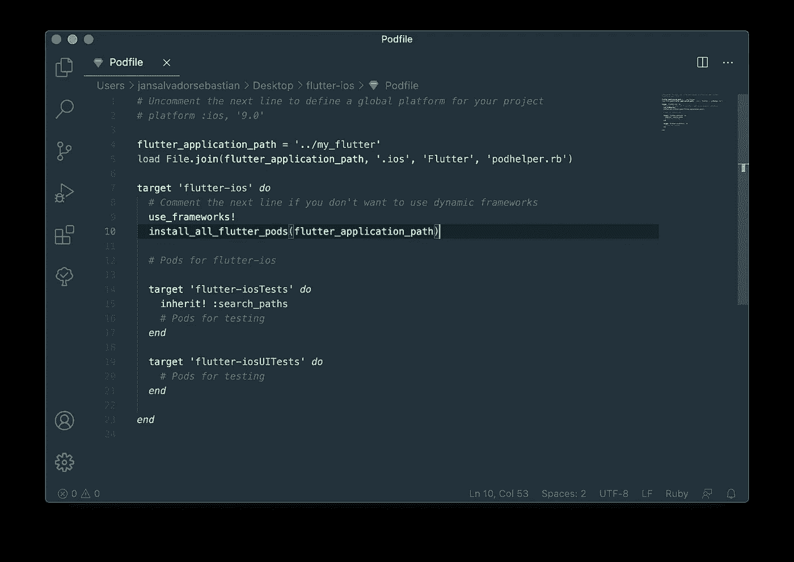
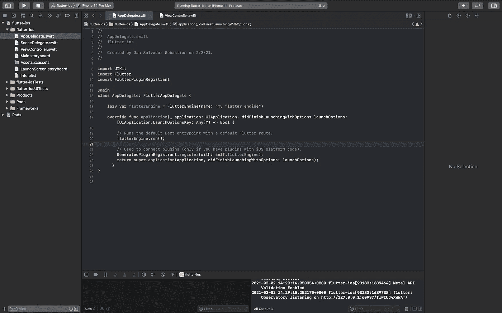
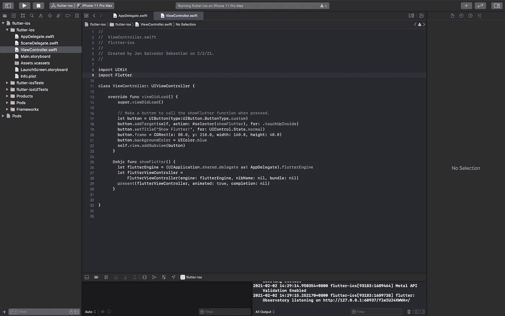

# 将 Flutter 连接到您的本地 iOS 项目

> 原文：<https://blog.devgenius.io/connect-flutter-to-your-native-ios-project-5fffbc543b3e?source=collection_archive---------0----------------------->



在前一篇文章中，我们一步一步地解决了这个问题。如果你错过了，你可以在这个[链接](https://medium.com/dev-genius/connect-flutter-to-your-native-android-project-ae6abfd1a73c)上阅读。

一些开发人员认为将一个 flutter 项目连接到您的原生项目很难，但是在本文中，我们将为您简化它！所以，我们开始吧！

来自[https://giphy.com/](https://giphy.com/)

# **先决条件**

1.  Xcode
2.  椰子足类
3.  颤振和飞镖 SDK

# **整合**

为了简化示例，我们将为两个项目创建一个新项目。以便更容易理解和列举我们的示例 POC 集成所需的设置。

所以让我们假设原生项目有很多代码和 UI。

所以让我们开始吧！

**颤振** 1。创建一个模块。

```
flutter create --template module name_of_project
```

2.更改方向路径并导入/收集依赖项。

```
/// MARK : Change Directory.
cd /Users/jansalvadorsebastian/Desktop/name_of_project/// MARK: Fetch the Dependencies.
flutter pub get
```

> *注意:这是可选的，但这是最佳实践之一，这也是我包含此实践的原因。*

3.在你的设备上测试一下。

```
/// MARK:Option #1: Run Active.
flutter run/// MARK: Option #2: Run all active/availble devices
flutter run -d all/// MARK: Option #3: Run on a specific device.
flutter run -d "iPhone XS"
```

> *注意:这是可选的，但这是最佳实践之一，这也是我包含此实践的原因。*

**Xcode**

1.  创建一个 iOS 项目。

> 注意:这是可选的，如果你已经有一个现有的项目，你可以尝试一下。

2.在您的项目上初始化 Cocoapods。

```
/// MARK: Change Destination.
cd ~/path-to-project/// MARK: Initialized Pods.
pod init
```

3.将 Flutter 整合到您的母语中。

I)在您的 IDE 中打开`PodFile`。在你的`PodFile`上添加这几行代码。

```
/// MARK: Flutter Path
flutter_application_path = '../my_flutter'/// MARK: Embed it to your Environment/Project
 load File.join(flutter_application_path, '.ios', 'Flutter', 'podhelper.rb')
```

样本:



iii)安装吊舱。

```
/// MARK: Installation
pod install
```

iv)这些是您的 Xcode 项目的文件。


v)打开`.xcworkspace`文件。

现在，让我们继续进行本地项目中的编码部分。

1.  在你的`Appdelegate`里，加上这个代码。

```
import Flutter
import FlutterPluginRegistrantclass AppDelegate: FlutterAppDelegate {lazy var flutterEngine = FlutterEngine(name: "my flutter engine")override func application(_ application: UIApplication, didFinishLaunchingWithOptions launchOptions: [UIApplication.LaunchOptionsKey: Any]?) -> Bool {
        // Runs the default Dart entrypoint with a default Flutter route.
        flutterEngine.run();
        // Used to connect plugins (only if you have plugins with iOS platform code).
        GeneratedPluginRegistrant.register(with: self.flutterEngine);
        return super.application(application, didFinishLaunchingWithOptions: launchOptions);
      }
}
```

样本:



2.在 ViewController 中。

I)将 Flutter 导入您的模块。

```
import Flutter
```

ii)我们再加上`button`。

```
let button = UIButton(type:UIButton.ButtonType.custom)
  button.addTarget(self, action: #selector(showFlutter), for: .touchUpInside)
  button.setTitle("Show Flutter!", for: UIControl.State.normal)
  button.frame = CGRect(x: 80.0, y: 210.0, width: 160.0, height: 40.0)
  button.backgroundColor = UIColor.blue
  self.view.addSubview(button)
}
```

iii)按钮的事件动作。

```
[@objc](http://twitter.com/objc) func showFlutter() {
    let flutterEngine = (UIApplication.shared.delegate as! AppDelegate).flutterEngine
    let flutterViewController =
        FlutterViewController(engine: flutterEngine, nibName: nil, bundle: nil)
    present(flutterViewController, animated: true, completion: nil)
  }
```

样本:



iv)现在，尝试在您的设备/模拟器上构建它！

就这些了，伙计们！希望你能学到新的东西！喔喔喔！🥳🥳🥳

对于下一个主题，我将添加简单的路线，所以敬请关注！

[](https://giphy.com/clips/laclippers-basketball-nba-kawhi-leonard-j52sPn4EG2TIgIUoCf) [## 它是一个包裹。- GIPHY 剪辑

### 在 GIPHY 上搜索动画 gif！

giphy.com](https://giphy.com/clips/laclippers-basketball-nba-kawhi-leonard-j52sPn4EG2TIgIUoCf)