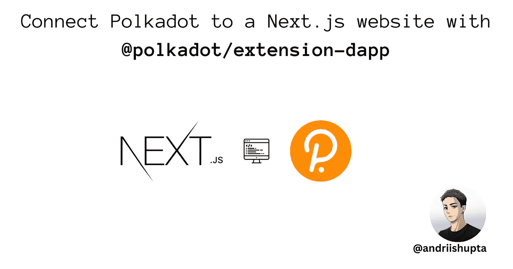
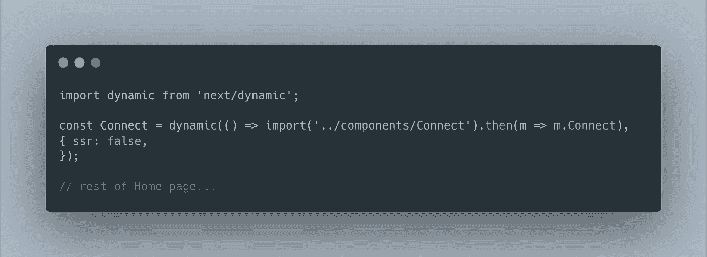
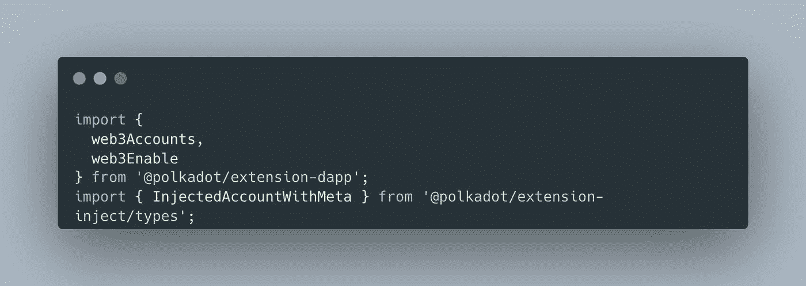
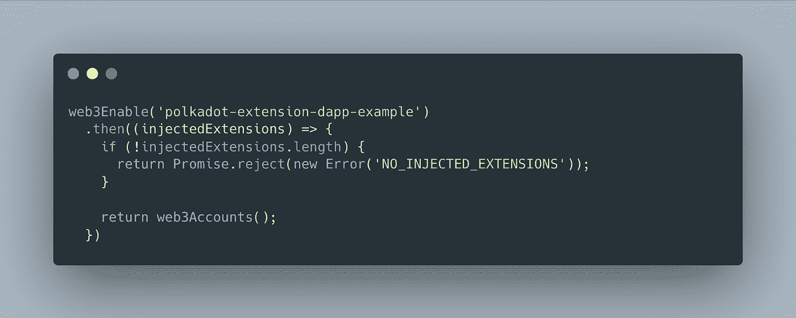
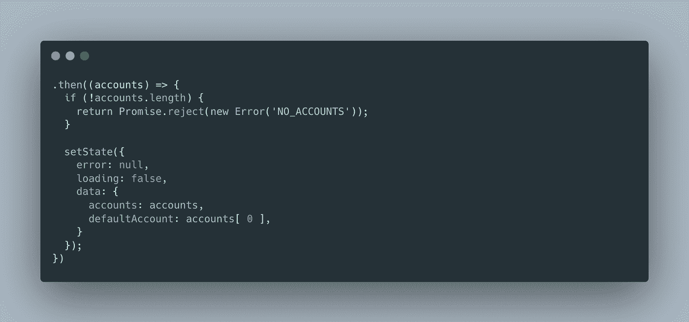
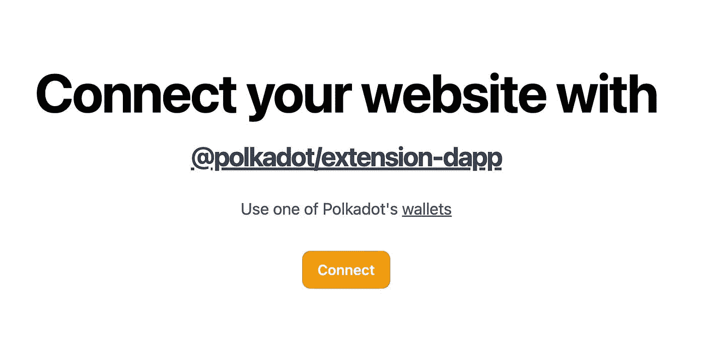
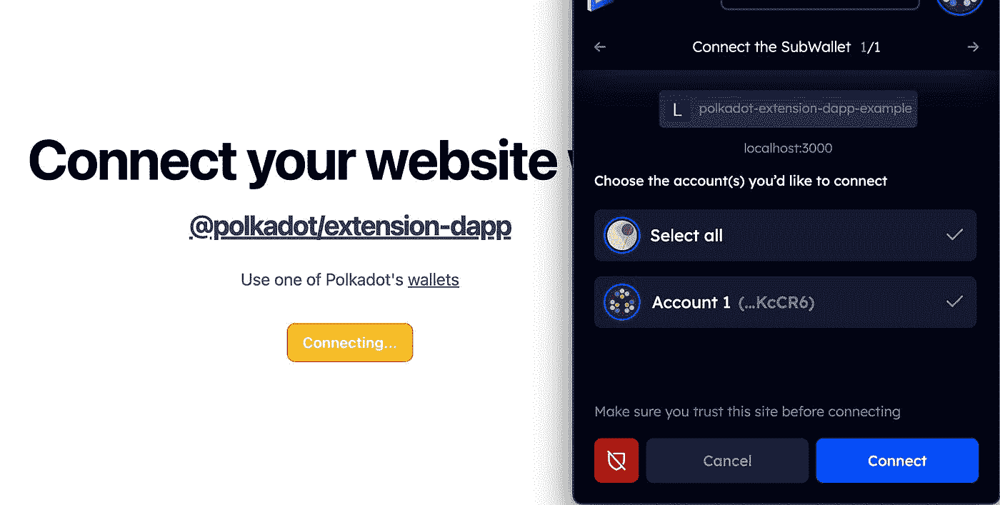
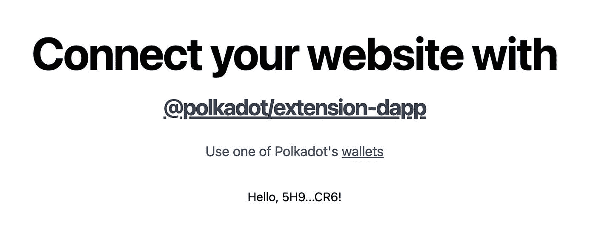
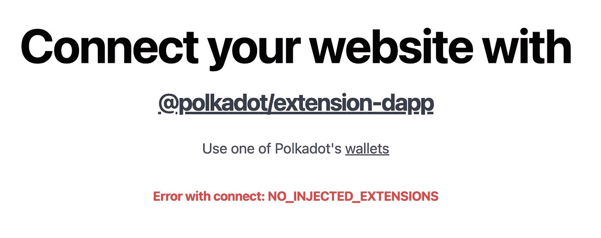
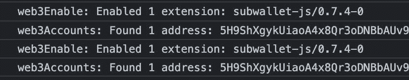

# 使用@polkadot/extension-dapp 将 Polkadot 连接到 Next.js 网站

> 原文：<https://blog.devgenius.io/connect-polkadot-to-a-next-js-website-with-polkadot-extension-dapp-e422e7e363a6?source=collection_archive---------14----------------------->

# 🔗链接

*   [andriishupta/polkadot-extension-dapp-example | GitHub](https://github.com/andriishupta)
*   [polkadot-extension-dapp-example |部署在 Vercel 上](https://polkadot-extension-dapp-example.vercel.app/)
*   [延期文件](https://polkadot.js.org/docs/extension/)
*   [子波](https://subwallet.app/)
*   PolkaVerse | GitHub
*   [Subtips | Github](https://github.com/andriishupta/subtips-app)
*   🌴[我的链接](https://linktr.ee/andriishupta)

# 📰发布于

*   [哈希节点💻](https://blog.andriishupta.dev/)
*   [中型✍️](https://andriishupta.medium.com/)
*   [开发社区👩‍💻👨‍💻](https://dev.to/andriishupta)

# 🤓介绍

作为一名开发人员，有必要了解各种区块链平台之间的差异，以选择适合您需求的平台。一个关键的区别(对我来说)是开发者可以获得技术资源和教程。以太坊有许多文章和教程演示如何将钱包连接到网站，而 Polkadot 上的信息较少。这可能会让刚接触以太坊的开发者更容易入门，并学习如何在该平台上构建应用。

对于开发人员来说，熟悉 Polkadot 以及如何在它的平台上构建也很重要，因为它有独特的特性和潜在的应用。

如今，对于 web3 社区来说，开发人员在文档之外的体验非常重要。

在本文中，我将展示一个如何将 [SubWallet](https://subwallet.app) (这就是我所使用的)连接到 Next.js 网站的例子。

# 技术

在以太坊上，我们有 web3.js 和 ethers.js 用于连接到一个网站和许多建立在它上面的不同的库。例如，我见过的许多项目将 [wagmi](https://wagmi.sh/) 与 React.js 一起使用。这只是一个福音，例如它包括了您需要与区块链交互的完整功能列表:“连接钱包”显示 ENS 和平衡信息、签署消息、与合同交互等等——所有这些都具有缓存、请求重复数据删除和持久性。

Polkadot 有现成的库和工具可以和区块链一起工作，其中之一就是`@polkadot/extension-dapp`。这就是我们用来“连接钱包”的东西。

# 🧑‍💻编码

我们将使用默认的 Next.js 应用程序，所以这里没有什么新东西。查看[入门](https://nextjs.org/docs/getting-started)提醒自己 Next.js。

使用`@polkadot/extension-dapp`最关键的一点是它需要一个浏览器来运行，所以使用 Next.js，我们只需要在客户端渲染时渲染“连接”按钮。为此，我们将使用[动态导入](https://nextjs.org/docs/advanced-features/dynamic-import)。

[🔗源代码](https://github.com/andriishupta/polkadot-extension-dapp-example/blob/main/pages/index.tsx)

在主页上，我们动态加载我们的`Connect`组件。连接组件是所有奇迹发生的地方。

[🔗源代码](https://github.com/andriishupta/polkadot-extension-dapp-example/blob/main/components/Connect.tsx)

先说进口:

`InjectedAccountWithMeta`是我们将获得的一种账户。我是为了打字稿导入的。

这里我们主要关注的是`web3Enable`和`web3Accounts`。

*我在下面使用了承诺链，但是如果你更喜欢*`try-catch`*+*`async / await`*——那就来吧！*

# `web3Enable`

最初的功能是调用 even 来检查我们的浏览器是否有钱包可以使用。如果我们没有任何东西可以处理，扩展会在控制台中显示它，我们还应该抛出一个错误，告诉用户他应该使用有效的钱包来使用浏览器。

# `web3Accounts`

与`web3Accounts`相同——如果你是第一次打开网站，它会加载已连接的账户或提示你连接到网站——这对于 web3 用户来说是非常熟悉的体验。

您可以在部署在 Vercel 上的[polkadot-extension-dapp-example |上尝试这个流程，它看起来是这样的:](https://polkadot-extension-dapp-example.vercel.app)

*免责声明:我只在有 1 个钱包的时候试过，但举个简单的例子，应该够用了。*

# 🧑‍🏫后续步骤和更多示例

使用连接的钱包和可用帐户，您可以做任何您想做的事情:查看如何创建和签署交易，显示`<Identicon/>`等:

[https://polkadot.js.org/docs](https://polkadot.js.org/docs)

使用`@polkadot/api`、`@polkadot/ui-keyring`等更成熟的例子是[波尔卡舞](https://github.com/dappforce/polkaverse)。它是一个建立在[sub Social](https://subsocial.network/)——“社交金融的区块链”之上的去中心化社交网络。

此外，我还有另一个项目，我试图使用 Subsocial API——这是 raw-raw-raw，因为我可以连接到 Subsocial API 和 Polkadot 来体验事情是如何工作的。随意看看:[https://github.com/andriishupta/subtips-app](https://github.com/andriishupta/subtips-app)

感谢阅读！🙇

*原发布于*[*https://blog . andriishupta . dev*](https://blog.andriishupta.dev/connect-polkadot-to-a-nextjs-website-with-polkadotextension-dapp)*。*