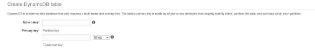
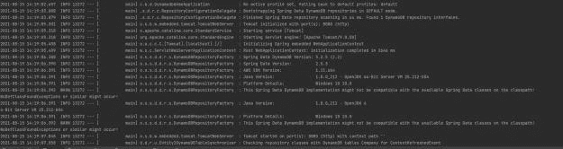
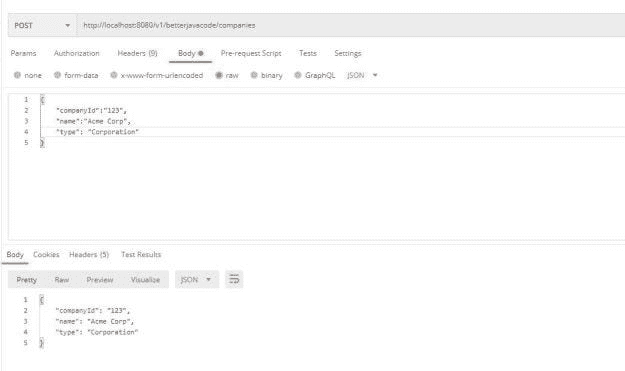

# 将 Spring Boot 应用程序与 AWS Dynamo DB 连接

> 原文：<https://blog.devgenius.io/connect-spring-boot-application-with-aws-dynamo-db-18c70a34fdea?source=collection_archive---------5----------------------->

在这篇文章中，我将展示如何将 Spring Boot 应用程序与 AWS Dynamo DB 连接起来。我还将介绍 AWS Dynamo DB 的一些基础知识，它是一个非 SQL 数据库。

# AWS 发电机数据库

根据 Amazon [文档](https://aws.amazon.com/dynamodb/)，Dynamo DB 是无 SQL 键值和文档数据库。我们确实有一些替代方案，比如 Cassandra(键值)或 Mongo DB(文档)。

迪纳摩 DB 提供

*   可靠的可扩展性能
*   允许键值访问的简单 API

Dynamo DB 通常非常适合具有以下要求的应用程序:

1.  大量数据和延迟要求
2.  推荐系统的数据集
3.  使用 AWS Lambda 的无服务器应用程序

# 关键概念

在我们可以使用 [Dynamo DB](https://betterjavacode.com/programming/7-aws-services-every-developer-should-know-about) 之前，理解这个数据库的一些关键概念是很重要的。

*   **表格、项目和属性**——这三个是迪纳摩 DB 的基本模块。表格是一组数据记录。项目是表中的单个数据记录。此后，表中的每一项都使用主键来标识。属性是单个项目中的数据片段。
*   迪纳摩数据库表是无模式的。然而，我们只需要在创建表时定义一个**主键**。简单主键**或复合主键**是主键的两种类型。****
*   **二级索引** —有时主键不足以从表中访问数据。辅助索引支持来自 Dynamo DB 的附加访问模式。然而，有两种类型的索引— **局部二级索引**和**全局二级索引**。本地辅助索引使用与基础表相同的分区键，但使用不同的排序键。全局辅助索引使用与基础表不同的分区键和排序键。

# 迪纳摩数据库的应用

与其他 SQL 或 NoSQL 数据库相比，Dynamo DB 有一个不同之处。我们可以通过 REST 调用与 Dynamo DB 进行交互。我们不需要应用程序需要保持一致连接的 JDBC 连接协议。

有两种方法可以将应用程序连接到 Dynamo DB。

1.  将 Spring 数据库与 Dynamo DB 一起使用
2.  使用 AWS SDK 提供的客户端

# Spring Boot 应用

作为演示的一部分，我们将创建一些描述实体关系的数据模型类。随后，应用程序将为 crud 操作提供一个简单的 REST API，并将数据存储在 Dynamo DB 中。

因此，让我们从在应用程序中添加所需的依赖项开始:

```
dependencies {
	implementation 'org.springframework.boot:spring-boot-starter-web'
	implementation 'io.github.boostchicken:spring-data-dynamodb:5.2.5'
	implementation 'junit:junit:4.13.1'
	testImplementation 'org.springframework.boot:spring-boot-starter-test'
}
```

因此，依赖关系`spring-data-dynamodb`允许我们在模型类中表示 Dynamo DB 表，并为这些表创建存储库。

我们将如下创建我们的模型类`Company`:

```
package com.betterjavacode.dynamodbdemo.models;

import com.amazonaws.services.dynamodbv2.datamodeling.DynamoDBAttribute;
import com.amazonaws.services.dynamodbv2.datamodeling.DynamoDBAutoGeneratedKey;
import com.amazonaws.services.dynamodbv2.datamodeling.DynamoDBHashKey;
import com.amazonaws.services.dynamodbv2.datamodeling.DynamoDBTable;

@DynamoDBTable(tableName = "Company")
public class Company
{
    private String companyId;

    private String name;

    private String type;

    @DynamoDBHashKey(attributeName = "CompanyId")
    @DynamoDBAutoGeneratedKey
    public String getCompanyId ()
    {
        return companyId;
    }

    public void setCompanyId (String companyId)
    {
        this.companyId = companyId;
    }

    @DynamoDBAttribute(attributeName = "Name")
    public String getName ()
    {
        return name;
    }

    public void setName (String name)
    {
        this.name = name;
    }

    @DynamoDBAttribute(attributeName = "Type")
    public String getType ()
    {
        return type;
    }

    public void setType (String type)
    {
        this.type = type;
    }
}
```

所以这个类 Company 映射到同名的 Dynamo DB 表。注释`DynamoDBTable`帮助我们进行映射。同样，`DynamoDBHashKey`是这个表的属性键。`DynamoDBAttribute`是这张表的其他属性。

我们将创建一个 REST 控制器和一个服务类，允许我们调用这个对象的 CRUD APIs。

```
package com.betterjavacode.dynamodbdemo.controllers;

import com.betterjavacode.dynamodbdemo.models.Company;
import com.betterjavacode.dynamodbdemo.services.CompanyService;
import org.springframework.beans.factory.annotation.Autowired;
import org.springframework.http.HttpStatus;
import org.springframework.http.ResponseEntity;
import org.springframework.web.bind.annotation.*;

@RestController
@RequestMapping("v1/betterjavacode/companies")
public class CompanyController
{
    @Autowired
    private CompanyService companyService;

    @GetMapping(value = "/{id}", produces = "application/json")
    public ResponseEntity getCompany(@PathVariable("id") String id)
    {

        Company company = companyService.getCompany(id);

        if(company == null)
        {
            return new ResponseEntity<>(HttpStatus.BAD_REQUEST);
        }
        else
        {
            return new ResponseEntity<>(company, HttpStatus.OK);
        }
    }

    @PostMapping()
    public Company createCompany(@RequestBody Company company)
    {
        Company companyCreated = companyService.createCompany(company);

        return company;
    }
}
```

因此，我们有两种方法，一种是获取公司数据，另一种是创建公司。

```
package com.betterjavacode.dynamodbdemo.services;

import com.betterjavacode.dynamodbdemo.models.Company;
import com.betterjavacode.dynamodbdemo.repositories.CompanyRepository;
import org.springframework.beans.factory.annotation.Autowired;
import org.springframework.stereotype.Service;

import java.util.List;
import java.util.Optional;

@Service
public class CompanyService
{
    @Autowired
    private CompanyRepository companyRepository;

    public Company createCompany(final Company company)
    {
        Company createdCompany = companyRepository.save(company);
        return createdCompany;
    }

    public List getAllCompanies()
    {
        return (List) companyRepository.findAll();
    }

    public Company getCompany(String companyId)
    {
        Optional companyOptional = companyRepository.findById(companyId);

        if(companyOptional.isPresent())
        {
            return companyOptional.get();
        }
        else
        {
            return null;
        }
    }
}
```

# 将 Spring Boot 应用程序与 AWS Dynamo DB 连接

到目前为止，我们已经创建了应用程序的一些部分。但是，我们还有一个重要的部分，那就是将我们的应用程序连接到 AWS 中的 AWS Dynamo DB 服务。

登录 AWS 控制台并访问 Dynamo DB。

在 Dynamo DB 中创建新表。



假设，你选择主键为`CompanyId`，我们这里应该没问题。记住，那是我们在模型类中定义的分区键。

现在回到 Spring Boot 应用程序。创建一个新 bean `ApplicationConfig`来定义 Dynamo DB 配置。

```
package com.betterjavacode.dynamodbdemo.config;

import com.amazonaws.auth.AWSCredentials;
import com.amazonaws.auth.AWSCredentialsProvider;
import com.amazonaws.auth.AWSStaticCredentialsProvider;
import com.amazonaws.auth.BasicAWSCredentials;
import com.amazonaws.regions.Regions;
import com.amazonaws.services.dynamodbv2.AmazonDynamoDB;
import com.amazonaws.services.dynamodbv2.AmazonDynamoDBClientBuilder;
import org.socialsignin.spring.data.dynamodb.repository.config.EnableDynamoDBRepositories;
import org.springframework.beans.factory.annotation.Value;
import org.springframework.context.annotation.Bean;
import org.springframework.context.annotation.Configuration;

@Configuration
@EnableDynamoDBRepositories(basePackages = "com.betterjavacode.dynamodbdemo.repositories")
public class ApplicationConfig
{
    @Value("${amazon.aws.accesskey}")
    private String amazonAccessKey;

    @Value("${amazon.aws.secretkey}")
    private String amazonSecretKey;

    public AWSCredentialsProvider awsCredentialsProvider()
    {
        return new AWSStaticCredentialsProvider(amazonAWSCredentials());
    }

    @Bean
    public AWSCredentials amazonAWSCredentials()
    {
        return new BasicAWSCredentials(amazonAccessKey, amazonSecretKey);
    }

    @Bean
    public AmazonDynamoDB amazonDynamoDB()
    {
        return AmazonDynamoDBClientBuilder.standard().withCredentials(awsCredentialsProvider()).withRegion(Regions.US_EAST_1).build();
    }
}
```

我们需要通过`application.properties`中的`accessKey`和`secretKey`。重要的是，我们在这里创建了一个`AmazonDynamoDB` bean。

现在，让我们启动我们的应用程序，我们将看到日志显示它已经创建了一个与 DynamoDB 表`Company`的连接。



一旦应用程序启动，我们将访问 Postman for REST API。



# 结论

这个演示的代码可以在我的 [github 库](https://github.com/yogsma/betterjavacode/tree/main/dynamodbdemo)中找到。

在这篇文章中，我们展示了如何在 Spring Boot 应用程序中使用 Dynamo DB——一个非 SQL 数据库。

*   我们讨论了迪纳摩 DB 的概念。
*   我们创建了一个 Spring Boot 应用程序。
*   我们在 AWS 中创建了一个 Dynamo DB 表。
*   我们将 Spring Boot 应用程序连接到 AWS Dynamo 数据库表。

*原载于 2021 年 8 月 15 日 https://betterjavacode.com*[](https://betterjavacode.com/programming/spring-boot-connect-aws-dynamo-db)**。**