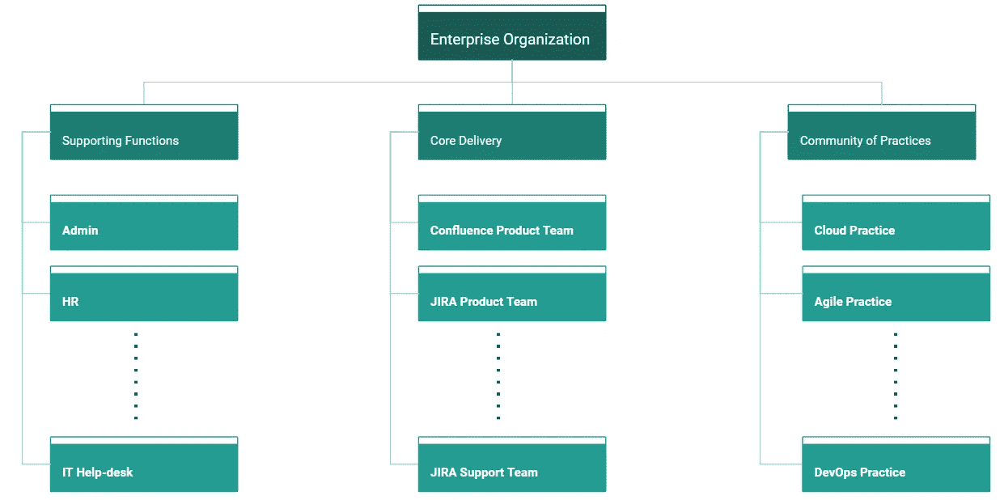
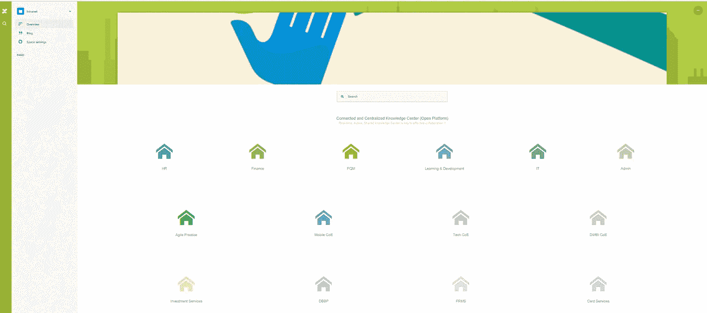
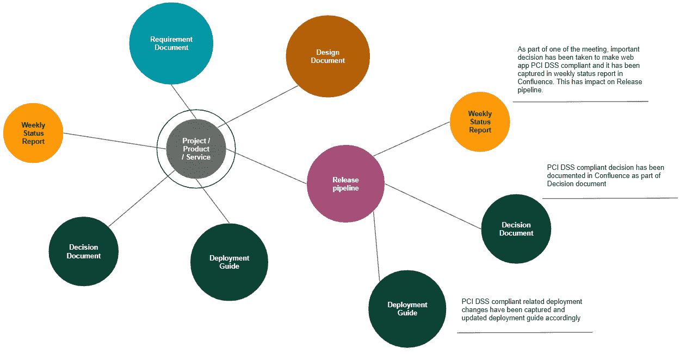

# 连接和集中的知识中心(开放平台)

> 原文：<https://blog.devgenius.io/connected-and-centralized-knowledge-center-open-platform-ac26921eaf46?source=collection_archive---------1----------------------->

**实时、活跃、共享的知识中心是有效团队协作的关键！！**

关于 ***团队协作*** 已经说了很多，写了很多，人们可以在互联网上找到丰富的信息。因此，在分享实现更好的团队协作的方法时，我会尽量具体一些。

作为本文的一部分，我将介绍问题的解决方案——“团队如何有效地协作？”进而提高组织的生产力。解决方案基于由 Atlassian 创建的名为" [Confluence](https://www.atlassian.com/software/confluence) 的非常具体的工具/产品，以及由 [RefinedWiki](https://www.refinedwiki.com/) 创建的" [RefinedSpaces](https://www.refinedwiki.com/) "插件。市场上可能会有更多的工具/产品提供相同的功能，用户可以根据自己的需要和不同的使用情形来使用它们。然而重要的一点是，如果工具/产品本身成为团队协作的痛苦，那么最终团队停止使用该工具，整个协作的目的就失败了。

在本文的最后，我嵌入了 Confluence 演示站点的链接，您可以参考该站点来了解本文解决方案部分所涉及的不同点。

让我们快速了解 Confluence 和 RefinedSpaces 如何帮助团队进行实时协作。

通过融合，您可以实现以下几点-

1.  **访问和使用方面的所有权**:组织中的每个人都拥有真正意义上的工具。团队可以自己轻松地创建、更新和访问信息，而不依赖于控制、管理和所谓“拥有”该工具的任何其他内部或外部团队。相反，想象一个场景，团队依赖其他人或其他团队为您提供访问或创建信息，而团队需要等待数小时/数天才能得到他们的响应。
2.  **集中化**:在中央位置创建信息，可以使用 HTTPS 作为其基于网络的工具/应用程序通过网络访问这些信息。相反，想象一个分散的地方，信息分散在不同的系统中，如电子邮件、聊天、共享文件夹、特定团队成员的硬盘等。团队在获取一些信息上浪费了时间(数小时/数天)。作者 Anne Catambay 写了一篇关于团队协作主题的博客[你的企业是在协作——还是仅仅在交流？](https://www.clarizen.com/is-your-enterprise-collaborating-or-just-conversing/)我发现这与本文非常相关。
3.  **连接**:我们能够连接不同的信息集/页面，以了解完整的上下文并看到大图。相反，想象一个信息不连贯的地方，团队正在努力获取完整的上下文。团队、团队或一些团队成员感到迷失和孤立，并基于非常有限的上下文提供解决方案。
4.  **一致性**:使用 Confluence 模板(开箱即用并创建自定义模板)来实现跨组织信息收集的一致性。

“RefinedSpaces”真是锦上添花。它有助于以最简单的方式增强信息的结构、主题、布局和导航。为 Confluence 构建整体内容导航框架实际上节省了很多时间(是的，很多时间)。

现在让我们谈谈解决方案。

**解决方案** —使用 Confluence 和 RefinedSpaces 创建集中和互联的知识中心。

企业组织需要多层次的合作-

*   在组织级别—多个部门(核心交付团队、支持职能团队，如人力资源、行政、IT 服务台、差旅服务台等。和实践社区，如 CoEs)
*   在部门层面，多个项目/产品/服务(例如，Confluence、JIRA 等。如果我们考虑亚特兰蒂斯人)
*   在项目级别，多个团队(如交付团队、支持团队、专业服务团队等。)
*   在团队级别，多个团队成员(每个单独的团队成员)

这是示例层次结构，您可以根据自己的组织结构来定义和设计该层次结构。

企业组织样本结构

现在使用 RefinedSpaces 插件在 Confluence 中映射这个层次。

汇合仪表板页面(所有团队的主页)

每个团队都有他们自己的家/空间，他们将不再依赖任何其他团队从他们的家/空间访问/创建/更新信息。

现在，下一步是，如果我们进入任何家庭/空间，我们希望在信息块方面有一致的用户体验。因此，我们参考了 Home/space，这将帮助每个团队如何对信息进行分类、结构化和组织。

你可以使用信息建筑来设计、定义和丰富参考家居/空间，你可以随心所欲地发挥创造力，但一定要保持简单。

最后一部分是建立多个工件的连接，以获得完整的上下文，这就是 Confluence 在协作工具中发挥关键作用的地方，它使协作工具基于网络，并提供相同的体验，就像我们使用 google over web 搜索信息并通过不同的链接导航一样。

集中和连接的信息，以获得完整的背景

**快速总结-**

*要建立快乐的团队，团队中的每个人都必须对一个更大的目标有归属感，这个目标可以通过有效的协作来实现。所以拜托了，*

1.  选择权利工具和提示
2.  使用信息架构建立集中和互联的知识中心
3.  通过设置适当的流程和实践，授权给整个团队，而不是个人

最后，请看下面的 Confluence 和 RefinedSpaces 插件演示站点。

[https://realtime-collaboration.atlassian.net/wiki/](https://realtime-collaboration.atlassian.net/wiki/)

谢谢大家！