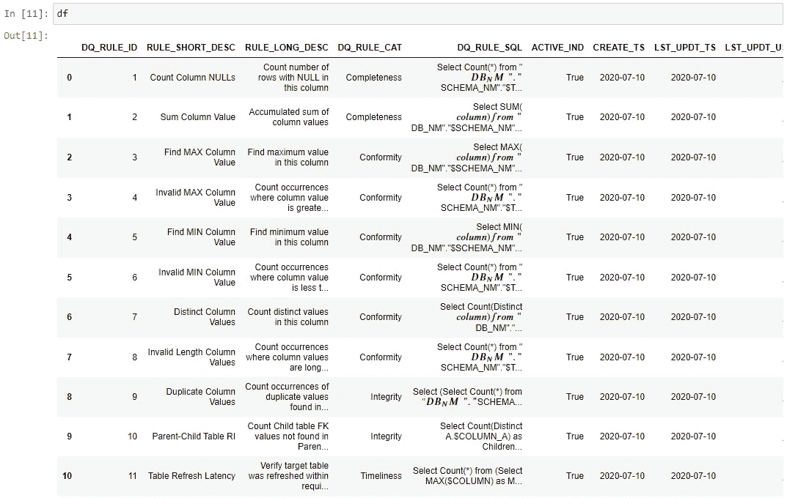
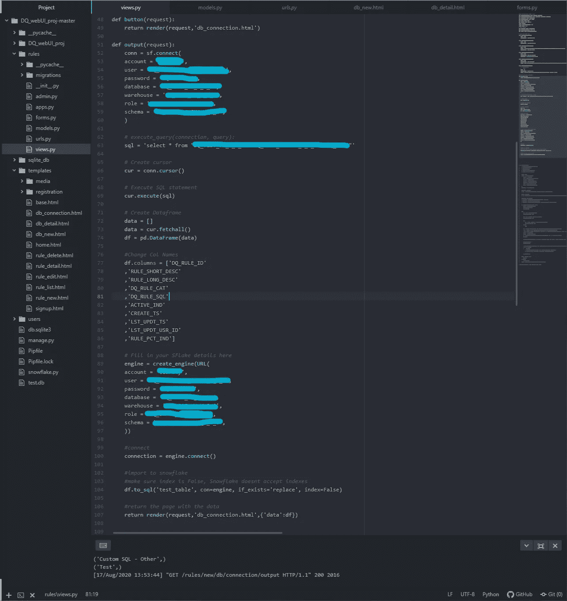

# 将 Django Web 应用程序连接到雪花数据库

> 原文：<https://blog.devgenius.io/connecting-a-django-web-app-to-a-snowflake-database-855c16df590?source=collection_archive---------1----------------------->


# 简短而令人愉快的

## 此流程的高级步骤:

*   使用雪花数据库中的表定义 sql 查询
*   使用 python 的 snoflake.connector 库创建与雪花的连接
*   使用雪花连接执行所述查询，并将结果转换为 pandas 数据帧
*   修改数据框架列标题(手动)
*   使用 sqlalchemy 创建引擎
*   将数据帧导入回雪花数据库的新表中

## 给我看看代码

下面是一个连接 web 应用程序的简单方法，在我的例子中是 Django web 应用程序(在上周之前我对它一无所知，所以不要把你的 web 应用程序构建愿望建立在这篇文章的基础上)连接到 Snowflake(我也从来没有真正接触过它，所以在这里也要小心)。

## 导入

```
import pandas as pd
import snowflake.connector as sf
from snowflake.sqlalchemy import URL
from sqlalchemy import create_engine
```

## 创建虚拟数据帧

```
x = [1,2,3]
y = [2,3,4]
df = pd.DataFrame([x, y], columns=['one', 'two', 'three'])
```

## 用 sqlalchemy 创建引擎 url

```
# Fill in your SFlake details here
engine = create_engine(URL(
    account = 'x',
    user = 'a',
    password = 'a!',
    database = 'af',
    warehouse = 'f',
    role = 'd',
    schema = 'f',
))
```

## 创建连接变量

```
connection = engine.connect()
```

## 将数据帧导入回您的雪花数据库

```
df.to_sql('test_table', con=engine, if_exists='replace', index=False) #make sure index is False, Snowflake doesnt accept indexes
```

# 现在，如果您想导入一个数据帧，而该数据帧中的数据来自对雪花数据库的查询，该怎么办呢？

```
#create connection variable - use your own creds obviously
conn = sf.connect(
    account = 'a',
    user = 'd',
    password = 'f!',
    database = 'f',
    warehouse = 's',
    role = 'a',
    schema = 'f',
)# execute_query(connection, query):
sql = 'select * from "some_db"."some_schema"."some_table"'# Create cursor
cur = conn.cursor()# Execute SQL statement
cur.execute(sql)# Fetch result
# print(cur.fetchall())# Create Dataframe
data = []
data = cur.fetchall()
df = pd.DataFrame(data)#Change Col Names
df.columns = ['DQ_RULE_ID'
,'RULE_SHORT_DESC'
,'RULE_LONG_DESC'
,'DQ_RULE_CAT'
,'DQ_RULE_SQL'
,'ACTIVE_IND'
,'CREATE_TS'
,'LST_UPDT_TS'
,'LST_UPDT_USR_ID'
,'RULE_PCT_IND']print(df)
```



df 结果

太好了，这将查询我们的数据库，并把数据放入熊猫数据框架。接下来，我们需要将它导入回雪花。这一部分让人们有点犹豫，因为 django 有它自己的数据库模型，最重要的是，你可能会想“我必须使用那个模型”——你没有。

## 将 df 导入回雪花

我们只需回收用于虚拟数据库的相同代码，就可以了。

```
# Fill in your SFlake details here
engine = create_engine(URL(
    account = 'a',
    user = 'd',
    password = 'f!',
    database = 'vb',
    warehouse = 'z',
    role = 'x',
    schema = 'c',
))connection = engine.connect()df.to_sql('test_table', con=engine, if_exists='replace', index=False) #make sure index is False, Snowflake doesnt accept indexes
```

这是一个高层次的概述。希望代码有意义。这很简单。

这是在 jupyter 笔记本和 django 应用程序中完成的。我试图构建一个数据库连接工具，让用户可以连接到雪花数据库，然后编写查询。



此连接的 Django web 应用程序版本

显然，这可以更好地编码，但对于快速和肮脏的东西，它的工作。希望这有所帮助。