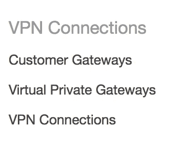
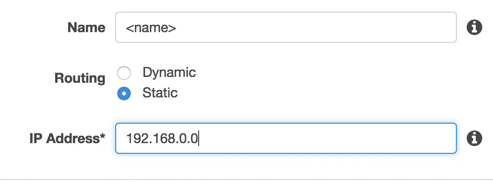
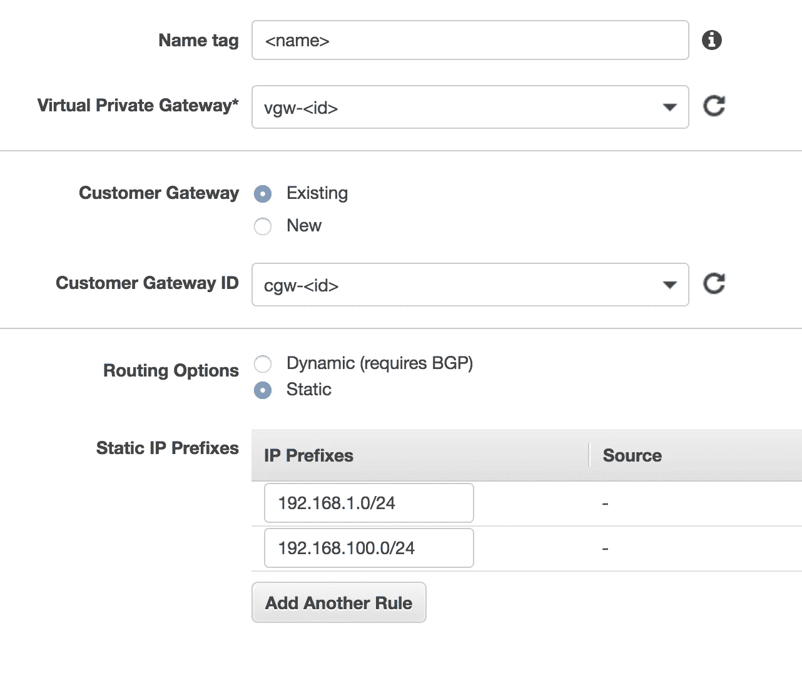
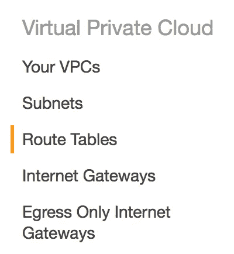
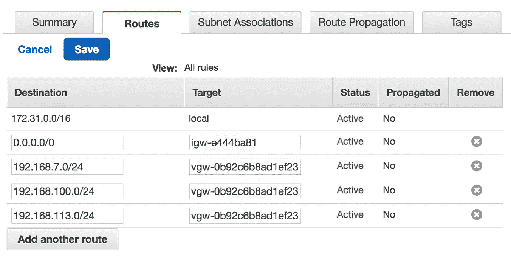
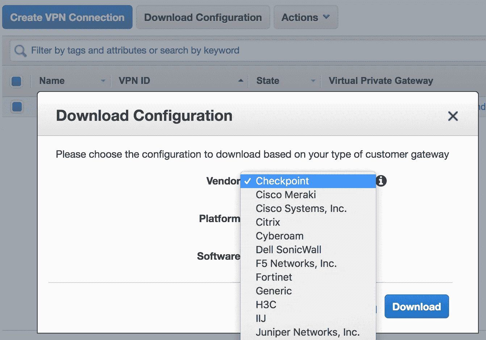
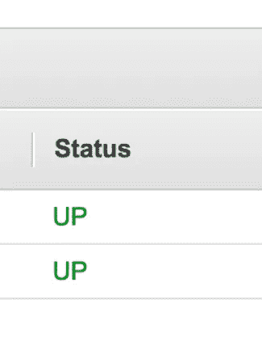

# 将 AWS VPC 连接到您的 VPN —从云到 Colo

> 原文：<https://blog.devgenius.io/connecting-an-aws-vpc-to-your-vpn-from-the-cloud-to-the-colo-ccc6c2320a43?source=collection_archive---------25----------------------->

本文将概述将 AWS 虚拟私有云(VPC)连接到本地网络的过程。它将解释如何在两个网络之间创建互联网协议安全(IPsec) VPN 隧道。要继续学习本教程，您需要[了解如何创建 EC2 实例](https://medium.com/@nZenitram/spinning-up-an-ec2-instance-ef7e81044dc4)，如果您还没有在 VPC 中运行的实例的话。


文化科学/杰森·珀索夫·风暴医生/斯通/盖蒂

我把这个过程分成了七个步骤:

1.  创建一个指向您的`<firewall_ip>`的客户网关(cgw)
2.  创建虚拟专用网关(vpg ),并将其连接到您选择的 VPC。**提示:如果您的实例运行在您不希望连接到网络的 VPC 中，您将在您希望连接的 VPC 中重新创建这些实例。** [此处说明该过程。](https://aws.amazon.com/premiumsupport/knowledge-center/move-ec2-instance/)
3.  创建虚拟专用网络(vpn)连接。命名它，将其分配到您创建的 VPG 和 CGW，选择静态路由选项，并分配它需要访问 VPN 的 IP 范围。
4.  创建一个路由表，并将其分配给要连接到 VPN 的 VPC。为您需要在网络上访问的 IP 范围添加路由，并选择您创建的 CGW 作为其目标。
5.  返回 VPN 连接选项卡，然后单击下载配置。从供应商列表中选择供应商-> `WatchGuard, Inc.`、平台- > `XTM, Firebox`和软件- > `Fireware OS 11.12.2+ (WebUI)` **提示:此配置特定于您的使用案例和防火墙。配置下载将引导您逐步完成该过程。**
6.  登录`<firewall_ip>:<port>`,按照下载配置文件中的说明进行操作。它将包括创建 VPN 隧道所需的所有 AWS 信息。
7.  测试连接。

# 事实是:

**步骤 1:创建客户网关**

[来自文件](https://docs.aws.amazon.com/AmazonVPC/latest/NetworkAdminGuide/Introduction.html):

> 什么是客户网关？
> 
> 亚马逊 VPC VPN 连接将您的数据中心(或网络)链接到您的亚马逊 VPC 虚拟私有云(VPC)。一个*客户网关*是你这边连接的锚。它可以是物理或软件设备。VPN 连接的 AWS 侧的锚称为*虚拟专用网关*。

要创建客户网关，请导航至 AWS 控制台上的 VPC 仪表板，并点击左侧栏底部的`Customer Gateway`链接。单击`Create Customer Gateway`并输入一个名称，该名称将帮助您识别网关将连接到哪个网络。在`IP Address`字段中，提供您将要连接的防火墙的公共 IP 地址，然后点击创建。



**步骤 2:创建虚拟专用网关**

[来自文档](https://docs.aws.amazon.com/AmazonVPC/latest/UserGuide/VPC_VPN.html):

> 虚拟专用网关
> 
> 一个*虚拟专用网关*是 VPN 连接 Amazon 端的 VPN 集中器。您创建一个虚拟专用网关，并将其连接到您想要从中创建 VPN 连接的 VPC。

此处涉及的过程与**步骤 1** 大致相同，只是增加了一项。点击`Create Virtual Private Gateway`将其命名为有帮助的名称，为其提供默认的 ASN 设置，并再次点击创建。返回虚拟专用网关控制面板，然后选择新创建的 VPG。点击`Actions -> Attach to VPC`,选择您希望连接的实例所在的 AWS VPC。

**步骤 3:创建虚拟专用网络连接**

[来自文件](https://docs.aws.amazon.com/AmazonVPC/latest/UserGuide/vpn-connections.html):

> AWS 管理的 VPN
> 
> 您可以在 VPC 和远程网络之间创建 IPsec VPN 连接。在 VPN 连接的 AWS 端，*虚拟专用网关*提供两个 VPN 端点(隧道)用于自动故障转移。

在 VPN 连接过程中，我们将客户网关和我们在前面步骤中创建的虚拟专用网关联系在一起。点击`VPN Connection`，给 VPN 连接起一个有用的名字。接下来，从第一个下拉列表中选择您在上一步中创建的 VPG，从第二个下拉列表中选择您在第一步中创建的 CGW，并选择您希望从隧道提供动态路由还是静态路由。选择`Static`将允许您仅打开网络上您希望 VPN 隧道能够访问的 IP 范围。

你可以在这里阅读更多关于 VPN 路由选项[。](https://docs.aws.amazon.com/AmazonVPC/latest/UserGuide/VPC_VPN.html#VPNRoutingTypes)



**第四步:创建路由表**

[来自文件](https://docs.aws.amazon.com/AmazonVPC/latest/UserGuide/VPC_VPN.html#VPNRoutingTypes):

> 路由表和 VPN 路由优先级
> 
> 路由表决定了网络流量的流向。在路由表中，您必须为远程网络添加一个路由，并将虚拟专用网关指定为目标。这使得从 VPC 发往远程网络的流量能够通过虚拟专用网关和其中一个 VPN 隧道进行路由。您可以为路由表启用路由传播，以便自动将网络路由传播到路由表中。

点击左侧栏中的`Route Tables`，创建路由表并选择正确的 VPC。如果您的 VPC 需要访问外部互联网，您将需要创建一个`Internet Gateway`并将其连接到您正在为其创建 VPN 隧道的 VPC。在下面的路由表配置图像中，您可以看到我们在第一个位置有本地 VPC 的 IP 范围，目标设置为`local`(本地是我们的 VPC)，第二行包括一个很宽的开放 IP 范围，我们需要选择我们刚刚创建的 IGW 作为目标。点击`Target`栏中的文本字段，IGW 将被填充。接下来，添加您希望 VPN 通道在本地网络上访问的 IP 范围，并将这些 IP 范围指向在上一步中创建的 VPG。



**步骤 5 & 6:配置防火墙**

下一步更难讲授，但令人欣慰的是，AWS 做了一项出色的工作，提供了您需要在支持的防火墙上配置什么的详细的逐步分解。要开始，点击左栏底部的`VPN Connections`。选择我们刚刚创建的 VPN 连接，并在屏幕顶部点击`Download Configuration`。在出现的模态中，将有三个下拉:`Vendor`、`Platform`和`Software`。每个供应商都有不同的防火墙配置面板。如果您不确定所要求的信息，想办法验证您的选择，然后点击`Download`。登录防火墙，单击系统，然后单击升级操作系统后，我找到了防火墙的操作系统版本信息。



**提示:严格遵循配置说明。它们包含我们刚刚设置的配置的所有相关 IP，只有一个例外..** *(看门狗配置如下所示)*

当您修改防火墙上的静态路由配置时，您需要将**步骤 3.b** (如下所示)中的 IP 替换为您的 VPC 提供的 IP 范围。在我们的示例中，它将是`172.31.0.0/16`，与我们在**步骤 4 中创建路由表时生成的 IP 范围相同。**

```
! ------------------------------------------------------------------
! #3: Static Route Configuration
!
! Your Customer Gateway needs to set a static route for the prefix corresponding to your
! VPC to send traffic over the tunnel interface.
! An example for a VPC with the prefix 10.0.0.0/16 is provided below:
!
Go to VPN-->BOVPN Virtual Interfaces-->Select vpn-<id> -->Click EDITVPN Routes-->Click ADD:
    a. Choose Type: Network IPv4
    b. Route To: 10.0.0.0/16
    c. Metric: 1

 Click OK
```

**步骤 7:检查和测试隧道状态**



从`VPN Connections`控制台，点击`Tunnel Details`选项卡并检查工作台的`Status`栏。如果您在栏中看到两个绿色的`UP`指示器，那么 AWS 已经连接到您的防火墙。要测试连接，您可以 SSH 到您的一个实例，并 ping 本地网络上的一台机器。我还建议登录到您的一台本地机器，并 ping 您的云中的实例。请记住，您还需要为 VPC 中的实例配置安全组，以接受它们将与之通信的任何端口或 IP 范围上的流量。

# 有几个问题:

将多个区域引入 VPN 会使事情变得相当复杂。例如，在一个地区创建的 VPC 的默认 IP 范围是相同的，`172.31.0.0`。当您想要将多个 VPC 连接到同一个 VPN 时，事情就变得复杂了，因为当您试图将同一个 IP 范围添加到两个不同的隧道时，您的防火墙会抱怨。遗憾的是，没有办法修改现有 VPC 的 CIDR 或更改现有 EC2 实例的 VPC。在某些情况下，可能需要创建一个 VPC，启动一个新实例，为正在运行的实例拍摄快照，用它创建一个卷，并将其作为根目录附加。

你有本地域名吗？如果是这样，您将需要在 AWS VPC 中设置一个绑定从机，并配置 VPC 的`DHCP Options Sets`以指向绑定从机。配置一个绑定从节点[并不太复杂](http://www.microhowto.info/howto/configure_bind_as_a_slave_dns_server.html)，但是也需要修改绑定主节点的配置。绑定服务器将相互通信，并且当主绑定服务器发生变化时，将通知从服务器并对其进行更新。默认情况下，您的 VPC DHCP 选项集将指向默认的`AmazonProvidedDNS`,因此设置绑定从服务器的替代方法是将 DNS 记录添加到您的默认记录集中。关于 AWS DHCP 选项集[的更多信息，请看文档](https://docs.aws.amazon.com/AmazonVPC/latest/UserGuide/VPC_DHCP_Options.html)。

# 应该可以了。

如果一切顺利，并且我没有忘记我的报告中的一些关键步骤，你的 AWS VPC 现在应该与你的本地网络通信。如果您在说明中发现了错误或不准确之处，或者只是需要一些关于过程的澄清，请在下面评论，我将尽最大努力纠正错误或帮助您。

别忘了查看我在下面链接的其他 AWS 文章:

## [从您的网络构建并连接到 AWS MySQL RDS 数据库](https://medium.com/@nZenitram/build-and-connect-to-an-aws-mysql-rds-database-from-your-network-7ecade580b90)

## [创建一个 EC2 实例。](https://medium.com/@nZenitram/spinning-up-an-ec2-instance-ef7e81044dc4)

## [媒介、Lambda 和我(或者我如何将媒介故事导出到我的网站)](https://medium.com/@nZenitram/medium-lambda-and-me-or-how-i-export-medium-stories-to-my-website-148b599ad271)

## [为 AWS 设置您的身份和访问管理](https://medium.com/@nZenitram/setting-up-your-identity-and-access-management-for-aws-6245e4ccf6c1)