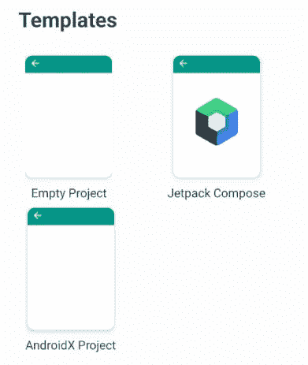
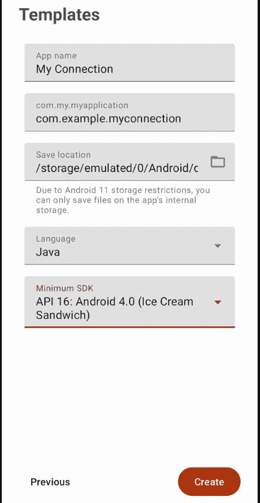
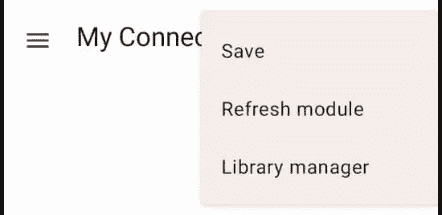
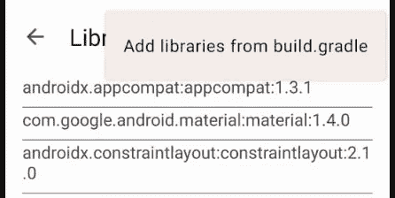
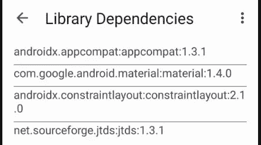
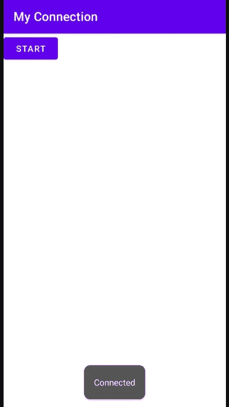

# 将 Android 应用程序连接到 MS SQL Server

> 原文：<https://blog.devgenius.io/connecting-android-app-to-ms-sql-server-2d50e999396b?source=collection_archive---------0----------------------->

## 使用 AndroidX 库和 jTDS JDBC 驱动程序


扎卡里·斯坦尼斯在 [Unsplash](https://unsplash.com?utm_source=medium&utm_medium=referral) 上的照片

这篇文章是上一篇文章的延续，即“[使用 Java 或 Kotlin 语言](/develop-android-app-directly-from-android-mobile-device-using-java-or-kotlin-language-958d6365dc5a)在 Android 移动设备上直接开发 Android 应用”。AndroidX 是对原有 Android 支持库的重大改进，不再维护(参考 [AndroidX 概述](https://developer.android.com/jetpack/androidx))。jTDS 是一款开源的 100%纯 Java JDBC 3.0 驱动程序，适用于微软 SQL Server 和 Sybase Adaptive Server Enterprise，目前被认为是这些服务器上最快的生产就绪 JDBC 驱动程序(参见 [jTDS 项目](https://jtds.sourceforge.net/))。这个帖子的灵感来自帖子“[将 Android 应用程序连接到数据库](https://medium.com/@nahomdesta61/connect-android-application-to-database-71975ce87b4a)”。虽然可以将 Android 应用程序直接连接到数据库服务器，但请注意，这种方法可能仅适用于开发和探索目的，而不适用于最终产品(阅读[不要将您的应用程序连接到您的数据库—不仅仅是安全性](https://idiallo.com/blog/dont-connect-directly-to-your-database))。在尝试以下步骤之前，按照[上一篇文章在 Android 设备](/develop-android-app-directly-from-android-mobile-device-using-java-or-kotlin-language-958d6365dc5a)上设置 Android Assist。

# (1)创建 AndroidX 项目

点击 AndroidX 项目模板。



输入项目的以下详细信息，并点击**创建**按钮。代码助手将创建项目，然后显示编辑器窗口。

```
App name = My Connection
Package name = com.example.myconnection
Save location = (accept the default value)
Language = Java
Minimum SDK = API 16 ... (or any minimum SDK listed in the Android Device)
```



建议开发人员在编辑代码之前先运行这个引导项目。检查应用程序是否可以编译和运行(文本 Hello World！应该出现在屏幕的中央)。

点击编辑器侧菜单以显示项目文件夹/文件列表。需要编辑以下文件:
(1) app/build.gradle
(注意代码辅助需要使用它们的库管理器添加依赖项。这将在后面的步骤中解释。)
(2)app/src/Android manifest . XML
(3)app/src/main/Java/…/main activity . Java
(4)app/src/main/RES/layout/activity _ main . XML

> 对于 Android 开发的新开发人员，建议您在编辑完上面列表中的每个文件后立即编译并运行项目。这是为了确保在进入后续步骤之前，您确定每个文件都已被正确编辑。此外，它避免了在后期修复代码错误的麻烦。

每次编辑文件时，点击文件夹图标，然后点击弹出菜单中的“保存”项。

点击文件名关闭文件，然后点击弹出菜单中的“关闭”项。

点击运行图标编译并运行项目。在弹出菜单中选择“构建调试 APK”项，以便调试功能可用。

(1.1)编辑 app/build.gradle

```
plugins {
    id 'com.android.application'
}

android {
    compileSdk 31

    defaultConfig {
        applicationId "com.example.myconnection"
        minSdk 16
        targetSdk 31
        versionCode 1
        versionName "1.0"
    }

    buildTypes {
        release {
            minifyEnabled false
            proguardFiles getDefaultProguardFile('proguard-android-optimize.txt'), 'proguard-rules.pro'
        }
    }
    compileOptions {
        sourceCompatibility JavaVersion.VERSION_1_8
        targetCompatibility JavaVersion.VERSION_1_8
    }
}

dependencies {
 // NOTE: use the CodeAssist library manager to update dependencies
implementation 'net.sourceforge.jtds:jtds:1.3.1'

}
```

(1.2)编辑 app/src/AndroidManifest.xml

```
<?xml version="1.0" encoding="utf-8"?>
<manifest xmlns:android="http://schemas.android.com/apk/res/android"
    package="com.example.myconnection"
    android:versionCode="1"
 android:versionName="1.0">

    <uses-permission android:name="android.permission.INTERNET" />
 <uses-permission android:name="android.permission.ACCESS_WIFI_STATE"/>
 <uses-permission android:name="android.permission.ACCESS_NETWORK_STATE" />

    <uses-sdk android:minSdkVersion="16" android:targetSdkVersion="31"/>

    <application
        android:allowBackup="true"
        android:icon="@mipmap/ic_launcher"
        android:label="@string/app_name"
        android:roundIcon="@mipmap/ic_launcher_round"
        android:supportsRtl="true"
        android:theme="@style/Theme.MyApplication">
        <activity
            android:name=".MainActivity"
            android:exported="true">
            <intent-filter>
                <action android:name="android.intent.action.MAIN" />

                <category android:name="android.intent.category.LAUNCHER" />
            </intent-filter>
        </activity>
    </application>

</manifest>
```

(1.3)编辑 app/src/main/Java/…/main activity . Java

```
package com.example.myconnection;

import android.Manifest;
import android.content.pm.PackageManager;
import androidx.core.app.ActivityCompat;
import androidx.appcompat.app.AppCompatActivity;
import android.os.StrictMode;
import android.os.Bundle;
import android.view.View;
import android.widget.Toast;

import java.sql.Connection;
import java.sql.DriverManager;
import java.sql.SQLException;

public class MainActivity extends AppCompatActivity {

 private static String host = "yourdbname.mssql.somee.com";
 private static String port = "1433";
 private static String Classes = "net.sourceforge.jtds.jdbc.Driver";
 private static String database = "yourdbname";
 private static String username = "yourname_SQLLogin_1";
 private static String password = "xxxxxxxxxx";
 //private static String url = "jdbc:jtds:sqlserver://"+host+":"+port+"/"+database;
 private static String url = "jdbc:jtds:sqlserver://"+host+"/"+database;

 private Connection connection = null;

 @Override
 protected void onCreate(Bundle savedInstanceState) {
  super.onCreate(savedInstanceState);
  setContentView(R.layout.activity_main);

 }

 public void startConn(View view) {
  ActivityCompat.requestPermissions(this,new String[]{Manifest.permission.INTERNET}, PackageManager.PERMISSION_GRANTED);

  StrictMode.ThreadPolicy policy = new StrictMode.ThreadPolicy.Builder().permitAll().build();
  StrictMode.setThreadPolicy(policy);
  try {
   Class.forName(Classes);
   connection = DriverManager.getConnection(url, username,password);
   Toast.makeText(this, "Connected", Toast.LENGTH_SHORT).show();
   } catch (ClassNotFoundException e) {
   e.printStackTrace();
   Toast.makeText(this, "Class fail", Toast.LENGTH_SHORT).show();
   } catch (SQLException e) {
   e.printStackTrace();
   Toast.makeText(this, "Connected no", Toast.LENGTH_SHORT).show();
  }
 }
}
```

(1.4)编辑 app/src/main/RES/layout/activity _ main . XML

```
<LinearLayout xmlns:android="http://schemas.android.com/apk/res/android"
xmlns:tools="http://schemas.android.com/tools"
android:layout_width="match_parent"
android:layout_height="match_parent"
android:orientation="horizontal"
tools:context=".MainActivity" >

<Button
android:id="@+id/send_message"
android:layout_width="wrap_content"
android:layout_height="wrap_content"
android:text="start"
android:onClick="startConn"
/>
</LinearLayout>
```

# (2)向代码辅助库添加依赖关系

点击主编辑器窗口中的文件夹图标。


点击弹出菜单中的“库管理器”项。



轻按 3 点按钮以显示弹出菜单。


轻按弹出式菜单中的“从 build.gradle 添加库”项目。



最后，列表将包括 jtds 驱动程序，如下所示。



回到主窗口。

要确保所有必需的资源都已相应更新，请再次点击文件夹图标，然后点击刷新模块。

# (3)运行应用程序

当应用程序出现在 Android 移动屏幕上时，点击开始按钮，然后等待 toast 消息出现。如果一切正常，应用程序将显示 toast 消息“已连接”。

