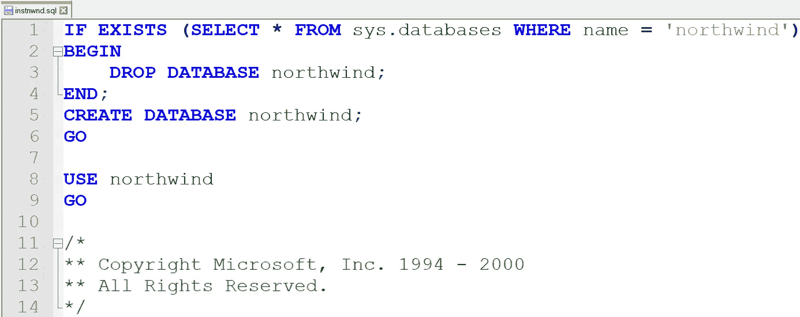
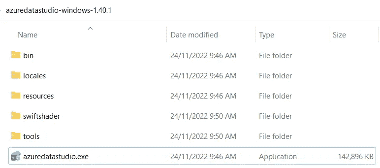
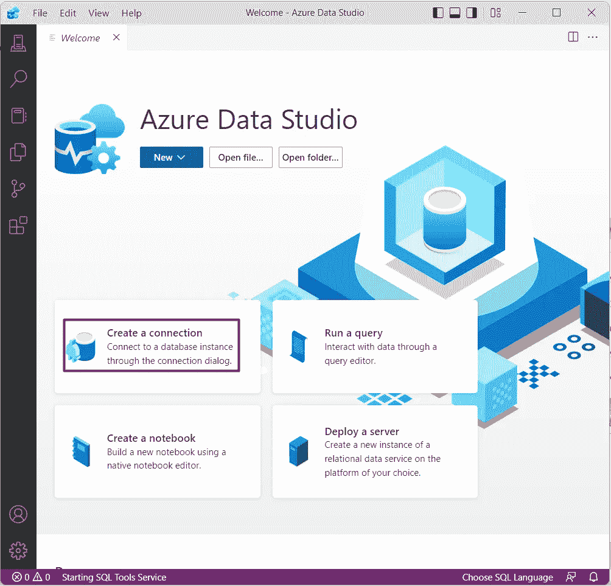
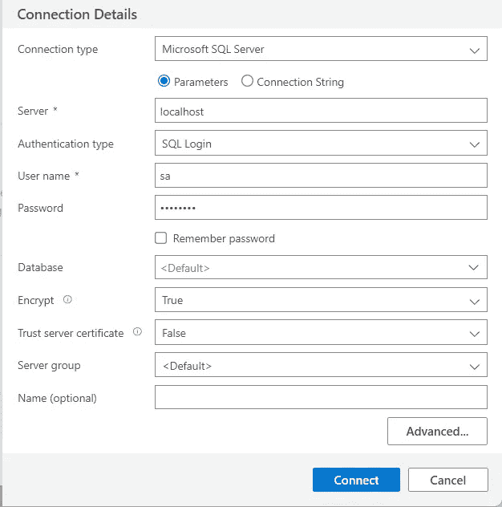
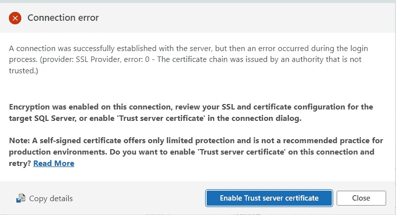
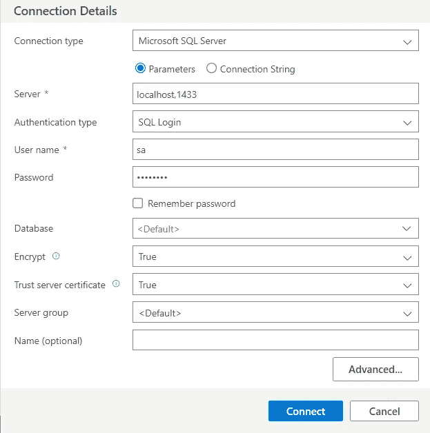
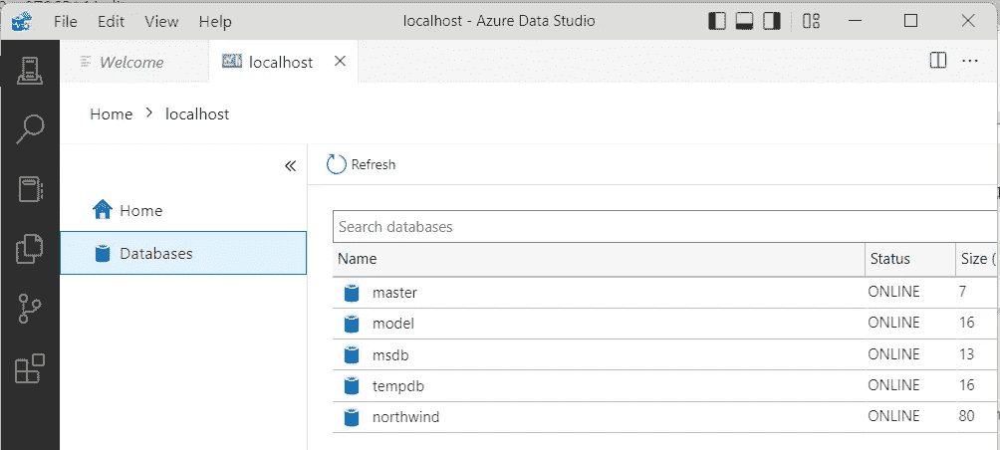
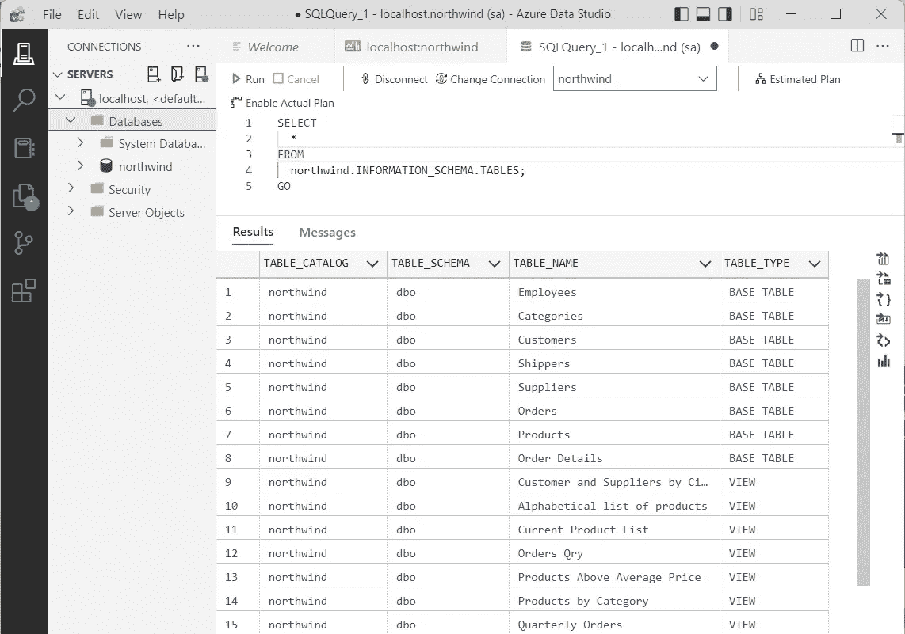

# 将 Azure Data Studio 连接到 MS SQL Server Docker 版本

> 原文：<https://blog.devgenius.io/connecting-azure-data-studio-to-ms-sql-server-docker-version-8f9ce8786314?source=collection_archive---------5----------------------->

使用 MS SQL Server、Azure Data Studio 和 Northwind 数据库


由 [Growtika 开发商营销机构](https://growtika.com/)在 [Unsplash](https://unsplash.com?utm_source=medium&utm_medium=referral) 拍摄的照片

从 MS SQL Server 2017 (14.x)开始，MS SQL Server 在所有支持的平台上都有相同的底层数据库引擎，包括 Linux 和容器(请参考[[1]Linux 上的 Microsoft SQL Server](https://learn.microsoft.com/en-us/sql/linux/sql-server-linux-overview))。这篇文章探索了 SQL Server Docker 版本(参考[[2]Docker](https://learn.microsoft.com/en-us/sql/linux/quickstart-install-connect-docker)上的 Microsoft SQL Server)使用 MS Azure Data Studio(参考 [[3] MS Azure Data Studio](https://learn.microsoft.com/en-us/sql/azure-data-studio/download-azure-data-studio) )和 SQLCMD 程序(参考 [[4]Microsoft SQLCMD](https://learn.microsoft.com/en-us/sql/ssms/scripting/sqlcmd-connect-to-the-database-engine) )来操作 SQL Server 的 Northwind 示例数据库(参考[[5]Microsoft Get the north wind sample database](https://learn.microsoft.com/en-us/dotnet/framework/data/adonet/sql/linq/downloading-sample-databases))。

# (1)设置 MS SQL Server Docker 版本

(1.1)运行拉动命令[【1】](https://learn.microsoft.com/en-us/sql/linux/sql-server-linux-overview)。

```
docker pull mcr.microsoft.com/mssql/server:2017-latest
```

(1.2)保存图像(可选)。

```
docker save -o mssql-2017-20221124.tar mcr.microsoft.com/mssql/server:2017-latest
```

保存的图像可以在以后加载到 Docker 中

```
docker load -i mssql-2017-20221124.tar
```

(1.3)运行图像[【2】](https://learn.microsoft.com/en-us/sql/linux/quickstart-install-connect-docker)。

```
docker run -e "ACCEPT_EULA=Y" -e "MSSQL_SA_PASSWORD=P@ssw0rd" -p 1433:1433 --name sql1 --hostname sql1 -d mcr.microsoft.com/mssql/server:2017-latest
```

(1.4)运行 SQLCMD 命令。

进入容器的终端命令并找到 SQLCMD 程序。

```
# find . -name sqlcmd
./opt/mssql-tools/bin/sqlcmd
```

用基本参数[【4】](https://learn.microsoft.com/en-us/sql/ssms/scripting/sqlcmd-connect-to-the-database-engine)运行程序。提示`1>`表示 SQLCMD 正在运行并等待 SQL 命令输入。

```
# ./opt/mssql-tools/bin/sqlcmd -S localhost -Usa -PP@ssw0rd
1>
```

尝试运行一些基本命令。参考 SqlShack.com 的[中的例子和解释。](https://www.sqlshack.com/working-sql-server-command-line-sqlcmd/)

```
select DB_NAME()
GO
select name from sys.databases
GO
SELECT SERVERPROPERTY('COLLATION')
GO
SELECT SERVERPROPERTY('EDITION')
GO
SELECT SERVERPROPERTY('IsIntegratedSecurityOnly')
GO 
```

# (2)建立北风数据库

从 [github](https://github.com/microsoft/sql-server-samples/blob/master/samples/databases/northwind-pubs/instnwnd%20(Azure%20SQL%20Database).sql) 下载 Northwind 数据库，并将 sql 文件另存为`instnwnd.sql`。该文件不包含创建数据库的命令。必须添加以下命令。

```
IF EXISTS (SELECT * FROM sys.databases WHERE name = 'northwind')
BEGIN
    DROP DATABASE northwind;  
END;
CREATE DATABASE northwind;
GO

USE northwind
GO
```

编辑文件`instnwnd.sql`。将上述代码添加到文件的顶部，如下所示。保存文件。



将文件复制到 docker 容器中。

```
docker cp instnwnd.sql sql1:/opt/mssql-tools/bin
```

回到容器并转到 SQLCMD 文件夹

```
# cd "./opt/mssql-tools/bin/"
```

运行 sqlCMD 以输入文件中的 SQL 命令。

```
# ./sqlcmd -S localhost -Usa -PP@ssw0rd -i instnwnd.sql
Changed database context to 'northwind'.
```

运行 SQLCMD 程序。检查 northwind 数据库是否已创建。

```
# ./sqlcmd -S localhost -Usa -PP@ssw0rd
1> select name from sys.databases
2> GO
name                                                                                                                    
--------------------------------------------------------------------------------------------------------------------------------
master                                                                                                                  
tempdb                                                                                                                  
model                                                                                                                   
msdb                                                                                                                    
**northwind **                                                                                                              

(5 rows affected)
1>
```

# (3)建立微软 Azure 数据工作室

从[官网【3】](https://learn.microsoft.com/en-us/sql/azure-data-studio/download-azure-data-studio)下载 MS Azure Data Studio 并安装程序。运行程序。



单击创建连接按钮。



在“连接详情”表单中，输入基本连接参数，即`Server`、`Authentication type`、`User name`、`Password`，点击**连接**按钮。



如果弹出关于不可信连接的错误，请单击“启用信任服务器证书”按钮。



或者，开发人员可以在如下所示的“连接详细信息”表单中指定端口号，例如 **Server = localhost，1433** 和**Trust Server certificate = TRUE**。



成功登录后，Azure Data Studio 将显示到指定服务器的连接页面。单击主页按钮下的数据库按钮，检查包括 northwind 在内的数据库是否显示在主面板中。



尝试运行一个命令来列出 northwind 数据库中的所有表。

```
SELECT
  *
FROM
  northwind.INFORMATION_SCHEMA.TABLES;
GO
```

