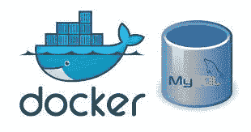

# 将 docker 连接到 mysql

> 原文：<https://blog.devgenius.io/connecting-docker-to-mysql-1c22d35fac2d?source=collection_archive---------6----------------------->



图片来自 [better programming.pub](https://betterprogramming.pub/customize-your-mysql-database-in-docker-723ffd59d8fb)

您已经将您的应用程序容器化，并且您想知道如何将它链接到 mysql 数据库，无论是在本地还是在某个远程服务器上。放松，不必担心，这个简单的指南会对你有帮助的。

假设您已经安装了 mysql，您将需要对用户配置和数据库访问权限进行一些调整。默认情况下，MySQL 被配置为只监听本地连接，因此需要做一些调整。

有两种情况需要通过 IP 地址将 docker 容器连接到 MySQL:

****远程连接*** :数据库托管在另一台机器上
* ***本地连接*** :数据库托管在托管 docker 系统的同一台机器上。

N/B:需要注意的是，对于上述两种情况，您都需要使用托管数据库的机器的 IP 地址。

嗯，您可能想知道为什么场景 2 需要一个外部 IP 地址，然而 docker 容器运行在托管 mysql 数据库的同一台机器上。原因是 docker 容器总是被视为某种机器，因此，它被分配了一个不同于主机 IP 地址的地址( ***172.17.0.2*** )。

**1。配置 mysql 监听外部 IP 地址。**

第一步:打开 mysqld.cnf

导航到/etc/mysql/mysql.conf.d 检查名为 mysql.cnf 或 mysqld.cnf 的文件，并使用 nano 编辑器打开它。

```
sudo nano /etc/mysql/mysql.conf.d/mysql.cnf
```

**第二步:检查具有*bind-address = 127 . 0 . 0 . 1***
默认值 ***127.0.0.1*** 表示 mysql 将只监听本地连接。因此，为了打开外部地址，我们将该行改为***【bind-address = 0 . 0 . 0 . 0***。保存更改，然后退出 nano 编辑器。
N/B:有时***bind-address = 127 . 0 . 0 . 1***可能不在 mysqld.cnf 中，在这种情况下，只需在底部添加一行即可(本例中 _bind-address = 0.0.0.0)。

**第三步:你可能还需要打开防火墙的 3306 端口。**

```
sudo ufw allow 3306
```

**第四步:重启 mysql**

```
sudo systemctl restart mysql
```

**步骤 5:创建一个用户，您将使用该用户从 docker 容器(被视为“远程服务器”)连接到主机上的 mysql。**

```
mysql> CREATE USER 'somename'@'docker_container_ip' IDENTIFIED BY 'password';
```

注意:使用*hostname -i*检查 docker 容器的 ip 地址

**第 6 步:根据需要授予用户/帐户权限。**

```
mysql> GRANT CREATE, ALTER, INSERT, UPDATE, SELECT on *.* TO 'somename'@'docker_ip_address' WITH GRANT OPTION;
```

**步骤 7:使用*FLUSH PRIVILEGES*命令释放缓存内存，然后退出 mysql**

```
mysql> FLUSH PRIVILEGES;mysql> exit;
```

**2。现在让我们回到我们的代码。在您连接到 mysql 数据库的地方，使用您的凭证如下:**
N/B:记得根据您的凭证替换详细信息。

```
myconnection <- dbPool(drv = RMySQL::MySQL(),
                         dbname = "yourdb",
                         host = "host_machine_ip_address", 
                         username = "somename", # This is the user #that we created in mysql (somename)
                         password = "thepasswordyouassigned")
```

**3。从 docker 文件构建您的 docker 映像，然后运行它并转到**[**http://127 . 0 . 0 . 1:3838**](http://127.0.0.1:3838)**查看您的应用程序。**

没错！！！我们是一伙的！！