# 通过 AWS 物联网核心连接 ESP32 和 BME280 传感器，使用 MQTT 读取传感器数据

> 原文：<https://blog.devgenius.io/connecting-esp32-bme280-sensor-via-aws-iot-core-using-mqtt-and-freertos-to-read-sensor-data-5329b7fd59ea?source=collection_archive---------7----------------------->

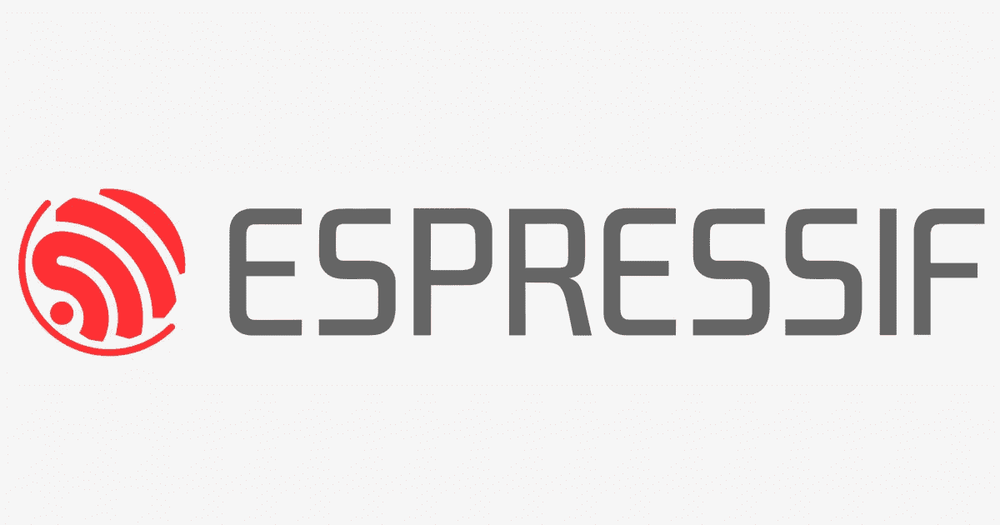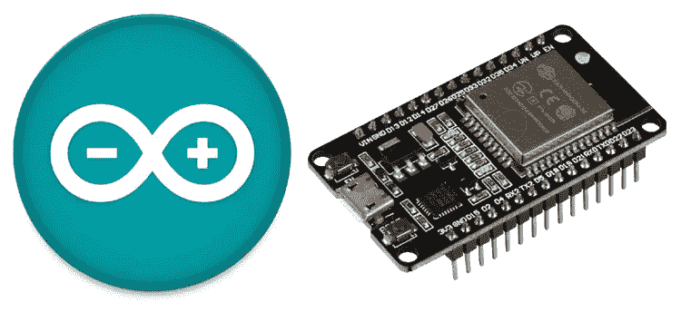

这篇博客是关于通过 I2C 连接 ESP32 和 BME280，并使用 MQTT 在 AWS 物联网中收集传感器数据。

我们开始吧！！！！！！

**硬件要求:**

1.  ESP32 开发套件
2.  BME280 环境传感器
3.  Windows、Mac 或 Linux 系统
4.  连接线(用于 I2C 连接)

**软件需求:**

1.  Arduino IDE
2.  亚马逊网络服务(AWS 物联网)
3.  FreeRTOS(用于定时器等。,)

**总结:**

目标是通过 I2C 连接 ESP32 和 BME280，读取传感器读数，并通过 MQTT 将其发送到 AWS 云。

为此，我们有一些先决条件，如下所示:

**第一步:在 AWS 物联网核心中创建一个东西**

最重要的是，必须有一个 AWS 帐户，点击下面的链接就如何创建一个 AWS 帐户。

 [## 创建 AWS 帐户

### 本主题介绍如何创建不受 AWS 组织管理的独立 AWS 帐户。如果你想…

docs.aws.amazon.com](https://docs.aws.amazon.com/accounts/latest/reference/manage-acct-creating.html) 

这里的东西代表将连接到 AWS 的物联网设备。

进入 AWS 物联网核心->所有设备->事物。

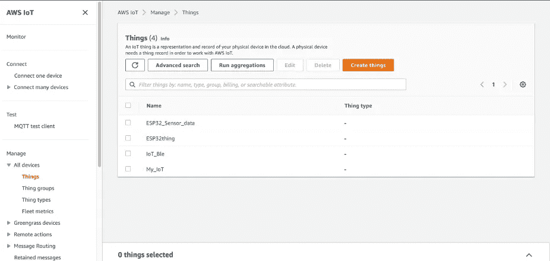

点击创造事物。

给你的东西起个名字，然后点击下一步。

通过单击自动生成新证书，选择创建设备证书的默认或推荐选项。

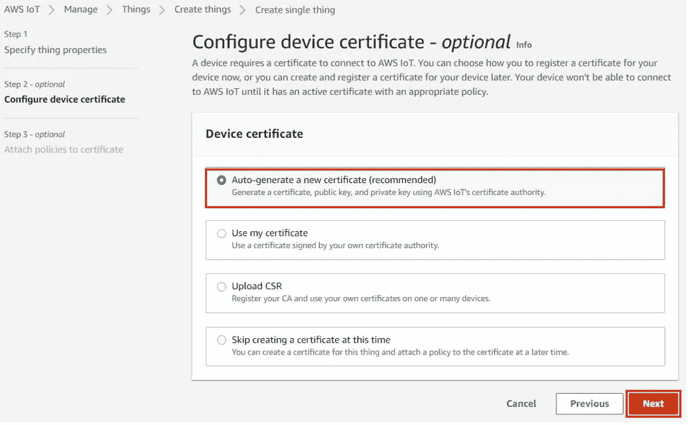

单击“下一步”为设备创建策略。

点击创建策略，并给它一个名称的政策，并添加政策的影响为'允许'，设置政策的行动和资源，参考下面的附加图像。

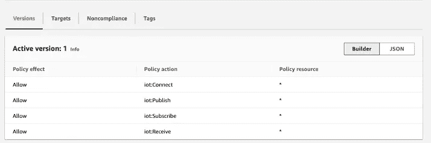

单击“下一步”将创建您的新策略。

现在去创建一个东西，将策略添加到这个东西中，下载所有的设备根证书、客户端证书、私钥和公钥，不要出错，因为它不能再次下载。

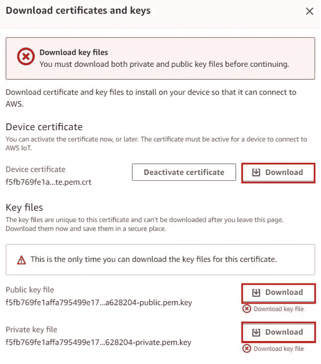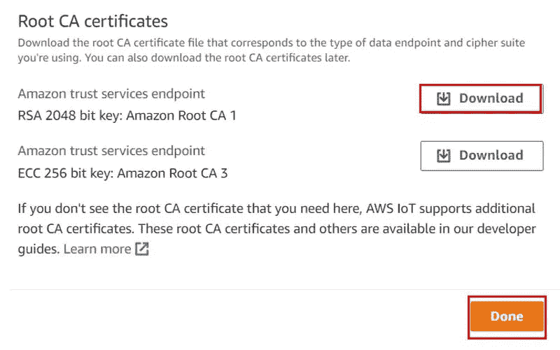

现在，我们将得到成功创建该事物并创建其证书的通知。你会注意到‘你的东西’已经被创造出来了。

**步骤 2:将传感器与 BME280 传感器**连接

我们的 ESP32 MQTT 发布器与 BME280 传感器相连。

BME280 传感器用于测量环境温度、大气压力和相对湿度的读数。该传感器使用 I2C 或 SPI 与微控制器进行数据通信。

I2C 的意思是内部集成电路，工作原理是同步、多主多从系统。对于 BME280 和 ESP 板，ESP32 充当主机，BME280 传感器充当从机，因为它是外部设备，所以充当从机。ESP 开发板通过 I2C 协议与 BME280 传感器通信，以获取温度、大气压力和相对湿度。

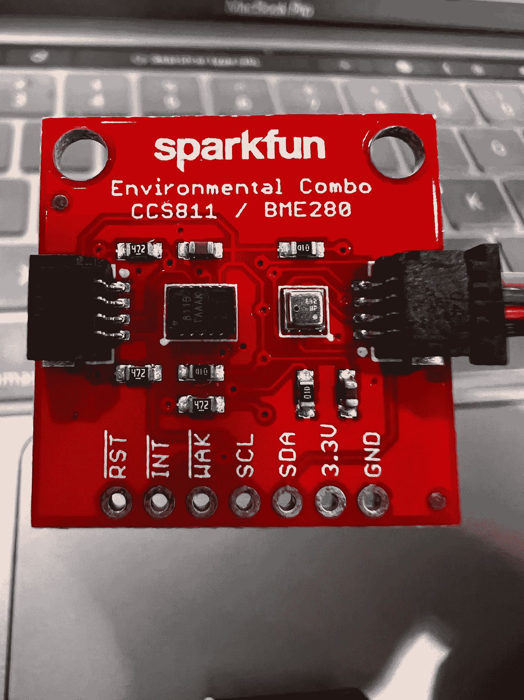

这是 Sparkfun 环境组合，具有 BME280 和 CCS811 传感器

*   VCC:连接 3.3V
*   SCL:用于产生时钟信号
*   SDA:用于发送和接收数据

## BME280 传感器与 ESP32 接口

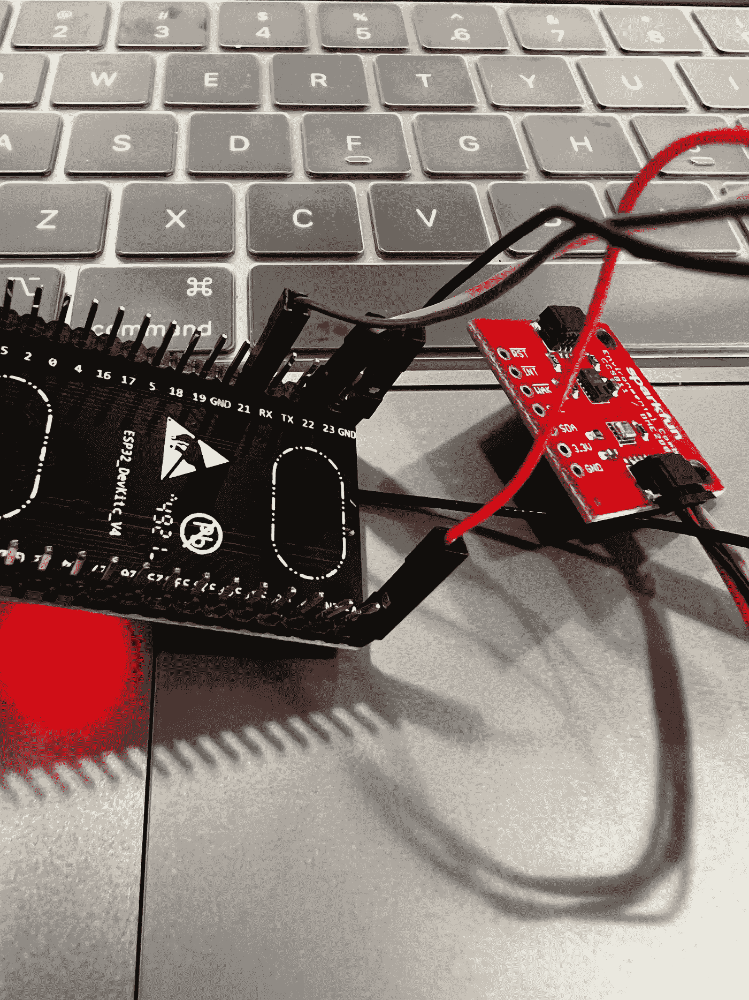

BME280 与 ESP32 板的连接非常简单。我们必须将 VCC 端子与 3.3V 相连，将地与地(公共地)相连，将传感器的 SCL 与模块的 SCL 相连，将传感器的 SDA 与 ESP32 模块的 SDA 引脚相连。

**第三步:安装 Arduino IDE 和所需的库**

Arduino IDE 可用于 Mac 和 Windows，我们可以下载 IDE 并开始安装所有的库。

ESP32 板必须下载到 Arduino IDE，以下链接将带您了解如何将 ESP32 板与 Arduino IDE 集成。

 [## 如何在 Arduino IDE 中安装 ESP32

### 在本文中，您将学习如何在 Arduino IDE 中安装 ESP32。这将是一步一步的指示…

microcontrollerslab.com](https://microcontrollerslab.com/install-esp32-arduino-ide/) 

# 安装 BME280 Arduino 库

因为我们将 BME280 传感器与 ESP32 连接，所以我们必须将 BME280 库安装到我们的模块中。这个项目需要两个库:

1.  [阿达果 _BME280 库](https://github.com/adafruit/Adafruit_BME280_Library)
2.  [阿达果 _ 传感器库](https://github.com/adafruit/Adafruit_Sensor)

我们将使用 Arduino IDE 中的库管理器来安装最新版本的库。打开你的 Arduino IDE，进入**草图>包含库>管理库。**在搜索栏中键入 Adafruit BME280 库名，并安装这两个库。

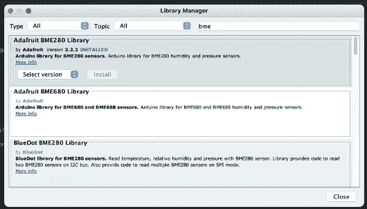

# ESP32 MQTT BME 280 Publisher Arduino 草图

*   导入所有需要的库

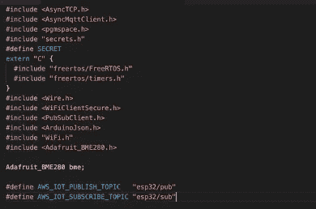

*   为 MQTT 订阅和发布创建一个主题。

> #定义 AWS _ IOT _ 发布 _ 主题" esp32/pub "
> #定义 AWS _ IOT _ 订阅 _ 主题" esp32/sub "

*   声明用于处理消息和连接 Wifi 的函数，并声明 AWS 凭证。

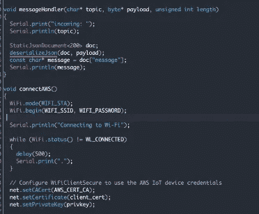

*   连接 AWS IoT 和 MQTT 主机的功能。

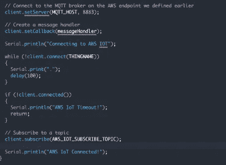

*   发布消息、创建 I2C 连接和连接到 AWS MQTT 的函数。

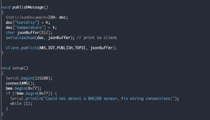

*   函数来显示结果

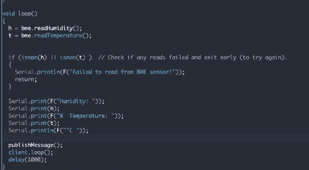

**步骤 4:创建名为 secrets.h 的文件，并添加 AWS 证书、私钥和设备根密钥。**

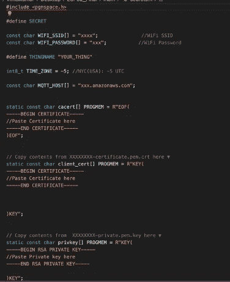

**第五步:编译并运行代码**

一旦您编译并运行代码，没有任何错误，您可以打开串行终端，并可以看到代码工作，并连接到 AWS IoT。

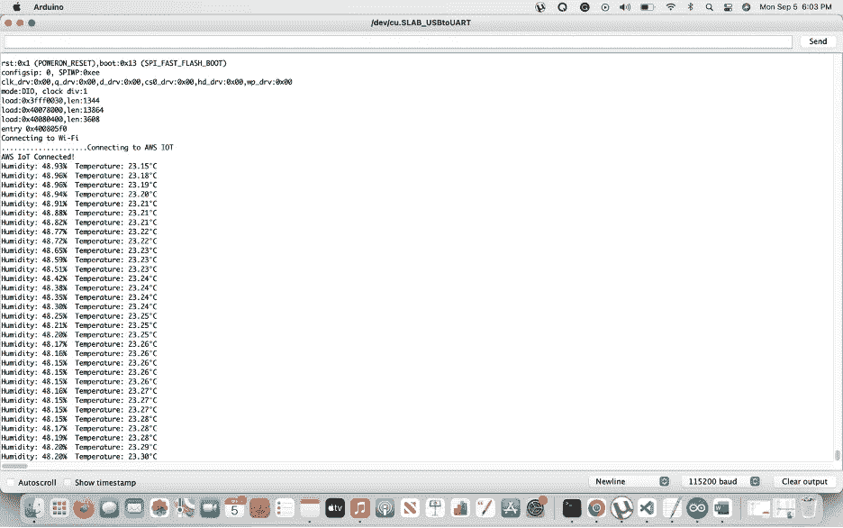

**步骤 6:转到 AWS IoT MQTT 测试客户端，发布到主题**

现在导航到 AWS IoT，单击 MQTT 测试客户端，给出发布的主题，在我们的例子中是“esp32/pub”。

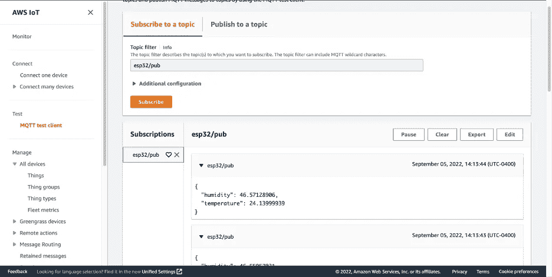

你可以看到它的工作一样甜！！！！！！！！！

你可以使用 ESP32 和 AWS MQTT 从亚马逊 AWS 物联网核心发送或接收数据，我们可以订阅各种物联网节点发布的传感器读数主题。

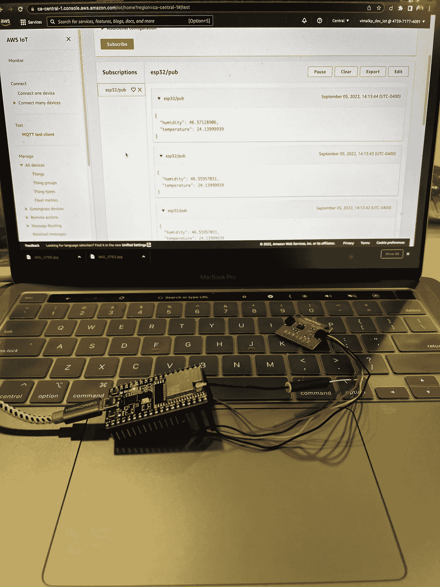

非常感谢阅读…..祝你黑客生涯愉快！！！！！

维马尔库马尔·帕萨拉西

嵌入式 ML 工程师，定量分析

加利福尼亚州多伦多

联系我@[https://www . LinkedIn . com/in/vimal-Kumar-parthasarathy-767025136/](https://www.linkedin.com/in/vimal-kumar-parthasarathy-767025136/)