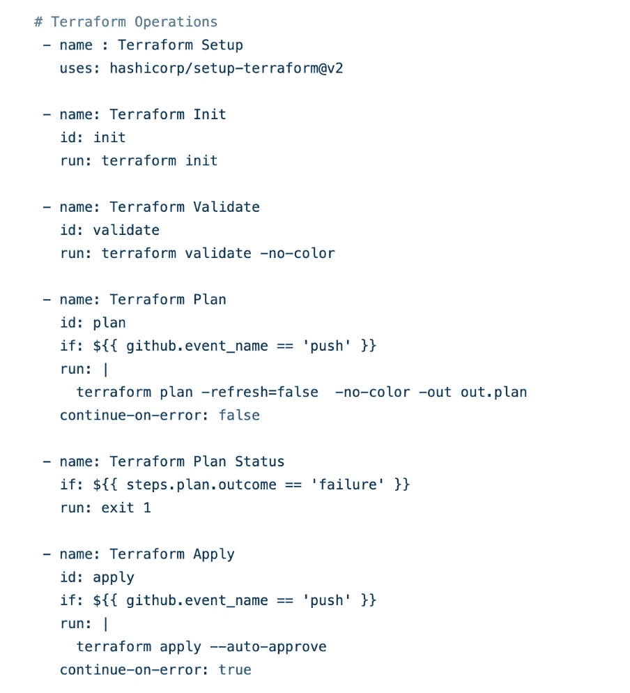

# 使用 OpenID Connect(OIDC)将 Github 操作连接到 AWS，并安全地部署到 AWS

> 原文：<https://blog.devgenius.io/connecting-github-actions-to-aws-using-openid-connect-oidc-and-securely-deploy-to-aws-541f5e320d0d?source=collection_archive---------2----------------------->


在本文中，您将了解如何使用 OpenID Connect 将您的 Github 操作连接到 AWS，而不是将您的 AWS 机密和访问密钥存储在 GitHub 操作机密中，并了解为什么这是完成此过程的安全方式。

## 什么是 OpenID Connect？？

GitHub Actions 工作流通常被设计为访问云提供商(如 AWS、Azure、GCP 或 HashiCorp Vault)，以便部署软件或使用云服务。为了访问云资源，它将向云提供商提供凭证，比如密码或令牌。这些凭证通常作为秘密存储在 GitHub 中，工作流每次运行时都会向云提供商呈现这个秘密。

然而，使用硬编码的秘密需要您在云提供商中创建凭证，然后在 GitHub 中将它们作为秘密复制。

借助 OpenID Connect (OIDC ),您可以采取不同的方法，将工作流配置为直接向云提供商请求短期访问令牌。您的云提供商还需要在其终端支持 OIDC，并且您必须配置一个信任关系来控制哪些工作流能够请求访问令牌。目前支持 OIDC 的提供商包括亚马逊网络服务、Azure、谷歌云平台和 HashiCorp Vault 等。

# 使用 OIDC 的好处

通过更新您的工作流以使用 OIDC 令牌，您可以采用以下良好的安全实践:

*   **没有云秘密**:你不需要复制你的云凭证作为长期存在的 GitHub 秘密。相反，您可以在云提供商上配置 OIDC 信任，然后更新您的工作流，通过 OIDC 向云提供商请求短期访问令牌。
*   **认证和授权管理**:通过使用云提供商的认证(authN)和授权(authZ)工具来控制对云资源的访问，您可以更精确地控制工作流如何使用凭证。
*   **轮换凭证**:通过 OIDC，你的云提供商发放一个只对单个作业有效的短期访问令牌，然后自动过期。

## **OIDC 入门**


因此，当您运行带有操作的作业时:configure-aws-credentials。Github Actions 扮演“角色-假设”和“从 AWS cloud 请求令牌”中提到的角色。它向 GitHub 的 OIDC 提供者请求一个 OIDC 令牌，后者用一个自动生成的 JSON web 令牌(JWT)来响应，这个令牌对于生成它的每个工作流作业都是唯一的。当作业运行时，OIDC 令牌会呈现给云提供商。为了验证令牌，云提供商检查 OIDC 令牌的主题和其他声明是否与云角色的 OIDC 信任定义中预先配置的条件相匹配。如果所有的验证都是正确的，那么 AWS 会生成一个临时令牌并发送给 github actions，这样它就可以在 AWS Cloud 中部署资源。


JWT 包含所有参数，如回购名称、分行名称、存储库所有者。

## 在 AWS 中创建 OpenID Connect 的逐步过程


转到 AWS 控制台，然后转到 IAM >身份提供商>选择 OpenID 连接>添加 Github 操作的提供商 URL

[https://token.actions.githubusercontent.com](https://token.actions.githubusercontent.com)然后点击拇指指纹

添加 audience 为“sts.amazonaws.com ”,然后单击“创建”。

然后，假设刚才创建的身份角色，创建一个角色


然后选择 Web 身份，并从下拉列表中选择身份提供者和受众，然后单击下一步


添加您希望授予 Github 操作访问权限的管理策略。现在我已经添加了“管理员访问”。


然后编辑信任策略和内部条件，添加“StringLike ”,它与通配符一起使用，允许来自“nanditasahu 03/github-actions-OpenID-connect”组织和存储库的任何分支、拉请求合并分支或环境承担 AWS 中的角色。您需要在“token . actions . githubusercontent . com:sub”字段中添加存储库名称。


这里的“repo:nanditasahu 03/github-actions-OpenID-connect:*”表示任何分支或合并分支都可以使用这个角色来部署资源。如果您想要使用任何特定的分支来承担该角色，则添加“repo:nanditasahu 03/github-actions-OpenID-connect:ref:refs/heads/branch name”。


然后添加角色名称和描述，并创建角色。

## 现在让我们进入 github 工作流程

我们正在创建一个 ec2 实例，并在 ubuntu 机器上安装 nginx。

```
terraform {
  required_providers {
    aws = {
      source = "hashicorp/aws"
      version = "4.41.0"
    }
  }
}

provider "aws" {
  region = "us-east-1"
}
```

这是我们正在使用的 aws 提供程序文件。该地区是“美国东部 1”。

```
terraform {
  backend "s3" {
    bucket = "demo-terraform-backend-1"
    key    = "demo"
    region = "us-east-1"
  }
}
```

这是后台地形文件。

这是 ec2 实例 terraform 文件。

这是 ec2 实例安全地形文件。

要在工作流程中创建机密>前往设置>操作>机密


## 流水线步骤


id-token:write 需要权限设置，因为如果将`id-token`的`permissions`设置为`read`或`none`，并且内容应设置为 read 以访问存储库内容，您将无法请求 OIDC JWT ID 令牌。

然后，在第一阶段，我们检查存储库。


在第二阶段，我们使用 OpenID Connect 从承担角色的 AWS 帐户访问临时令牌。您只需在 AWS IAM 控制台中更改前面步骤中创建的角色 arn，就可以向会话添加任何名称。



然后，我们将使用操作“setup-terraform@v2”从 terraform 设置开始，并执行所有 terraform 命令—初始化、验证、计划和应用


在下一阶段，我们将 Github 操作的公共 IP 添加到 EC2 实例的安全组中。然后，我们对 Terraform EC2 实例进行 SSH，删除已经存在的脚本，并使用 scp 操作复制 nginx 脚本。在 scp 命令中，source 是 github ubuntu 机器中文件的位置，target 是您希望在 terraform ec2 实例中上传脚本的路径。务必从您在 scp 命令中部署的 ec2 实例更改 IP 地址(主机)。


然后需要使用 bash 命令在 Terraform 实例中部署 Nginx 脚本。“ec2_public_ip”正在返回 Terraform 公共 ip。在最后一步，您将从 Tearrform EC2 实例中删除 Github Actions IP 地址。


我们正在 Terraform EC2 实例中部署的 Nginx 脚本。


EC2 已创建— Terraform 实例


Terraform 实例的安全组


桶装。地形资源创建的 tfstate 文件

阅读更多关于 OpenID Connect 的内容:[查看 AWS 链接](https://docs.aws.amazon.com/IAM/latest/UserGuide/id_roles_providers_create_oidc.html)，[查看 Github-Actions 链接](https://docs.github.com/en/actions/deployment/security-hardening-your-deployments/configuring-openid-connect-in-amazon-web-services)

要获得演示的所有代码，[检查我的 Github Repo](https://github.com/NanditaSahu03/github-actions-openid-connect)

给我买杯咖啡:)↓——如果你喜欢我的文章

