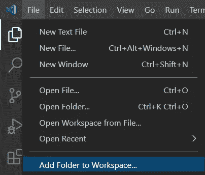
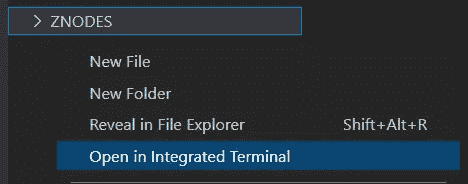
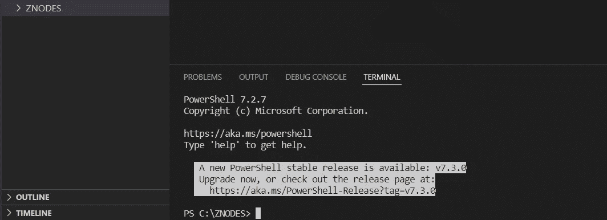
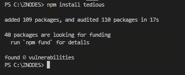

# 使用繁琐的包将 NODEJS 连接到 MS SQL Server 数据库

> 原文：<https://blog.devgenius.io/connecting-nodejs-to-ms-sql-server-database-8518bf54598?source=collection_archive---------0----------------------->

使用异步等待异步编程方法


照片由[康尼·施耐德](https://unsplash.com/@choys_?utm_source=medium&utm_medium=referral)在 [Unsplash](https://unsplash.com?utm_source=medium&utm_medium=referral) 拍摄

微软目前贡献并支持 Node.js (NODEJS)中的开源繁琐(繁琐)模块，用于使用 JavaScript 连接到 SQL Server(参考[微软 SQL Server 的驱动历史](https://learn.microsoft.com/en-us/sql/connect/connect-history))。繁琐的模块是 TDS 协议的 JavaScript 实现，所有现代版本的 SQL Server 都支持(参考[SQL Server 的 Node.js 驱动](https://learn.microsoft.com/en-us/sql/connect/node-js/node-js-driver-for-sql-server))。微软在他们的[入门页面](https://learn.microsoft.com/en-us/sql/connect/node-js/node-js-driver-for-sql-server?view=sql-server-ver16#get-started)提供了一个简单的指南。

这篇文章演示了以下内容:

1.  典型的表相关 T-SQL 语句。
2.  乏味的输出类型，如 JSON 数组和对象。
3.  NodeJS 命令行参数。
4.  Async-Await 方法处理到数据库服务器的异步连接。

# (0)先决条件

NODEJS 要求在主机(Windows、Linux 或 Mac)上安装运行时和包管理器。开发者可以[直接安装](https://nodejs.org/en/download/)或者使用 [Chocolatey 包管理器](https://community.chocolatey.org/packages/nodejs.install)。

这篇文章使用可视代码作为代码编辑器。安装可视化代码有三种方式:
(1) [直接安装](https://code.visualstudio.com/download)。
(2) [巧克力](https://community.chocolatey.org/packages/vscode)包装。
(3) [波塔普斯](https://portapps.io/app/vscode-portable/)。

最方便的方式是 Chocolatey 套餐；使用`choco uninstall`命令可以轻松移除已安装的软件包。

这篇文章是上一篇关于 MS SQL Server Docker 版本的文章的继续。首先按照帖子中的说明为下面的练习设置一个 MS SQL Server。

## (一)建立开发环境

在可视代码程序中，选择菜单文件/[将文件夹添加到工作区]。例如，创建一个文件夹 C:\ZNODES。



在浏览器面板中，选择 ZNODES 文件夹，右键单击并选择[在集成终端中打开]。



在下面的示例中,“终端”窗口包含 Power Shell 控制台。



## **(b)安装繁琐的软件包**

键入以下命令安装繁琐。

```
npm install tedious 
```



# **(1)** 典型的与表相关的 T-SQL 语句。

典型的与表相关的 T-SQL 是:(1)创建表，(2)获取表描述，(3)插入记录，(4)从表中获取记录，(5)删除表中的记录，以及(6)删除表。

下面的语句定义了一组包含在数组`arrySql`中的 T-SQL 字符串。反勾号，即`字符用于保留多个字符串行。

```
arrySql=[
    `
    CREATE TABLE "MyCustomers" (
        "CustomerID" int IDENTITY(1,1),
        "CompanyName" nvarchar (40) NOT NULL ,
        "ContactName" nvarchar (30) NULL ,
        "ContactTitle" nvarchar (30) NULL ,
        "Address" nvarchar (60) NULL ,
        "City" nvarchar (15) NULL ,
        "Region" nvarchar (15) NULL ,
        "PostalCode" nvarchar (10) NULL ,
        "Country" nvarchar (15) NULL)
        ;
    `,
    `
    SELECT 
        ordinal_position, 
        column_name, 
        data_type 
    FROM 
        information_schema.columns 
    WHERE 
        table_name = 'MyCustomers'
    ;
    `,
    `
    INSERT INTO MyCustomers (CompanyName, ContactName, ContactTitle, Address, City, Region, PostalCode, Country)
    OUTPUT INSERTED.CustomerID         
    VALUES ('COM', 'John', 'Mr', 'Malaysia', 'KL', 'Federal', '50000', 'Malaysia')
    ;
    `,
    `
    SELECT * FROM MyCustomers
    ;
    `,
    `
    DELETE FROM MyCustomers
    ;
    `,
    `
    DROP TABLE MyCustomers
    ;
    `                
];
```

这个程序根据用户输入以 JavaScript 数组或对象的形式生成输出数据。输入选项被定义为一组包含在数组`arryOpt`中的字符串。

```
arryOpt=['array','object'];
```

为了在数据库处理之前获得`arrySql`和`arryOpt`的索引值，程序要求用户输入两个整数参数。然后，程序将读取参数，并在数组中选取相应的值，如下所示。

```
const myArgs = process.argv.slice(2);
strgSql=arryStrgSql[myArgs[0]];
console.log('selected arryStrgSql: ',strgSql);
strgOpt=arryStrgOpt[myArgs[1]]||'array';
console.log('selected arryStrgOpt: ',strgOpt);
```

至此，上述语句可以一起写成如下形式。

```
 /* filename: inputtest.js */
arryStrgSql=[
    `
    CREATE TABLE "MyCustomers" (
        "CustomerID" int IDENTITY(1,1),
        "CompanyName" nvarchar (40) NOT NULL ,
        "ContactName" nvarchar (30) NULL ,
        "ContactTitle" nvarchar (30) NULL ,
        "Address" nvarchar (60) NULL ,
        "City" nvarchar (15) NULL ,
        "Region" nvarchar (15) NULL ,
        "PostalCode" nvarchar (10) NULL ,
        "Country" nvarchar (15) NULL)
        ;
    `,
    `
    SELECT 
        ordinal_position, 
        column_name, 
        data_type 
    FROM 
        information_schema.columns 
    WHERE 
        table_name = 'MyCustomers'
    ;
    `,
    `
    INSERT INTO MyCustomers (CompanyName, ContactName, ContactTitle, Address, City, Region, PostalCode, Country)
    OUTPUT INSERTED.CustomerID         
    VALUES ('COM', 'John', 'Mr', 'Malaysia', 'KL', 'Federal', '50000', 'Malaysia')
    ;
    `,
    `
    SELECT * FROM MyCustomers
    ;
    `,
    `
    DELETE FROM MyCustomers
    ;
    `,
    `
    DROP TABLE MyCustomers
    ;
    `                
];

arryStrgOpt=['array','object'];

const myArgs = process.argv.slice(2);
strgSql=arryStrgSql[myArgs[0]];
console.log('selected arryStrgSql: ',strgSql);
strgOpt=arryStrgOpt[myArgs[1]]||'array';
console.log('selected arryStrgOpt: ',strgOpt);
```

以下是上述代码的控制台输入/输出示例。这里，对程序`inputtest.js`的调用带有两个参数，即第一个参数 3 (select 语句)和第二个参数 0(数组输出)。

```
PS C:\ZNODES> node inputtest.js 3 0
selected arryStrgSql:  
    SELECT * FROM MyCustomers
    ;

selected arryStrgOpt:  array
PS C:\ZNODES> 
```

# (2)繁琐的输出类型，即 JSON 数组和对象。

繁琐的包以由值和元数据对象组成的对象的形式从表中检索每一行。如果程序用户喜欢将一行作为数组返回，则只选取对象值，例如:`data: [[1,”COM”,”John”,”Mr”,”Malaysia”,”KL”,”Federal”,”50000",”Malaysia”]]`

否则，如果程序用户希望将一行作为对象返回，元数据对象的 colName 属性将被用作对象值的键，例如:
`data: [{“CustomerID”:1,”CompanyName”:”COM”,”ContactName”:”John”,”ContactTitle”:”Mr”,”Address”:”Malaysia”,”City”:”KL”,”Region”:”Federal”,”PostalCode”:”50000",”Country”:”Malaysia”}]`

处理检索到的数据的代码如下:

```
 request.on('row', columns => { 
        if (strgOpt=="array"){
            var arry=[];
            columns.forEach(column => {
                arry.push(column.value);
            });
            result.push(arry);
            //console.log(result);  
        }
        if (strgOpt=="object"){
            var objt={};
            columns.forEach(column => {
                objt[column.metadata.colName]=column.value;
            });
            result.push(objt);
            //console.log(result);  
        }        
    });
```

上面的代码将成为下面一个繁琐的相关功能的一部分，即`executeSQL`。

```
var Request = require('tedious').Request;

const executeSQL = (connection,strgSql,strgOpt) => new Promise((resolve, reject) => {
    var result =[];    
    const request = new Request(strgSql, (err,rowCount) => {
        if (err) {
            reject(err);
        } else {
            //console.log("rowCount:",rowCount);
            if ((result == "" || result == null || result == "null")) result = "[]";  
            //console.log("result:",result);
            resolve(result);
        }   
        connection.close();    
    });    
    request.on('row', columns => { 
        if (strgOpt=="array"){
            var arry=[];
            columns.forEach(column => {
                arry.push(column.value);
            });
            result.push(arry);
            //console.log(result);  
        }
        if (strgOpt=="object"){
            var objt={};
            columns.forEach(column => {
                objt[column.metadata.colName]=column.value;
            });
            result.push(objt);
            //console.log(result);  
        }        
    });
    connection.on('connect', err => {
        if (err) {
            reject(err);
        }
        else {
            connection.execSql(request);
        }
    });   
    connection.connect();    
});
```

`executeSQL`函数返回一个**承诺**对象。它需要三个参数，即连接对象(`connection`)、SQL 语句(`strgSql`)和输出类型(strgOpt)。为了处理一个 Promise 对象，对`executeSQL`函数的调用应该包含在一个**异步模式**中，如下所示。关键字 **await** 表示希望由`executeSQl`函数返回一个承诺对象。

```
const taskDbseCmmd = async() => {
    try {
        const data = await executeSQL(connection,strgSql,strgOpt);
        console.log("data:",JSON.stringify(data));
        //return data;
    } catch (error) {
        throw(error)
    }
};

taskDbseCmmd();
```

数据库处理需要一个如下所示声明的连接对象。

```
var config = {  
    server: 'localhost',
    authentication: {
        type: 'default',
        options: {
            userName: 'sa',
            password: 'P@ssw0rd'
        }
    },
    options: {
        // If you are on Microsoft Azure, you need encryption:
        encrypt: true,
        database: 'master',
        port:1433,
        trustServerCertificate: true        
    }
};     

var Connection = require('tedious').Connection;
const connection = new Connection(config);
```

# (3)将所有这些放在一起

以上代码的完整脚本如下所示。

```
/* filename: appdbse.js */

var Request = require('tedious').Request;
const executeSQL = (connection,strgSql,strgOpt) => new Promise((resolve, reject) => {
    var result =[];    
    const request = new Request(strgSql, (err,rowCount) => {
        if (err) {
            reject(err);
        } else {
            //console.log("rowCount:",rowCount);
            if ((result == "" || result == null || result == "null")) result = "[]";  
            //console.log("result:",result);
            resolve(result);
        }   
        connection.close();    
    });    
    request.on('row', columns => { 
        if (strgOpt=="array"){
            var arry=[]
            columns.forEach(column => {
                arry.push(column.value);
            });
            result.push(arry);
            //console.log(result);  
        }
        if (strgOpt=="object"){
            var objt={}
            columns.forEach(column => {
                objt[column.metadata.colName]=column.value;
            });
            result.push(objt);
            //console.log(result);  
        }        
    });
    connection.on('connect', err => {
        if (err) {
            reject(err);
        }
        else {
            connection.execSql(request);
        }
    });   
    connection.connect();    
});

arryStrgSql=[
    `
    CREATE TABLE "MyCustomers" (
        "CustomerID" int IDENTITY(1,1),
        "CompanyName" nvarchar (40) NOT NULL ,
        "ContactName" nvarchar (30) NULL ,
        "ContactTitle" nvarchar (30) NULL ,
        "Address" nvarchar (60) NULL ,
        "City" nvarchar (15) NULL ,
        "Region" nvarchar (15) NULL ,
        "PostalCode" nvarchar (10) NULL ,
        "Country" nvarchar (15) NULL)
        ;
    `,
    `
    SELECT 
        ordinal_position, 
        column_name, 
        data_type 
    FROM 
        information_schema.columns 
    WHERE 
        table_name = 'MyCustomers'
    ;
    `,
    `
    INSERT INTO MyCustomers (CompanyName, ContactName, ContactTitle, Address, City, Region, PostalCode, Country)
    OUTPUT INSERTED.CustomerID         
    VALUES ('COM', 'John', 'Mr', 'Malaysia', 'KL', 'Federal', '50000', 'Malaysia')
    ;
    `,
    `
    SELECT * FROM MyCustomers
    ;
    `,
    `
    DELETE FROM MyCustomers
    ;
    `,
    `
    DROP TABLE MyCustomers
    ;
    `                
];

arryStrgOpt=['array','object'];

const myArgs = process.argv.slice(2);
strgSql=arryStrgSql[myArgs[0]];
console.log('selected arryStrgSql: ',strgSql);
strgOpt=arryStrgOpt[myArgs[1]]||'array';
console.log('selected arryStrgOpt: ',strgOpt);

var config = {  
    server: 'localhost',
    authentication: {
        type: 'default',
        options: {
            userName: 'sa',
            password: 'P@ssw0rd'
        }
    },
    options: {
        // If you are on Microsoft Azure, you need encryption:
        encrypt: true,
        database: 'master',
        port:1433,
        trustServerCertificate: true        
    }
};     

var Connection = require('tedious').Connection;
const connection = new Connection(config);

const taskDbseCmmd = async() => {
    try {
        const data = await executeSQL(connection,strgSql,strgOpt);
        console.log("data:",JSON.stringify(data));
        //return data;
    } catch (error) {
        throw(error)
    }
};

taskDbseCmmd();
```

上述代码的控制台输入/输出示例如下。

```
PS C:\ZNODES> node appdbse.js 0 0
selected arryStrgSql:  
    CREATE TABLE "MyCustomers" (
        "CustomerID" int IDENTITY(1,1),
        "CompanyName" nvarchar (40) NOT NULL ,
        "ContactName" nvarchar (30) NULL ,
        "ContactTitle" nvarchar (30) NULL ,
        "Address" nvarchar (60) NULL ,
        "City" nvarchar (15) NULL ,
        "Region" nvarchar (15) NULL ,
        "PostalCode" nvarchar (10) NULL ,
        "Country" nvarchar (15) NULL)
        ;

selected arryStrgOpt:  array
data: "[]"
PS C:\ZNODES> node appdbse.js 1 0
selected arryStrgSql:  
    SELECT
        ordinal_position,
        column_name,
        data_type
    FROM
        information_schema.columns
    WHERE
        table_name = 'MyCustomers'
    ;

selected arryStrgOpt:  array
data: [[1,"CustomerID","int"],[2,"CompanyName","nvarchar"],[3,"ContactName","nvarchar"],[4,"ContactTitle","nvarchar"],[5,"Address","nvarchar"],[6,"City","nvarchar"],[7,"Region","nvarchar"],[8,"PostalCode","nvarchar"],[9,"Country","nvarchar"]]
PS C:\ZNODES> node appdbse.js 2 0
selected arryStrgSql:  
    INSERT INTO MyCustomers (CompanyName, ContactName, ContactTitle, Address, City, Region, PostalCode, Country)
    OUTPUT INSERTED.CustomerID
    VALUES ('COM', 'John', 'Mr', 'Malaysia', 'KL', 'Federal', '50000', 'Malaysia')
    ;

selected arryStrgOpt:  array
data: [[1]]
PS C:\ZNODES> node appdbse.js 3 0
selected arryStrgSql:  
    SELECT * FROM MyCustomers
    ;

selected arryStrgOpt:  array
data: [[1,"COM","John","Mr","Malaysia","KL","Federal","50000","Malaysia"]]
PS C:\ZNODES> node appdbse.js 4 0
selected arryStrgSql:
    DELETE FROM MyCustomers
    ;

selected arryStrgOpt:  array
data: "[]"
PS C:\ZNODES> node appdbse.js 5 0
selected arryStrgSql:
    DROP TABLE MyCustomers
    ;

selected arryStrgOpt:  array
data: "[]"
```

# (4)程序分解

为了提高代码的可读性和可维护性，可以将上述程序脚本文件拆分成几个脚本文件，即`progArguments.js`、`dbseConfig.js`、`dbseService.js`和`appMain.js`。`appMain.js`将是首先启动的主程序。来自其他脚本文件的代码块在运行时通过`module.exports`和`require`技术集成到`appMain.js`中。

文件名:progArguments.js

```
/* filename: progArguments.js */
const arrySql=[
    `
    CREATE TABLE "MyCustomers" (
        "CustomerID" int IDENTITY(1,1),
        "CompanyName" nvarchar (40) NOT NULL ,
        "ContactName" nvarchar (30) NULL ,
        "ContactTitle" nvarchar (30) NULL ,
        "Address" nvarchar (60) NULL ,
        "City" nvarchar (15) NULL ,
        "Region" nvarchar (15) NULL ,
        "PostalCode" nvarchar (10) NULL ,
        "Country" nvarchar (15) NULL)
        ;
    `,
    `
    SELECT 
        ordinal_position, 
        column_name, 
        data_type 
    FROM 
        information_schema.columns 
    WHERE 
        table_name = 'MyCustomers'
    ;
    `,
    `
    INSERT INTO MyCustomers (CompanyName, ContactName, ContactTitle, Address, City, Region, PostalCode, Country)
    OUTPUT INSERTED.CustomerID         
    VALUES ('COM', 'John', 'Mr', 'Malaysia', 'KL', 'Federal', '50000', 'Malaysia')
    ;
    `,
    `
    SELECT * FROM MyCustomers
    ;
    `,
    `
    DELETE FROM MyCustomers
    ;
    `,
    `
    DROP TABLE MyCustomers
    ;
    `                
];

const arryOpt=['array','object'];

module.exports ={arrySql,arryOpt};
```

文件名:dbseConfig.js。

```
/* filename: dbseConfig.js */
var config = {  
    server: 'localhost',
    authentication: {
        type: 'default',
        options: {
            userName: 'sa',
            password: 'P@ssw0rd'
        }
    },
    options: {
        // If you are on Microsoft Azure, you need encryption:
        encrypt: true,
        database: 'master',
        port:1433,
        trustServerCertificate: true        
    }
}     ;

module.exports = config;
```

文件名:dbseService.js。

```
/* filename: dbseService.js */
var Request = require('tedious').Request;

const executeSQL = (connection,strgSql,strgOpt) => 
    new Promise((resolve, reject) => {
        var result =[];    
        const request = new Request(strgSql, (err,rowCount) => {
            if (err) {
                reject(err);
            } else {
                //console.log("rowCount:",rowCount);
                if ((result == "" || result == null || result == "null")) result = "[]";  
                //console.log("result:",result);
                resolve(result);
            }   
            connection.close();    
        });    
        request.on('row', columns => { 
            if (strgOpt=="array"){
                var arry=[]
                columns.forEach(column => {
                    arry.push(column.value);
                });
                result.push(arry);
                //console.log(result);  
            }
            if (strgOpt=="object"){
                var objt={}
                columns.forEach(column => {
                    objt[column.metadata.colName]=column.value;
                });
                result.push(objt);
                //console.log(result);  
            }        
        });
        connection.on('connect', err => {
            if (err) {
                reject(err);
            }
            else {
                connection.execSql(request);
            }
        });   
        connection.connect();    
    });

module.exports ={executeSQL};
```

文件名:appMain.js。

```
/* filename: appMain.js */
var config = require('./dbseConfig');
var Connection = require('tedious').Connection;
const connection = new Connection(config);
var dbseService= require ('./dbseService');
var objtProgArguments = require('./progArguments');

const myArgs = process.argv.slice(2);
strgSql=objtProgArguments.arrySql[myArgs[0]];
console.log('selected arryStrgSql: ',strgSql);
strgOpt=objtProgArguments.arryOpt[myArgs[1]]||'array';
console.log('selected arryStrgOpt: ',strgOpt);

const taskDbseCmmd = async() => {
    try {
        const data = await dbseService.executeSQL(connection,strgSql,strgOpt);
        console.log("data:",JSON.stringify(data));
        //return data;
    } catch (error) {
        throw(error)
    }
};

taskDbseCmmd();
```