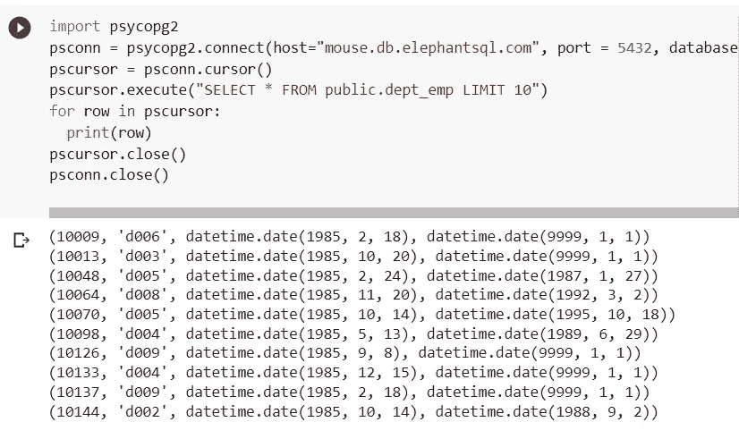
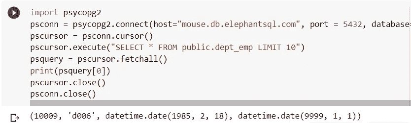
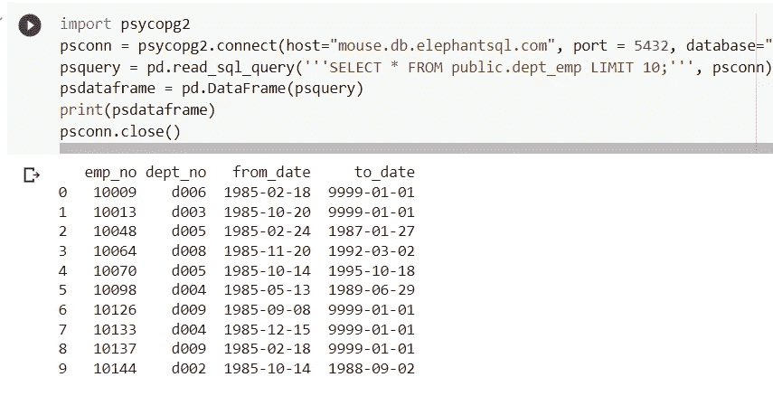

# 将 Google 协同实验室(Colab) Python 连接到 PostgreSQL、MySQL、MS SQL 和 SQLITE 数据库

> 原文：<https://blog.devgenius.io/connecting-python-to-databases-via-google-colaboratory-colab-5e07fb98a64b?source=collection_archive---------1----------------------->

使用光标对象和熊猫数据框架


鲁拜图·阿扎德在 [Unsplash](https://unsplash.com?utm_source=medium&utm_medium=referral) 上的照片

Colaboratory，简称“Colab”，是谷歌研究院的产品，允许开发者通过浏览器编写和执行任意 Python 代码，特别适合机器学习、数据分析和教育(参考[谷歌 Colaboratory FAQ)](https://research.google.com/colaboratory/faq.html) 。Colab 可以通过数据库特定的驱动程序/连接器连接到 POSTGRESQL、MYSQL/MARIADB、MSSQL 和 SQLITE 等数据库。这篇文章提供了连接到这些数据库并使用游标对象和 Pandas DataFrame 与它们交互的代码示例。

# (1) POSTGRESQL

安装 psycopg2 适配器。Psycopg 是 Python 编程语言最流行的 PostgreSQL 数据库适配器(参考 [Pypi Psycopg](https://pypi.org/project/psycopg2/) )。

```
!pip install psycopg2
```

定义连接参数。以下是 elephantsql.com 服务器的连接参数示例。

```
import psycopg2
psconn = psycopg2.connect(host="mouse.db.elephantsql.com", port = 5432, database="abcdefgh", user="abcdefgh", password="your-password")
```

亚马逊红移基于 PostgreSQL ( [亚马逊—红移和 Postgres](https://docs.aws.amazon.com/redshift/latest/dg/c_redshift-and-postgres-sql.html) )。因此，上面的连接语句应该也适用于 Amazon Redshift。

# (2) MYSQL/MARIADB

为 Python 安装 MySQL 连接器。它是 Python 平台和开发的标准化数据库驱动程序(参考 [MySQL 社区下载](https://dev.mysql.com/downloads/connector/python/))。

```
!pip install mysql-connector-python
```

定义连接参数。以下是通过 IP 地址连接到服务器的连接参数示例。

```
import mysql.connector as mysql
myconn = mysql.connect(host='82.180.175.153',database='abcdefghij_klm', user='uabcdefghi_jkl', password='your-password')
```

# (3)微软 SQL

为 Python 安装 MS ODBC 驱动程序。ODBC 是应用程序使用 SQL Server 的主要本地数据访问 API(参见[Microsoft ODBC Driver For SQL Server](https://learn.microsoft.com/en-us/sql/connect/odbc/microsoft-odbc-driver-for-sql-serve))。

```
%%sh

curl https://packages.microsoft.com/keys/microsoft.asc | apt-key add -

curl https://packages.microsoft.com/config/ubuntu/16.04/prod.list > /etc/apt/sources.list.d/mssql-release.list

sudo apt-get update

sudo ACCEPT_EULA=Y apt-get -q -y install msodbcsql17
```

安装 PyODBC 接头。它是由微软贡献给 pyODBC 开源社区的社区支持软件(参考[微软 Python SQL 驱动](https://learn.microsoft.com/en-us/sql/connect/python/pyodbc/python-sql-driver-pyodbc))。

```
!pip install pyodbc
```

定义连接参数。以下是 somee.com 服务器的连接参数示例。

```
import pyodbc 
msconn = pyodbc.connect(driver="ODBC Driver 17 for SQL Server",server="abcdefghijklmn.mssql.somee.com",database="abcdefghijklmn",UID="abcdefghijklmn_SQLLogin_1",PWD="your-password",)
```

# (4) SQLITE

Colab 已经预装了 SQLITE，因此不需要额外安装。

以下是一个连接到位于内容文件夹中的 sqlite 文件的示例。该文件可从 [DataQuest.io](https://www.dataquest.io/blog/python-pandas-databases/) 获得。

```
import sqlite3
ltconn = sqlite3.connect("/content/flights.db")
```

Colab 只在活动会话期间保存文件。要永久保存文件，请将文件上传到 Google Drive，并使用上面连接参数中的 Google Drive 文件路径。在此之前，运行下面的代码将 Colab 连接到 Google Drive。

```
from google.colab import drive
drive.mount('/content/drive')
```

因此，连接参数如下所示:

```
ltconn = sqlite3.connect("/content/drive/MyDrive/Colab Notebooks/db-connect/flights.db")
```

# (5)光标对象

一旦定义了一个连接对象，就可以从中创建一个游标对象，这样 Python 代码就能够在数据库会话中执行 SQL 命令(参见 [Psycopg 游标类](https://www.psycopg.org/docs/cursor.html))。例如，下面的代码演示了如何创建游标对象来执行 SQL SELECT 查询。使用循环打印查询结果。

```
import sqlite3
ltconn = sqlite3.connect("/content/flights.db")
ltcursor = ltconn.cursor()
ltcursor.execute("select * from airlines limit 5;")
for row in ltcursor:
  print(row)
ltcursor.close()
ltconn.close()
```



使用循环打印光标对象结果

光标对象带有许多方法(参考[教程点 Python 光标对象](https://www.tutorialspoint.com/python_data_access/python_mysql_cursor_object.htm))，如 fetchAll()，如下所示。FetchAll()将光标对象转换为可迭代对象。

```
import sqlite3
ltconn = sqlite3.connect("/content/flights.db")
ltcursor = ltconn.cursor()
ltcursor.execute("select * from airlines limit 5;")
ltrows = ltcursor.fetchall()
print(ltrows[0])
ltcursor.close()
ltconn.close()
```



使用 fetchall 方法创建可迭代对象

# (6)熊猫数据框

对于使用 Python 作为主要编程语言的数据科学家来说，Pandas 包是必备的数据分析工具(参见 [AnalyticsVidhya Pandas 简介](https://www.analyticsvidhya.com/blog/2021/08/must-know-pandas-functions-for-machine-learning-journey/))。Pandas 数据框将数据组织成二维表格数据。它还可能包含行和列的标记轴(参见 [Pandas DataFrame](https://pandas.pydata.org/docs/reference/api/pandas.DataFrame.html) )。

下面是一个接收查询结果的 Pandas 数据帧的例子。

```
import sqlite3
ltconn = sqlite3.connect("/content/flights.db")
ltquery = pd.read_sql_query('''select * from airlines limit 5;''', ltconn)
ltdataframe = pd.DataFrame(ltquery)
print(ltdataframe)
ltconn.close()
```



看这里的 Colab 笔记本:
[https://Colab . research . Google . com/drive/1 ww 4 hft 82 xqsupvn 7 KSC 4 tkupncefqcx 0？usp =共享](https://colab.research.google.com/drive/1WW4HfT82xqSUpvn7Ksc4TkuPnCeFqcx0?usp=sharing)

# 相关数据库文章:

1.  [学习&不安装任何东西练习 SQL 数据库](https://medium.com/@mohamad.razzi.my/learn-practice-sql-database-without-installing-anything-aaf6d05250f8)
2.  [排除 Windows 上 PostgreSQL 安装问题的故障](/troubleshooting-postgresql-installation-on-windows-6b36f6addb4f)
3.  [将 Azure Data Studio 连接到 MS SQL Server Docker 版本](/connecting-azure-data-studio-to-ms-sql-server-docker-version-8f9ce8786314)
4.  [将谷歌协作实验室(Colab) Python 连接到 PostgreSQL、MySQL、MS SQL 和 SQLITE 数据库](/connecting-python-to-databases-via-google-colaboratory-colab-5e07fb98a64b)
5.  [将 Android 应用程序连接到 MS SQL Server](/connecting-android-app-to-ms-sql-server-2d50e999396b)
6.  [使用繁琐的包将 NODEJS 连接到 MS SQL Server 数据库](/connecting-nodejs-to-ms-sql-server-database-8518bf54598)
7.  [理解内部、左连接和右连接查询的简单方法](/an-easy-way-to-understand-inner-left-join-and-right-join-query-a5b2de32c04c)