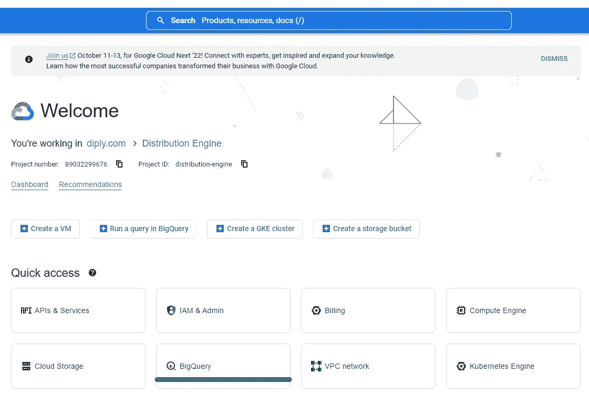
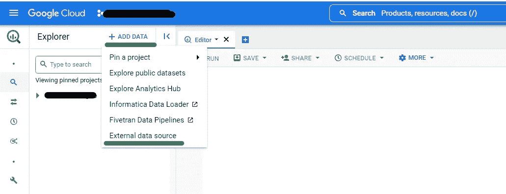
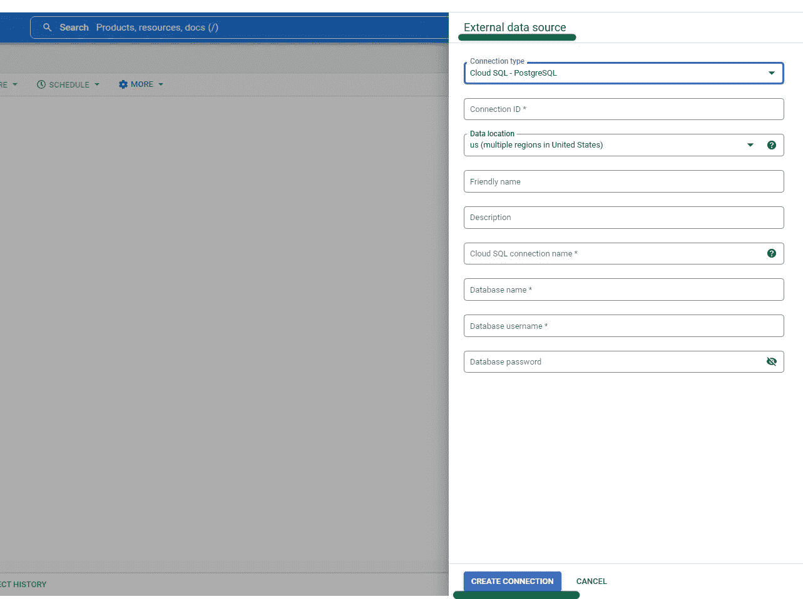
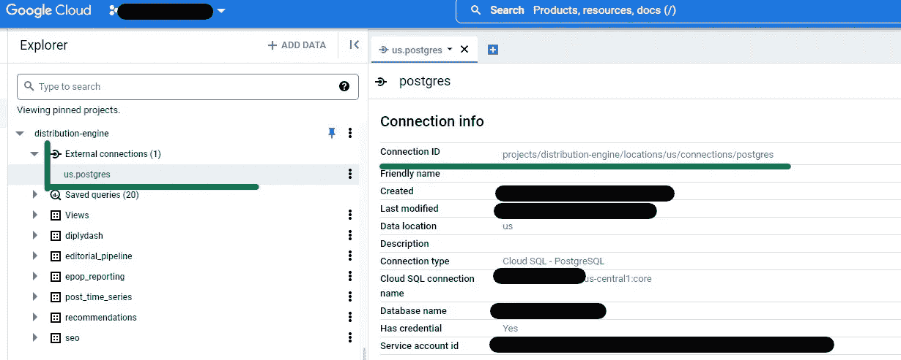

# 从 BigQuery 连接到云 SQL 实例

> 原文：<https://blog.devgenius.io/connecting-to-cloud-sql-instance-from-bigquery-807fc186b314?source=collection_archive---------10----------------------->

将两者联系起来再容易不过了。


照片由 Brett Sayles 从[https://www . pexels . com/photo/golden-gate-bridge-over-the-body-of-water-3186163/](https://www.pexels.com/photo/golden-gate-bridge-over-body-of-water-3186163/)

最初，我的公司在 Cloud SQL 中使用 PostgreSQL 实例来存储我们所有的数据。随着时间的推移，我们的要求和愿望越来越多，我们扩展到 BigQuery，同时仍然使用云 SQL。因此，我需要找到一种方法来连接这两个地方的数据。

在本文的第一部分，我将讨论最初的一次性设置，它允许您在每次需要访问存储在云 SQL 中的任何数据时，只需使用 EXTERNAL_QUERY()函数。然后，我将向您展示如何连接 BigQuery 和云数据库之间的表，以及如何在 where 子句的子查询中使用来自云 SQL 的表。此外，我将阐明使用联邦查询的缺点。

## A.从 BigQuery 创建到云 SQL 的连接

(确保[启用了 BigQuery 连接 API](https://console.cloud.google.com/apis/library/bigqueryconnection.googleapis.com?_ga=2.132575502.1890669153.1662665769-20160393.1626291283&_gac=1.118873467.1660848669.Cj0KCQjwxveXBhDDARIsAI0Q0x0nb1KkNDwqyJwrtyHXA6YmymrRPVoORvhWzKKqLCPD0O1yEXwu7WoaAtM1EALw_wcB&project=distribution-engine)&连接资源在与云 SQL 实例相同的项目中创建)

1.  点击谷歌云控制台中的 BigQuery:



作者截图—访问 BigQuery 页面

2.接下来，单击+添加数据并选择一个外部数据源:



作者截图-添加数据

3.用要求的信息填写打开的对话框:



作者截图—创建连接 ID

4.创建后，您的连接 ID 可以在您的外部连接下找到；只需扩展您的外部连接，然后单击提供给您的选项:



作者截图—可重用的连接 ID

## B.利用存储在云 SQL 中的数据

一旦建立了连接，就可以根据需要多次重用它。请遵循以下逻辑来访问云 SQL 中的数据:

```
EXTERNAL_QUERY("connection ID","""your query that is extracting data from the tables stored in Cloud SQL""")
```

1.  加入存储在云 SQL 中的表:

在第一个例子中，我使用左连接来访问存储在 PostgreSQL 中的数据。我使用外部查询函数，该函数由连接 ID 组成，连接 ID 由实际查询中的 coma 分隔。

```
SELECT interval_date, round(earnings*cad,2) as revenue_cadFROM `distribution.facebook`   as pmd LEFT JOIN  EXTERNAL_QUERY( "connectionID", """ SELECT date, cad FROM exchange_rates order by date DESC """ ) AS exchange on pmd.interval_date  = exchange.date ORDER BY interval_date DESC;
```

2.在 WHERE 子句中使用 EXTERNAL_QUERY()作为子查询的一部分:

尽管 where 子句中的 EXTERNAL_QUERY()的结构是相同的，但我花了几分钟才弄明白如何使用它。因此，我想与你分享我的例子:

```
SELECT 
    interval_est, 
    date_est ,
    sessions,
FROM `distribution.facebook_hourly` 
    where content_id in (SELECT 
                             content_id 
                         FROM EXTERNAL_QUERY(
                              "connectionID",
                              """SELECT 
                                     distinct content_id
                                 FROM fb_categories"""))
```

## C.缺点

1.  最大的缺点是性能——它不会像查询存储在 BigQuery 中的数据那样快。
2.  此外，您无法从云 SQL 访问存储在 BigQuery 中的数据。

## D.资源

1.  关于如何从 BigQuery 访问云 SQL 的官方文档