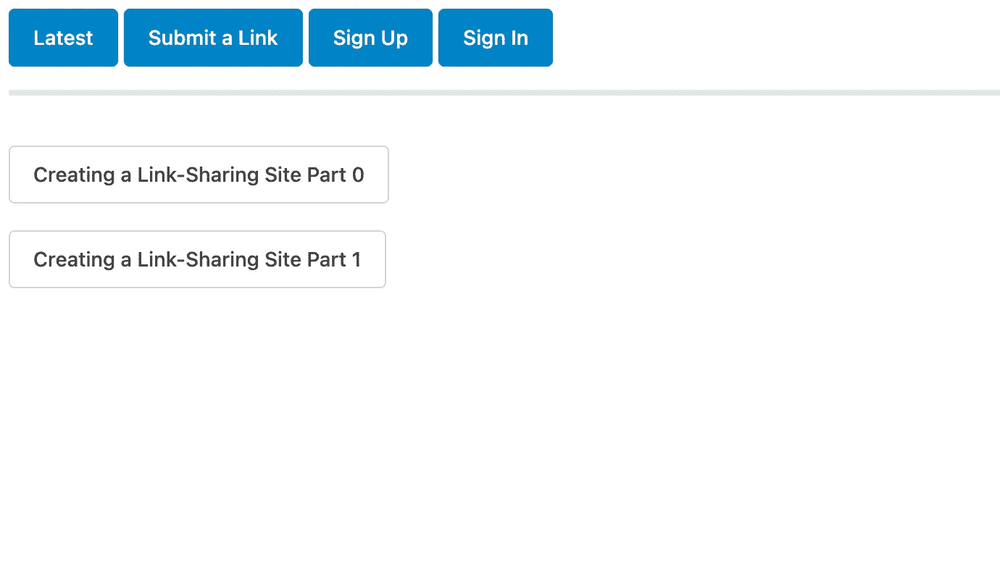
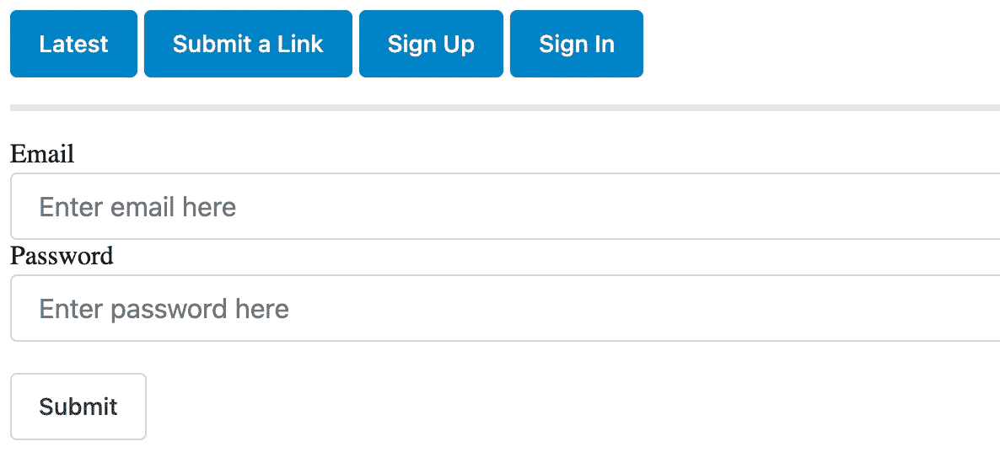

# 连接到 Firestore —链接共享网站第 3 部分

> 原文：<https://blog.devgenius.io/connecting-to-firestore-link-sharing-site-part-3-f37ce41a4389?source=collection_archive---------16----------------------->

## 将 web 应用程序连接到 Firestore。最后，一个工作链接共享网站…

# 介绍

感谢您花时间和我一起创建一个新的链接共享网站。在上一篇文章中，我谈到了我是如何初始化 Firebase 的。今天我要谈谈我是如何将 web 应用程序与 Firebase 的产品结合起来的。特别是，我将介绍我是如何连接 Firestore 的，并为用户提供了一种提交和查看存储在 Firestore 上的链接的方式。

# 处理认证

在[之前的文章](https://adamjhawley.com/post/2022-03-14-creating-a-link-sharing-site-part-2/#creating-an-sign-up-page)中，我描述了如何使用 Firebase SDK 函数`[createUserWithEmailAndPassword()](https://firebase.google.com/docs/auth/web/password-auth#create_a_password-based_account)`将注册表单连接到 Firebase 身份验证。

即使在注册之后，我认为我必须首先创建一个帐户，然后单独调用一个登录函数。然而，Firebase SDK 使它比这更容易！如果帐户创建成功，用户将自动登录。

## Web 组件重定向

因此，用户创建了一个帐户并登录。在这一点上，我所知道的大多数网站会将用户重定向回他们之前的页面或另一个特定的页面。为了简单起见，我选择在用户登录时将他们重定向到“浏览”页面。该页面是用户可以“浏览”所有最近添加的链接的页面，它也充当主页(见下文)。



最初，`createAccount()`看起来是这样的:

```
createAccount(email, password) {
  const auth = getAuth();
  createUserWithEmailAndPassword(auth, email, password)
  .then((userCredential) => {
      const user = userCredential.user;
  })
}
```

起初，我调用了`createAccount()`，然后立即将用户重定向到一个新页面。**没有等待** `**createUserWithEmailAndPassword()**` **的响应。**我很快意识到这是一个问题，账户创建成功与否并不重要。如果用户点击了注册表单中的“提交”按钮，他们就会被重定向、认证或不认证。

但是，如果由于使用了无效的电子邮件或密码等错误而没有创建帐户，那么用户界面应该给用户一个修改表单条目的机会。为了解决这个问题，我将我的`createAccount()`逻辑包装在一个`Promise`中:

```
createAccount(email, password) {
  return new Promise ((resolve, reject) => {
    const auth = getAuth()
    createUserWithEmailAndPassword(auth, email, password)
    .then((userCredential) => {
        this.user = userCredential.user;
        resolve()
    })
  })
}
```

作为 JavaScript 的相对新手，我仍在努力掌握与`async`、`await`、`Promise`等相关的一切。所以对于新来者，我最近出版了一本关于 JavaScript 承诺入门的指南。

## 正在登录

用户可以创建账户，万岁！但是他们每次都要注册一个新账户才能登录。对我来说听起来不太用户友好…

尽可能保持简单，我制作了一个和注册页面一模一样的登录页面。唯一的区别是当用户点击“提交”时会发生什么。我的`signIn()`方法和`createAccount()`几乎一模一样。不同的是`signIn()`使用的是`[signInWithEmailAndPassword()](https://firebase.google.com/docs/auth/web/password-auth#sign_in_a_user_with_an_email_address_and_password)`而不是前面提到的`createUserWithEmailAndPassword()`。



**工作签到页面**

现在是庆祝的时候了！连接到 Firestore 的工作验证。用户现在可以在网站上创建账户，以后再登录。

# Firestore

## 添加链接

放到网站的内容上。在 [web 组件重定向部分](https://adamjhawley.com/post/2022-04-26-creating-a-link-sharing-site-part-3/#web-component-redirects)和本系列第 1 部分中，我们已经看到了用户将如何查看浏览页面上的链接，我展示了如何创建一个提交链接的页面，但提到提交按钮根本不起作用。是时候改变了！

我首先创建了一个事件处理程序`submitLink`来处理表单中的提交按钮被按下的情况:

```
get _form () {
  return this.renderRoot.querySelector('#submit-form')
}

async submitLink (e) {
  let userTitle = this._form.querySelector('#title-input').value
  let userLink = this._form.querySelector('#link-input').value
  const db = getFirestore(this.app);
  let col = collection(db, 'links')
  await addDoc(col, {
    link: userLink,
    title: userTitle
  })

  const event = new CustomEvent('submitted-link')
  this.dispatchEvent(event)
}
```

我还修改了模板中的提交按钮，以使用新的`submitLink`处理程序:

```
<sl-button @click=${this.submitLink}>Submit</sl-button> 
```

在 Firebase 方面，我从使用 [getFirestore()](https://firebase.google.com/docs/firestore/quickstart#initialize) 开始。我将`this.app`传递给`getFirestore()`，其中`this.app`是传递给 web 组件的属性，等于`[initializeApp()](https://firebase.google.com/docs/firestore/quickstart#initialize)`的输出。第一行的目的是通过访问数据库初始化一个变量。

然后我定义了`col`，一个可以访问数据库中特定集合的变量:

```
let col = collection(db, 'links')
```

最后一步是将包含链接的文档添加到集合中:

```
await addDoc(col, {
  link: userLink,
  title: userTitle
})
```

如果此操作成功，那么我们已经将链接添加到数据库中！接下来，我使用与前面描述的[相同的策略](https://adamjhawley.com/post/2022-04-26-creating-a-link-sharing-site-part-3/#web-component-redirects)通过分派一个定制事件将用户重定向到一个新页面。

## 阅读链接

幸运的是，从 Firestore 上阅读和在上面写作非常相似。下面是我用来从 links 集合中获取所有可用链接的代码行:

```
const db = getFirestore(this.app)
let col = collection(db, 'links')
const querySnapshot = await getDocs(col)
querySnapshot.forEach((doc) => {
  this.linkBoxes.push(doc.data())
})
```

前两行与写作完全相同，并完全遵循我在[上一部分](https://adamjhawley.com/post/2022-04-26-creating-a-link-sharing-site-part-3/#adding-links)中描述的内容。事情在第三行有一点变化。

一个`[querySnapshot](https://firebase.google.com/docs/reference/js/v8/firebase.firestore.QuerySnapshot)`包含一个查询的结果。通过对整个集合`col`使用`getDocs()`，我要求将集合中的所有文档返回到变量`querySnapshot`中。

一旦查询被解析，我将遍历每个文档，并将它们添加到浏览页面上显示的链接列表中。

> 注意:要访问每个文档的内容，您必须遍历每个文档并调用它的`.data()`方法。

这就是全部了！链接提交工作，现在主页是使用用户正确提交的链接填充的。

# 结论

在本次更新中，我讨论了:

*   [我如何使用 JavaScript 承诺执行重定向](https://adamjhawley.com/post/2022-04-26-creating-a-link-sharing-site-part-3/#web-component-redirects)
*   [签到页面是如何产生的](https://adamjhawley.com/post/2022-04-26-creating-a-link-sharing-site-part-3/#signing-in)
*   [用户如何获得提交链接的能力](https://adamjhawley.com/post/2022-04-26-creating-a-link-sharing-site-part-3/#adding-links)
*   [主页如何动态加载 Firestore 的链接](https://adamjhawley.com/post/2022-04-26-creating-a-link-sharing-site-part-3/#reading-links)

我真诚地希望你喜欢这个更新。如果你想知道我什么时候发布更多更新，可以考虑在 [Medium](https://medium.com/@adamjhawley) 上关注我，或者在 [Twitter](https://twitter.com/_adamjhawley) 上关注我。

*原载于*[*https://adamjhawley.com*](https://adamjhawley.com/post/2022-04-26-creating-a-link-sharing-site-part-3/)*。*