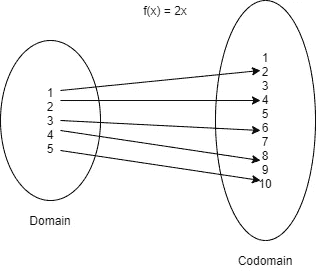
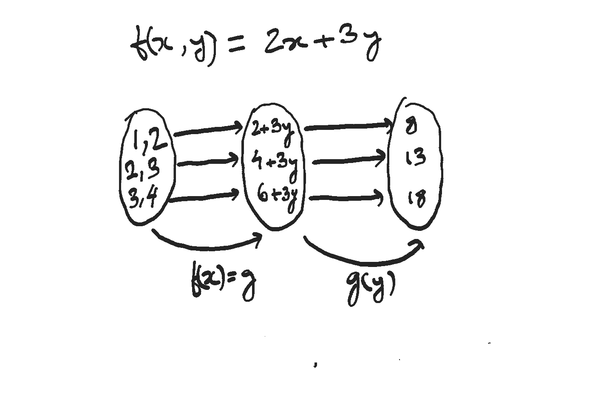

# 攻克 Java 中的函数式编程—第 1 部分—函数

> 原文：<https://blog.devgenius.io/conquering-functional-programming-in-java-part-1-functions-9deab03200a1?source=collection_archive---------5----------------------->

女:N -> N

一次又一次，我被邀请参加一个关于函数式编程的非正式会议或者写一篇博客。这有时让我感到惊讶，因为我们主要倾向于将对象(现实世界中的实体，如汽车和员工)视为一等公民，而不是功能(更通用的术语是行为)。我说的“第一类公民”是指我们主要使用对象，例如，我们可以创建/销毁对象，我们可以在这些对象上调用某些方法，最重要的是，我们总是将一个或另一个对象作为参数传递给任何方法。

函数式编程带来的好处是，它切换了档位，使“函数”(行为)成为“一等公民”。这是否意味着我们现在可以创建/销毁函数，执行函数，或者传递函数？是的。我们可以。让我把你的注意力引回到我刚才提出的观点上来。我提到创建/销毁函数和执行函数是有原因的。这两者是两个独立的操作。当我们创建或定义一个函数时，并不一定意味着我们会立即执行这个函数。这个我们以后再说。

因此，在面向对象编程中，对象是*的一等公民*，而在函数式编程中，函数是*的一等公民。*

如果您正在阅读这篇文章，那么您很有可能已经看到或使用过一些时髦的 Java 8 特性，如 Optionals、Streams、forEach 等。但是相信我，这只是冰山一角。函数式编程远不止这些。我打算让你熟悉它的大部分。

在开始我们的旅程之前，我想指出 Java 不是一种函数式编程语言，相反，它是一种面向对象的编程语言*,具有函数式编程语言的一些特性。*所以请不要拿 Java 和 Scala/Kotlin 比较。但是不要担心，我将介绍一些基础知识以及一些高级概念，比如尾部调用优化，这些在 Java 中是默认不存在的，但是您仍然可以在 Java 中实现 TCO。

最好从零级开始(即使你是经验丰富的开发人员，相信我，你不会后悔这一部分)。

# 什么是函数？

让我们暂时放下编程的帽子，以非程序员的身份进行讨论。有趣的事实:让我问你一个问题。如果你必须在艾萨克·牛顿爵士和阿尔伯特·爱因斯坦之间做出选择，你会选择谁？如果同样的问题问我，我的答案是牛顿。不仅仅是因为法律或整合的发明。想想吧。牛顿是发现数学可以用来模拟现实世界的人。那个发现是垫脚石。

回到我们的话题。什么是函数？我知道现在你一定回忆起了你高中时代的关系和职能。但是函数不仅仅是数学或编程构造，也是我们日常生活的一部分。如果你愿意接受功能的字典含义，那么它意味着任何人或事物的目的或特殊职责。例如，心脏的*功能*是将血液输送到全身。所以它吸入血液，然后将血液推向其他部位。因此，无论我们在哪里看到，我们都会发现函数在起作用，比如在太阳、地球或你购物的时候(计算总花费)。

本节的重点将是向您重新介绍成为函数式编程忍者所需的关键数学函数构造。

剧透提示:函数主要是一个数学概念。它是定义两个集合如何相关的关系。

女:N -> N

源集称为功能域，目标集称为功能域。你一定记得一件事，函数是一种特殊的关系。那么什么是“特殊关系”呢？要成为函数，关系必须满足一个条件:定义域的所有元素在共定义域中必须有且只有一个对应的元素。这句话有一些有趣的含义:

*   域中不能存在在共域中没有对应值的元素。
*   在对应于域的相同元素的共域中不能存在两个元素
*   可能在共域中有元素，而在源集中没有相应的元素。
*   在源集合中，可能存在具有多个对应元素的共域元素。
*   在定义域中有对应元素的余定义域元素的集合称为函数的象

在上图中，我画了一个从 N 到 N 的函数‘x’(N 是所有自然数的集合)。这个 N 到 N 是函数的类型，表示为 N → N。同样，您可以将另一个函数定义为 g(x) = x+1，其中 x 是正整数。那么这个函数就代表了每个正整数和它的后继者之间的关系。让我们为“g”的域和共域指定一个别名作为 A 和 B，然后你可以将“g”从 A -> B 重新表述为“x”的函数，更具体地说,“g”的类型变成 A -> B。

# 功能和操作的类型

您可以对它们执行多种功能和操作。在这篇博客中详细讨论每一个细节是不切实际的，但是如果你需要快速修改，你可以向 ChatGPT 询问。我打算介绍几种类型的函数和一些函数操作，这些你会经常遇到。

## 反函数

一个函数可能有也可能没有反函数。如果 f(x)是从 A 到 B 的函数(A 是域，B 是共域)，反函数记为 f-1(x ),以 B 为域，A 为共域。我们把函数的类型表示为 f: A -> B，反函数(如果存在)的类型为 f: B -> A。

## 部分功能:

没有为域中的所有元素定义关系，但满足其余要求(域中的任何元素都不能与共域中的一个以上元素有关系)的关系通常被称为部分函数。

部分函数在编程中很重要，因为许多错误都是由于将部分函数当作整体函数来使用造成的。例如，关系 f(x) = 1/x 是从 N 到 Q(有理数)的部分函数，因为它不是为 0 定义的。是从 N*到 Q 的全函数，但也是从 N 到(Q 加误差)的全函数。通过在余域(错误条件)中添加一个元素，可以将部分函数转化为整体函数。

## 身份功能

identity 函数是一种特殊的函数，它只是域的镜像。例如，f(x) = x，其中 x 在 n 中，那么无论你为 x 选择什么值，结果都是这样。用最简单的话来说，输出=输入。所以在 f(x) = x 中，用 1 作为 x => f(1) = 1。你可以清楚地看到，函数的输入和函数应用的结果也与输入或域完全相同。

## 功能组成

在函数式编程中，函数是构造块。您可以对函数本身执行多种操作。要画一个平行线，考虑一下你可以在对象上执行的操作，比如克隆、toString、equals 等等。同样，您有一个称为函数组合的函数操作。总的想法是，可以组合函数来构建其他函数。函数 f 和 g 的组合记为 f g，读作 g 的 *f round g* 或 *f of g.* 有些人甚至称之为 g' 之后的' *f 这只是为了记住执行顺序，即函数 g 将首先应用，然后是函数 f。例如:f: f(x) = x + 2，g: g(x) = x * 2，然后*

f g (x) = f(g(x)) = f(x * 2) = (x * 2) + 2

如果你将这个函数应用于 3，你会得到如下结果

f g (3) = f(g(3)) = f(3 * 2) = 6 + 2 = 8

这就是功能应用/执行的含义。

有趣的是，f g 通常不同于 g f，尽管它们有时可能是等价的。例如:

g f (3) = g(f(3)) = g(3 + 2) = 5 * 2 = 10

请注意，函数的应用顺序与书写顺序相反。如果你写 f g，你首先应用 g，然后 f。

## 多个参数的功能

到目前为止，我们只讨论了一个论点的功能。几个参数的作用呢？简单来说，没有几个自变量的函数。还记得定义吗？函数是源集合和目标集合之间的关系。它不是两个或多个源集和一个目标集之间的关系。一个函数不能有多个参数。

但是两个集合的乘积本身就是一个集合，所以从这样一个集合的乘积到一个集合的函数可能看起来是几个自变量的函数。让我们考虑下面的函数:f(x，y) = x + y，这可能是 N x N 和 N 之间的一个关系，在这种情况下，它是一个函数。但它只有一个自变量，是 N×N 的一个元素，N×N 是所有可能的整数对的集合。这个集合中的一个元素是一对整数，而一对整数是更一般的元组概念的特例，用于表示几个元素的组合。对是由两个元素组成的元组。元组用括号标注，所以(2，3)是一个元组，是 N×N 的元素，函数 f 可以应用于这个元组:f((2，3)) = f(2，3) = 2 + 3 = 5。

## 函数 Currying

元组的功能可以有不同的理解。函数 f(2，3)可能被认为是从 N 到 N 的一组函数的函数。因此，前面的示例可以重写为 f(x)(y) = g(y)，其中 g(y) = x+y。显然，您可以写出 f(x) = g，这意味着将函数 f 应用于参数 x 的结果是一个新的函数 g。将此 g 函数应用于 y 得出如下结果:g(y) = x + y。当应用 g 时，x 不再是一个变量。它不取决于论点或其他任何东西。这是一个常数。

这里唯一的新东西是 f 的余域*是一组函数，而不是一组数，即 f 应用于整数的结果是一个函数。现在，因为你仍然有一个函数(一个中间函数)，你仍然要把它应用到某个东西上。例如，考虑元组的这个函数:*

f: f(x，y) = 2x + 3y。

这个可以稍微写的不一样，f(x)(y) = 2x + 3y。让我们把 x 当作 5，y 当作 10。那么如果我们将 5 应用于 f(x)(y)会发生什么？会的

f(5)(y) = 2 * 5 + 3y = 10 + 3y

应用 5 的结果现在是‘y’的新函数。因此你可以把它写成 g(y)。现在这个新的或中介函数可以应用到 10。因此，

g(y) = 10 + 3y

g(10) = 10 + 3 * 10 = 10 + 30 = 40。

f: N -> g -> N

f(x)(y)是函数 f(x，y)的简化形式。将这种变换应用于一个元组的函数(如果愿意，也可以称之为多个参数的函数)被称为 currying，以数学家 Haskell Curry 命名(尽管他不是这种变换的发明者)。同样，你可以有一个三元组的函数，

f(x，y，z) = 2x + 3y + 4z

你可以把它改写成咖喱的形式，

f(x)(y)(z) = 2x + 3y + 4z

现在，假设您要将此函数应用于坐标(1，2，3)，然后首先应用 x 的值，这将产生 y，z 的中间函数。然后，您可以将此中间函数应用于“y”以获得“z”的另一个中间函数。最后，您可以将这个中间函数应用到“z”以获得最终结果。

设 f(x) = g，则

f(x)(y)(z) = g(y)(z)

设 g(y) = h，那么

g(y)(z) = h(z)

现在让我们开始将 f(x)(y)(z)或 f(x，y，z)应用于(1，2，3)

f(x)(y)(z) = 2x + 3y + 4z

=> f(1)(y)(z) = 2*1 + 3y + 4z

=> g(y)(z) = 2 + 3y + 4z

=> g(2)(z) = 2 + 3*2 + 4z

=> h(z) = 2 + 6 + 4z = 8 + 4z

=> h(3) = 8 + 4*3 = 20

如上所述，你可以用一个简单的经验法则，将同样的原则应用于任何数量的论点，

*   首先，编写函数的形式化形式
*   开始一个一个的应用函数，得到中介函数。

f(x1，x2，x3，…，xn) => f(x1)(x2)(x3)…..(xn)

这里要带走的关键是，在对任何值应用 curried 函数后，结果将是一个中间函数和结果本身。结果将在稍后应用该中间函数时计算。

当处理函数 currying 时，你实际上是部分地应用了函数。如您所见，部分应用的函数会产生另一个函数，该函数既可以用于计算最终结果，也可以作为参数在应用程序中传递给不同的函数。

函数通常是围绕一些行为的抽象，当我们开始将整个函数作为参数传递给其他函数时，就像任何其他变量一样，那么我们本质上是将行为参数化。听起来很有趣吧？这确实是一个强大的概念。以至于现在策略模式已经成为 Java 中的反模式。我们将在本系列的后面对此进行研究。

有了这样的认识，我觉得结束这一部分是安全的。 [**在下一部分**](https://najeebarif.medium.com/conquering-functional-programming-in-java-part-2-functions-in-java-baf53a8146f4) 中，我们将开始研究如何在 Java 中表示函数。