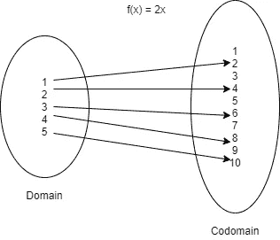

# 攻克 Java 中的函数式编程—第 2 部分—Java 中的函数

> 原文：<https://blog.devgenius.io/conquering-functional-programming-in-java-part-2-functions-in-java-baf53a8146f4?source=collection_archive---------8----------------------->



女:N -> N

在本系列的[第 1 部分，我们看了函数在数学上下文中的含义。我们还看到了一些类型的函数以及一些可以在函数上执行的函数操作。例如，我们看到了什么是函数组合，概括一下，*你可以把它看作是对两个或更多函数的二元运算，就像加法是对两个或更多操作数的运算一样*。](https://najeebarif.medium.com/conquering-functional-programming-in-java-part-1-functions-9deab03200a1)

在本节中，我们将讨论如何在我们最喜欢的编程语言 Java 中表示函数。如果你一直跟着我，你一定已经注意到我把函数称为对*行为*的抽象。这很好，我们已经有了一个在 Java 中封装行为的结构，那就是方法。那真的那么直白吗？不完全是。为了给 java 中的函数带来一流的支持，我们需要一种像传递变量一样传递函数的方法。但是，这对于简单的方法来说是不可能的(当然，你可以使用反射 API 来围绕方法类对你的代码建模，但是相信我，这带来的是更多的痛苦而不是收获)。不仅如此，如果不能将一个方法传递给另一个方法，如何组合两个方法呢？

不过，你可以做的一件事是让 Java 方法*函数化*，也就是说，如果一个方法满足一个*纯函数*的要求，那么它就是函数化的。函数式编程的症结所在。在纯函数中，你永远不会或者不应该有副作用。

*   它不能改变函数之外的任何东西。从外面看不到内部突变。
*   它绝不能改变自己的论点。
*   它不能抛出错误或异常。
*   它必须总是返回值。
*   当用相同的参数调用时，它必须总是返回相同的结果。

方法可以变成函数式的，但是它们缺少了一些东西，使得它们无法在函数式编程中表示函数:除了应用于参数之外，它们不能被操纵。不能将一个方法作为参数传递给另一个方法。其后果是，如果不应用方法，就无法编写方法。您可以编写方法应用程序，但不能编写方法本身。

相反，您可以做的是定义一个新的构造来用 Java 建模一个函数(是的，我稍后将介绍 Java 8 和 lambdas，但是现在您可以跟随它来获得一个大概的概念)。最简单的建模方法是使用 Java 接口，因为这让我们可以定义一个抽象方法，它的实现可以在我们需要的任何时候提供，或者通过匿名类，或者通过一些具体的实现(剧透一下:我们通常使用现代的匿名类 lambdas，但是稍后会详细介绍)。

```
public interface Function {
    int apply(int arg);
}
```

假设这是我们的函数定义，让我们定义一个函数来三重化一个整数值，f(x) = 3x:

```
final Function tripleFunction = new Function() {
            @Override
            public int apply(int arg) {
                return 3 * arg;
            }
        };
final int result = tripleFunction.apply(2);
```

这里要注意的关键是 apply 方法的签名，它接受一个 int 作为输入，返回一个 int 作为输出。让我们创建另一个函数来平方任意数 g(x) = x * x

```
Function squareFunction = new Function(){
            @Override
            public int apply(int arg) {
                return arg * arg;
            }
        };
final var result = squareFunction.apply(2);
```

您可以看到如何在运行时定义不同的行为。通过在运行时为 apply 方法提供新的实现。让我们把函数合成的最初问题带回来。让我们假设我们想要将两个函数 tripleFunction 和 squareFunction 组合在一起。我们能这样做吗？想到的一个快速解决方案是**square function . apply(triple function . apply(2))**。但这是不正确的。这是函数应用程序的组成部分，而不是函数本身。仔细看，你会看到，首先，你把三重函数应用于 2，然后结果应用于平方函数。相反，我们想要的是构造一个函数，最终产生一个新的函数，而不是一个值。为此，我们必须在函数接口中编写一个新的 compose 方法。

```
static Function compose(Function f1, Function f2){
    return new Function() {
        @Override
        public int apply(int arg) {
            return f1.apply(f2.apply(arg));
        }
    };
}
```

现在你可以组合这两个函数了。

```
Function intermediaryComposedFunction = 
      Function.compose(tripleFunction, squareFunction);
final int result = intermediaryComposedFunction.apply(2);
```

请注意中间函数是如何生成的，然后将该函数应用于 2 以获得最终结果。听起来很熟悉？

到目前为止一切顺利，但我们仍然有两个主要问题。第一，我们只创建将 int 作为输入，返回 int 作为输出的函数。而且函数定义真的很痛苦。我们能在这些方面有所改进吗？是的，我们可以很好地解决这些问题。让我们首先解决 int 函数的问题，然后我们再回来解决冗长的问题。

如果我们想创建一个函数来大写一个字符串呢？怎么才能解决这个问题？简单地说，我们引入泛型并使函数接口多态。

```
public interface Function<T, U> {
    U apply(T arg);
}
......

@Test
@DisplayName("Should triple the value: ")
void testTripleFunction(){
    final Function<Integer, Integer> tripleFunction = new Function<>() {
        @Override
        public Integer apply(Integer arg) {
            return 3 * arg;
        }
    };
    final var result = tripleFunction.apply(2);
    assertThat(result)
            .isEqualTo(6);
}
```

那么大写用例呢？

```
@Test
@DisplayName("Should uppercase the string.")
void uppercaseString(){
    final Function<String, String> toUppercaseFunction = new Function<>() {
        @Override
        public String apply(String arg) {
            return arg.toUpperCase();
        }
    };
    final var hello = toUppercaseFunction.apply("hello");
    assertThat(hello)
            .isEqualTo("HELLO");
}
```

对于更通用的 compose 方法，我将稍后再讨论它。让我们首先解决冗长的问题。

在 Java 8 中，Lambdas 被引入到语言中，以简洁的方式提供任何抽象方法的实现。考虑一下我们是如何创建三重函数的，

```
 final **Function<Integer, Integer> tripleFunction** = new Function<>() {
    @Override
    public **Integer** apply(**Integer** **arg**) {
        return **3 * arg**;
    }
};
```

如果你看这个，你会注意到，在这个定义中，只有几件有趣的事情，输入，输出，和实际的逻辑。我用粗体标出了它们。回想一下，我们将函数的类型定义为 A -> B，其中 A 是输入，B 是输出。现在如果你把所有不必要的东西从定义中去掉，也把函数类型 A -> B 考虑进去，我想你会明白 lambda 是怎么写的，为什么要写。对于我们的例子，首先，tripleFunction 的类型是 *Function < Integer，Integer>，这意味着它将接受一个整数作为输入并返回一个整数。所以大概是这样:**整数- >整数**。现在在上面的定义中，输入是*(整数 arg)* 所以让我们替换它，它变成:**(整数 arg)>整数**。现在让我们关注箭头操作符的右边，返回类型。仅仅提到整数是不够的。这个整数值是怎么计算出来的逻辑是什么？哦，等等，我们有逻辑，也碰巧返回整数(相信我，编译器现在有一个很好的推理引擎。)所以不用写(Integer arg) - > Integer 我们可以写， **(Integer arg) - > 3 * arg** 。瞧，这是你的第一个λ表达式。因此现在三元函数的定义变成了:*

```
Function<Integer, Integer> triple = (Integer x) -> 3 * x
```

大多数时候你不需要明确指定输入的类型，但是如果编译器抱怨你可以定义或者你可以选择跳过它。

```
Function<Integer, Integer> triple = x -> 3 * x
```

类似地，您可以定义平方函数，

```
Function<Integer, Integer> square = x -> x * x;
```

现在这些比我们以前拥有的要好得多。

现在让我们考虑一个简单的用例，您想要一个组合函数，它组合两个类型为 *Integer - > Integer* 的函数。

如果不使用 lambda，您将会写出类似这样的代码:

```
static Function<Integer, Integer> composeIntFunctions(Function<Integer, Integer> f1,
                                                      Function<Integer, Integer> f2){
    return new Function<Integer, Integer>() {
        @Override
        public Integer apply(Integer arg) {
            return f1.apply(f2.apply(arg));
        }
    };
}
```

注意 return 语句，这是我们想要的，我们想看看是否可以通过使用 Lambda 来改进它。应用同样的原理，去掉所有不必要的，保留输入、输出和逻辑。那你就只剩下

```
static Function<Integer, Integer> composeIntFunctions(Function<Integer, Integer> f1,
                                                      Function<Integer, Integer> f2){
    return arg -> f1.apply(f2.apply(arg));
}
```

注意 return 语句。**返回****arg->f1 . apply(F2 . apply(arg))；**一行字，更干净，更时尚。

老实说，这个功能<t u="">接口可以满足你所有的功能需求。您可以将这个接口视为核心组件。您可以创建一些方便的专用功能接口*来帮助您处理一些常见的场景。定义函数接口的关键在于，你可以用一个抽象方法来定义一个接口，并用 Java . lang .**Functional interface**来注释这个接口。java 注释。该接口也可以有默认或静态方法，但它应该只有一个抽象方法。这是将任何接口标记为功能接口的一般约定。*</t>

Java 提供了一组方便的函数接口，可以满足您的大部分需求(大约 90%)。记住所有这些接口都是函数<t r="">接口的特殊用例。是的，Java 里也有一个接口，java.util.function.Function <t r="">。你可以查看 [java 文档](https://docs.oracle.com/javase/8/docs/api/java/util/function/package-summary.html)来找出所有存在的功能接口。</t></t>

在结束这一部分之前，让我们看看另一个非常重要的特性。你还记得我们创建的 toUppercase 函数吗？(用 lambda 重写)

```
Function<String, String> toUppercase = str -> str.toUpperCase();
```

这可能看起来太多了，但是坚持一会儿，你很快就会看到一切都在融合。让我们编写一个普通的 java 方法来做同样的事情。

```
public static String toUppercase(String input){
    return input.toUpperCase();
}
```

查看这个方法，您可以很容易地看出这个函数的输入是 String 类型的，它返回 String。逻辑是**input . toupper case()；**。这看起来与前面的 lambda 示例非常相似。那么有什么方法可以将简单的 java 方法与函数< T，R >联系起来呢？是的，我们可以。现在它依赖于函数的类型和 Java 8 中引入的新的编程结构——方法引用。看着上面的方法你可以清楚的推断出它的类型，String - > String。在 Java 中，我们将这种函数类型表示为函数<字符串，字符串>。让我们给它起个名字，

```
Function<String, String> methodRefToUpper = null;
```

这里唯一剩下的事情就是我们让变量引用实际的方法。而这样做的方法就是使用*class name****:****method name。*

```
import java.util.function.Function;

public class Main {

    public static void main(String[] args) {
        final Function<String, String> methodRefToUpper = Main::toUppercase;
        final var hello = methodRefToUpper.apply("hello");
    }

    public static String toUppercase(String input){
        return input.toUpperCase();
    }
}
```

我想你可以看到方法引用的力量。通过这种方式，您可以引用任何 java 方法并有效地创建它的实例，按需执行它，或者将它传递给不同的方法或函数，或者您可以对它执行任何其他功能操作。这也有非常有趣的含义，无论什么函数接受函数<t r="">的参数，你都可以传入一个方法引用，该方法引用一个接受 T 的输入并返回 r 的输出的方法。</t>

```
final List<String> stringList =
        Stream.of("hello", "world", "java", "is", "awesome")
        .map(methodRefToUpper).toList();
// contents of the list: [HELLO, WORLD, JAVA, IS, AWESOME]
```

Stream 类有一个采用函数<t u="">的 map 方法，用于根据 map 函数转换流的元素。可以看看*Java . util . stream . stream*。java 了解更多信息。对于新来的人，让我快速解释一下这里发生了什么。您正在定义一个字符串流，然后使用 map 方法转换流中的每一个元素。由于 map 方法将函数< T，R >作为参数，您通过我们刚刚在上面创建的变量传递对函数的引用。最后，我们将所有新转换的值收集到一个列表中，因为流本质上是无界的(可以把它想象成永无止境的连续数据流)。</t>

这一部分旨在向您介绍如何用 Java 表示函数，以及 Java 必须提供什么。在接下来的两部分中，我们将考虑 FP 的一些更高级的特性，比如高阶函数、多参数函数、尾部调用优化、记忆化等。