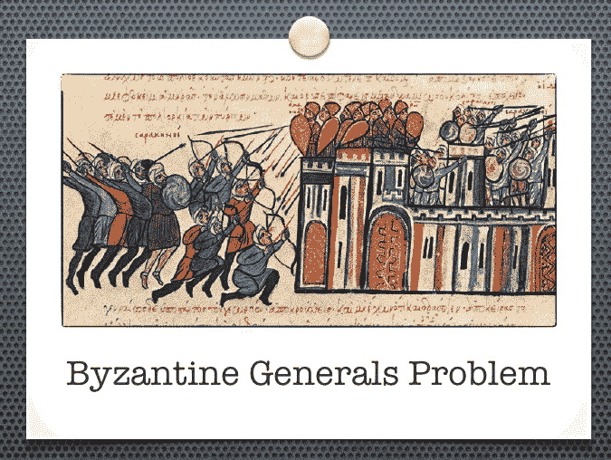
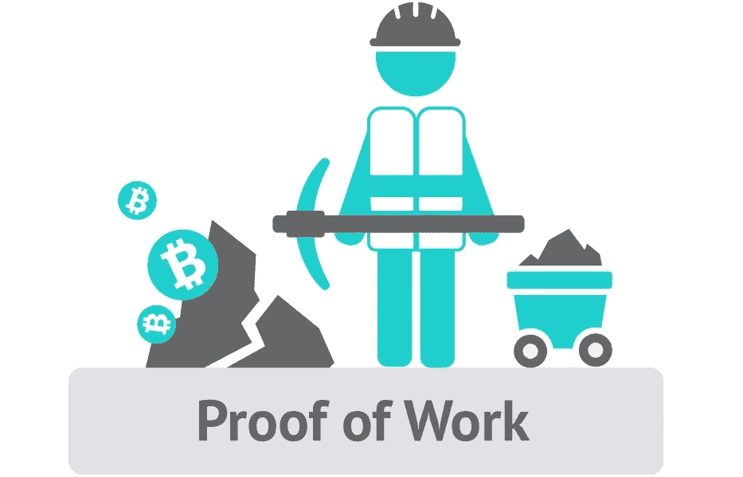
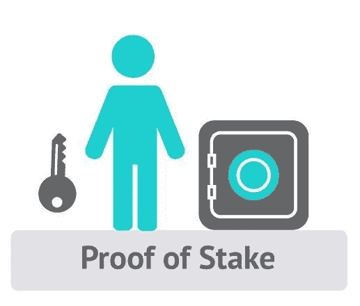

# 区块链中的共识协议

> 原文：<https://blog.devgenius.io/consensus-protocols-in-blockchain-3727f490ebcd?source=collection_archive---------11----------------------->

## 区块链基础知识

## 工作证明、利益证明、活动证明

在 [Unsplash](https://unsplash.com?utm_source=medium&utm_medium=referral) 上由 [Hitesh Choudhary](https://unsplash.com/@hiteshchoudhary?utm_source=medium&utm_medium=referral) 拍摄的照片

区块链是比特币和其他加密货币背后的基础技术，也用于许多应用中。吸引许多人的区块链的一些关键特征是去中心化、透明性和不变性。特别是在当今时代，技术正在接管我们的生活，人们渴望更多的独立和所有权，而不是信任大公司(以及政府)和许多因素..所有这些都有助于区块链、去中心化金融应用等的巨大成功。

区块链不是一种单一的技术，而是包括各种东西的集合，构成了整体解决方案，如点对点技术、密码学和共识协议。

所以，区块链是一个-

> 分布式账本技术(DLT ),允许数据存储在全球成千上万的服务器上，同时让网络上的任何人都能近乎实时地看到其他人的条目。链条中的每个区块都包含许多交易，每次区块链上发生新的交易时，该交易的记录都会添加到每个参与者的分类账中。

# 透明度

照片由[阿列克斯·达尔伯格](https://unsplash.com/@aleksdahlberg?utm_source=medium&utm_medium=referral)在 [Unsplash](https://unsplash.com?utm_source=medium&utm_medium=referral) 上拍摄

本质上，在区块链中，参与区块链的每个系统都存储整个交易列表。通过这种方式，它实现了透明性，因为任何加入网络的人都可以从头开始查看网络上发生的所有交易。

# 分散

美国宇航局在 [Unsplash](https://unsplash.com?utm_source=medium&utm_medium=referral) 拍摄的照片

由于该交易列表存储在网络上的所有系统中，它实现了**去中心化**，即数据不存储在任何一个中央服务器上。

# 共识；一致

[Cytonn 摄影](https://unsplash.com/@cytonn_photography?utm_source=medium&utm_medium=referral)在 [Unsplash](https://unsplash.com?utm_source=medium&utm_medium=referral) 上拍照

区块链带来的重要功能是如何验证每笔交易并将其添加到网络中的机制。这是区块链的根本定义和区别。每当提交交易时，都必须进行验证，区块链中的所有系统都必须就结果达成一致。这个过程被称为*共识机制*。它定义了整个网络如何将交易添加到区块链并达成共识的过程。

# 共识协议

《共识协议》试图在高层解决“拜占庭将军”问题。这是你会听到的术语，当谈论区块链中的共识机制时。这背后有一个有趣的故事。

想象一下这个场景。中间有一座城堡，中尉们已经包围了城堡。将军计划发动一次进攻。然而，由于军队如此分散，将军没有集中控制。城堡被击败的唯一方法是军队同时发动有计划的同步攻击。将军们就时间达成一致的唯一方法是通过信使传递信息。现在的问题是，如果信使被敌人抓住，他们的信息被篡改了怎么办。此外，如果将军本人腐败并试图在将军们之间制造不和怎么办。因此，没有办法检查消息是否真实，那么我们作为这个国家最优秀的军事战略家，如何创建一个“不可信”的系统来确保进攻城市的胜利呢？**这是拜占庭将军的问题**。

# 工作证明

资料来源:en.bitcoinwiki.org

这是最受欢迎的共识机制，因为 PoW 是比特币、以太坊和大多数其他区块链网络中使用的机制。在 PoW 中，每个参与节点执行一个数学上具有挑战性的问题，向块中添加一个新事务。无论谁先执行这项复杂的任务，都将向整个网络广播他们的工作，其他节点验证工作并更新区块链。在这里，最先解决问题的矿工会因完成工作而获得奖励。当矿工正在工作并出示他们所做工作的证明时，这被称为“工作证明”协议。

> 工作证明是解决重复花费问题的原始方法，并且已经被证明是可靠和安全的。比特币证明了我们不需要中央实体来防止同样的资金被花两次。

对于 PoW 来说，随着网络的增长，采矿需要大量的能源。在某些时候，矿工可能对采矿没有任何优势，因为花费与回报可能不值得参与采矿过程。这可能会造成一个问题，即很少有大的参与者参与采矿，从而否定了任何人都可以参与的分散网络的优势。

# 利害关系证明

资料来源:en.bitcoinwiki.org

利益证明(PoS)是公共区块链的一类共识算法，它依赖于验证者在网络中的经济利益。请注意术语验证器。那是因为没有硬币创造(采矿)存在于股权证明中。相反，所有的硬币从第一天起就存在，验证者(也称为利益相关者，因为他们在系统中持有股份)严格按照交易费支付。在这里，一组验证者轮流对下一个区块进行提议和投票，每个验证者的投票权重取决于其存款(即股份)的大小。PoS 的显著优势包括安全性、降低集中化风险和能源效率。因此，在这种共识算法中，一个“验证者”投资于系统的硬币，而不是投资于昂贵的计算机设备来进行区块开采竞赛。

> 作为赌注的证明，你被选中创建下一个区块的机会取决于你拥有的系统中硬币的比例。

# 活动证明

活动证明是一种结合了电源和 PoS 的混合方法。在活动证明中，采矿以传统的工作证明方式开始，矿工们竞相解决一个密码难题。此时，系统切换到赌注证明。根据报头中的信息，随机选择一组验证者对新块进行签名。验证者拥有的硬币越多，他或她被选中的可能性就越大。一旦所有的验证器对模板进行了签名，它就变成了一个成熟的块。

# 结论

在区块链领域，共识协议决定了技术的功能。这一领域正在进行大量的研究和实验。随着这项技术越来越受欢迎，它必须具有可扩展性，共识协议会影响区块链的延迟和可用性。工作证明是有效的，但它也带来了许多缺点，为其他协议(如利益证明和活动证明)提供了空间。然而，它仍处于起步阶段，在不久的将来，这个领域将会有很大的进步。无论加密货币的未来如何，区块链都将继续存在，并将进入许多领域，共识机制成为每个应用的关键。

[亚历山大·奈特](https://unsplash.com/@agkdesign?utm_source=medium&utm_medium=referral)在 [Unsplash](https://unsplash.com?utm_source=medium&utm_medium=referral) 上拍照