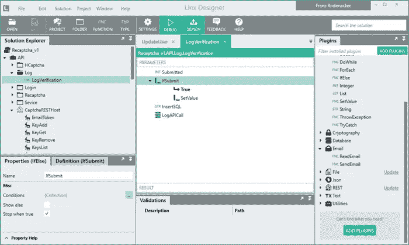
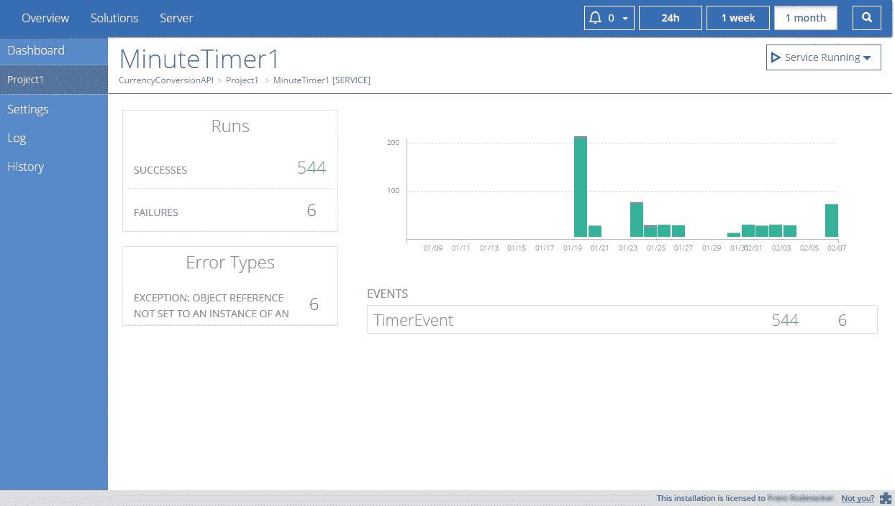

# 考虑低码？为什么 Linx 应该是您选择的低代码平台。

> 原文：<https://blog.devgenius.io/considering-low-code-why-linx-should-be-your-low-code-platform-of-choice-733624e93dce?source=collection_archive---------0----------------------->

构建和维护后端应用程序既复杂又耗时。你需要选择正确的工具，编写模板代码，与最新的框架搏斗，试图理解别人的代码，找出新的 API，等等。部署和托管带来了它自己的问题:我们如何部署？我们部署到哪里？我们如何监控它？版本控制、测试、安全等等呢？

[通用低代码平台 Linx](https://linx.software/) 解决了其中的许多问题，是低代码市场的先驱。原因如下…

随着越来越多的企业了解到该技术相对于传统编码实践的广泛优势，低代码继续获得牵引力。它允许您保留传统编码解决方案的重要元素，如灵活性和定制，同时为您的组织节省大量的时间和金钱。

Linx IDE 应用程序设计器

# 但是并不是所有的低代码平台都是平等的。

低级代码，像许多其他软件术语一样，有点含糊不清。在这个总括术语下，存在着各种各样的工具类型——网站生成器、表单构建器、API 连接器、数据库构建器、工作流自动化等等，每一种都需要不同水平的技术熟练程度。

虽然大多数低代码环境倾向于使用视觉隐喻来描述逻辑程序流，但是当事情变得稍微复杂时，你的“图”很快就会分解。Linx 遵循自由形式的函数式编程方法，允许您处理后端开发的深层复杂性。

大多数低级代码工具针对特定的领域或技术子集，并使用可视化的流程来处理定制逻辑。Linx 是一个通用平台，对它可以连接的技术没有任何限制，并使用编程概念的可视化抽象来简化和维护复杂的逻辑。

通过坚持泛型编程概念，Linx 创造了一种独特的方法，解决了典型低代码平台的许多常见缺陷和限制。

# 真正的编程灵活性

程序员考虑低代码工具的一个常见问题是缺乏灵活性。大多数低代码工具都是基于工作流范例的。 **Linx 的不同之处在于它遵循了一种编程范式**，这种范式使它更加全面，也更易于开发人员和 it 专业人员掌握。

它没有规定一条“黄金路径”，也没有提供模板或许多其他工具所提供的任何过程流概念。相反，Linx 将拖放功能的速度和效率与传统开发的表现力和能力结合起来。通过这样做，它涵盖了几乎所有的场景或需求。你几乎可以说它们是用于后端开发的低代码 Visual Studio。

# 以不同的格式编程

Linx 抽象了编程概念，因此我们的工具自然地像普通编程工具一样工作。Linx Designer 是一个 IDE，它允许您在更高的级别进行编程和调试，并将程序规范保存到部署到一个或多个 Linx 服务器的文件中，以运行应用程序。在 Linx 中构建解决方案应该与您使用低级编程的方式没有什么不同；它只是在服务器端提供了更大的块、更多的视觉帮助和许多现成的功能。

Linx 应用服务器

# 您的筹码很重要

我们认识到，很少有应用程序开发项目是从零开始的；大多数必须与现有的数据库、遗留代码和其他已经在生产中的应用程序集成。

正是因为这个原因，Linx 被设计成“工具不可知的”，允许您将您的业务逻辑与您选择的服务相结合。

结果；快速迭代开发，使用新的或现有的资源，并部署到具有内置管理和监控的生产环境中。

# 它与其他低代码工具相比如何

可用于构建 API、自动化和集成的低代码工具分为几大类。

…

# 工具类别

**通用低代码平台(Linx)**
最佳用例:构建 API，任何后端自动化或集成。
不适合:构建用户界面。

**消费者应用集成(Zapier，IFTTT)**
最佳用例:非技术用户的简单自动化。
不适合:任何稍微复杂或者构建 API 的东西。

**RPA (UIPath，Automation Anywhere)**
最佳用例:通过自动化用户界面来自动化业务流程。
不适合:有 API 的自动化或集成或构建 API。

**BPM (Kissflow，creation)**
最佳用例:自动化业务流程。
不适合:集成系统或构建 API

**企业低代码平台(Mendix，Outsystems)**
最佳用例:构建应用。
不适合:根据预算整合系统或业务。

**企业低代码平台(Mulesoft，Boomi)**
最佳用例:大规模企业集成。
不适合:中小型自动化和集成
或快速完成工作。

# 展开性

大多数低代码工具使得在特定领域工作变得非常容易，但是在处理不属于工具设计的主要用例的系统和概念时却有困难。通常，当特定领域的低代码工具达到极限时，Linx 可以填补空白。

将 Linx 与…结合起来。
**Zapier、IFTTT** 等工具，用于复杂的自动化或与遗留或本地系统的集成。

**UIPath，Automation Anywhere** 用于托管供 RPA 使用的 API 或微服务。

**Kissflow，creation**用于托管供 BPM 使用的 API 或微服务，集成到遗留或不受支持的系统以及大容量处理。

**Mendix，Outsystems** 用于集成传统或不受支持的系统，构建微服务和高容量处理。

**Mulesoft，Boomi** 用于集成到传统或不受支持的系统、快速原型开发和微服务。

当今的竞争环境正在推动组织的数字化转型。在快节奏、不断变化的市场中，跟不上的组织将会落后。因此，上市速度和变化速度是数字经济中的关键竞争优势。Linx 允许企业满足在数字时代取得成功的三个发展要求:快速构建，正确构建(为您！)，为未来打造。