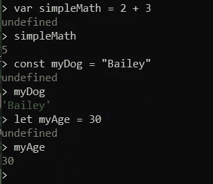
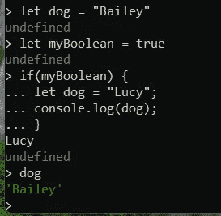
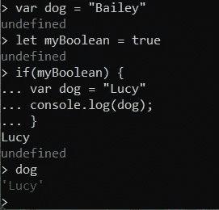
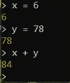
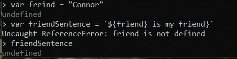
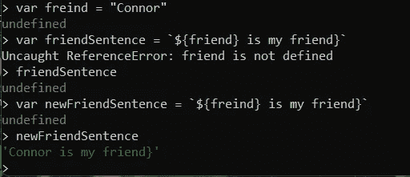
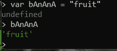

# Const myFirstJavascriptBlog = "声明变量"

> 原文：<https://blog.devgenius.io/const-myfirstjavascriptblog-declaring-variables-38b30c4958fa?source=collection_archive---------12----------------------->

当我开始写这篇博文时，我感到不知所措。当我觉得自己所知甚少的时候，被要求写一些关于 JavaScript 的东西是令人畏惧的。所以我决定涵盖我对最简单概念的最基本理解。

**声明变量**

在我看来，JavaScript 中最简单的概念就是声明变量。我会把声明变量描述为给数据或值分配一个非常具体的单词或短语。我们可以通过使用关键字*让*、*变量*或*常量来做到这一点。*我们使用这些关键字，方法是在它们后面输入任何我们想称之为变量的名字。我们使用*赋值操作符* ( *=)* 将新变量赋给我们选择的任何数据。我们可以把变量赋给一些非常简单的东西，比如一个短语或者数学等式。或者更复杂的东西，比如 JavaScript 函数。

简单变量声明的示例

**使用不同的关键字**

用不同的关键字声明变量会导致 JavaScript 中不同的功能。用 *const* 关键字声明变量意味着变量不能改变，即变量是*常量*。在上面的例子中，我使用了 *const* 关键字来给我的狗命名，因为它永远不会改变。当我们用 *let* 关键字声明一个变量时，赋给变量的值可以改变。我在指定年龄时使用了*字母*关键字，因为每年我都会长大一岁。现在，我可以编写一个函数，每年给 myAge 变量加 1，而不必手动更改分配给该变量的数据(或值)。*让*和 *const* 关键字声明*块作用域*的变量。这意味着变量在定义它们的代码块中是可用的。我认为用一个例子来说明这一点是最容易的。

在这个例子中，我给变量 dog 赋予了两个不同的值。如果我在 If 语句中 console.log 我的狗变量的值，它会正确地记录狗的名字 Lucy。然而，一旦我在 if 语句之外调用 dog，dog 的值仍然赋给 Bailey。在 if 语句的代码块中，我给变量赋了一个值，即使两个变量同名，它也不会在代码块之外改变变量的值。

在 JavaScript 中声明变量最古老的方法是使用关键字 *var* 。与 *const* 和 *let* 相反， *var* variable 关键字为非块范围的变量赋值。我认为有一个例子可以很好地说明这一点。

使用与我们之前的例子相同的值，我们看到用 *var* 而不是 *let* 声明变量的结果。现在，在 if 语句之外声明的 dog 变量被重新分配了我们在 if 语句中声明的 dog 变量的值。它没有在 if 语句外打印 Bailey，而是再次打印 Lucy。

**不使用任何关键字**

在 JavaScript 中给变量赋值的第四种方法是根本不使用关键字。我们只需要使用*赋值操作符* (=)。这创建了一个*未声明的变量。据我所知，我们不想这样分配变量。但这里有一个如何做的例子:*

又是一个非常简单的例子

**命名变量时要记住的事情**

在命名变量时，有一些重要的事情要记住。拼写非常重要。编写 JavaScript 时没有自动更正功能。一个简单的例子是，当您实际上想将变量命名为“朋友”时，键入“朋友”。

我想在 friendSentence 中使用 friend，但是我没有拼写 friend，所以 JavaScript 没有找到我要找的东西

稍后，当我想使用“friend”变量时，它将返回 undefined，因为我从一开始就拼错了变量名。如果我继续拼错变量，而试图使用它，我们不会遇到任何问题。

在这里，我继续将 friend 拼错为 freind，但是由于我的一致性，JavaScript 知道在 newFriendSentence 中应该做什么

这是可行的，但是对于最初编写 JavaScript 的人和试图修改或阅读它的人来说，这显然会造成混乱。上面的例子还演示了*标识符*(又名变量名)是大小写特定的。我的 newFriendSentence 变量使用了 camelCase。除了第一个单词，我在每个单词的开头都用大写字母。另一个标准做法是在*标识符*的单词之间使用下划线(_)。在这种情况下，我可以将变量声明为 new_friend_sentence。通过我在熨斗学校的短暂学习，我发现驼色更常见，这也是我更喜欢的。值得注意的是，这些只是命名标识符的行业标准。JavaScript 并不介意我们如何拼写或使用大写。只要我继续像第一次赋值变量时一样输入单词，JavaScript 就会知道该做什么。

没有人想输入或阅读香蕉，但 JavaScript 并不介意

除了我上面提到的规则之外，在命名*标识符*(变量名)时还有其他通用规则，包括:

1.  可以包含字母、数字、下划线和美元符号。
2.  可以以字母、$或 _
3.  不能包含 JavaScript 保留字或关键字(例如，我们不能将变量命名为 constlet；)

总之，在 JavaScript 中有四种方法来声明变量:

1.  使用关键字*var*(var favorite color = " green "；)
2.  使用关键字*const*(const dog = " Bailey)；)
3.  使用关键字*让*(让 number of dogs = 2；)
4.  没有关键字，仅使用赋值运算符(x = 5)

在声明变量时有一些通用规则要遵循，使用这些不同的关键字会在 JavaScript 中产生不同的功能。

谢谢你通读了我的第一篇博文，我希望它不会太痛苦。就像写 JavaScript 一样，通过练习，我会越来越擅长写博客。