# 如何创建 Apple Card 支付拨号——第 3 部分

> 原文：<https://blog.devgenius.io/constraint-the-thumbs-center-to-it-s-super-view-how-to-create-an-apple-card-payment-dial-part-3-eb1e670ec49c?source=collection_archive---------20----------------------->

**用户交互和事件处理。**

在[第一部分](https://medium.com/@hayder_41070/how-to-create-an-apple-card-payment-dial-bdbae4017c21)中，我们设计了基本接口。在《T21》第二部分中，我们开发了一种弯曲文本的方法。在这一部分中，我们将了解如何与表盘互动。

让我们从在表盘上添加一个拇指开始。打开 **PaymentDialView.xib** 在顶层添加一个子视图，使其成为最前面的视图，称之为*缩略图视图*。

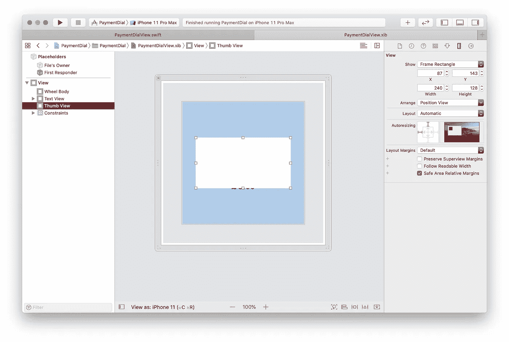

添加宽度和高度约束，将其值设置为 56。

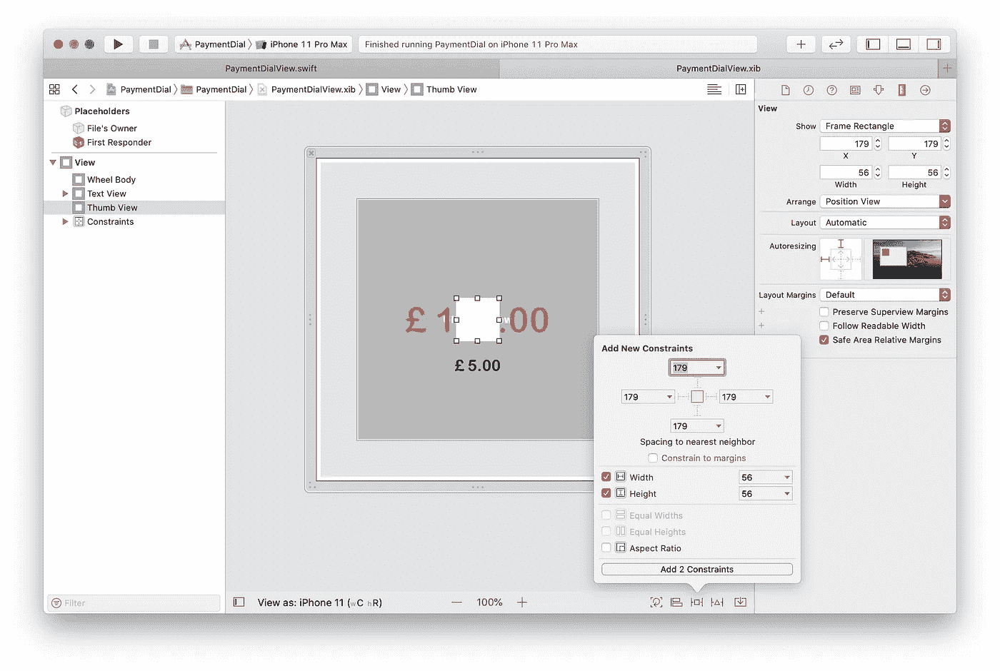

将拇指的中心约束到它的超级视图。

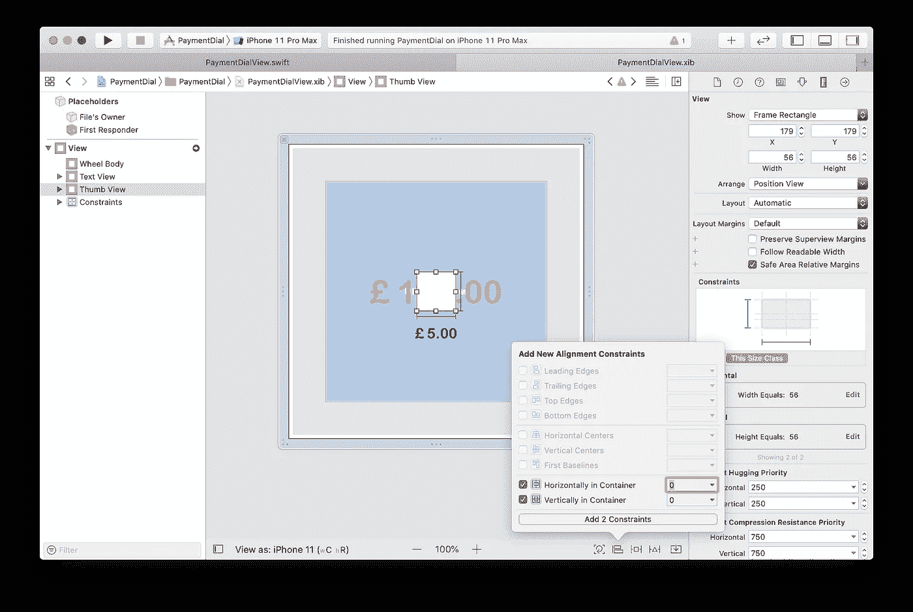

回到`PaymentDialView`，添加下面的`IBOutlet`并连接。

将`thumbCenterXConstraint`连接到*界面生成器*中标有“Thumb View.centerX = centerX”的顶视图约束，如下所示:

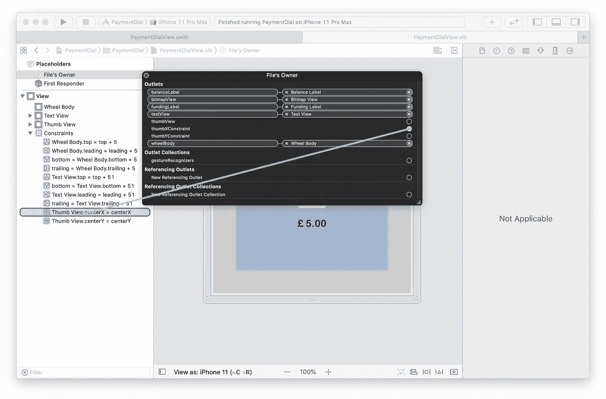

以类似的方式将`thumbCenterYConstraint`连接到“Thumb View.centerY = centerY”。

在`commonInit()`中添加一个名为`setupThumb()`的新功能，我们将设置拇指的圆角半径、边框并给它添加阴影。

当我们打开 **Main.storyboard** 时，我们可以直接在*界面构建器*中看到更改的结果。我们应该看到我们的拇指在表盘中间。我们需要它在边缘，让我们现在修复它。

我们希望刻度盘位于由`dialBody`和`textView`形成的边框的中心。我们不需要每次都计算这个距离，只需要在视图的约束更新的时候。我们将把这个值存储在一个新变量中，这个变量只在`updateConstraints()`中更新。

`distanceFromCenter`是`textView`的半径和`thumbView`的半径之和减去拇指的边框宽度。
将`thumbCenterXConstraint`设置为`distanceFromCenter`将产生以下结果:

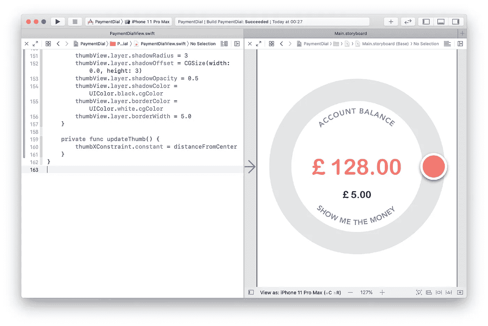

你会注意到我们把它移到了一个新的函数中，这个函数在`updateConstraints`中被调用，我们很快就会在其他地方使用它。让我们也将`thumbCenterYConstraint`设置为`distanceFromCenter`，我们最终得到:

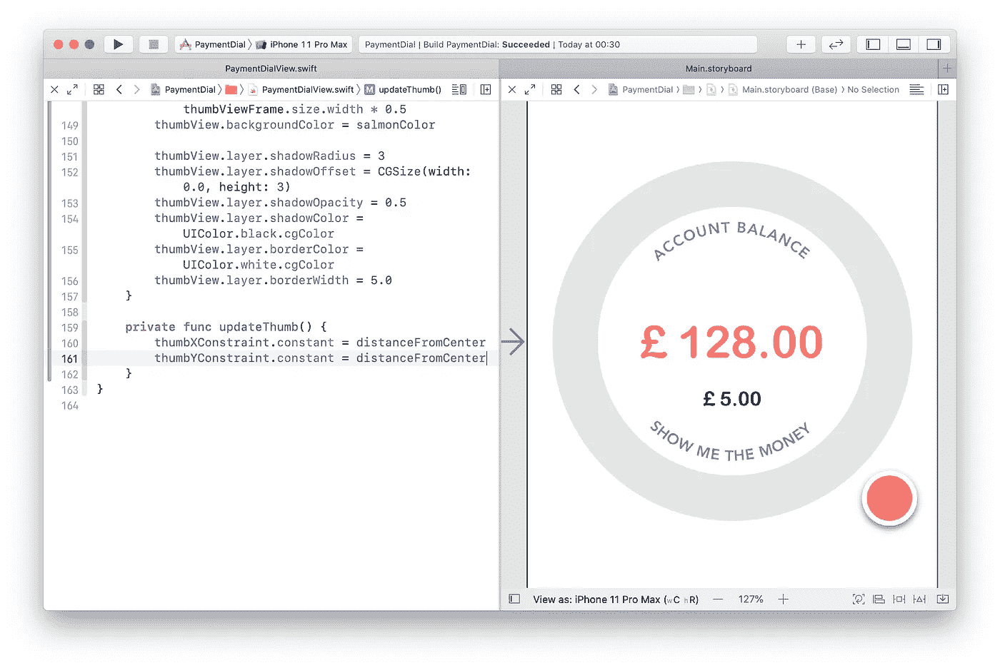

不是我们想要的地方！为了解决这个问题，我们需要使用一些基本的三角学来寻找圆上的点。

让我们声明一个新的变量`angle`,它将保存从我们拇指中心到刻度盘中心的线的角度。

我们现在可以像这样更新拇指中心约束:

如果我们设定角度= -。pi/4.0，我们可以在下图中看到，拇指停留在由`dialBody`和`textView`形成的边界构成的圆内。

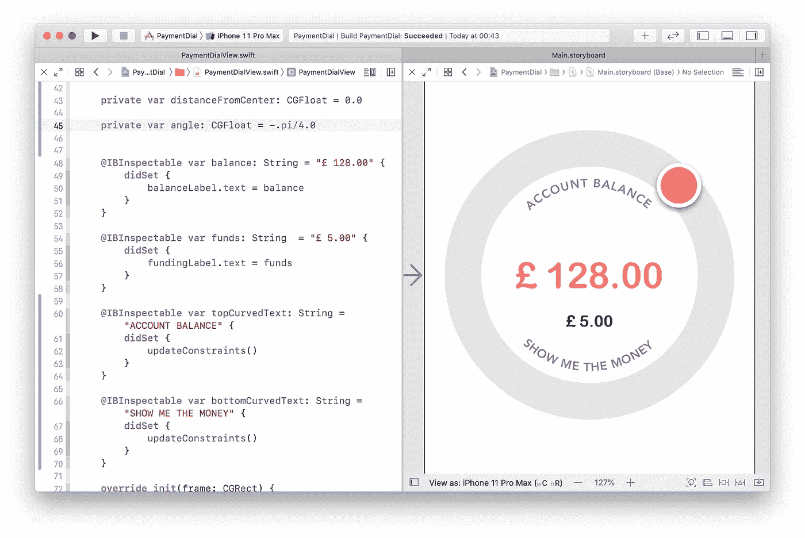

# 与拇指互动

为了与我们的拇指互动，我们将添加一个平移手势。转到 *PaymentDialView.xib* 并将 **UIPanGestureRecognizer** 拖动到左侧的**文档轮廓**窗格。
右键单击*缩略图*，拖动**手势识别器**出口到**平移手势识别器**对象，如下图所示。

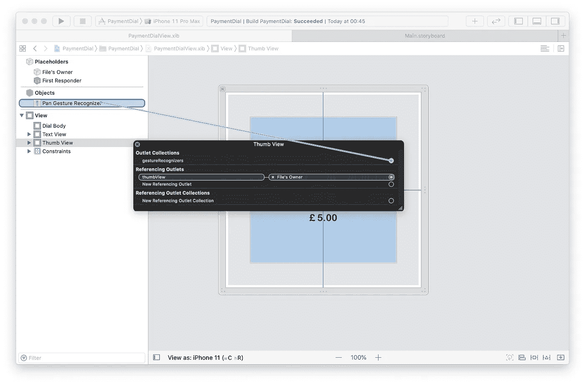

在 **PaymentDialView.swift** 中为我们的平移手势添加一个`@IBAction`。

在 **PaymentDialView.xib** 中将手势识别器的**发送动作**连接到**文件的所有者** `thumbViewPanned()`

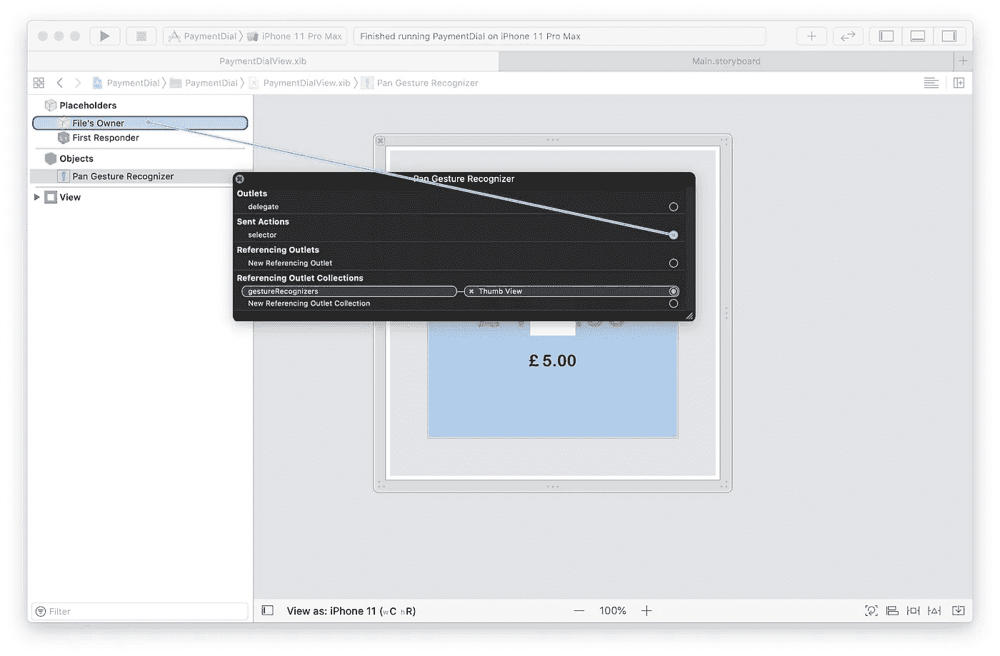

在 **PaymentDialView.swift** 中，将以下内容添加到`thumbViewPanned`:

上面的函数，是平移相对于表盘中心的位置，这样我们就可以找到生命点和圆心之间的直线。然后，我们使用 [atan2](https://en.wikipedia.org/wiki/Atan2) 找到直线与 x 轴的夹角，以更新我们的`angle`变量。一旦我们有了角度，我们可以更新我们的拇指约束。

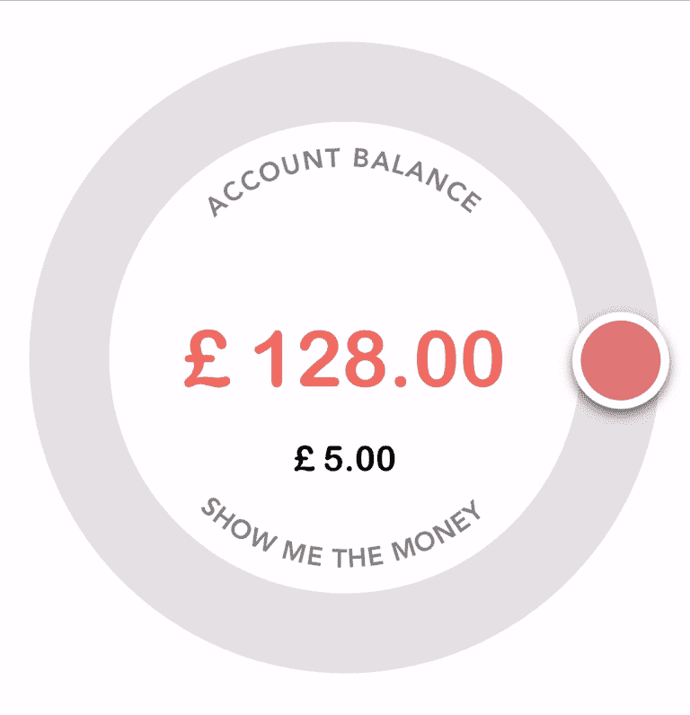

# 楔子

在苹果牌表盘上，12 点钟的位置，有一个半圆，姑且称之为楔形。它限制了拇指的活动，所以它不能通过它。让我们将它添加到我们的视图中。

转到 *PaymentDialView.xib* ，在*表盘主体*和*文本视图*之间添加一个视图。给它起个名字**楔形容器**。
选择**楔形容器**和**缩略图**并将其约束设置为*等宽*和*等高*。

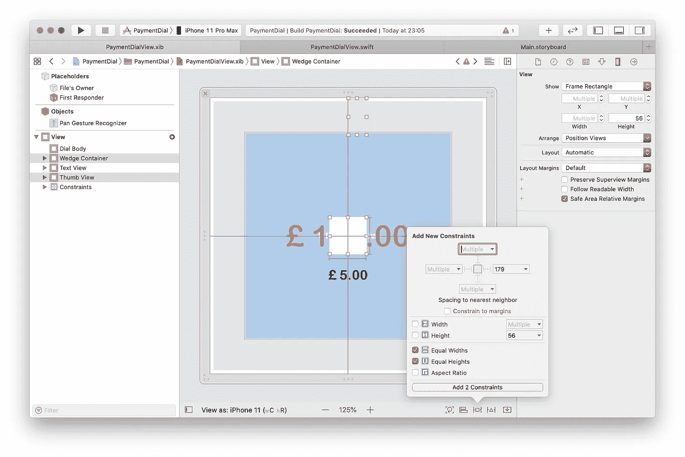

取消选择**缩略图视图**并打开右侧**检查器**窗格中的**尺寸**检查器。在*水平*约束部分的“等宽:缩略图”上点击**编辑**。将**乘数**设置为 2。这将使**楔形容器**的宽度为**缩略图**宽度的一半。

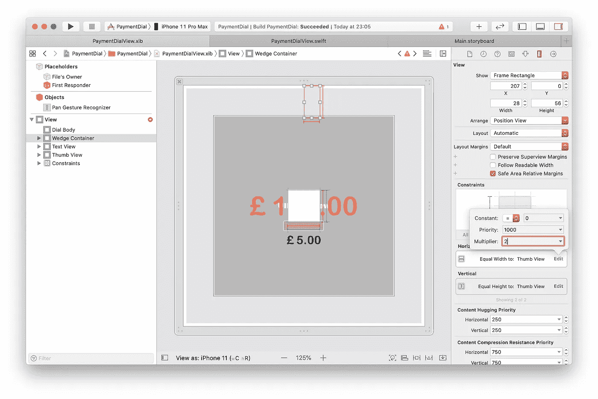

向**楔形容器**添加与其超级视图相关的顶部和前导约束。

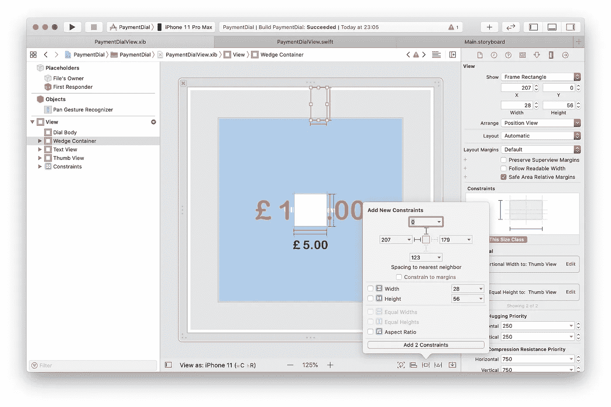

回到右侧**检查器**窗格中的**尺寸**检查器，双击*水平*约束部分中的“行距为:超级视图”。在*领先对正约束*部分，将*第二项*改为**超级视图。将 X** 居中，并将**常量**值更改为 0。

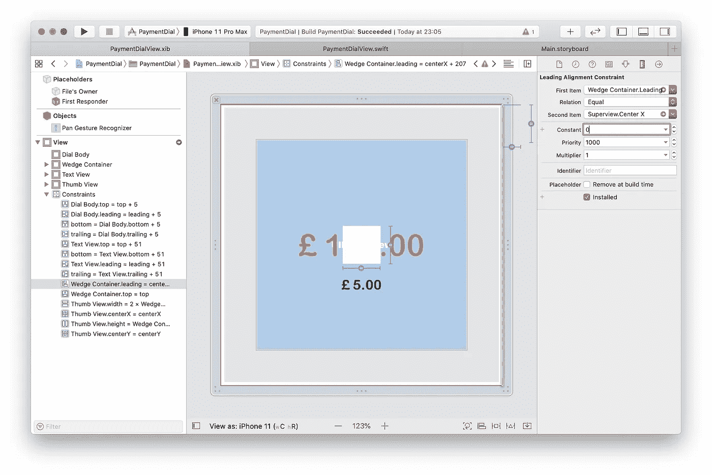

在**属性**检查器中，将**楔形体容器**的背景色设置为**透明色**并选择**剪辑到边界**。

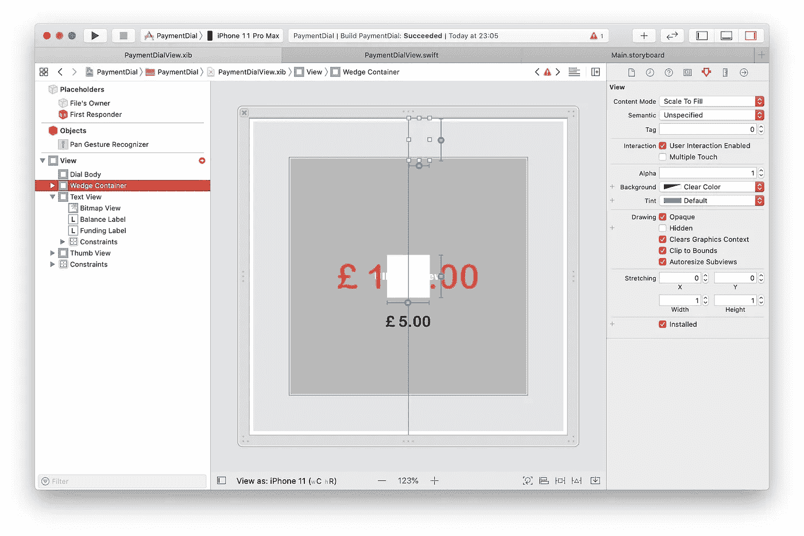

在**楔形容器**内添加一个子视图，命名为**楔形视图**。选择**楔形容器**和**缩略图**以及*等宽*和*等高*的约束。

取消选择**缩略图视图**，在**楔形视图**仍被选中的情况下，添加值为 0 的顶部和尾部约束。将其背景颜色设置为与**表盘主体**相同的颜色。

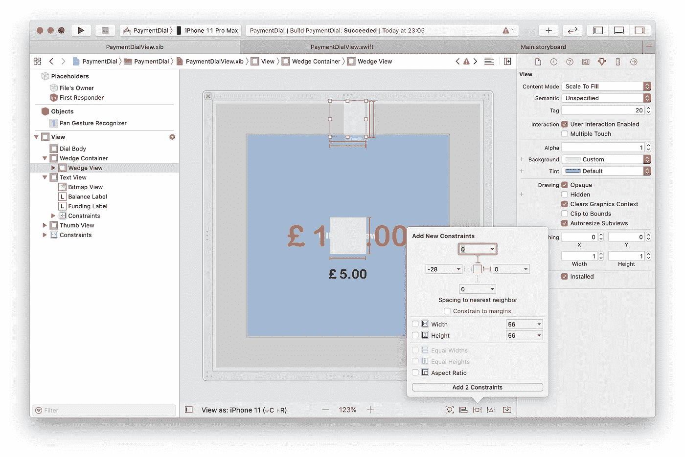

在 **PaymentDialView** 中为**楔形视图**创建一个`IBOutlet`并连接。

我们现在需要设置**楔形视图**的图层边框颜色、宽度和圆角半径属性，我们将在代码中完成，并将该函数添加到我们的`commonInit()`方法中。

由于**楔形视图**的超级视图是**楔形视图**的一半宽度，它将为我们裁剪视图，只渲染半个圆，给我们我们想要的效果。

要查看结果，只需打开 **Main.storyboard** 并在*界面构建器*中实时查看。

我想借此机会说*我真的很喜欢界面构建器*。

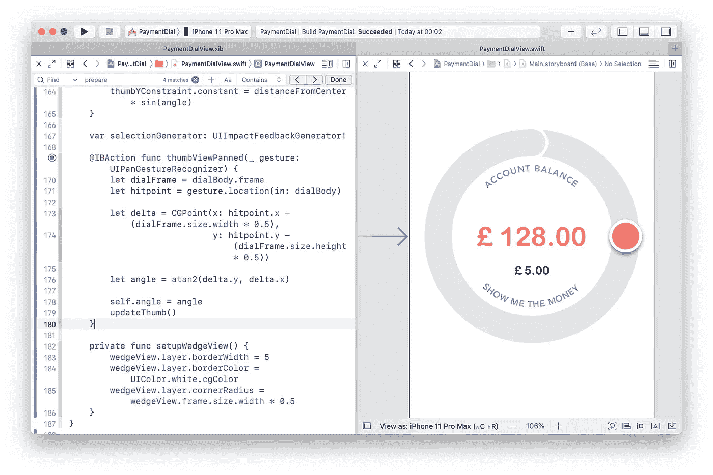

# 表盘的标记

Apple Card 表盘上有 4 个标记，当用户到达一个标记时，表盘的边框会改变颜色。我们稍后会谈到颜色变化，但是现在，让我们添加标记。我们在这里要发疯了，在代码中添加标记，而不是界面构建器，更准确的位置，我们可以通过它们循环。
我创建了一个名为 MarkerView 的简单视图，它看起来是这样的:

在 **PaymentDialView.swift** 中像这样声明一个名为`markers`的变量:

创建一个名为`addMarkers()`的函数:

从`commonInit()`内部调用它，然后创建另一个名为`updateMarkers()`的函数:

从`updateConstraints()`内部调用这个函数。
检查 **Main.storyboard** ，表盘视图现在应该是这样的:

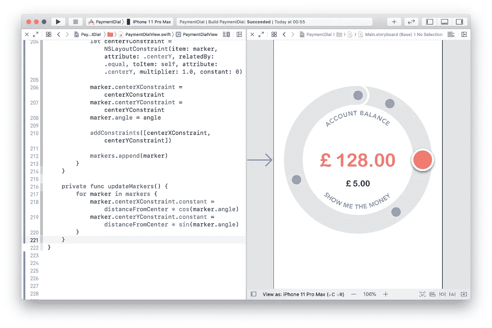

现在我们有了一个视觉指示器来指示拇指应该停在哪里，还有标记，让我们让它实际停在那里。

# 起点

拇指应该从第一个标记开始。让我们覆盖`didMoveToSuperview()`来设置第一次启动时的拇指位置。

添加上述方法将产生以下效果:

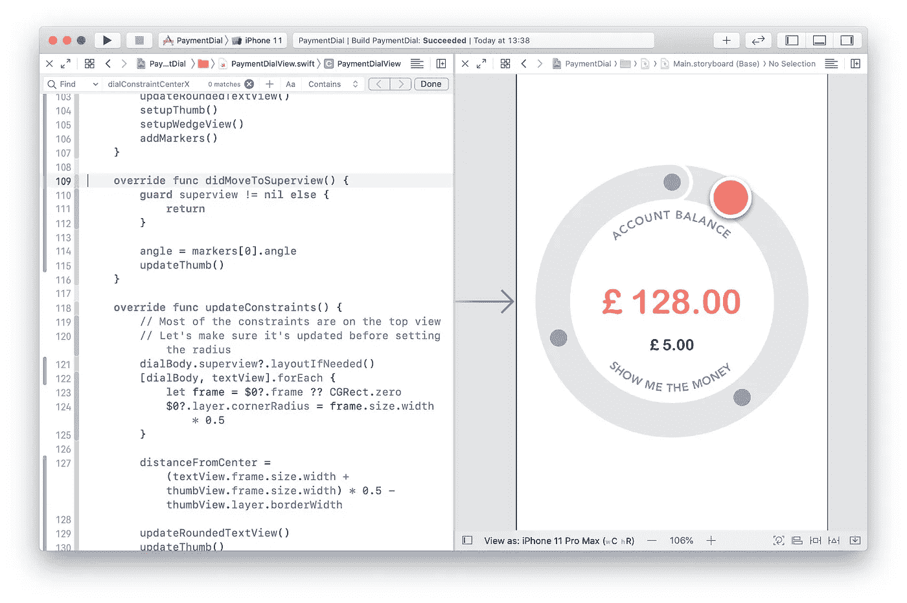

# 限制运动

为了限制拇指的移动，我们需要跟踪拇指最后在哪个象限。为了找到拇指所在的象限，我们需要找到平移视图时产生的`angle`的余弦和正弦三角函数的符号。
添加一个变量`currentQuadrant`到`PaymentDialView`类:

我们去`thumbViewPanned()`更新一下:

运行应用程序，拇指的活动范围会受到限制。

# 对齐标记

当拇指靠近一个标记时，让它捕捉到位置。我们通过检查生成的角度是否接近其中一个标记来做到这一点。如果是，我们将它设置为标记的角度，在代码中看起来像这样:

# 触觉反馈

最后，让我们在用户捕捉到标记时添加一些反馈。
将以下两个变量添加到类中:

在`thumbViewPanned()`中，将以下内容添加到函数顶部:

最后，我们的捕捉代码将如下所示:

`didSnap`和`shouldTriggerImapct`将确保我们每个快照仅获得一次反馈。

在下一部分中，我们将基于拇指的移动来更新表盘的 UI 元素。