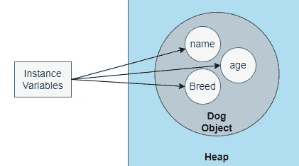
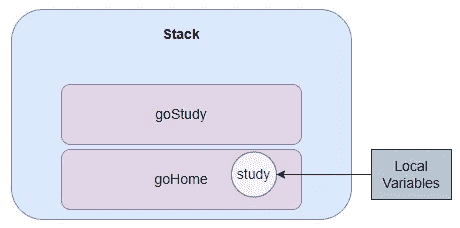
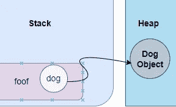
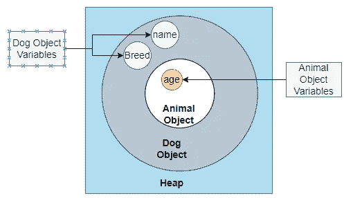
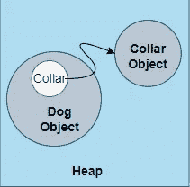
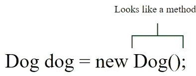

# Java 中的构造函数和垃圾收集

> 原文：<https://blog.devgenius.io/constructors-and-garbage-collection-in-java-eb945a57a826?source=collection_archive---------5----------------------->


**实例和局部变量**

实例变量是在类内部声明的，它们代表一个对象的字段，存在于它们所属的对象内部。这些对象位于垃圾回收堆中。



局部变量是在方法内部声明的变量，也可以是方法参数。局部变量是临时的，在方法执行完毕之前一直有效，这意味着局部变量在方法到达右花括号之前一直有效。

```
public int total (int num1, int num2) {
    int total = num1 + num2;
    return total;
} // The Local variables will live until the code reaches here
```

在上面的代码中，变量 total 是一个局部变量。变量 num1 和 num2 也是局部变量，因为它们是作为参数传入的。当编译器在 return 语句后点击右括号时，这些变量就会消失

方法和局部变量存在于**栈**中。当一个方法被调用时，它会到达堆栈的顶部。

```
public void goHome () {
    boolean study = gostudy();
    if (study){
        System.*out*.println("Finished studying");
    }
}
public boolean gostudy () {
    System.*out*.println("Studying");
    return true;
}
```

goHome 方法最初将进入堆栈并进行变量研究，而 goStudy 方法将位于 go home 方法之上。当 goStudy 方法执行完毕时，goStudy 方法将从堆栈中删除，然后在 goHome 方法执行完毕后，goHome 方法也将从堆栈中删除



方法存在于堆栈中，直到该方法完成其执行。堆栈顶部的方法是当前正在执行的方法。在上面给出的图像中，goStudy 方法是当前正在执行的方法。

如果有一个局部变量是一个对象，那么对该对象的引用就存储在堆栈中。

```
public void foof () {
    Dog dog = new Dog();
}
```



dog 变量将在堆栈中，并有一个对 dog 对象的引用。

当一个对象在堆中被创建时，它包含实例变量和它的超类的所有实例变量



当我们创建一个新对象时，不仅该对象的构造函数，而且该对象超类的所有构造函数都被调用。

如果狗类继承了动物类。创建新的狗对象时。编译器调用 Dog 类继承的所有构造函数。编译器将调用 Dog 类、Animal 类和 Object 类的构造函数。

这是因为子类可能依赖于父类的某些东西。并且子类在父类之前创建是没有意义的。

如果一个对象的实例变量是对另一个对象的引用，它看起来会像这样。



实例变量 collar 将保留对 collar 对象的引用。

实例变量的寿命与对象一样长。当不再有对对象的引用时，该对象有资格进行垃圾回收。然后当 RAM 的内存变低时，垃圾收集器将清理该内存

有几种方法可以让对象符合垃圾回收的条件

*   如果引用变量超出范围。如果一个局部变量引用了一个对象，并且该局部变量的方法执行完毕，那么该局部变量将是死的。因为没有对该对象的引用，所以该对象有资格进行垃圾收集
*   如果对象的引用变量被赋给另一个对象。那么将不会有对初始对象的任何引用，因此该对象将有资格进行垃圾收集

```
Hippo hippo = new Hippo();
hippo = new Hippo();
```

*   如果引用对象被设置为空

```
Hippo hippo = new Hippo();
hippo = null;
```

当我们创建一个新对象时。我们使用 new 关键字，后跟类名和括号。这看起来像一种方法。但不是方法而是类的**构造器**。构造函数类似于方法。您调用带有 new 关键字的构造函数，后跟类名。



每个类都有一个构造函数，如果我们不写构造函数，编译器会为你写一个构造函数，这叫做默认构造函数。

```
public class Hippo {

    public Hippo(){

    }
}
```

构造函数与类同名，并且没有返回值。

构造函数在将对象赋给引用变量之前运行。构造函数通常用于给类的实例变量赋值。通过使用构造函数，我们可以确保将一个值赋给一个特定的变量。

```
public class Hippo {
    int age;
    String name;

    public Hippo(String name,int age){
        this.age = age;
        this.name = name;
    }
}
```

我们可以将值传递给构造函数，现在当我们创建一个新的河马时，它看起来像这样。

```
Hippo hippo = new Hippo("hippo",4);
```

但是如果我们不知道传递什么值给构造函数，我们就不能创建对象，为了解决这个问题，我们可以有多个构造函数。我们可以有一个带参数的构造函数，这样我们就可以传递一个值，也可以有一个不带参数的构造函数，这样如果我们不知道传递给构造函数什么，我们就可以创建一个对象。

```
public Hippo(String name,int age){
    this.age = age;
    this.name = name;
}
public Hippo(){

}
```

只有当我们没有定义构造函数时，编译器才会为我们创建默认的构造函数。如果我们创建了一个构造函数，编译器不会为我们创建另一个构造函数。

当我们创建多个构造函数时，我们应该确保每个构造函数的参数是不同的。如果我们有两个参数类型相同的构造函数，我们必须改变参数的顺序

```
public Hippo(){}
public Hippo(int age){}
public Hippo(int age,String name){}
public Hippo(String name,int age){}
There are some instances where an constructor without any parameters does not make sense.
```

如果我们有一个颜色类，它有一个如下所示的构造函数，可以得到 RGB 值。有道理。但是如果我们有一个没有参数的构造函数，这个类就不会知道颜色是什么，没有参数的构造函数也没有什么意义。

```
Color c = new Color(3,45,200);
```

如果你想调用超类的构造函数，你可以使用 super 关键字。Super 应该是构造函数的第一行，我们也可以将参数传递给超级构造函数。

```
public Hippo(){
    super();
}
```

类似默认构造函数如果我们不使用 super 调用超构造函数，编译器会为我们调用超类构造函数。当编译器调用超类构造函数时，它调用的是超类的默认构造函数，它没有任何参数。

如果你想调用同一个类的另一个构造函数，你可以使用 this 关键字。与 super 类似，这应该是构造函数中的第一行。不能在同一个构造函数中同时使用 super 和 this。

```
public Hippo(){
}

public Hippo(int age){
    this();
}
```

你可以通过查看我的 Java 入门列表，点击[这里](https://medium.com/@shashane.ranasinghe/list/introduction-to-java-9eb6c894d19c)来了解更多的 Java 知识

**参考文献**

1.  *凯西·塞拉和伯特·贝茨。2005.第一版 Java，第二版。美国奥赖利&联合公司。*