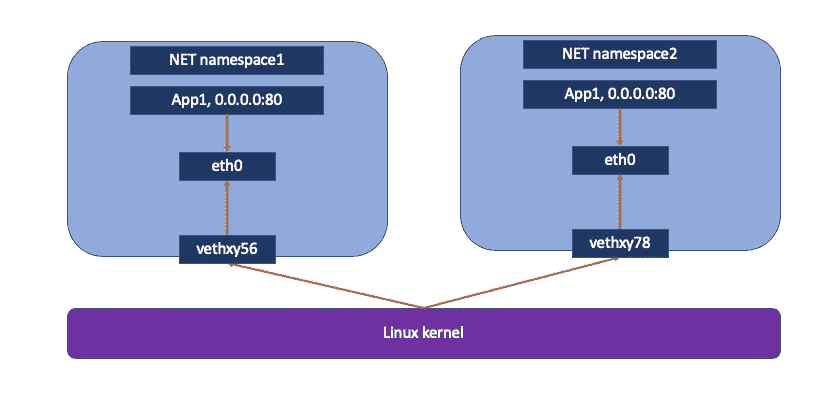
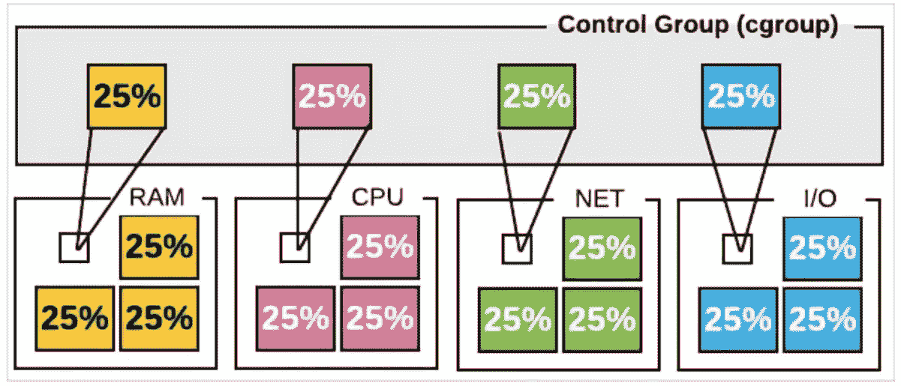

# 容器—名称空间介绍

> 原文：<https://blog.devgenius.io/container-namespace-introduction-6a1e26f8707a?source=collection_archive---------3----------------------->

## 常见容器名称空间介绍


# 什么是名称空间

我们都知道操作系统使用虚拟内存技术，让每个用户进程都认为自己拥有所有的物理内存，这就是操作系统对内存的虚拟化。

还有，通过分时调度系统，可以公平地调度和执行每个进程，即每个进程都可以获得 CPU，使每个进程在进程活动期间都认为自己拥有所有的 CPU 时间，这就是操作系统对 CPU 的虚拟化。

但是，以上两种虚拟化技术只是虚拟化了**【物理资源】**。其实在一台主机上，操作系统中有很多**【非物理资源】**，比如用户权限、网络协议栈资源、文件系统挂载路径资源等。通过 Linux 的**命名空间**特性，这些非物理的全局资源可以被虚拟化。

根据 wiki **的说法，名称空间**是 Linux 内核的一个特性，它对内核资源进行分区，使得一组进程看到一组资源，而另一组进程看到一组不同的资源。

该功能通过为一组资源和进程分配相同的命名空间来工作，但是这些命名空间引用不同的资源。名称空间是 Linux 上容器的一个基本方面。


# 名称空间如何工作

名称空间是 Linux 系统的基本概念。它是在内核层实现的。

*   每个容器运行在相同的容器运行时进程中，并共享相同的主机系统内核。
*   每个容器都必须有一个类似于虚拟机的隔离运行空间，但容器技术实现了一个进程内运行指定服务的运行环境，还可以保护主机内核免受其他进程的干扰和影响，如文件系统空间、网络空间、进程空间等。
*   名称空间目前主要通过以下技术在容器运行空间中相互隔离:


# 容器中使用的常见名称空间

## MNT 命名空间

`MNT namespace`提供磁盘挂载点和文件系统的隔离:

*   每个容器必须有自己独立的根文件系统和独立的用户空间
*   它为系统上的不同进程提供了拥有主机文件系统的不同视图的机会


使用带有`CLONE_NEWNS`标志的`clone`或`unshare`系统调用创建一个新的挂载名称空间。创建新的装载命名空间时，其装载列表初始化如下:

*   如果名称空间是使用`clone`创建的，那么子名称空间的挂载列表是父进程的挂载名称空间中的挂载列表的副本。
*   如果名称空间是使用`unshare`创建的，那么新名称空间的挂载列表是调用者以前的挂载名称空间中的挂载列表的副本。

**演示**

在新的`mount`名称空间中运行 shell

```
$ unshare --mount
```

创建一个`/tmp/mnt`目录

```
$ mkdir /tmp/mnt
$ ls /tmp/mnt
```

坐骑`/usr/local/bin`

```
$ mount --bind /usr/local/bin /tmp/mnt/
$ ls /tmp/mnt/
2to3-3.10  idle3.10  pip3.10  pydoc3.10  python3.10  python3.10-config
$ findmnt  | grep "tmp/mnt"
└─/tmp/mnt                            /dev/xvda1[/usr/local/bin]                         xfs        rw,noatime,attr2,inode64,logbufs=8,logbsize=32k,noquota
```

出口

```
$ exit
$ ls /tmp/mnt/pydoc3.10
ls: cannot access /tmp/mnt/pydoc3.10: No such file or directory
```

## IPC 名称空间

IPC 名称空间用于隔离 System V IPC 对象和 POSIX 消息队列。用于实现这一点的克隆标志是`CLONE_NEWIPC`。每个 IPC 名称空间都有自己的一组 System V IPC 标识符和自己的 POSIX 消息队列文件系统。

**在一个 IPC 命名空间中创建的对象对作为该命名空间成员的所有其他进程可见，但对其他 IPC 命名空间中的进程不可见**。


**演示**

列出当前 IPC 名称空间

```
$ lsns | grep ipc
4026531839 ipc       112     1 root   /usr/lib/systemd/systemd --switched-root --system --deserialize 21
```

创建 IPC 命名空间:

```
$ unshare --ipc
$ lsns | grep ipc
4026531839 ipc       110     1 root   /usr/lib/systemd/systemd --switched-root --system --deserialize 21
4026532281 ipc         3 29447 root   -bash
```

## UTS 命名空间

UTS 命名空间用于隔离系统中与`uname`系统调用相关的两个特定元素。UTS(UNIX Time Sharing)名称空间是以用于存储由`uname`系统调用返回的信息的数据结构命名的。

具体来说，UTS 名称空间隔离了主机名和 NIS 域名。它使容器能够拥有自己的主机名，该主机名独立于主机系统和其上的其他容器。


**演示**

创建 UTS 命名空间:

```
$ unshare --fork --mount --uts /bin/bash# Re-associate socket to new namespace
$ mount -t tmpfs tmpfs /run $ hostnamectl set-hostname test.com
Failed to create bus connection: No such file or directory
$ hostanme
cloud-dev.com
$ hostname test.com
$ hostname
test.com
```

现在，如果您使用新终端登录服务器:

```
$ ssh cloud-dev
$ hostname
cloud-dev.com
```

## PID 命名空间

PID 名称空间隔离了进程 ID 号空间，这意味着不同 PID 名称空间中的
进程可以具有相同的 PID。PID 名字空间允许容器提供诸如暂停/恢复容器中的一组进程以及将容器迁移到新主机的功能，同时容器内的进程保持相同的 PID。


**演示**

检查当前 PID

```
$ echo $$
28877
```

如您所见，当前的`Bash` shell 具有 PID 28877，让我们创建一个新的 PID 名称空间。

```
$ unshare --pid -f
$ echo $$
1
$ lsns | grep pid
4026531836 pid       110     1 root   /usr/lib/systemd/systemd --switched-root --system --deserialize 21
4026532281 pid         3 29479 root   -bash
```

## Net 命名空间

网络命名空间可以虚拟化网络栈，每个网络命名空间都有自己的资源，比如网络接口、IP 地址、路由表、隧道、防火墙等。例如，由`iptables`添加到网络名称空间的规则将只影响进出该名称空间的流量。

每个容器都类似于一个虚拟机。它有自己的网卡、监听端口、TCP/IP 协议栈等。比如 Docker 运行时使用网络命名空间启动一个`vethX`接口，这样你的容器就会有自己的桥 IP 地址，通常是`docker0`，`docker0`本质上是一个 Linux 虚拟网桥。



**演示**

创建网络命名空间

```
unshare --net=/var/run/netns/testns
```

列出当前网络命名空间

```
$ lsns | grep net
4026532088 net       113     1 root   /usr/lib/systemd/systemd --switched-root --system --deserialize 21
4026532282 net         3 30639 root   -bash$ ip netns
testns
```

检查新的名称空间接口

```
$ ip netns exec testns ip addr
1: lo: <LOOPBACK> mtu 65536 qdisc noop state DOWN group default qlen 1000
    link/loopback 00:00:00:00:00:00 brd 00:00:00:00:00:00
```

## 用户名称空间

用户名称空间隔离与安全相关的标识符和属性，特别是用户 id 和组 id、根目录、键和功能。在用户名称空间内部和外部，进程的用户和组 id 可以不同。

特别是，一个进程可以在用户名称空间之外拥有一个普通的非特权用户 ID，同时在名称空间之内拥有一个用户 ID 0；换句话说，该进程对用户名称空间内的操作具有完全特权，但对名称空间外的操作没有特权。


**演示**

检查当前用户名称空间

```
$ lsns | grep user
4026531837 user      116     1 root   /usr/lib/systemd/systemd --switched-root --system --deserialize 21
```

创建一个新的用户命名空间并附加它

```
$ unshare --map-root-user --user --fork
$ lsns | grep user
4026531835 cgroup      4 30413 root unshare --map-root-user --user --fork
4026531836 pid         4 30413 root unshare --map-root-user --user --fork
4026531838 uts         4 30413 root unshare --map-root-user --user --fork
4026531839 ipc         4 30413 root unshare --map-root-user --user --fork
4026531840 mnt         4 30413 root unshare --map-root-user --user --fork
4026532088 net         4 30413 root unshare --map-root-user --user --fork
4026532281 user        4 30413 root unshare --map-root-user --user --fork
```

尝试以新 root 用户的身份更新主机名

```
$ id
uid=0(root) gid=0(root) groups=0(root)
$ hostname test.com
hostname: you must be root to change the host name
```

## Linux 控制组(Cgroups)

在 Linux 中，`Cgroups`是由 Linux 内核提供的特殊机制，它允许我们为一个进程或一组进程分配各种资源，如处理器时间、每组进程的数量、每控制组的内存量或这些资源的组合。

与流程类似，`Cgroups`是分层组织的，子`cgroups`从其父级继承一组特定的参数。`cgroups`与正常流程的主要区别在于，许多不同层次的控制组可能同时存在，而正常流程树总是单一的。

在容器中，如果不对它施加任何资源限制，宿主将允许它占用无限量的内存空间。有时候程序会因为代码 bug 一直申请内存，直到主机内存被占用。

为了避免这样的问题，主机有必要限制容器的资源分配，如 CPU、内存等。`Cgroups`主要功能是限制一个进程组可以使用的资源上限，包括 CPU、内存、磁盘、网络带宽等。此外，可以对进程进行优先级排序，并且可以执行暂停和恢复进程之类的操作。



图片来自 [LinuxAcademy](http://linuxacademy.com)