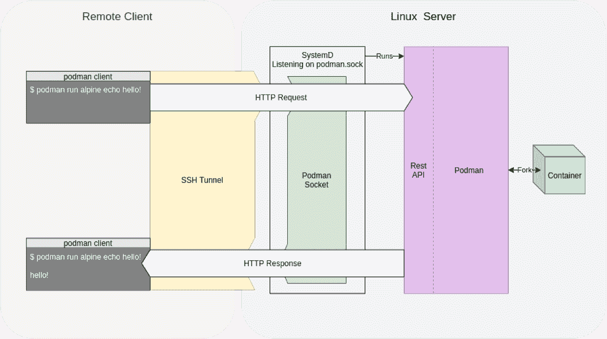
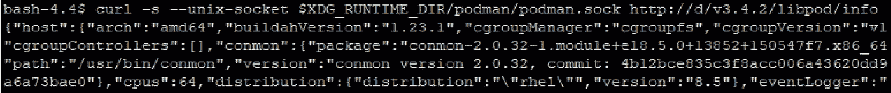
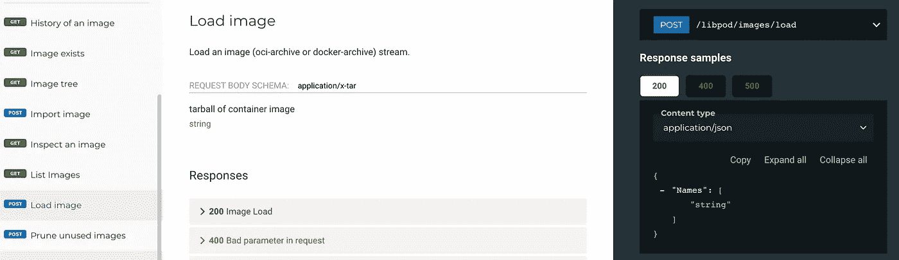
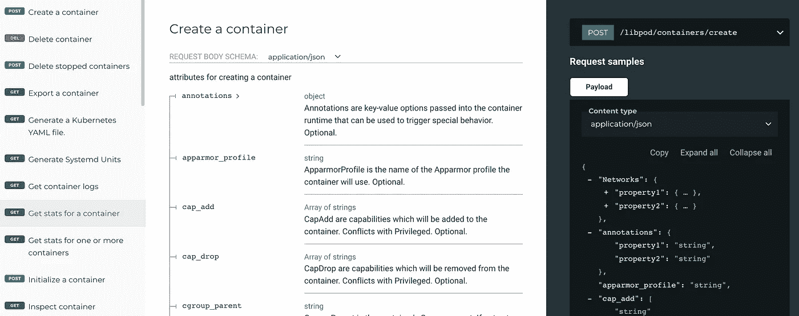

# 带有 Restful API 的容器远程

> 原文：<https://blog.devgenius.io/container-remote-with-restful-api-964fb626af64?source=collection_archive---------10----------------------->

## 通过 HTTP 调用 Podman 或 docker 引擎

你是否考虑过执行容器操作，比如启动容器，远程提取容器图像？你可能会说我们有 Kubernetes API。它有控制平面，支持 restful API。然而，许多公司可能只有码头工人或搬运工。此外，如果您希望在只有 docker 或 podman 的情况下从一个容器中启动容器，该怎么办？你可能会在 Docker 里说 [Docker，在 Podman](https://docs.gitlab.com/ee/ci/docker/using_docker_build.html) 里说 [Podman。但是，自动化程度可能不是很高，因为您可能需要在 shell 会话中调用 docker、podman cli。](https://www.redhat.com/sysadmin/podman-inside-container)

本文介绍了 Podman restful API，它类似于 Kubernete API 和 podman remote 提供的控制平面，后者是通过 restful API 与 Podman 引擎交互的 podman 客户端。

# 波德曼 Restful API

由 podman 系统服务提供的 REST API 被分成两部分:一个为 Docker v1.40 API 提供支持的兼容层，以及一个 Podman-native Libpod 层。该架构是:



在下面的文章中

[](https://www.redhat.com/sysadmin/podman-clients-macos-windows) [## 适用于 macOS 和 Windows 的 Podman 远程客户端

### 核心的 Podman 运行时环境只在 Linux 操作系统上运行。其他操作系统可以使用远程客户端…

www.redhat.com](https://www.redhat.com/sysadmin/podman-clients-macos-windows)  [## 波德曼

### podman-system-service -运行 API 服务 podman 系统服务命令创建一个监听服务，它将…

docs.podman.io](https://docs.podman.io/en/latest/markdown/podman-system-service.1.html) 

与 Podman restful API 交互的最常见方式是通过 unix 套接字或 tcp。

## Unix 套接字

使用默认套接字运行 API 监听 5 秒钟。

```
# A value of 0 means no timeout, therefore the session will not expire
podman system service --time 5
```

还可以使用 systemd 来激活 Podman API 套接字。

[](https://access.redhat.com/documentation/en-us/red_hat_enterprise_linux/8/html/building_running_and_managing_containers/assembly_using-the-container-tools-api_building-running-and-managing-containers) [## 第十八章。使用容器工具 API Red Hat Enterprise Linux 8 | Red Hat 客户门户

### Red Hat 培训课程适用于 RHEL 8。新的基于 REST 的 Podman 2.0 API 取代了旧的远程 API，适用于…

access.redhat.com](https://access.redhat.com/documentation/en-us/red_hat_enterprise_linux/8/html/building_running_and_managing_containers/assembly_using-the-container-tools-api_building-running-and-managing-containers) 

下面我从 user 下开始，socket 文件将创建在/run/user/$ UID/pod man/pod man . sock 下

```
systemctl enable --now podman.socket
systemctl start --user podman.socket
```

检查 API 版本

```
podman info --debug
```

结果

```
version:
  APIVersion: 3.4.2
```

检查 Podman restful API 信息(用上面检索到的版本替换 API 版本)

```
export XDG_RUNTIME_DIR=/run/user/$UID/
curl -s --unix-socket $XDG_RUNTIME_DIR/podman/podman.sock [http://d/v3.4.2/libpod/info](http://d/v1.0.0/libpod/info)
```



其他命令

检查图像

```
export XDG_RUNTIME_DIR=/run/user/$UID/
curl -s --unix-socket $XDG_RUNTIME_DIR/podman/podman.sock [http://d/v3.4.2/libpod/images/json](http://d/v1.0.0/libpod/info)
```

检查容器

```
export XDG_RUNTIME_DIR=/run/user/$UID/
curl -s --unix-socket $XDG_RUNTIME_DIR/podman/podman.sock [http://d/v3.4.2/libpod/containers/json](http://d/v1.0.0/libpod/info)
```

## 传输控制协议（Transmission Control Protocol）

启动 Podman 服务器

```
podman system service tcp:[::]:8080 --time 60
```

shell 会话将在那里停留 60 秒。

现在，在本地服务器上的另一个会话中，运行以下命令

```
curl -s http://127.0.0.1:8080/v3.4.2/libpod/info
```

您也可以从远程机器访问

```
curl -s http://<ip address>:8080/v3.4.2/libpod/info
```

您也可以使用 [podman 遥控器](https://github.com/containers/podman/issues/10810)来访问

```
podman --remote --url tcp://[ip address]:8080 images
```

有了 restful API，你可以用很多方式与 Podman 引擎交互，比如 curl，python，golang，javascript，比如有一个官方的 Podman 客户端 SDK。它比使用 Python subprocess.run 要好。

 [## GitHub-containers/pod man-py:pod man 的 RESTful API 的 Python 绑定

### Podman 的 RESTful API 的 Python 绑定。通过在…上创建帐户，为 containers/podman-py 的发展做出贡献

github.com](https://github.com/containers/podman-py) 

```
"""Demonstrate PodmanClient."""
import json
from podman import PodmanClient# Provide a URI path for the libpod service.  In libpod, the URI can be a unix
# domain socket(UDS) or TCP.  The TCP connection has not been implemented in this
# package yet.uri = "unix:///run/user/1000/podman/podman.sock"with PodmanClient(base_url=uri) as client:
    version = client.version()
    print("Release: ", version["Version"])
    print("Compatible API: ", version["ApiVersion"])
    print("Podman API: ", version["Components"][0]["Details"]["APIVersion"], "\n")# get all images
    for image in client.images.list():
        print(image, image.id, "\n")# find all containers
    for container in client.containers.list():
        first_name = container['Names'][0]
        container = client.containers.get(first_name)
        print(container, container.id, "\n")# available fields
        print(sorted(container.attrs.keys()))print(json.dumps(client.df(), indent=4))
```

# 运输

一般当你运行容器时，容器映像通常来自公共([https://hub.docker.com](https://hub.docker.com))或私有容器注册中心( [ACR](https://azure.microsoft.com/en-us/services/container-registry/) 、 [ECR](https://aws.amazon.com/ecr/) 、 [GCR](https://cloud.google.com/container-registry) )，映像标签通常是<容器注册中心服务器> / <映像回购> : <映像标签>的格式。然而，波德曼实际上支持更多的运输或存储。

 [## 波德曼

### 添加自定义的主机到 IP 的映射(host:ip)。格式为主机名:ip。- add-host 选项…

docs.podman.io](https://docs.podman.io/en/latest/markdown/podman-run.1.html#image)  [## 波德曼

### podman save 将图像保存到本地文件或目录。默认情况下，podman 将写入保存到 STDOUT，并且可以被重定向…

docs.podman.io](https://docs.podman.io/en/latest/markdown/podman-save.1.html) 

从上面的文章，这里是支持的传输。它支持将映像存储在目录中的使用情形(本地或附加共享)

**docker**://docker-reference(默认)存储在远程容器映像注册表中的映像引用。例如:“quay.io/podman/stable:latest”。该引用可以包括特定注册表的路径；如果不匹配，将查询 registries.conf 中列出的注册表来查找匹配的图像。默认情况下，来自 podman 登录的凭证(默认情况下存储在$ XDG _ 运行时 _ 目录/容器/auth.json)将被用来进行身份验证；否则，它会退回到使用$HOME/中的凭证。docker/config.json。

**dir** :path 一个现有的本地目录路径，将清单、层 tarballs 和签名存储为单独的文件。这是一种非标准化格式，主要用于调试或无创容器检查。

**docker-archive**:path[:docker-reference]存储在 docker 保存格式文件中的图像。docker-reference 仅在创建这样的文件时使用，并且它不能包含摘要。

**docker-daemon**:docker-reference 以 docker-reference 格式存储在 docker daemon 内部存储器中的图像。docker-reference 也可以是一个图像 ID (docker-daemon:algo:digest)。

**oci-archive** :path:给指定路径下符合“开放容器图像布局规范”的目录下的图像加标签，用标签指定。

```
podman save --format oci-archive fedora -o /tmp/fedora
podman run oci-archive:/tmp/fedora echo hello
```

然而，Podman restful API [只支持使用来自容器映像注册表](https://github.com/containers/podman/blob/main/pkg/api/handlers/utils/images.go#L67)的映像创建容器。以下文章描述了该错误

[](https://github.com/containers/podman/issues/8927) [## 无法通过 http api 问题#8927 containers/podman 从 oci-archive 创建容器

### 这是错误报告还是功能请求？(只留下一个在它自己的行)/种类错误描述我不能使用…

github.com](https://github.com/containers/podman/issues/8927) 

```
curl -d '{"image":"oci-archive:/tmp/busybox.oci"}' -H "Content-Type: application/json" --unix-socket /run/podman/podman.sock [http://localhost/v1.24/libpod/containers/create](http://localhost/v1.24/libpod/containers/create){"cause":"invalid reference format","message":"invalid reference format","response":500}
```

为了从文件夹中的 OCI 归档映像创建容器，您需要首先加载映像。

[](https://github.com/containers/podman/issues/7185) [## Podman API 不接受“docker-compose build”问题#7185 的“应用程序/tar”内容类型…

### 这是错误报告还是功能请求？(一行只留一个)/种类 bug 描述运行 docker-compose…

github.com](https://github.com/containers/podman/issues/7185) 

正确的命令是

```
curl -XPOST --unix-socket $XDG_RUNTIME_DIR/podman/podman.sock -H content-type:application/x-tar [http://d/v3.4.2/libpod/images/load](http://d/v1.0.0/libpod/info) -T /tmp/fedora
```

响应包含 docker 容器注册表。然后，您可以使用图像标签来创建容器。

# Podman restful API 参考

 [## 参考

### 编辑描述

docs.podman.io](https://docs.podman.io/en/latest/_static/api.html?version=v4.1) 

从上面来看，API 是“/libpod/images/load”，头应该是“content-type:application/x-tar”。



上面的 API 是“创建一个容器”，端点是“/libpod/containers/create”，头是“content-type:application/json”，还可以引用有效载荷，例如 command: command/entrypoint 以在容器启动时运行，image: image 标签，name:容器名等..

# 附录

波德曼遥控器

 [## 波德曼

### podman 的远程 CLI:一个简单的 pod、容器和图像管理工具。Podman (Pod 经理)…

docs.podman.io](https://docs.podman.io/en/latest/markdown/podman-remote.1.html) 

Podman restful API 示例

[](https://www.redhat.com/sysadmin/podmans-new-rest-api) [## 先睹为快:波德曼的新 REST API

### 这是你我之间的秘密，不要告诉任何人！答应吗？好吧，我向你保证，所以是这样的:有一个…

www.redhat.com](https://www.redhat.com/sysadmin/podmans-new-rest-api) [](https://www.redhat.com/sysadmin/podman-rest-api) [## 如何用 REST API 管理 Podman 中的 pod

### 两年前，在 Podman 中可以使用 REST API，现在仍然在积极地维护它，添加了新的特性…

www.redhat.com](https://www.redhat.com/sysadmin/podman-rest-api) [](https://www.redhat.com/sysadmin/podman-python-bash) [## 使用 Python 和 Bash 探索 Podman RESTful API

### 你可能听说过波德曼·V2 有一个新的 RESTful API。本文档使用代码示例演示了 API 在…

www.redhat.com](https://www.redhat.com/sysadmin/podman-python-bash) 

Docker restful API

[](https://docs.docker.com/engine/api/sdk/examples/) [## 使用 Docker 引擎 SDK 和 Docker API 的示例

### 预计阅读时间:19 分钟安装 Docker 后，您可以安装 Go 或 Python SDK，还可以试用…

docs.docker.com](https://docs.docker.com/engine/api/sdk/examples/) [](https://docs.docker.com/registry/spec/api/) [## HTTP API V2

### Docker Registry HTTP API 是一种协议，有助于将图像分发到 Docker 引擎。它相互作用…

docs.docker.com](https://docs.docker.com/registry/spec/api/) 

Docker restful API 客户端

[](https://github.com/docker/docker-py) [## GitHub-Docker/Docker-py:Docker 引擎 API 的 Python 库

### Docker 引擎 API 的 Python 库。它可以让你做 docker 命令做的任何事情，但是在 Python 内部…

github.com](https://github.com/docker/docker-py) 

波德曼中的波德曼

[](https://www.redhat.com/sysadmin/podman-inside-container) [## 如何在容器内部使用 Podman

### 从事上游容器技术的人们问得最多的话题之一是在一个…

www.redhat.com](https://www.redhat.com/sysadmin/podman-inside-container) [](https://developers.redhat.com/blog/2019/04/04/build-and-run-buildah-inside-a-podman-container) [## 在 Podman 容器中构建并运行| Red Hat Developer

### 去年圣诞节，我送给妻子一套类似俄罗斯套娃的套娃。如果你不熟悉…

developers.redhat.com](https://developers.redhat.com/blog/2019/04/04/build-and-run-buildah-inside-a-podman-container) 

波德曼将军

[](https://phoenixnap.com/kb/podman-tutorial) [## Podman 教程:如何使用图像、容器和 pod

### 简介 Podman 是一个容器引擎，用于在 Linux 上运行和管理 OCI 容器。RedHat 将其发展为…

phoenixnap.com](https://phoenixnap.com/kb/podman-tutorial)