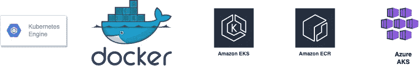
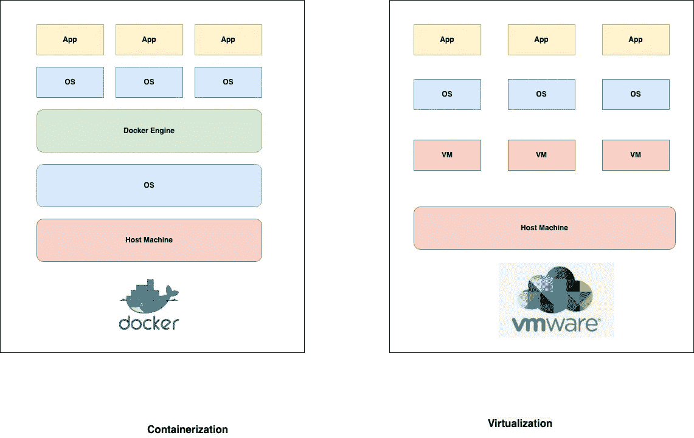
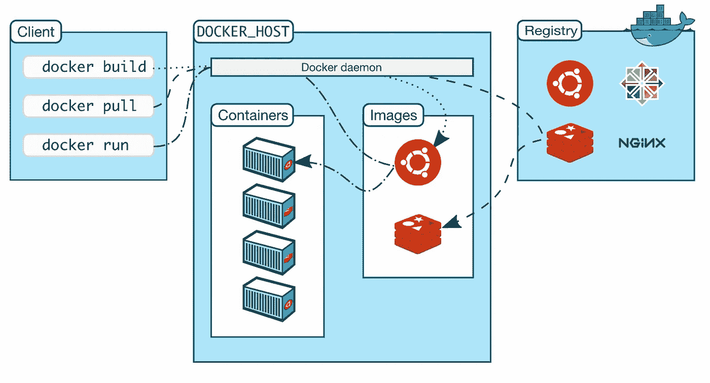

# 集装箱化

> 原文：<https://blog.devgenius.io/containerization-101-2a22fb2a539d?source=collection_archive---------1----------------------->

这篇博客是我们从零开始讨论 101 个概念的系列文章的一部分，读者的入门知识有限。这篇文章属于*中级*系列，因为它涉及理解**容器编排层**来打包、构建和部署应用程序。

101 系列中的一些早期博客如下:

[**API 101**](/api-101-773ec501b485) [**异步通信 101**](/async-communication-101-b04d5c95333a) [**负载均衡 101**](/load-balancing-101-8251350c033f)[**缓存 101**](/caching-101-634ef4f8ed1b)[**数据库 101**](/database-101-13d593ec4078)

# 什么是容器？

容器是一种封装应用程序代码的隔离方法，它的所有 ***依赖项、库、*** 框架都集成到一个部署单元中。有了统一的包模块，容器可以很容易地在操作系统和其他跨平台之间移动，因此对于最终用户来说运行起来很容易而且无缝。鉴于其可移植性和与 Linux **/MacOx/Windows** 生态系统的运行时环境的隔离，容器已经成为在公共和私有云环境中部署**微服务**的现代方式。

**云上常见的容器引擎**

[**Dockers**](https://en.wikipedia.org/wiki/Docker_(software)) 和 [**Kubernetes**](https://en.wikipedia.org/wiki/Kubernetes) 已经成为企业和小规模部署最常见的开源。Docker 是这一领域的早期适配器，解决单节点部署的用例，而 K8 则通过其抽象引擎工具解决多节点协调问题。

# 容器化和虚拟化的区别

*   虚拟化支持在单个物理硬件上运行多个虚拟[**【VM】**](https://en.wikipedia.org/wiki/Operating_system)，而容器化是一种操作系统级虚拟化，支持在单个操作系统上运行多个应用。
*   虚拟机不是可移植的*，也就是说，它们不能从一个物理硬件转移到另一个物理硬件。然而，容器可以跨硬件和操作系统移植*
*   *容器化使用轻量级的容器引擎，例如**码头工人**，然而虚拟化涉及一个重量级的 [**管理程序**](https://www.vmware.com/topics/glossary/content/hypervisor.html) 。*
*   *虚拟机具有很长的部署生命周期，同一实例用于多个应用程序。然而，容器的生命周期较短，相当于应用程序环境的运行时。*

# *什么是容器引擎？*

*默认情况下，容器引擎使用 [**客户端-服务器架构**](https://cio-wiki.org/wiki/Client_Server_Architecture#:~:text=Client%20Server%20Architecture%20is%20a,a%20network%20or%20internet%20connection.) 在给定的操作系统上运行端到端编排引擎，该架构具有以下组件*

*   ***客户端—** 客户端是一个**命令行界面**或 GUI 工具，它向容器守护程序发出指令，以执行运行容器所需的步骤。*
*   ***主机—** 托管容器的实际操作系统。这可以是本地笔记本电脑，也可以是运行容器守护进程的云上的虚拟机。*
*   ***Image Registry**——远程位置，用户将他们的构建工件作为图像推送到这里，这些图像可以使用容器客户端独立提取*

**

***Docker 容器引擎—架构***

# *例子*

*为了在本地操作系统上使用示例容器，可以使用下面的 Github repo 示例。*

* [## GitHub - amit894/docker-images:学习 docker 的报告

### 用于学习 Docker docker 从容器注册表中拉取图像 Docker 推送图像到容器…

github.com](https://github.com/amit894/docker-images) 

# 摘要

容器化已经成为微服务架构的部署选择，其中业务 API 基于功能域以及基于读/写的 TPS 定义进行区分。有了容器，基础设施可以根据动态业务需求进行扩展，从而提供长期的成本和运营优势。考虑到这个主题的巨大性质，我们将对容器世界中使用的每一个编排部分的深层架构做单独的博客。其中最受欢迎的有: [**AWS 集装箱、**](https://aws.amazon.com/containers/) **A** [**zure 集装箱**](https://azure.microsoft.com/en-in/product-categories/containers/) 和 [**GCP 集装箱。**](https://cloud.google.com/containers)

*如需反馈，请留言至****Amit[dot]894[at]Gmail[dot]com****或联系 https://about.me/amit_raj**中的任何一个链接。**