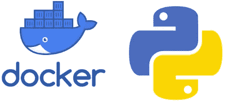
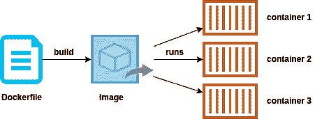
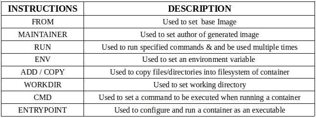
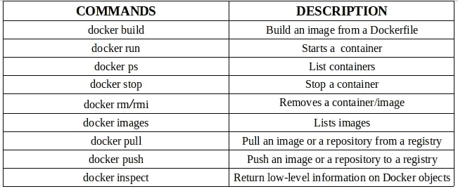
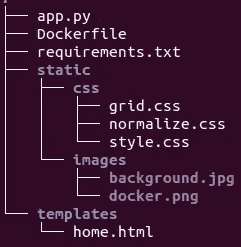
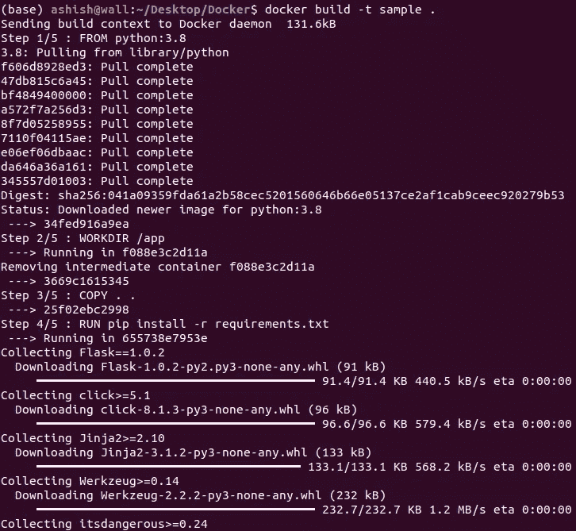
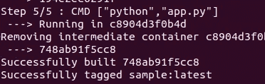
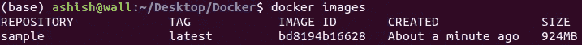
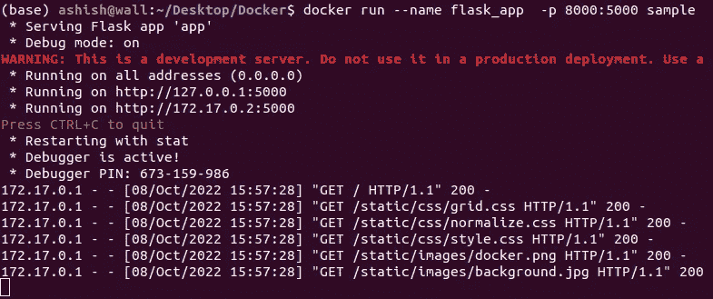
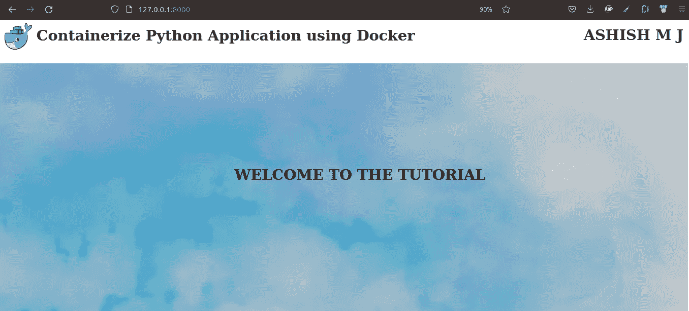

# 使用 Docker 封装 Python 应用程序

> 原文：<https://blog.devgenius.io/containerize-a-python-application-using-docker-f8cea56568dd?source=collection_archive---------0----------------------->



本文旨在概述 docker 的基础知识，并学习如何构建一个在容器中运行 Python 应用程序的映像。

## **什么是 Docker？**

它是一个开发、发布和运行应用程序的平台。简单地说，您可以构建您的应用程序，将它们和它们的依赖项一起打包到一个容器中，然后这些容器可以被运送到其他机器上运行。

## **关键**术语

*   ***Dockerfile*** -由指令和参数组成的文本文件。它通知 Docker 应该如何构建图像。
*   ***Image-*** 它是一个只读模板，带有创建容器的说明。docker 文件中的每条指令都会在映像中创建一个层。
*   ***容器-*** 它是一个图像的运行实例。它由其映像以及提供给它的任何配置选项(创建或启动)很好地定义。



同一图像(模板)的多个运行实例(容器)

上图显示了使用 docker 文件创建或构建的同一个图像(模板)的多个运行实例(容器)。

## Dockerfile 指令

Dockerfile 文件由一组指令和参数组成。一般语法是

```
INSTRUCTION arguments
```

最常用的 Dockerfile 指令是:



常用的 Dockerfile 文件指令

样本文档

## Docker 命令

最常用的 docker 命令是:



常用的 docker 命令

## 入门指南

我们将通过以下步骤创建一个简单的项目来封装 Python 应用程序:

*   使用 [flask](/getting-started-with-flask-python-cbdeca3dcfe) 创建一个简单的静态 web 应用程序
*   创建 Dockerfile 文件
*   从 Dockerfile 文件构建图像
*   运行容器中的图像



项目结构

## 1.装置

*   下载 [Docker](https://docs.docker.com/get-docker/)
*   安装库[烧瓶](https://flask.palletsprojects.com/en/2.1.x/installation/)

## 2.密码

*   app.py

app.py

*   home.html

home.html

*   requirements.txt

requirements.txt

*   Dockerfile 文件

Dockerfile 文件

## 3.奔跑

打开“终端”并导航到项目。

*   通过运行下面的命令，从 Dockerfile 构建一个映像。传入`-t`参数来命名图像。

```
docker build -t sample .
```



码头工人建造



成功构建

*   要验证构建的映像，请使用以下命令

```
docker images
```



docker 图像

*   运行 docker 容器。`-p`标志将容器内部运行的端口映射到您的主机。--name 用于为容器命名，sample 是之前构建的图像名称。

```
docker run --name flask_app  -p 8000:5000 sample
```



码头运行

*   打开浏览器并键入

```
[http:://127.0.0.1:8000/](http://127.0.0.1:5000)
```



烧瓶应用

## 结论

在这个故事中，我们已经了解了 docker 的基础知识，并学习了如何通过简单的步骤使用 docker 封装 Python 应用程序。希望你已经了解了 docker 的基础知识。

感谢阅读！

[Github](https://github.com/ashish-mj/Docker) [网站](https://ashishmj.vercel.app/) [领英](https://www.linkedin.com/in/ashish-mj/)