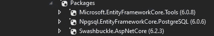

# 集装箱化。net core + PostgreSQL 应用使用 docker 和 docker-compose

> 原文：<https://blog.devgenius.io/containerizing-net-core-postgresql-application-using-docker-and-docker-compose-af06831568a5?source=collection_archive---------0----------------------->

[伊恩·泰勒](https://unsplash.com/@carrier_lost?utm_source=medium&utm_medium=referral)在 [Unsplash](https://unsplash.com?utm_source=medium&utm_medium=referral) 上拍照

在构建软件时，我们可以遵循大量的架构设计，微服务架构是众所周知的架构设计之一，我们可以使用它来构建松散耦合、可独立部署的软件。在本文中，我将介绍如何使用？net core 和 PostgreSQL 借助 docker 和 docker-compose。

本文将涵盖上图中突出显示的区域，而不会涵盖 API 网关之类的场景，因为这可能超出了本文的范围。

让我们开始吧，首先我们需要在我们的机器上安装以下软件，

*   [Visual Studio](https://visualstudio.microsoft.com/)
*   [码头工人](https://docs.docker.com/desktop/install/windows-install/)
*   [PostgreSQL](https://www.postgresql.org/download/windows/)

根据您的操作系统，安装可能略有不同。一旦你设置好所需的软件，让我们开始编码吧。

首先，我将从 Visual Studio 模板中选择一个空白解决方案，并创建一个目录结构，如下图所示。目录结构不需要和我创建的一样，你可以用你自己的方式定义它。

Infrastructure 文件夹用于保存域文件夹下的域实体，我在 Infrastructure 文件夹中实现了存储库模式，它将充当应用程序的数据访问和业务逻辑之间的抽象层。模型文件夹将保存我们的 API 所需的请求和响应模型。

定义目录结构后，让我们安装实现所需的 nuget 包。

*   Npgsql。 [EntityFrameworkCore](https://www.nuget.org/packages/Npgsql.EntityFrameworkCore.PostgreSQL/7.0.0-preview.7) 。一种数据库系统
*   [微软。实体框架工作核心工具](https://www.nuget.org/packages/Microsoft.EntityFrameworkCore.Tools/7.0.0-preview.7.22376.2)

安装 nuget 包后，我将添加一个名为 Customer 的类，我将在整个系列中使用这个实体，我将在我们的数据库中保存一个客户，然后从数据库中检索客户。

添加客户实体后，我创建了一个名为 ApplicationDataContext 的类，它扩展了 EF Core DbContext 类，表示与数据库的会话，可用于查询和保存我们实体的实例。

然后，我将在 launchSettings.json 中添加连接字符串，并在 Program.cs 文件中注册 ApplicationDataContext

一旦你完成了到目前为止提到的所有步骤，你就可以在 Visual Studio 中打开 nuget 包管理器控制台并执行“添加-迁移”和“更新-数据库”命令。这将在您的项目中创建一个迁移文件夹，并根据我们定义的实体创建数据库。

然后，我创建了两个 API 方法，一个是检索所有客户，另一个是在数据库中保存一个客户。我会把源代码的链接放在你可以找到我写的 API 的地方。我不打算解释 API 方法，因为这可能超出了本文的范围。

一旦你开始这个项目，你将能够看到我们的 API 的大摇大摆的文档，如下图。

**让我们将应用程序容器化**

到目前为止，我们已经创建了我们的应用程序，并在本地主机上进行了测试，现在让我们为我们的应用程序添加 docker 支持。使用 Visual Studio 为我们的应用程序添加 docker 支持非常简单，您只需右键单击 API 项目并添加 Docker 支持。

这将在我们的应用程序中添加一个 Docker 文件，如下图所示。因为我将在 src 文件夹中使用 docker-compose，所以我将 src 从 docker 文件的路径中删除。

因为我们计划将我们的应用程序和 PostgreSQL 数据库部署为容器，所以我们将使用 docker-compose 来管理这些容器。Docker Compose 是一个用于定义和运行多容器 Docker 应用程序的工具。

在为我们的应用程序添加 docker 支持之后，我在 src 文件夹中创建了一个 docker-compose 文件

在 docker-compose 文件中，我们将使用 docker 容器中的 PostgreSQL 数据库，而不是使用本地 PostgreSQL 数据库。一旦我们终止容器，容器中的所有数据都将丢失，因此我使用卷将数据保存在 customer_db 容器中。

创建 docker-compose 文件后，我们可以从 src 文件夹中执行命令 **docker-compose up** 。这个命令将构建图像并启动我们的应用程序和数据库实例。一旦你打开 Docker 桌面应用程序，你会看到我们的容器运行成功。

这篇文章到此为止。在本文中，我们介绍了如何设置我们的应用程序在本地环境中运行。然后我们添加了对应用程序的 docker 支持，后来我们使用 docker-compose 作为单独的容器来托管我们的应用程序和数据库。希望你能从这篇文章中找到有用的东西。本文的源代码在下面的链接中提到。✌️

[https://github.com/infaz98/.net-core-PostgreSQL-docker-demo-app](https://github.com/infaz98/.net-core-postgresql-docker-demo-app)