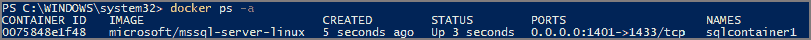
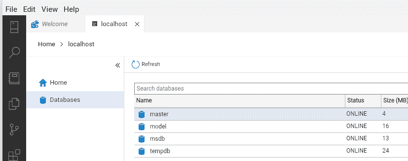

# 无处不在的容器:如何在低端 Chromebook 上用 Docker 运行微软 SQL Server、SQL tools 和 Azure Data Studio

> 原文：<https://blog.devgenius.io/containers-everywhere-how-to-run-microsoft-sql-server-sql-tools-and-azure-data-studio-with-8893869cfc94?source=collection_archive---------5----------------------->

当我想起多年前我的一位同事说过的一句有趣的话时，我仍然会微笑:“哦，表演真的很棒吗？”？我想我们需要猕猴桃。KIWI 是“用铁杀死它”的首字母缩写，这意味着如果你的软件性能不足，那么你可以通过投入更多的硬件来轻松修复它，这通常是优化的第一个方法:)

但是如果我们想拉一个“反向猕猴桃”呢？运行完整的 SQL server 和数据库工具最少需要多少硬件？我已经在各种 IT 行业和工作了很多年，截至最近几年，我在一台非常灵活的低端 Chromebook(赛扬 N4000，4 GB RAM)上进行了所有的家庭计算。随便你怎么说谷歌，但他们在优化像这样的低端硬件以运行现代计算体验方面令人惊叹。Chromebooks 最初是只能运行 Chrome 浏览器的廉价网络设备，后来发展成为非常安全、几乎完全的 Linux 开发机器。最棒的是。这些低端设备非常便宜，并且具有被动冷却功能——没有风扇，没有移动部件，零噪音:)

如果你有一台 Windows 10 电脑，你可以很容易地开始尝试 MSSQL。但如果你像我一样只有一台廉价的 Chromebook，不用担心。在本文中，我将带您了解在这台低性能机器上开始使用 MSSQL Server & tools 所需的步骤。另外，我们会在微软的官方 SQL 文档中发现一个长期存在的错误:)让我们开始吧。

1.  要求:最低 4GB 内存 x64 Chromebook 能够运行 Linux 容器，互联网连接，以及…时间:)2019 年起的所有 Chromebook，以及许多旧型号都可以运行它。如果你的机器比 2019 年更老，在这里检查你的运气[。](https://www.chromium.org/chromium-os/chrome-os-systems-supporting-linux/)
2.  Linux 安装:在你的 Chromebook 上搜索 Terminal，当你第一次尝试启动它时，Chrome OS 会给你一个简短的向导来安装 Linux 容器。根据您的 SSD / EMC 大小和可用空间，您可以为 Linux 容器分配 10–20gb 的存储空间。选择您的用户名，这将是 sudo-ers 组的成员，这意味着您可以使用它通过“sudo”命令安装软件。注意，它不会询问密码，因为所有的认证和安全都是由顶层(Chrome OS)处理的。如果你可以使用谷歌账户登录 Chromebook，你就可以用“sudo”安装软件。运行:

```
$ cat /etc/debian_version
11.1
```

而且你会发现你刚刚得到了一个闪亮的新 Debian stable(11.1 版——“牛眼”)。因此，默认的容器是基于 Debian 11 的，这对我来说是坚如磐石的。你可以谷歌一下使用 Ubuntu 容器的方法，但是我建议你坚持使用 Debian stable。由于 MS 只支持 Ubuntu 作为本地 MSSQL Linux 安装，我们将需要使用 MSSQL Docker 容器映像。

3.在 Debian 上安装 Docker 引擎:在 Linux 终端中，键入以下命令来更新 apt 包索引和安装包，以允许 apt 通过 HTTPS 使用存储库，添加 Docker 的官方 GPG 密钥，设置稳定的存储库，并最终安装 Docker 引擎:

```
$ sudo apt-get update$ sudo apt-get install \
    ca-certificates \
    curl \
    gnupg \
    lsb-release$ curl -fsSL [https://download.docker.com/linux/debian/gpg](https://download.docker.com/linux/debian/gpg) | sudo gpg --dearmor -o /usr/share/keyrings/docker-archive-keyring.gpg$ echo \
  "deb [arch=$(dpkg --print-architecture) signed-by=/usr/share/keyrings/docker-archive-keyring.gpg] [https://download.docker.com/linux/debian](https://download.docker.com/linux/debian) \
  $(lsb_release -cs) stable" | sudo tee /etc/apt/sources.list.d/docker.list > /dev/null$ sudo apt-get update
$ sudo apt-get install docker-ce docker-ce-cli containerd.io
```

4.通过运行以下命令，获取并运行 MSSQL 2019 容器映像:

```
$ sudo docker pull mcr.microsoft.com/mssql/server:2019-latest
```

然后去给自己泡杯咖啡或茶，因为即使在我非常快的 1 Gbps 光纤连接上，拉 450 MB 也要花 12 分钟。

最后，要使用 Docker 运行容器映像，您应该使用以下正确的命令:

```
$ sudo docker run -e "ACCEPT_EULA=Y" -e "MSSQL_SA_PASSWORD=<YourStrong@Passw0rd>" \
   -p 1433:1433 --name sql1 -h sql1 \
   -d mcr.microsoft.com/mssql/server:2019-latest
```

注意:微软官方文档提到了“SA_PASSWORD”字符串来为“SA”(系统管理员用户)指定一个强密码。但这是错误的，你需要使用正确的字符串“MSSQL_SA_PASSWORD”来代替，否则你将无法使用该用户名进行连接！这个文档错误已经存在至少一年了，因为如果你在谷歌上搜索“在 Docker 容器中运行 Linux 上的 MS SQL Server 时 SA 登录失败”，你会发现很多命中结果，比如[2020 年 5 月 10 日](https://techdailychronicle.com/how-to-fix-login-failed-for-sa-when-running-ms-sql-server-on-linux-in-a-docker-container/)的这个。

现在，您可以检查 Docker 容器映像是否已经启动并正在运行:

```
$ sudo docker ps -a
```

你会得到这样的结果:



(第二个截屏是来自微软在 Windows 上运行的 Docker 文档的图像，我添加了它，以便如果您看不到我的 Linux 图像，您可以了解该命令的输出。本文最初发表的地方 LinkedIn 在嵌入图形方面不是很灵活……)

5.安装 Azure Data Studio 并将其连接到正在运行的 MSSQL Server Docker 映像

SQL Server Management Studio (SSMS)还不能用于 Linux，但是 Azure Data Studio 可以。即使它不是一个嵌入式的替代品，它也是一个非常强大的 MSSQL 图形界面，并且这个工具在所有主要平台(Windows，Mac，Linux)上都可用。但是，它目前不支持 ARM 架构，所以如果你有 ARM 的 Chromebook(带有联发科、高通骁龙等公司的 SOC。)你运气不好。

下载。在这里为你的 Debian [安装 deb 包(大约 115 MB)并与你的 Linux 安装共享 Chromebook 上的下载文件夹。在 Chrome OS 文件管理器上，右击下载文件夹，选择“与 Linux 共享”。这个文件夹将会出现在 Linux 容器的“/mnt/chromeos/my files/Downloads”中](https://go.microsoft.com/fwlink/?linkid=2183341)

```
$ cd /mnt/chromeos/MyFiles/Downloads
$ ls
azuredatastudio-linux-1.34.0.deb
```

现在我们需要安装 Azure Data Studio 包:

```
$ sudo dpkg -i azuredatastudio-linux-1.34.0.deb
```

由于缺少依赖项，您将得到一个错误:

```
Selecting previously unselected package azuredatastudio
(Reading database ... 35082 files and directories currently installed.)
Preparing to unpack azuredatastudio-linux-1.34.0.deb ...
Unpacking azuredatastudio (1.34.0-1639602013) ...
dpkg: dependency problems prevent configuration of azuredatastudio:
 azuredatastudio depends on libnss3 (>= 2:3.26); however:
  Package libnss3 is not installed.
 azuredatastudio depends on libsecret-1-0; however:
  Package libsecret-1-0 is not installed. dpkg: error processing package azuredatastudio (--install):
 dependency problems - leaving unconfigured
Processing triggers for desktop-file-utils (0.26-1) ...
Processing triggers for shared-mime-info (2.0-1) ...
Errors were encountered while processing:
 azuredatastudio.
```

这些可以通过运行以下命令来解决:

```
$ sudo apt -f install
```

我们现在可以通过运行以下命令来启动该程序:

```
$ azuredatastudio
```

Azure Data Studio 程序现在终于安装好了，它的图标可以钉在 Chrome OS dock 上了:


最后一步，让我们连接到正在运行的 MSSQL Server Docker 映像。点击新连接，输入服务器和用户名及密码，然后按“连接”:


现在，我们已经连接上了，可以看到 MSSQL Server 版本的详细信息及其附带的默认数据库:



就是这样:)

在下一集，我们将看看如何使用

*   包含 sqlcmd(命令行查询实用工具)和 bcp(大容量导入导出实用工具)的 mssql-tools 包
*   Windows 计算机上的通用 SQL Server Management Studio (SSMS)

干杯:)

链接/学分:

[https://www . chromium . org/chromium-OS/chrome-OS-systems-supporting-Linux/](https://www.chromium.org/chromium-os/chrome-os-systems-supporting-linux/)

[https://docs . Microsoft . com/en-us/SQL/Linux/quick start-install-connect-docker？view = SQL-server-ver 15&pivots = CS1-bash](https://docs.microsoft.com/en-us/sql/linux/quickstart-install-connect-docker?view=sql-server-ver15&pivots=cs1-bash)

[https://docs.docker.com/engine/install/debian/](https://docs.docker.com/engine/install/debian/)

[https://techdailycronicle . com/how-to-fix-log in-failed-for-sa-when-running-ms-SQL-server-on-Linux-in-a-docker-container/](https://techdailychronicle.com/how-to-fix-login-failed-for-sa-when-running-ms-sql-server-on-linux-in-a-docker-container/)

[https://docs . Microsoft . com/en-us/SQL/azure-data-studio/download-azure-data-studio？view=sql-server-ver15](https://docs.microsoft.com/en-us/sql/azure-data-studio/download-azure-data-studio?view=sql-server-ver15)