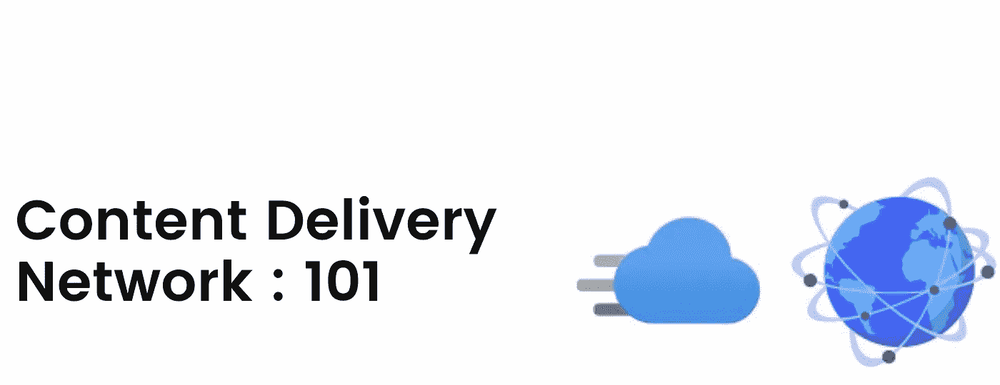

# 内容交付网络:101

> 原文：<https://blog.devgenius.io/content-delivery-network-101-7e24ff59be2e?source=collection_archive---------12----------------------->

这篇博客是我们从零开始讨论 101 个概念的系列文章的一部分，读者的入门知识有限。这篇文章属于 ***中级*** 系列，因为它涉及到理解**内容交付网络**的基础知识及其作为现代互联网流量主干的重要性。

101 系列中的一些早期博客如下:

[**数据库复制 101**](/database-replication-101-d148514598a7) [**数据库分片 101**](/database-sharding-101-4ef36046c29c) [**缓存策略 101**](/caching-strategy-101-3bc974d2a6cd)[**Kubernetes 部署 101**](http://kubernetes-deployments-101)  [**异步通信 101**](/async-communication-101-b04d5c95333a)

# 什么是内容交付网络？

**内容交付网络**是一个由分布在全球各地的数据中心的代理服务器组成的互联网络。拥有 CDN 的主要目的是改善业务应用的整体延迟和可用性，客户群遍布多个大洲。

自 20 世纪 80 年代初推出以来，CDN 已经成为多区域部署的最关键部分之一，通过可扩展的 **DNS 和缓存**块架构优化内容(**图像/视频/软件下载等**)交付。

# CDN 有什么帮助？

CDN 主要设计用于减少多个位置的用户与托管实际服务内容的**源服务器**之间的整体网络往返。

## **不带 CDN**

在这种情况下，每个用户请求都由源服务器提供服务，而与发起位置无关。因此，总延迟包括可能跨越国家/大陆的位置之间的额外网络跳跃。

**交通流量**

## 使用 CDN

在这种情况下，除了第一个请求之外，所有后续请求都由协同定位的 CDN 节点服务，该节点也被称为**边缘服务器**。因此，聚合客户请求的总体延迟与位置之间的额外网络跳数无关，从而提供更好的最终客户体验。

**交通流量**

# CDN 是如何运作的？

## 顺序流程

1.  客户端请求 html 页面[**www.example.com/index.html**](http://www.example.com/index.html)
2.  DNS 服务器向 ns.cdn1.com 的 CDN 服务器**发送请求。**
3.  CDN 确定哪个边缘服务器在地理上最近，并将请求路由到那里。
4.  如果边缘服务器有页面的缓存副本，它就为请求提供服务，而不去**源服务器**。
5.  如果边缘服务器没有页面的副本，它会从源服务器路由请求，并将其存储在缓存中以供将来的请求使用。

# 优势

1.  CDN 通过减少地理上分离的云区域之间的网络跳跃，改善了整体客户端请求**延迟**。
2.  鉴于 CDN 可以从边缘服务器提供缓存数据，它将客户端与任何边缘服务器中断隔离开来。因此提高了整体的可用性。
3.  CDN 可以通过启用 **DDOS 攻击**、 **bot 用户代理**和其他 **L7 流量过滤规则**来阻止任何恶意请求。
4.  由于大量请求由边缘服务器提供服务，源服务器上的**工作负载**被最小化。

# 摘要

所有主要互联网网站都大量使用 CDN，以高效的模式向全球客户提供各种内容，如**图像、视频、HTML 页面、javascript 等**。CDN 即服务是大多数现代应用架构的网络入口。一些最受欢迎的 CDN 提供商有[**【Akamai】**](https://www.akamai.com/resources/reference-architecture)[**CloudFare**](https://developers.cloudflare.com/fundamentals/get-started/)[**AWS CloudFront**](https://aws.amazon.com/cloudfront/)**，我们将在未来的博客中谈论其中一家的详细架构。**

***如需反馈，请留言至****Amit[dot]894[at]Gmail[dot]com****或联系*[*https://about.me/amit_raj*](https://about.me/amit_raj)*的任何链接。***