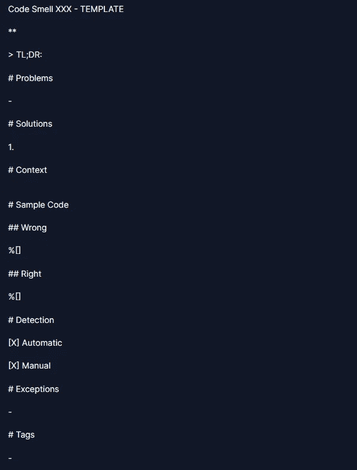
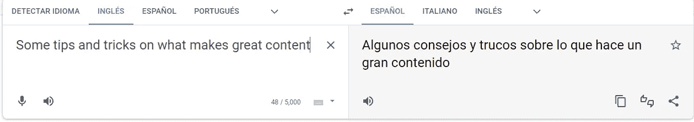
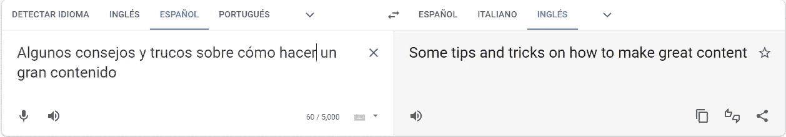

# 内容结构:内容创作的注意事项

> 原文：<https://blog.devgenius.io/content-structure-the-dos-and-dont-s-of-content-creation-b47f6d298a8d?source=collection_archive---------9----------------------->

## 关于如何制作精彩内容的许多技巧和诀窍。

> *TL；DR:遵循这些经验提示来改进你的技术文章。*

# 背景

我叫马克西·孔蒂里。我来自阿根廷。

我已经在软件行业教学和工作了将近 30 年。

在新冠肺炎·疫情之前，我写了 0 篇文章。

现在，我已经写了 300 个了，还在继续写…

这里有一些写博客的小技巧。

这些是我在旅途中学到的建议。

# Do 的

# 找到合适的位置

找到你热爱的事情。

理想情况下，你应该有点超出你的舒适区。

做你的研究，学习新的东西。

你可以做一些 [SEO](https://growtika.com/saas-seo/) 研究来最大化参与度，但是我鼓励你写下你的激情。

# 找到一个社区

在社交网络、论坛、博客、Discord 等上关注合适的人(需要时间)。

不要把个人社交网络和职业社交网络混在一起，因为这会助长拖延症。

我使用 [Twitter](https://twitter.com/mcsee1) 、 [Linkedin](https://www.linkedin.com/in/mcsee/) 、 [Discord](https://discord.com/users/mcsee#5172) 和 [RSS feeds](https://inoreader.com) 用于专业用途。

我有抖音、Instagram 和其他个人/快乐的 RSS 源。

# 创建文章模板

用它们作为你的签名。

从一个空的结构开始比从一张空白的画布开始工作要好得多。

这是我的代码气味系列中的一个例子。

# 使用正确的工具

大多数作家使用这样的工具(尤其是如果英语不是你的母语，我的母语也不是)。

*   [语法上](https://app.grammarly.com/)(免费版可以入手)
*   [海明威编辑](https://hemingwayapp.com/)
*   在线拼写和语法纠正
*   来回翻译

*   剽窃检测器
*   GPT-3 [重写工具](https://beta.openai.com/playground/p/default-summarize?model=text-davinci-002)
*   Unsplash 、 [Pixabay](https://pixabay.com/) 以及其他许多人(感谢他们出色的工作)
*   用 [Dalle-2](https://openai.com/dall-e-2/) 、[稳定扩散](https://stability.ai/)或[中途](https://www.midjourney.com/)创建自己的插图。

顺便说一下，这篇文章的照片是由 [Ryan Snaadt](https://unsplash.com/@ryansnaadt) 在 [Unsplash](https://unsplash.com/s/photos/writer) 上拍摄的

# 创建自己的工具

*   您可以开发自己的解析或验证工具，或者使用开源工具。

# 交叉发布和元数据

使用正确的 SEO 和规范工具。

给你的博客添加一些分析(如果有的话)，了解人们是如何找到你的文章的。

# 使用系列

读者喜欢看到相互交叉引用的简短文章，以了解每篇文章如何与其他文章互补。

# 添加一个 TL；博士:

[TL；医生是告诉你的读者你重视他/她的时间的好方法。](https://en.wikipedia.org/wiki/TL;DR)

# 使用感性的标题和图片

我们阅读所有文章的标题和图片，并决定我们将阅读哪些。

使用情绪化和朗朗上口的标题。

不要撒谎或使用点击诱饵标题。人类不喜欢骗子和说谎者。

这篇文章的第一个标题是:

> 写好文章的一些小技巧。

现在是:

> 关于如何制作令人惊叹的内容的许多提示和技巧。

# 在案例约定上保持一致

选择一些惯例并坚持下去。

比起判决案件，我更喜欢标题案件。

# 创造习惯

写作是一种习惯。

阅读[如何掌握它们](https://mcsee.medium.com/mastering-atomic-habits-c043a542d4b8)黑你的大脑。

# 当它足够好的时候出版。不是以后

不要等到文章完美了。

做一些校对。等几天，再读一遍。

改正上面的字:)。

# 园艺

让你的文章[保持鲜活](https://maximilianocontieri.com/today-i-learned-the-concept-of-gardening)。

准备好用建设性的反馈和其他人的想法来更新它们。

经常去重访他们。

# 使用(代码)示例

人们通过例子学习，而不是通过理论观点。

无论理论、基础和证据多么有趣，读者都会直接看例子。

# 生产力黑客

遵循一些提高效率的小贴士来保持专注。

您可以设置自己的微奖励、小步目标、[禁用所有通知](https://medium.com/dev-genius/10-more-simple-tips-to-boost-your-productivity-x2-2021-guide-8a44e761c4da)以及许多其他内容。

# 跟踪您的代码示例

为您的代码示例使用 GIT tracker，并将其粘贴到您的文章中。

不要使用 iframes，因为它们比较慢，而且可能无法在所有设备上加载

您可以使用 markdown 注释来跟踪隐藏的外部引用。

# 在移动设备上查看您的文章

你可能会在个人电脑上写文章和测试文章。

你的读者不会。

确保使用 AMP/PWA 页面和[窄代码块](https://maximilianocontieri.com/5-big-mistakes-i-made-writing-technical-articles)。

# 不要

# 写想法草案

不要保留工作进展中的文章。

享受动力。

乘风破浪！

# 打开太多选项卡

不要保留太多想法或太多标签。

解决它们并关闭它们。

# 式样

不要*滥用*造型。

人们**厌倦**试图*找到*他们的**意为**。

# 避免被动语态

被动句读起来比主动句慢。

你读主动句比被动句快。

# 不要边说边写

我们用不同的结构和语法说话和写作。

你需要写非常短的句子。

海明威为你施展了魔法。

# 对抗冒名顶替综合症

准备好对抗冒名顶替综合症。

你不是最适合写作的人，也永远不会是，没有人天生就是专家。

# 对抗完美主义

一篇不完美的发表文章胜过 10000 个想法

# 不要喂巨魔

人家有意见。

回答并[与好心人讨论](https://mcsee.medium.com/i-wrote-more-than-90-articles-on-2021-here-is-what-i-learned-76c238f9936f)。

你可以从他们那里学到新的观点。

不要喂巨魔。使用可用的调节工具。

练习，练习，练习

如果你建造了它，他们就会来。