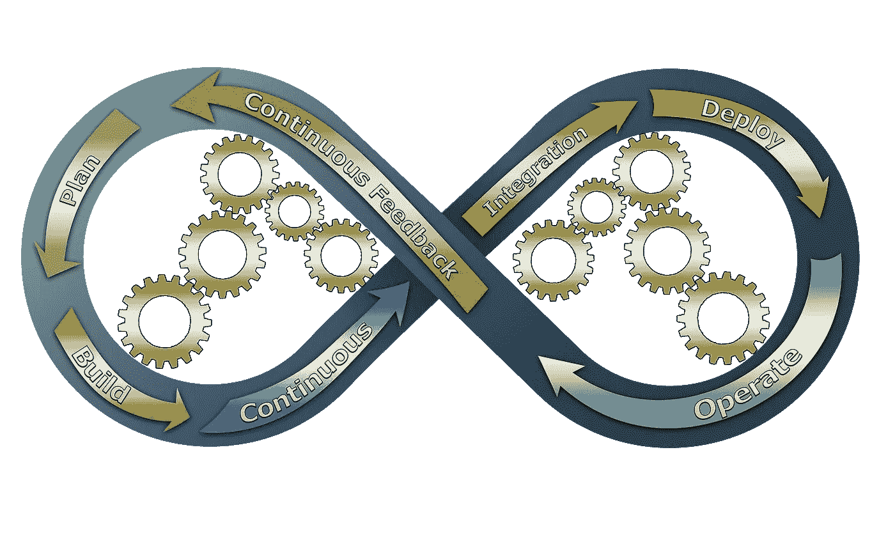

# 持续集成挑战

> 原文：<https://blog.devgenius.io/continuous-integration-challenges-ff612a18de2a?source=collection_archive---------3----------------------->

我们总是试图整合我们在实践中获得的知识，但是持续的整合就像许多其他范例一样需要打破你的规则。

> 在[软件工程](https://en.wikipedia.org/wiki/Software_engineering)，**持续集成** ( **CI** )是将所有开发人员的工作副本合并到一个共享的[主线](https://en.wikipedia.org/wiki/Trunk_(software))的实践，一天几次。[Grady Booch](https://en.wikipedia.org/wiki/Grady_Booch)在[他的 1991 年方法](https://en.wikipedia.org/wiki/Booch_method)、[【2】](https://en.wikipedia.org/wiki/Continuous_integration#cite_note-2)中首次提出 CI 这个术语虽然他并不主张一天积分几次，极限编程 (XP)采用了 CI 的概念，并提倡每天不止一次地集成——也许每天多达几十次。
> [维基百科](https://en.wikipedia.org/wiki/Continuous_integration)

理解一个实践最重要的事情之一是理解它们的原则和含义。

持续集成试图帮助团队更快地集成他们的代码，也许你知道集成地狱。

但这不仅仅是将你的代码集成到 git、svn 或你使用的任何东西中，而是不断地检查集成。我的意思是，软件中最大的问题之一是将孤立完成的不同部分集成在一起。
你可能已经感受到了这种痛苦，你被隔离的时间越长，问题就越多。让我们想象一个有前端、后端和 QA 的团队。如果你把你的故事分成前端任务和后端任务，两个团队都独立工作，我们在最后整合所有的东西，整合的难度与两个团队独立工作的时间成比例。如果 QA 在最后检查所有东西，并在其他功能中工作，反馈会更慢。

即使你同意调用一个 API，拥有一些行为，宇宙也会反对你，会在每个单词中引入小的解释。每次都会走一条路，以后会很难找到和修复。
[作为提示，尽量避免创建子任务，尽量通过用户故事来工作。](/the-atom-of-agile-ff0b3537643f?sk=ac3b9f9c3cfbc379fdafaa02047cad38)

因此，集成问题是一个返工的问题，是一个增加开发时间的问题，只是因为你没有经常检查你的集成，你没有解决每个小问题，当它发生时，你试图在最后解决所有的问题。

在上一个图像中，如果拼图块不适合最后的位置会发生什么？，你打算花多少时间来解决这个问题？。难道是因为拼图坏了，因为我丢了几块，这怎么可能？。

持续集成是一种帮助你更快回答这些问题的实践。减少返工的风险，减少错误，因为你将会看到你在更长时间内所做的事情，所以这给了你更多的可能性来解决问题，改变方向。

这很重要，持续集成的本质是将您的工作更快地部署到环境中。在 CI 中，这种环境通常是生产前环境。
CI 是两个词,“连续”意味着频繁，而“整合”则需要将所有的东西放在一起工作。

## 自动化部署

这两个词在两个不同的抽象层次上是相关的，很难进行持续的集成和手动部署到测试环境中。也许如果我们每天集成一次，我们可以牺牲团队中的某个人来做这件事。但是如果我们想要增加部署频率，手动工作将无法扩展。这就是我们需要自动化部署过程的原因，但是集成这个词却出现在我们面前。
如果我们想在那个环境中部署工作的东西，我们将需要检查结果应用程序是否足够好。它基本上是检查我们所做的没有破坏以前做过的任何事情。因此，现在我们的自动化部署不仅仅是自动部署，它也是在一定程度上证明我们工作质量的一种方式。
这是 CI 渠道:

> 部署管道是一台机器，通过组织我们的软件开发工作，帮助我们尽可能快速、高效、可重复和可靠地从提交到可发布的结果。
> [连续输送管道戴夫·法利](https://www.amazon.com/Continuous-Delivery-Pipelines-Better-Software/dp/B096TTQHYM)

但正如我所说的，我们的管道需要快速回答我们的工作是否足够好，我们需要一个[短反馈回路](/short-feedback-loops-137d075aa67d?sk=3716efe911938f7c8de7bcf49cc45b1a)。这一点很重要，因为没有关于管道运行小时数的值来给你答案。
我们将更改推送到 main 的频率和管道完成一个回答所需的时间之间有直接的关系。[我们需要快速维护管道(在我看来，少于十分钟)。](https://martinfowler.com/articles/continuousIntegration.html#KeepTheBuildFast)

部署管道比 CI 管道覆盖更多的东西，但是任何 CD 管道也是 CI 管道。Dave Farley 说，部署管道有四个基本组成部分:

*   提交阶段
*   工件储存库
*   验收阶段，以及
*   能够部署到生产中

## 工作方式

部署管道将帮助我们增加部署频率，也有一个快速门将告诉我们“EY，你有问题”。
但我们还需要利用这一能力，我们还需要改变我们的工作方式，以避免滥用我们的自动 CI 渠道。

如果我们每周向 main 推送一次，那么让一个不可思议的管道在每个 commit to main 中运行我们所有的单元、集成、e2e 测试有什么价值呢？。与每周手动检查一次我们的集成相比，这有什么优势？

事实上，如果我们的管道是红色的，并且在测试中破裂，我们的优势就很少:

*   谁写的代码？。
*   那个人现在还在做别的事情吗？。
*   新事物和旧事物哪个更重要？。
*   那个人能坚持多久才能记住那部分代码？。

所有这些问题都意味着时间，并且基本上与我们试图解决的问题有关，以减少工作过多的风险。
如果我们不整合连续(假设连续每天至少一次)我们就不做 CI，我们只是做 [CI theater](https://www.thoughtworks.com/radar/techniques/ci-theatre) 。

然后，如果我们想要持续地部署到那个测试环境，我们将需要改变我们的分支模型。一种方法是进行基于运行的开发。在基于主干的开发中，有两种风格，短命分支或只使用主干。如果可能的话，我推荐使用 main branch，每个人都直接将他们的更改推送到 main，但这并不意味着你必须从这里开始。这是一个漫长的过程，我们在另一个团队中所做的例子是这里的。

但这还不够，推送我们知道坏了的代码有什么价值？。因此，我们需要再次减少反馈循环，如何足够安全，以使我们的更改生效，而不破坏任何东西？。假设我们说我们的提交需要:

*   实现一个小行为代码。
*   证明代码正在做那种行为的测试。
*   隐藏未完成工作的代码。

这里我们说的是，我们所有的提交都需要进行自我测试，并与应用程序的其余部分很好地集成。这就是戴夫·法利所说的提交阶段。

在这个场景中，频繁推送的问题意味着在每次提交中选择小的行为来解决。我们的工作单元是 commit，它经过自我测试，可以安全地进入我们的测试环境。

但是我们都知道错误是不可避免的，那么 CI 的挑战之一就是当管道被破坏时该做什么。这意味着我们不能继续推进我们的管道，直到它再次变绿，所以对红色管道要做的第一件事就是修复它，以允许我们的队友继续推进。

## CI 反转原理(我发明了这个术语)

然后，从 CI 开始，而不是等待拥有管道和所有东西，我们可以这样开始:

*   小型的、自测的、隐藏的提交经常被推送到您的分支。
*   将我们从分支机构或本地副本合并到主数据库的频率增加到每天一次。
*   只需一个人就可以将这些东西部署到我们的环境中。
*   在某个时候，那个人会感觉到每天都在进行集成的痛苦，所以我们会开始考虑管道。
*   迭代和改进瓶颈，以更高的质量增加部署频率。

**部署管道是高频率手动部署带来的痛苦的结果，而不是 CI 的目标。**