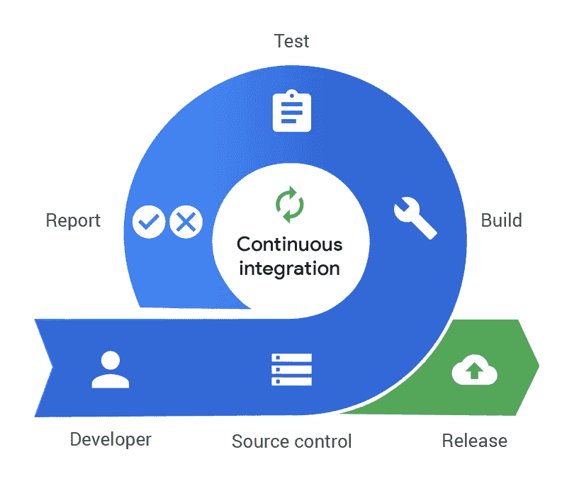
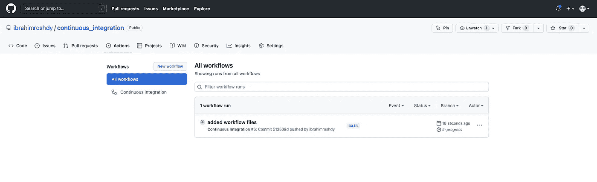
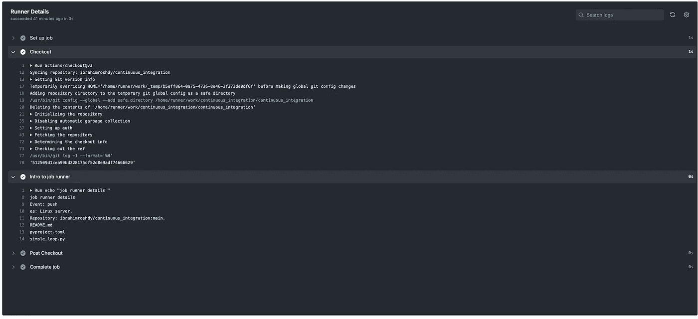
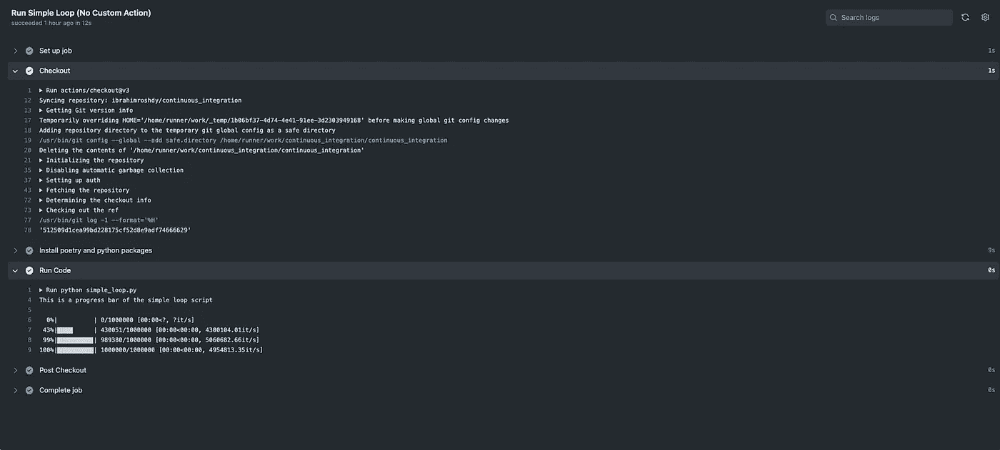

# 使用 GitHub 快速设置持续集成

> 原文：<https://blog.devgenius.io/continuous-integration-github-1130217cc2e9?source=collection_archive---------10----------------------->


戈兰·艾沃斯在 [Unsplash](https://unsplash.com?utm_source=medium&utm_medium=referral) 上的照片

在 GitHub 上使用持续集成之前你需要知道的所有事情。这是您使用 GitHub 操作、工作流程和工作设置的指南。

如果你是科技行业的软件工程师或项目经理，你可能听说过术语*持续集成*或 *CI* 。嗯，在本文中，我将解释持续集成，并以 GitHub 的基础设施为例。我还将解释为什么 GitHubCI 或 GitHub Workflow 是最好的 CI 工具之一。[另外，检验一下本文的样本项目](https://github.com/ibrahimroshdy/continuous_integration)。


图 1: [什么是持续集成](https://www.exoscale.com/static/syslog/2018-11-08-what-is-ci/what-is-continuous-integration.png)

持续集成是开发过程自动化的过程。它通过构建、测试和部署阶段来处理软件开发过程。

> *当然，术语持续集成——CI 与持续交付——CD 是一致的，其中最广为人知的是 CI/CD。然而，一次可以没有另一次而存在。在本文中，我将只关注持续集成主题。*

让我们解释一下现代项目中软件工程师的开发周期，如移动应用程序、API 或网站，其中有许多流程和集成，看起来很简单，如下所示:

1.  开发人员编写一些代码来表示项目代码库的变化
2.  开发人员提交他们的代码以集成(合并)到主代码库或集中代码库中
3.  合并后，主要代码库现在包括了开发人员所做的更改，代码将被编译或构建、测试和部署

合并后最常见的问题是由于缺少依赖关系而破坏代码库，缺少新代码更改所需的包的安装等等。著名的"*这是在我的本地环境或机器上工作"*的借口。集成或手动测试也会导致一些运行时问题。最后，从头开始复制整个基础设施来测试对代码库的潜在更改是非常耗时的。最佳解决方案之一是**持续集成**。

# 连续累计

持续集成有助于将传统的开发工作流程自动化为一个更加持续的过程，从而节省时间和精力。当代码变更出现在分支中时，会自动检查项目主代码库的兼容性、依赖性和可靠性。以及自动化测试、代码覆盖、自动化集成测试和自动化任何其他需要的过程。允许团队自信地添加特性，如果它通过了所有的构建和测试，它将被发布。现在已经发布了一个版本，可以部署已经完成**构建、测试和报告的项目。**

然而，部署是持续交付(CD)的一部分，但是 CI 的管道可以被认为在新代码库发布时结束，因为部署和交付是生产产品的替代，现在是 CD 的一部分。



图 2: [连续积分周期](https://www.pagerduty.com/wp-content/uploads/2020/01/continuous-integration-2.png)

## 要求

实现持续集成工作流有一些技术要求，如下所示:

1.  VCS 工具—版本控制系统:*将使用 git*
2.  一个构建工具— *将使用 GitHub Actions/GitHubCI*
3.  存储库管理器— *将使用 GitHub*

# CI 示例项目

在这个[示例项目](https://github.com/ibrahimroshdy/continuous_integration)中，我将带您了解如何在 GitHub 中创建定制的工作流或 CI 管道，并将解释 GitHub 工作流和操作是如何工作的。我用过 [CircleCI](https://circleci.com/) 、 [TravisCI](https://www.travis-ci.com/) 和 [GitLab](http://gitlab.com/) 。虽然，CircleCI 和 TravisCI 都是很棒的工具，但是我一直很欣赏 GitLab，因为它把所有的工具都封装在了一个地方。这意味着构建工具、存储库管理器和容器注册表都在 GitLab 中。我在 TravisCI 和 CircleCI 中使用 GitHub，但我一直希望 GitHub 有自己的工具，以便所有东西都在一个地方。现在我使用 GitHub，因为拥有定制动作和定制工作流的能力比 GitLab 更加简洁和灵活。

所以让我们解释一下这个项目和项目的文件

```
continuous_integration
│
├── README.md
├── .github # gitHub workflow directory
│     ├── actions # Custom actions directory
│     │   └── install-run-code # project's Custom Action 
│     │       └── action.yml # Action instructions file 
│     └── workflows # This project's Workflows 
│         └── ci_workflow.yml # Workflow instructions file
├── .gitignore
├── pyproject.toml
└── simple_loop.py
```

> 注意，`.yml`文件需要被命名为`actions.yml`

不需要在本地运行项目，但是如果需要的话，这里提供了快速启动说明。注意:这些与`.github/workflows/ci_workflows.yml`和`.github/actions/install-run-code/actions.yml`中的指令相同

> 创建一个虚拟环境并激活它

```
virtualenv venv -p python3
source venv/bin/activate
```

> 使用 pip 安装诗歌和 pyfiglet

```
pip install poetry pyfiglet
```

> 运行诗歌安装来安装所有需要的 python 包

```
poetry install
```

> 运行 pyfiglet，因为你可以

```
pyfiglet Continuous Integration
```

> 最后，运行代码

```
python simple_loop.py
```

> 你应该有这样的东西:

```
This is a progress bar of the simple loop script
100%|███████| 1000000/1000000 [00:00<00:00, 4474649.76it/s]
```

# GitHub 工作流程-操作

这段代码被推送到 GitHub repo 时会发生什么？流水线被触发，或者在 GitHub 术语中，工作流被触发，其中作业是并行的。

工作流运行由提交标记自动触发



图 GitHub Actions 选项卡上触发的工作流运行

在这个项目中有多个，具体来说在这个工作流中有三个作业:

1.  [流道详情](https://github.com/ibrahimroshdy/continuous_integration/runs/7454240537?check_suite_focus=true)
2.  [运行简单循环(无自定义动作)](https://github.com/ibrahimroshdy/continuous_integration/runs/7454240072?check_suite_focus=true)
3.  [运行自定义动作](https://github.com/ibrahimroshdy/continuous_integration/runs/7454240326?check_suite_focus=true)

## 跑步者详情

```
runner_details:
  runs-on: ubuntu-latest
  name: Runner Details
  steps:
    *##########   CHECK OUT REPO AND PRINT REPO INFO #######* - name: Checkout
      uses: actions/checkout@v3
    - name: Intro to job runner
      run: |
        echo "job runner details "
        echo "Event: ${{ github.event_name }}"
        echo "os: ${{ runner.os }} server."
        echo "Repository: ${{ github.repository }}:${{ github.ref_name }}."
        ls ${{ github.workspace }}
```

`[runner_details](https://github.com/ibrahimroshdy/continuous_integration/runs/7454240537?check_suite_focus=true)`是一个通过使用`runs-on`命令设置映像运行的作业，在作业中有两个主要的运行步骤。第一个总是由`uses`调用 GitHub 动作的`checkout`，因为它显示动作由`actions/chechout@v3`引用。第二项工作是一系列命令，提供关于跑步者的更多信息。*注意:这是一个演示作业，无需在 CI 中打印您的回购信息。*

结果将如下所示:



图 4:跑步者详细信息工作

## 运行简单循环

```
run_simple_loop:
  runs-on: ubuntu-latest
  name: Run Simple Loop (No Custom Action)
  steps:
    *##   CHECK OUT REPO AND DOWNLOAD PACKAGES AND RUN CODE ##* - name: Checkout
      uses: actions/checkout@v3
    - name: Install poetry and python packages
      run: |
        pip install poetry pyfiglet
        poetry config virtualenvs.create false
        poetry install
        pyfiglet Continuous Integration
    - name: Run Code
      run: python simple_loop.py
```

`[run_simple_loop](https://github.com/ibrahimroshdy/continuous_integration/runs/7454240072?check_suite_focus=true)`是一个作业，其中运行项目所需的步骤明确地写在`workflow`指令文件中。同样，第一步是使用 GitHub `actions/checkout@v3`检查代码，第二步是安装和运行代码所需的一系列命令。

结果将如下所示:



图 5:运行简单循环[无自定义动作]

## 运行自定义操作

```
run_simple_loop_action:
  runs-on: ubuntu-latest
  name: Run Custom Action
  steps:
 *## CHECK OUT REPO AND DOWNLOAD PACKAGES AND RUN CODE WITH CUSTOM ACTION ####* - name: Checkout
      uses: actions/checkout@v3
    - name: Install poetry and python packages
      uses: ./.github/actions/install-run-code
      with:
        project_name:
          Continuous Integration [With Custom Action]
```

`[run_simple_loop_action](https://github.com/ibrahimroshdy/continuous_integration/runs/7454240326?check_suite_focus=true)`是一个使用定制动作文件的作业。这类似于使用 GitHub 提供的预制动作文件的`checkout`步骤。在此工作中，将创建一个自定义动作文件，以说明将工作流文件与原始命令一起使用与将工作流与动作文件一起使用之间的区别，这样可以使工作流更易于使用。另外，查看 GitHub 提供的其他动作，[这里](https://github.com/features/actions)。

*结果与图 5 相同。但是，安装和运行代码并没有分开。*

> 下面的`[.github/actions/install-run-code/actions.yml](https://github.com/ibrahimroshdy/continuous_integration/blob/main/.github/actions/install-run-code/action.yml)` **类似于它在工作流文件中的写法，但是您可以自定义它以便更好地使用。**

> 因此，在将所有三个任务放在一起之后，`[.github/workflow/ci_workflow.yml](https://github.com/ibrahimroshdy/continuous_integration/blob/main/.github/workflows/ci_workflow.yml)`最终看起来会像这样

> 最后你可以在这里查看回购！

# 谢谢