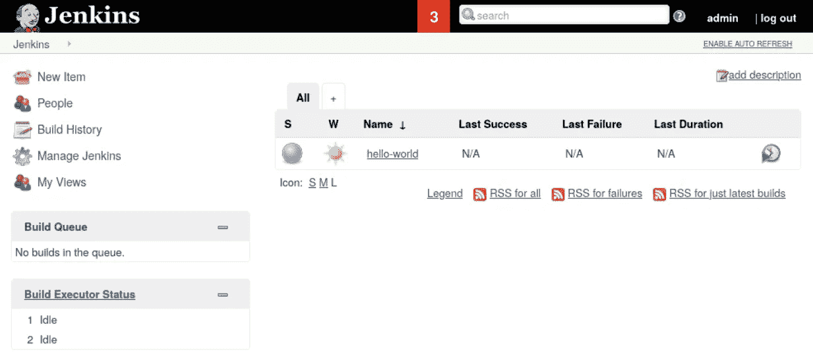
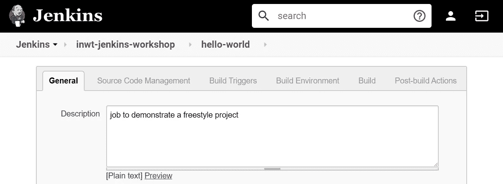
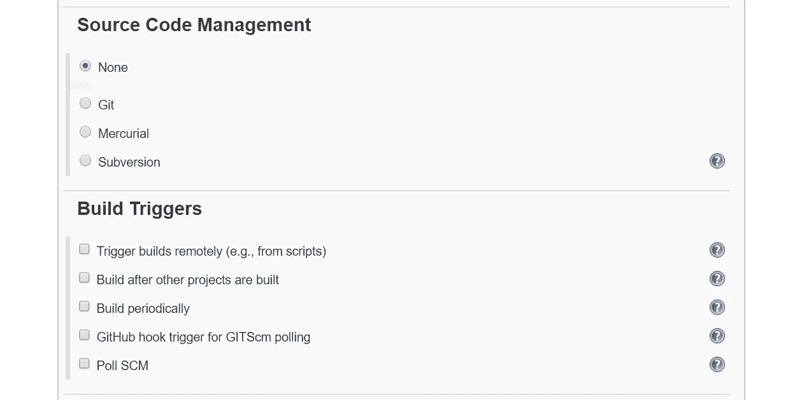
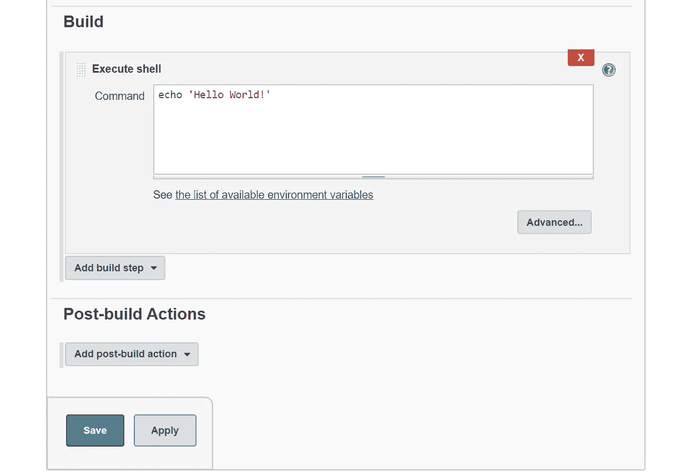
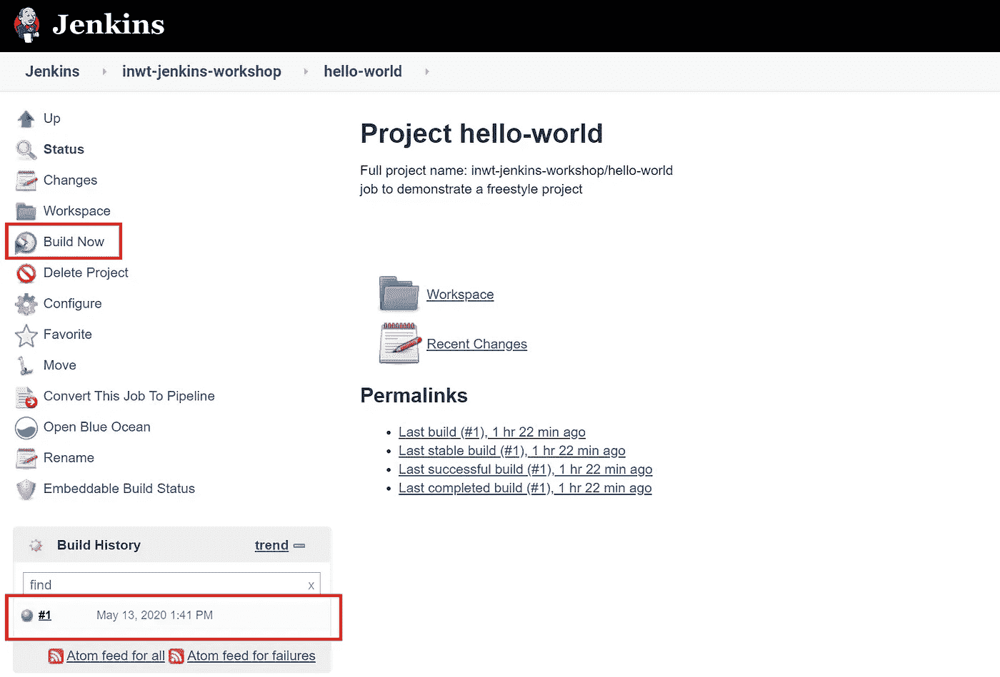
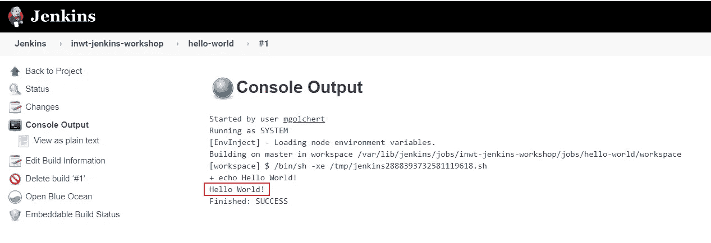
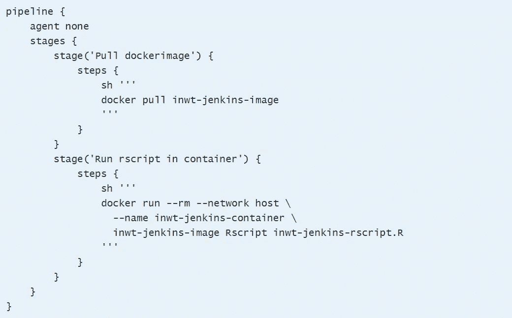

# 持续集成:Jenkins 简介

> 原文：<https://blog.devgenius.io/continuous-integration-introduction-to-jenkins-fa29d0955f43?source=collection_archive---------15----------------------->

Clem Onojeghuo 在 [Unsplash](https://unsplash.com/s/photos/bowtie?utm_source=unsplash&utm_medium=referral&utm_content=creditCopyText) 拍摄的照片

在我们关于持续集成的第一篇[博客文章](https://medium.com/@INWT_Statistics/continuous-integration-what-it-is-why-it-matters-and-tools-to-get-started-54fd44072288)中，我们展示了一系列 CI 工具——包括广泛使用且历史悠久的工具 Jenkins。Jenkins 是一个基于 web 的免费开源持续集成系统，用 Java 编写。项目的配置、可视化和评估仅通过浏览器进行。Jenkins 的一个特点是它的高度灵活性:目前有超过 1500 个插件可用，配置可以单独设计。持续集成的基本要求是在版本控制系统中管理代码。这里，Jenkins 也提供了大量兼容版本控制系统的选择。

顺便提一下，Jenkins 这个名字来源于开发者的假设，即这个名字与管家的职业相关联。本文旨在介绍这一工具，并就如何为您自己和您的项目使用红色领结管家提供建议。

# 装置

Jenkins 有不同的版本:您可以选择长期支持版本(LTS)和每周版本。虽然 Jenkins 每周发布一次每周版本的更新，但 LTS 版本每三个月发布一次稳定版本。这个决定应该基于你个人的喜好和需求。下一步你可以选择不同的版本:除了通用操作系统(Windows、Ubuntu / Debian、MacOS)的安装包之外，还有一个 Docker 版本和一个 web archive。战争)也是可用的。

你可以在这里下载适合你需求的安装包:[https://jenkins.io/download/](https://jenkins.io/download/)。在 Linux 中基于 Debian 的发行版下，你可以通过 apt 安装 Jenkins。通过安装，当系统启动并创建 Jenkins 用户时，Jenkins 作为守护程序启动。在 Windows 上，您所要做的就是打开下载的软件包，并按照安装说明进行操作。然后 Jenkins 监听端口 8080，您可以通过位于 [http://localhost:8080/](http://localhost:8080/) 的浏览器访问该端口，开始配置。

在这里你可以看到詹金斯的主页。在左侧的菜单栏中，您可以创建新任务、进行配置或查看构建历史。下面您可以看到构建队列和构建处理器状态。在右侧，您将看到所有现有作业的概述，以及有关上次成功、失败和持续时间的相应信息。我们将在接下来的章节中阐明所有这些术语的确切含义。

# Jenkins 入门:创建和配置作业

与 Jenkins 一起构建软件项目的第一步是创建一个所谓的“工作”这可以承担各种任务，通常在一个软件项目中有几项工作。例如，运行单元测试或部署代码的作业很常见。创建工作基本上有两种方式:

*   您可以完全通过 Jenkins 中的 click 界面来配置作业
*   您在 GitHub 这样的版本控制系统中创建一个 Jenkinsfile，然后将它集成到 Jenkins 中。

在 Jenkins 中有不同类型的工作，你可以通过点击“新项目”来选择最常见的类型是自由式项目。您可以使用 click 界面完全配置作业。作为一个例子，我们配置了一个自由式作业，上面写着“Hello World！”：

如您所见，您有很多配置选项。为了清楚起见，我们只显示了一些设置。在 INWT，我们也在 Jenkins 中使用各种插件，这就是为什么一些选项在基本安装中不可用。

作为配置的一部分，选择构建触发器可能是有意义的。例如，您可以启动受时间控制的作业(例如，每天的特定时间)或根据其他项目执行该作业(例如，在另一个作业成功执行后)。在我们的例子中，我们没有选择构建触发器。

完成配置后，可以通过单击“立即构建”来手动执行该作业运行一次作业称为构建。作业运行后，它在构建历史中被着色:蓝色表示构建成功，红色表示构建失败。您可能还听说过 Jenkins 中的特征天气标记(太阳、云、雷暴):这些是一个工作的一般“健康”的指示器，并且受到诸如构建历史或代码覆盖结果等因素的影响。

我们可以从蓝点看出我们的构建是成功的。通过点击 build 和下一页上的“控制台输出”，我们得到控制台输出，可以看到作业打印了“Hello World！”。

# 詹金斯的 GitHub 集成

在 Jenkins 中，你可以选择嵌入一个源代码管理系统，比如 GitHub。在 GitHub 的情况下，需要 [Git 插件](https://plugins.jenkins.io/git/)、存储库 URL 和相应的凭证来访问存储库中的代码。在最简单的情况下，存储库中有一个 Jenkins 文件，该文件在作业启动时执行。当选择构建触发器时，您有一个实际的选择，即每次提交到一个已定义的分支时启动作业。此设置特别适合执行单元测试的作业。

# 创建管道 Jenkinsfile

Jenkins 管道在 Jenkinsfile 中定义。管道 Jenkins 文件遵循 Groovy 语法。一个带有最小设置的 Jenkins 文件示例如下所示，其中 R 脚本在 Docker 容器中执行:

管道包含不同的阶段，要执行的命令在“步骤”块中。在我们示例的第一阶段，提取 Dockerimage，而在第二阶段，启动容器并执行 R 脚本。

在 INWT，我们更喜欢通过点击环境集成 Jenkins 文件的可能性，而不是纯粹的作业配置。这增加了我们的清晰度，因为 Jenkins 文件和代码在同一个地方。此外，所有团队成员都可以立即访问它们，并且我们可以从版本控制工具中受益，例如带有代码审查或回滚的 pull 请求。

# 结论

由于 Jenkins 广泛的应用程序和配置选项，本文在这一点上也可以涵盖各种其他主题。Jenkins 已经成为我们大多数数据科学项目非常有用的工具，尤其是在单元测试、ETL 过程和部署方面。它使我们能够自动化手动任务，并在早期阶段识别错误代码，因此我们可以立即做出反应，从而确保代码的长期质量。

*原载于 2020 年 6 月 15 日*[*【https://www.inwt-statistics.com】*](https://www.inwt-statistics.com/read-blog/continuous-integration-introduction-to-jenkins.html)*。*