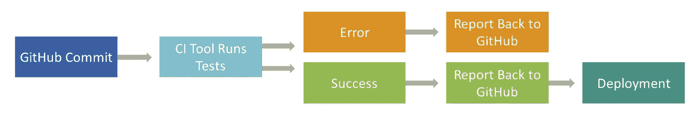

# 持续集成:它是什么，为什么重要，以及开始使用的工具

> 原文：<https://blog.devgenius.io/continuous-integration-what-it-is-why-it-matters-and-tools-to-get-started-54fd44072288?source=collection_archive---------37----------------------->

法里斯·穆罕默德在 Unsplash 上的照片

持续集成是一种软件开发实践，团队成员经常集成他们的工作[……]。每个集成都由一个自动化构建(包括测试)来验证，以尽可能快地检测集成错误。

martinfowler.com[的马丁·福勒](https://www.martinfowler.com/articles/continuousIntegration.html)

# 那么，大家都在说的这个“CI”是什么呢？

让我们将 Martin Fowler 对持续集成的定义带到一个更深层次的理解:持续集成，也称为 CI，是一种软件开发工具，用在软件开发的集成阶段——顾名思义。在这种情况下，“集成”意味着像乐高积木一样将软件碎片粘在一起，以创建一个复杂的工作整体，从而产生一个单一的产品或过程。

CI 建立在使用版本控制系统(例如 Git)的基础上，因此需要一个“存储库”来开始。这是软件产品的变更和版本被跟踪的地方(更多信息，见[维基百科关于版本控制的文章](https://en.wikipedia.org/wiki/Version_control)和/或这 10 分钟。YouTube 上的视频: [Git 教程第 1 部分:什么是版本控制？](https://www.youtube.com/watch?v=9GKpbI1siow))。

CI 所做的是在每次进行更改或添加时，重建并测试您的“母舰”(以您的软件产品所在的存储库的形式)。然后它给你反馈:是否一切正常(构建和测试成功)或者是否有任何错误，这是通常的情况；)因此，你将会知道你刚刚组装起来的部件是否彼此匹配，是否如预期的那样工作。如果你考虑到通常不止有一个，而是至少有几个软件开发人员在同一时间为一个项目工作的事实，这一点尤其有意义。

那么词中的“连续”又是怎样的呢？很久以前，开发人员常常编写大块的软件，这些软件可能一天集成一次(你可能听说过[夜间或每日构建](https://en.wikipedia.org/wiki/Daily_build))，或者更少。现在，使用 CI，您可以频繁地、以非常小的步骤集成您的更改:例如，每次完成某个特性或添加新功能时。

# 这与持续交付和持续部署有什么不同？

开发软件意味着它最终会出现在某个地方，比如客户那里、应用商店里、网络上等等。将软件提供给其他人(公司以外的人)通常被称为部署。

**连续交付**意味着我们会在任何时候向相关人员提供我们软件的最新工作和测试版本。这就像复制我们的母舰并将其推送到生产/部署服务器，几秒钟之内客户就可以看到软件的最新版本。相比之下，**连续部署**是部署过程的自动化，因此不再需要人工劳动，软件在开发时就被部署:在小而频繁的步骤中。

# 使用 CI 工具的动机是什么？

所以，很明显，CI 是一个有用的软件开发工具，你现在真的无法避免。但是让我们总结一下使用 CI 工具的具体优势。以下几点摘自 martinfowler.com 持续集成的[优势及其(非常)简短的版本。](https://www.martinfowler.com/articles/continuousIntegration.html#BenefitsOfContinuousIntegration)

*   **bug:***“持续的集成并不能消除 bug，但是它确实让发现和消除 bug 变得非常容易。”因此，你会工作得更有效率。*
*   **概述:**从历史上看，软件项目中有很多不确定性和未知性。有了 CI，你就能让自己始终知道*“你在哪里，什么有用，什么没用，你的系统中有哪些突出的错误。”*
*   **打破壁垒:** *【持续集成】有助于打破客户和开发之间的壁垒——我认为这些壁垒是成功软件开发的最大壁垒。”*

总而言之，**持续集成的好处是降低风险、时间和成本。**除了在公司层面的这些好处之外，对您来说还有一个个人好处:在其所有方面的部署是一个令人兴奋的话题，常常令人害怕。CI 迫使你经常这样做，并最终适应它。

# 持续集成:缺点

虽然有好的一面，但肯定也有不好的一面。当考虑持续集成工具时，等式中应该包括哪些缺点？

*   维护开销:持续集成服务器需要维护和管理，就像其他服务器一样。这给你的工作量增加了一些开销。
*   **服务器依赖:**如果 CI 服务器出现故障，那么，一切都会失败。所以应该非常注意服务器的维护和安全。
*   **采纳:**如果你在一个团队或组织中工作，并试图采纳 CI，可能需要一些时间和精力将其融入你的组织文化。最重要的是让所有的开发人员都参与进来，并让他们留在那里。

# 持续集成工具:选择

在 INWT，我们目前使用两种不同的 CI 工具，即 Jenkins 和 Travis CI，具体取决于项目。这两个都在这里简单介绍一下。当然，还有更广泛的工具可以更好地满足您的需求——再往下，您会发现一个包含更多 CI 工具的链表(当然，它并不声称是完整的)。

## 詹金斯

[Jenkins](https://jenkins.io/) 是目前领先的开源自动化服务器，用 Java 编程。它是在麻省理工学院的许可下发布的。 [Jenkins](https://www.inwt-statistics.com/Jenkins) 完全免费并且非常灵活，因为它允许使用大量的版本控制系统，并且提供了超过 1500 个插件。

## 特拉维斯·CI

[Travis CI](https://travis-ci.org/) 也是一个开源的自动化服务器，分布在 MIT 下，用 Ruby 编程。Travis CI 对于开源项目是免费的，对于公司和私人项目是许可的。项目需要利用 GitHub 作为版本控制系统，以便使用 Travis CI 作为持续集成平台。

## 更多 CI 工具

*   [竹子](https://www.atlassian.com/software/bamboo)
*   [Buildbot](https://buildbot.net/)
*   [CircleCI](https://circleci.com/)
*   [代码船](https://codeship.com/)
*   [GitLab CI](https://about.gitlab.com/product/continuous-integration/)
*   GoCD
*   [诚信](https://integrity.github.io/)
*   [团队合作](https://www.jetbrains.com/teamcity/)

# 从这里去哪里

我们的[下一篇博客文章](https://medium.com/@INWT_Statistics/continuous-integration-introduction-to-jenkins-fa29d0955f43)将关注 Jenkins，带你参观并介绍用户界面的基本方面。一旦你熟悉了这个环境，你就有足够的知识来开始玩 CI，并做一些实践练习。

*原载于 2020 年 6 月 15 日*[*【https://www.inwt-statistics.com】*](https://www.inwt-statistics.com/read-blog/continuous-integration-what-it-is-why-it-matters-and-tools-to-get-started.html)*。*