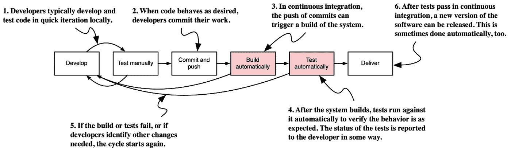
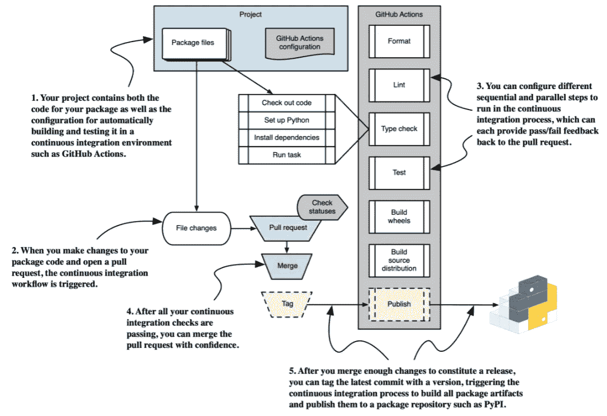
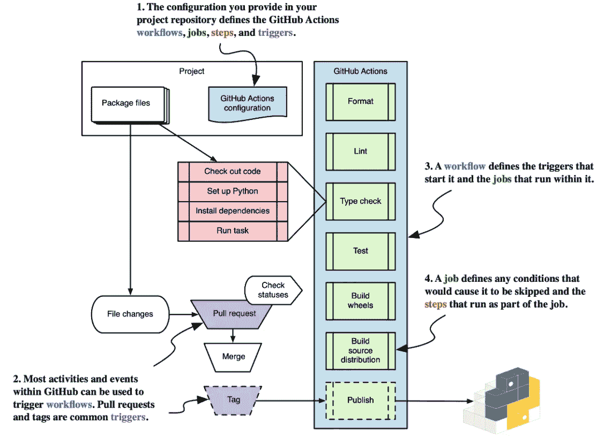
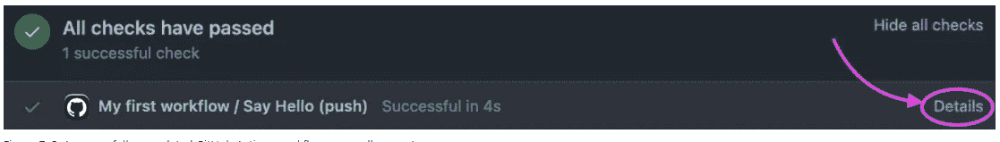
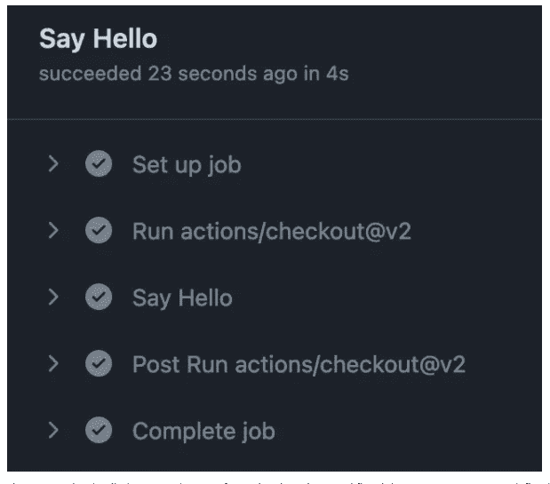
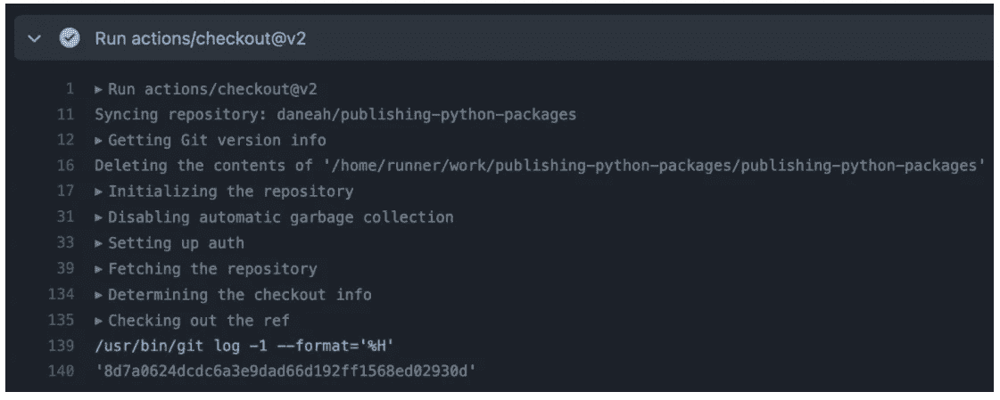
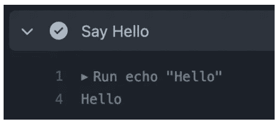

# 与 GitHub 动作的持续集成

> 原文：<https://blog.devgenius.io/continuous-integration-with-github-actions-3e6fba728504?source=collection_archive---------12----------------------->

## 引用

## *节选自* [*出版的 Python 包*](https://www.manning.com/books/publishing-python-packages?utm_source=medium&utm_medium=referral&utm_campaign=book_hillard3_publishing_8_26_21) *作者戴恩·希拉德*

*本文以 Python 软件包产品为例，讨论如何在 CI 工作流中使用 GitHub 操作。*

*如果你想了解更多关于 CI 和 Python 包的知识，请阅读它。*

在[manning.com](https://www.manning.com/books/publishing-python-packages?utm_source=medium&utm_medium=referral&utm_campaign=book_hillard3_publishing_8_26_21)结账时，在折扣代码框中输入 **fcchillard2** 即可享受 35%的折扣 [*发布 Python 包*](https://www.manning.com/books/publishing-python-packages?utm_source=medium&utm_medium=referral&utm_campaign=book_hillard3_publishing_8_26_21) 。

## **持续集成工作流程**

想象一下，你已经让几个新的开发人员加入你的项目，继续接受新的客户。您的团队已经花了几周的时间为您的软件包的下一个版本做准备，并且您最终在当天早些时候发布了新版本。当你的团队在庆祝的时候，你手机持续不断的震动让你有种不祥的感觉。事实证明，在发布之前进行最终变更的开发人员忘记了运行单元测试，最后的变更破坏了核心功能。

您需要一个适当的系统，可以自动运行您对每个变更开发的有价值的检查，在这个环境中，每个参与项目的人都可以确认他们的状态。随着项目的发展，这些*持续集成*系统是生产力和信心的另一个重大进步。

定义:持续集成(CI)是将变更尽可能频繁地合并到项目开发的主流中，以最小化偏离期望或预期行为的可能性的实践。CI 与大型软件项目的早期实践截然相反，在大型软件项目中，开发可能持续数月或数年，然后才被合并和发布。CI 鼓励小的、渐进的变革，目的是更早、更频繁地交付价值。对于持续集成的深入报道，请查看 Christie Wilson 的[***Grokking Continuous Delivery***](https://www.manning.com/books/grokking-continuous-delivery)**和 Mohamed Labouardy 的**[***Pipeline as Code***](https://www.manning.com/books/pipeline-as-code)**。**

大多数持续集成工作流由相同的基本步骤组成，如图 1 所示。自动*构建*和*测试*步骤是您当前流程中的缺口。



图一。一个基本的持续集成工作流为开发人员提供了一个关于他们变更的自动反馈循环。

因为自动构建和测试步骤是在共享位置执行的，所以您和您的团队可以验证给定的更改是否按预期工作，而不管更改的作者在本地执行的任何测试步骤。这是一个关键的转变:本地测试现在可以专注于在快速迭代中编写新的测试或更新现有的测试，并且运行完整的测试套件成为一种可选的便利。开发人员可以根据他们目前的能力在实现过程中做出选择，而不是被迫以一种非常特定的方式做事。

既然您已经熟悉了持续集成的基本流程，那么您就可以开始使用免费的工具构建一个持续集成了。

## **与 GitHub 动作的持续集成**

在合并任何新代码之前，您决定项目的每个变更都应该在共享环境中使用 CI 管道进行验证、记录和发布。这消除了由于某个人的本地配置而导致的任何可变性，并且防止了某个人从他们的计算机上发布一个从未被合并到代码库中的包版本的情况。因为你的团队一直在使用 GitHub 托管代码库和协作修改，所以你决定尝试一下 [GitHub Actions](https://github.com/features/actions) 。

## 其他持续集成解决方案

虽然我选择在本文中介绍 GitHub 的操作，但这只是众多选项中的一个。大多数持续集成解决方案在概念上有很大的重叠，因此学习不同的平台通常需要理解它们特定的术语。

一些广泛使用的云优先 CI 解决方案包括:

*   [GitLab CI/CD](https://docs.gitlab.com/ee/ci/)
*   [CircleCI](https://circleci.com/)
*   [蔚蓝 DevOps](https://azure.microsoft.com/en-us/services/devops)
*   [谷歌云构建](https://cloud.google.com/build)

如果这与您现有的个人或组织工作的云提供商选择一致，那么选择其中一个可能会很有用。 [Jenkins](https://www.jenkins.io/) 是一个开源解决方案，通常需要您付出更多的努力，但如果您想要完全的端到端控制，这可能会很好。

**强烈建议远离特拉维斯 CI** 这里就不链接了。尽管它曾经是开源项目最受欢迎的平台之一，但自 2019 年被收购以来，它一直受到功能开发缓慢、沟通不畅、安全问题以及推动付费计划的影响。

## **高级 GitHub 动作工作流**

为了有效地使用 GitHub 动作，您需要理解高级工作流、GitHub 动作特定的术语，以及下面几节中的配置格式。

在您的新管道中，每当您打开一个 pull 请求或将新的提交推送到 GitHub 时，CI 管道都会从您的分支中签出代码，并并行执行以下操作:

*   使用`black`和`format` tox 环境检查代码格式
*   使用 flake8 和`lint` tox 环境对代码进行 Lint
*   使用 mypy 和`typecheck` tox 环境检查代码
*   使用 pytest 和默认的 tox 环境对代码进行单元测试
*   使用`build`构建一个源代码发行版
*   使用`build`和 cibuildwheel 构建二进制轮发行版(本章后面会详细介绍)

每当您标记一个提交时，管道都会额外将分布发布到 PyPI。图 2 从较高的层面描述了这个流程。



图二。使用 GitHub 动作的 Python 打包的持续集成管道流

您将所有的测试和代码质量工作锁定在一个自动化的管道中。将来，如果您改变了一个 tox 环境的工作方式或添加了一种新的检查，您也可以将它们添加到您的管道中。这项投资将随着你创建的每一个新过程而获得回报。

## 理解 GitHub 动作术语

您需要利用以下 GitHub 操作概念来构建您的 CI 管道:

*   *工作流*:CI 管道的最高粒度级别。您可以创建多个工作流来响应不同的事件。
*   *工作*:您为工作流定义的高级阶段，比如构建或测试某些东西。
*   *步骤*:您在作业中定义的特定任务，通常由一个 shell 命令组成。步骤还可以引用其他预定义的 GitHub 动作，这对于构建像检查代码这样的常见任务非常有用。
*   *触发*:导致工作流发生的事件或活动。即使触发了工作流，您也可以使用表达式有条件地跳过该工作流中的作业。
*   *表达式*:一组 GitHub 特定的条件和值之一，您可以检查这些条件和值来控制您的 CI 管道。

现在，您只需要一个由几个作业组成的工作流，其中一些作业根据触发事件有条件地运行。每个作业都有几个相似的步骤来安装依赖项和工具，并最终运行一个任务。工作流由您创建的拉式请求和标签触发。图 3 显示了您之前看到的相同 CI 管道，这次指出了这些不同的活动部分如何映射到 GitHub Actions 概念。



图 3。持续集成管道的不同部分如何映射到 GitHub Actions 概念

## **深入理解 GitHub 动作**

讲授 GitHub Actions 必须提供的所有功能超出了本节选的范围，但是如果您想继续探索更多的功能，您可以遵循 [GitHub 的学习材料](https://docs.github.com/en/actions/learn-github-actions)。

有了术语，您就可以开始为您的包构建 GitHub Actions 工作流了。

**如果您还没有这样做，现在是将您的项目放在 Git 存储库中进行版本控制并将其推送到 GitHub 的好时机。如果您不熟悉 Git 或 GitHub，请暂停一下，花些时间熟悉一下。他们的** [**文档**](https://docs.github.com/en/get-started/quickstart/create-a-repo)**(**[**https://docs . github . com/en/get-started/quick start/create-a-repo**](https://docs.github.com/en/get-started/quickstart/create-a-repo)**)和 Mike McQuaid 的**[***Git in Practice***](https://www.manning.com/books/git-in-practice)**都是很好的参考资料。**

## **启动 GitHub 动作工作流配置**

您可以使用 [YAML](https://yaml.org/) 来配置 GitHub 动作工作流程。对于您的工作流，您可以使用单个 YAML 文件来指定作业和步骤。首先在您的存储库中创建一个新的分支。在项目的根目录下创建一个`.github/`目录，如果它还不存在的话。在`.github/`目录中，创建一个名为`workflows/`的新目录。GitHub 自动在`.github/workflows/`目录中发现扩展名为`.yml`的文件，并期望它们是有效的工作流定义。

您几乎可以为您的工作流配置文件起任何您喜欢的名字，但是当一个项目只配置了一个工作流时，使用名称`main.yml`是一种常见的做法。您还可以使用表示工作流用途的名称，例如`packaging.yml`。现在在`.github/workflows/`目录下创建一个空的配置文件。

每个 GitHub 操作工作流程必须至少有几个字段:

1.  `name`:在 GitHub 界面的几个部分显示的友好字符串
2.  `on`:触发工作流的一个或多个事件的列表
3.  `jobs`:要执行的一个或多个作业的映射
4.  反过来，一个作业必须至少有几个字段:
5.  Key:一个机器可读的字符串，通过它来引用管道中其他位置的作业。通常这是一个仅使用字母和连字符的作业名称版本。
6.  `name`:在 GitHub 界面的几个部分显示的人性化字符串。
7.  `runs-on`:作业使用的 GitHub Actions runner 的类型。对于您的目的来说，`ubuntu-latest`工作得很好。你可以在`runs-on` [文档](https://docs.github.com/en/actions/learn-github-actions/workflow-syntax-for-github-actions#jobsjob_idruns-on)中看到所有可用的跑步者。
8.  `steps`:要执行的一个或多个步骤的列表。

最后，步骤可以是两种格式之一:

*   对预定义动作的引用，例如 GitHub 或第三方提供的官方 [checkout](https://github.com/actions/checkout) 动作。这种格式指定了一个`uses`键，其值引用了动作的 GitHub 存储库和一个由`@`字符分隔的可选版本字符串。
*   一个显示在 GitHub 界面几个部分的友好的`name`字符串，以及一个指定要运行的命令的`run`字段。

清单 1 展示了这些部分如何组合成一个示例工作流配置。

**清单 1。打印短消息的 GitHub 动作工作流的示例 YAML 配置**

```
name: My first workflow ❶

 on: ❷
   - push

 jobs: ❸
   say-hello: ❹
     name: Say Hello ❺
     runs-on: ubuntu-latest ❻
     steps: ❼
       - uses: actions/checkout@v2 ❽

       - name: Say Hello ❾
         run: echo "Hello"
```

**❶工作流的友好名称**

**❷工作流由推送的代码和标签触发**

**❸工作流的作业**

**❹工作的机器可读密钥**

❺为这份工作取了一个人性化的名字

❻这项工作使用了最新的基于 Ubuntu 的 runner

❼求职的步骤

**❽使用官方结账动作结账**

**❾用自定义名称和命令运行一个步骤**

运行时，工作流检查触发工作流的分支或标记的代码，然后运行一个`echo`命令来打招呼。如果触发 push 事件的是 pull 请求，GitHub Actions 会在 pull 请求页面的底部报告 pending 状态(图 4)。


图 4。显示在拉取请求底部的挂起 GitHub 操作工作流

工作流完成后，GitHub Actions 在 pull request 页面上显示完成状态(图 5)。



图 5。pull 请求上成功完成的 GitHub 操作工作流

您可以单击工作流作业上的**细节**链接来查看各个步骤的输出(图 6)。您还可以在存储库的**操作**选项卡上找到所有以前运行的作业。GitHub Actions 在您定义的步骤之前和之后执行自己的一些步骤。



图 6。GitHub 操作工作流作业的详细步骤和输出。有些步骤是用户自定义的，有些是内置在 GitHub 动作中的。

您可以点击一个步骤的名称来展开并查看它的输出，这对于更好地理解 GitHub 或第三方提供的操作非常有用(图 7)。



图 7。正式签出操作的输出显示了从触发分支或标签签出代码所涉及的所有步骤。

您还可以使用输出来确认或调试您自己创建的步骤，例如确保记录的值是您所期望的(图 8)。



图 8。工作流作业步骤中指定的命令将与其输出一起显示。

特别是当一个工作流失败时，浏览 GitHub Actions 接口的这些不同级别对于发现如何修复失败变得非常重要。在这些区域中，您会看到失败的单元测试和关于不正确格式的代码或工具发现的其他代码质量问题的消息。

## 锻炼

在存储库中的新分支上:

1.  在项目的根目录下创建一个`.github/`目录，如果它还不存在的话。
2.  在`.github/`目录中，创建一个名为`workflows/`的新目录。
3.  在`.github/worfklows/`目录中为您的工作流配置创建一个 YAML 文件。您可以随意命名您的工作流配置文件，但是当一个项目只配置了一个工作流时，使用名称`main.yml`是一种常见的做法。您还可以使用表示工作流用途的名称，例如`packaging.yml`。
4.  在您的工作流文件中，添加清单 [1](https://freecontent.manning.com/continuous-integration-with-github-actions/#sample-workflow) 中的示例 YAML。
5.  将您的更改提交并推送到 GitHub。
6.  打开一个拉取请求。

完成这些步骤后，您应该看到 GitHub 动作触发了 pull requeest 上的工作流。确认工作流成功并执行您定义的步骤。将`echo`命令更改为新的字符串，并推送新的提交。工作流应该再次触发，输出应该反映您更新的字符串。

现在，您已经创建了一个可以工作的 GitHub Actions 工作流，您可以向其中添加真正的任务了。

如果你想了解这本书的更多信息，请点击查看。