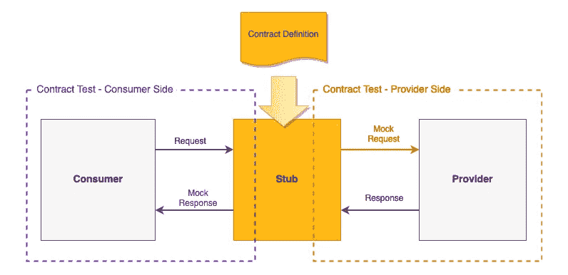
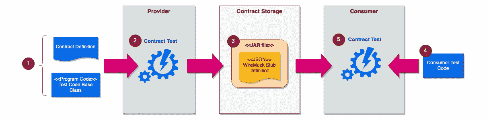
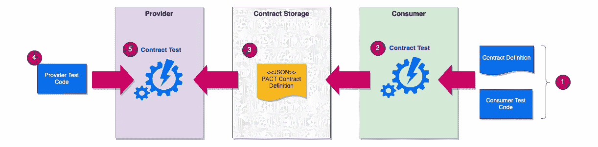
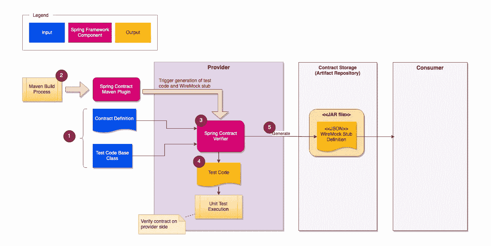
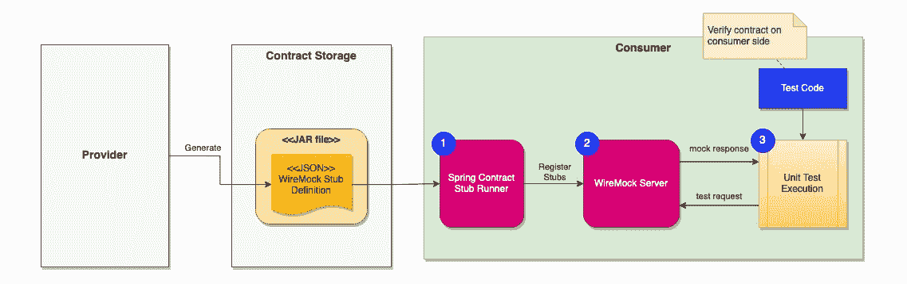
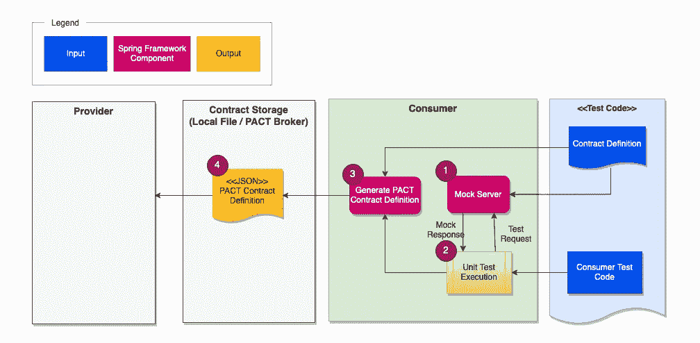
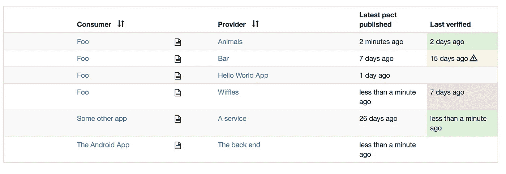
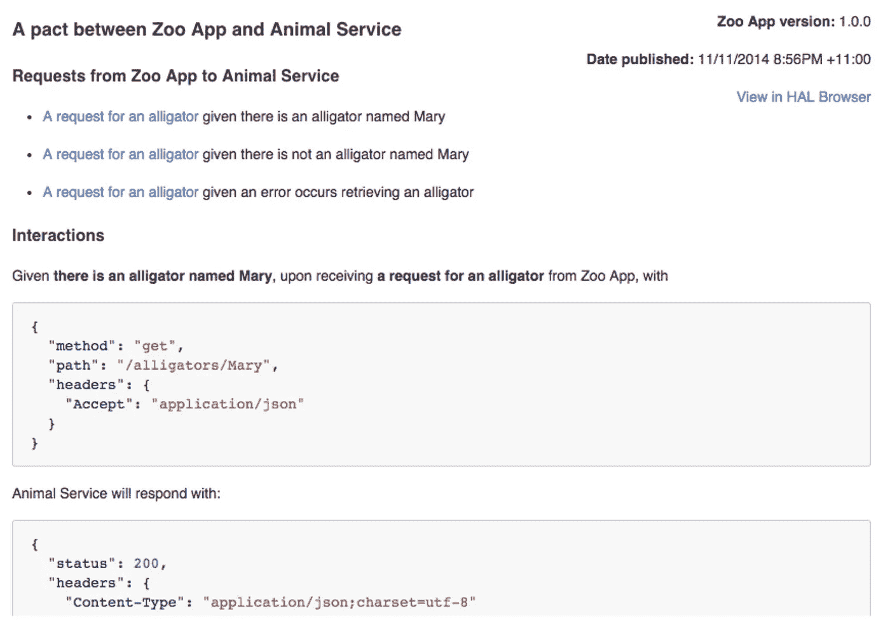
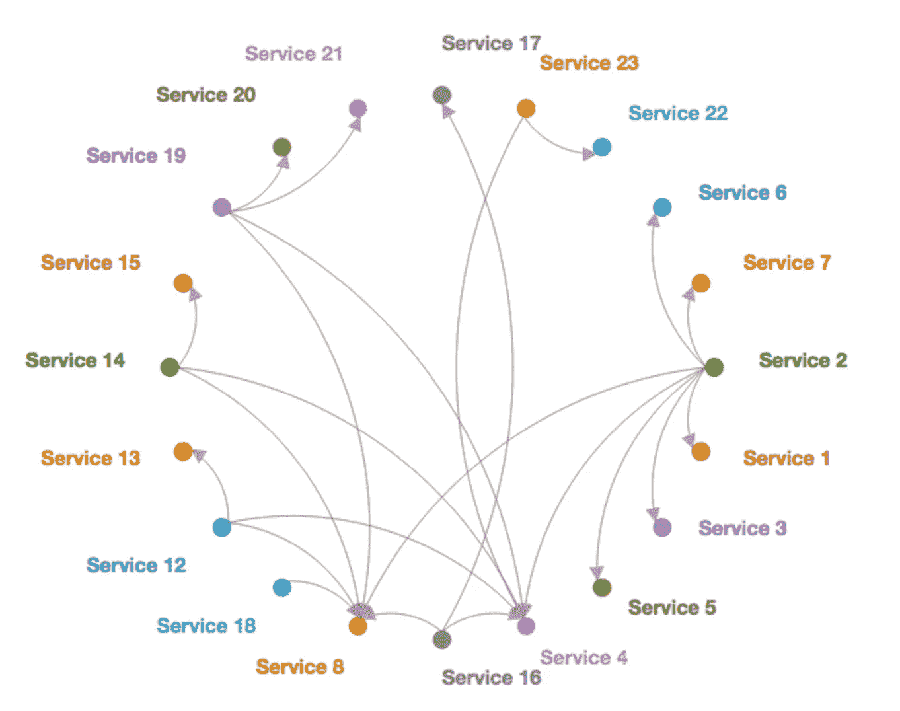
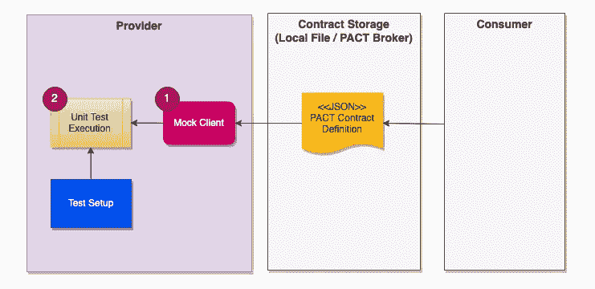

# 合约测试— Spring Cloud 合约与 PACT

> 原文：<https://blog.devgenius.io/contract-test-spring-cloud-contract-vs-pact-420450f20429?source=collection_archive---------1----------------------->

## 快速概述有助于您选择正确的框架


维多利亚诺·伊斯基耶多在 [Unsplash](https://unsplash.com/?utm_source=unsplash&utm_medium=referral&utm_content=creditCopyText) 上的照片

不可否认，系统或服务之间交互的系统设计是大多数系统架构的重要组成部分。因此，用于验证服务间接口的自动化契约测试最近成为一个热门话题。许多企业正在引入这种测试类型作为系统开发过程的一部分。

实现契约测试的主要好处是及早发现系统界面可能的破坏性变化。契约测试可以作为单元测试的一部分运行，允许开发人员在本地机器上轻松运行测试。越早发现问题，修复成本就越低。

## 什么是合同测试？

系统集成涉及两方——消费者和提供商。例如，一个银行应用程序向交易服务提交一个转账请求。银行应用程序是一个消费者，而交易服务是一个提供者，提供一个接口供客户使用。

传统上，系统接口的验证是系统集成测试的一部分。QA 团队只能在开发工作完成并且系统完全部署到测试环境之后运行集成测试。

为了更早地运行契约测试，我们的想法是根据商定的契约定义建立一个存根。为了验证消费者端的接口，测试代码运行消费者应用程序，该应用程序向存根提交测试请求。验证测试请求的数据格式，并基于契约定义生成模拟响应。然后，消费者验证该响应。

对提供者的契约测试正好相反。测试代码根据契约定义生成测试请求，并将其发送给提供者，然后验证来自提供者的响应是否符合契约定义。



合同测试的总体思路

## 合同测试框架

契约测试有两种流行的框架——[Spring Cloud Contract(SCC)](https://spring.io/projects/spring-cloud-contract)和 [PACT](https://docs.pact.io/) 。这两个测试框架分享了相似的契约测试思想，但是它们在某些方面是不同的。如果您打算将合同测试引入您的系统，那么第一个重要的任务就是选择适合您和您的团队的框架。然而，做出选择既费时又困难。

为了帮助您快速了解这两个框架，您将在本文中找到这两个框架的开发过程和关键信息。

# 概括地说，合同测试框架

这两个框架之间的关键区别是测试开发过程的起点。SCC 首先在提供者端定义契约，然后将其传递给消费者进行验证。相反，PACT 是消费者驱动的，这意味着消费者向提供者提供他们对合同的期望，以验证它是否符合预期的合同定义。消费者驱动的合同测试被许多现代组织广泛采用，更多信息请参考[这篇文章](https://martinfowler.com/articles/consumerDrivenContracts.html)。

## Spring Cloud 合同概述

下图说明了对提供者和消费者进行测试的整个流程:

*   **提供方—** (1)开发人员准备合同定义和提供方测试代码的基类。(2)契约测试过程生成并运行测试代码
*   **合同交付** — (3)合同定义转换成 WireMock 存根定义，打包成 JAR 文件。它被发布到一个工件存储库中，比如 Git 和 Nexus
*   **消费者端—** (4)开发人员为消费者准备测试代码，以及(5)合同测试将使用模拟提供商响应的 WireMock 存根来验证消费者。



Spring Cloud Contract —开发流程

## 契约概述

流程在高层次上是相似的，但它是从消费者端开始的。

消费者端的开发人员定义了对服务接口和测试代码的期望，以验证消费者的请求并评估来自存根的响应。用 DSL 程序代码编写的契约定义被转换成 JSON 格式，然后传递给提供者进行验证。

在提供者端，开发人员构建测试代码来模拟底层服务和数据(如果需要),然后启动框架的提供者应用程序来模拟测试请求并验证基于契约定义的响应。



PACT —开发流程

# Spring Cloud 合同—详细视图

接下来，让我们仔细看看 SCC 的流程。您将了解合同测试流程的输入、依赖和输出。

## SCC —提供商方

在提供者端，测试旨在验证提供者端的契约，并以 WireMock 存根格式交付契约定义。

下图显示了提供方的流程。它以 maven 构建过程为基础，增加了额外的步骤。maven 插件作为构建过程的一部分被触发，这样它将契约定义和基本测试类作为 Spring 契约验证器的输入，以生成测试代码并将契约导出为 WireMock 存根定义

随着测试的通过，契约定义在构建过程的最后被打包成一个 JAR 文件。

WireMock 是一个强大的模拟服务器，它帮助你独立地测试一个服务，而不依赖于其他提供者。如果您想了解更多信息，请参考本文。



spring Cloud Contract——提供方的开发流程

**属地**

以下依赖项和插件将被添加到 maven pom.xml 中

*春约督*

```
<dependency>
  <groupId>org.springframework.cloud</groupId>
  <artifactId>spring-cloud-starter-contract-verifier</artifactId>
  <scope>test</scope>
</dependency>
```

*春云契约 Maven 插件*

```
<plugin>
  <groupId>org.springframework.cloud</groupId>
  <artifactId>spring-cloud-contract-maven-plugin</artifactId>
  <extensions>true</extensions>
</plugin>
```

**合同定义**

Spring 提供了不同的契约定义方式，比如 groovy、yaml、程序代码。合同定义由示例和字段匹配器组成

例如，下面 YAML 格式的定义指定了一个用于创建客户记录的 API。请求体由姓名和电话组成，通过正则表达式进行验证。响应包含一个 5 位数字参考号。

**供应商合同的验证**

接下来，任务是检查提供者 API 是否符合契约。该框架生成单元测试代码，这些代码向提供者 API 发出测试请求以进行验证。

然而，这个过程并不是完全自动化的，它需要一个基类来生成单元测试用例。基类的目的是在每次测试运行之前初始化提供者 API 和其他设置。下面的示例基本测试类为测试设置了客户控制器。

配置好基本测试类后，当 maven 插件作为构建过程的一部分被调用时，框架会根据契约自动生成单元测试代码。

下面的样例代码显示了为客户创建 API 生成的样例测试代码。它向提供者 API 发送一个带有样本数据的请求，并评估来自提供者的响应。对于客户创建 API，下面的示例代码是生成的单元测试场景。

然后，自动生成的单元测试代码将与单元测试一起执行。

## SCC —合同存储

生成的 JAR 文件可以发布到一个工件存储库，比如 Nexus、JFrog 等。就像传统的 maven 库一样，JAR 文件可以通过组 id 和工件 id 使用版本控制进行唯一标识。

## SCC —消费者端

在消费者方面，框架提供了一个存根运行器，它获取存根定义并将存根注册到 WireMock 服务器。模拟服务器模拟测试用例的提供者 API，以在消费者端验证契约。



春云契约——消费者端的开发流程

**依赖关系**

这是 Spring 契约存根控件的 maven 依赖项。

```
<dependency>
  <groupId>org.springframework.cloud</groupId>
  <artifactId>spring-cloud-starter-contract-stub-runner</artifactId>
  <scope>test</scope>
</dependency>
```

**样本消费者测试案例**

@AutoConfigureStubRunner 使用指定的 maven 组 id、工件 id 和端口号启动存根控件。然后，存根控件从本地或远程存储库中获取存根定义。

下面的示例代码在端口号 6565 上启动了一个模拟的客户服务服务器。单元测试代码验证 CustomerClient 和存根 API 的集成，并断言响应。

# PACT —详细视图

让我们详细了解一下 PACT，看看它们之间的区别

## PACT —消费者方面

SCC 和 PACT 都利用模拟服务器在消费者端进行测试。基于契约定义，模拟服务器匹配来自消费者的测试请求，并生成示例响应。在消费者端完成验证后，PACT 在 JSON 文件中生成合同定义。

与 SCC 不同，PACT 不需要 maven 插件。该过程是作为单元测试执行的一部分嵌入的。



PACT——消费者方面的发展过程

**属地**

这是消费者端 PACT 测试的 maven 依赖性。

```
<dependency>
  <groupId>au.com.dius.pact.consumer</groupId>
  <artifactId>junit5</artifactId>
  <version>4.3.5</version>
</dependency>
```

**合同定义**

虽然 SCC 支持通过 groovy、yaml 和 DSL 方法调用来定义契约，但是 PACT 只支持 DSL 方法调用。

客户创建端点的 PACT 合同定义示例:

**消费者测试**

PACT 为模拟服务器设置提供了 annotation @PactTestFor。消费者应用程序上的测试与契约测试框架无关，因此消费者验证的测试代码类似于 SCC 的测试代码。唯一的区别是使用注释进行模拟服务器初始化。

## 契约——契约存储

PACT 契约定义可以发布给作为 PACT 框架一部分的 PACT 代理。然后，提供者一方可以从 PACT broker 获取合同进行测试。PACT broker 不仅仅是一个存储库，它还提供了更多的功能，如自动生成人类可读的合同文档、整体集成的网络图、跟踪测试结果等。

从[https://github.com/pact-foundation/pact_broker](https://github.com/pact-foundation/pact_broker)获取的 PACT broker 门户的示例截图



带有测试结果的合同定义



自动生成的合同文档



服务集成网络图

## PACT —提供商方

SCC 和 PACT 都有相同的概念，即测试场景是基于契约定义自动生成的。提供者端的测试是向提供者 API 发送测试请求，并检查响应是否符合契约。

合同测试可能不需要提供方的底层(例如数据库访问),因为测试主要关注接口格式的一致性。因此，测试设置是为底层服务创建模拟，并初始化提供者应用程序。



PACT——提供方的开发过程

下面的示例代码是针对客户 API 的 PACT 测试。存储库组件在带有@State 注释的方法中被模拟，因此测试集中在控制器组件上。PACT 更加灵活，因为它允许模拟每个 API 交互的设置。

# 摘要

总而言之，SCC 和 PACT 之间的差异总结如下，供您快速参考:

*   **方法—**SCC 的合同测试流程始于提供商端，而 PACT 则相反，它始于消费者端
*   **编程语言—** SCC 仅支持 Java，因为它基于 Spring 框架。另一方面，PACT 支持多种编程语言，如 Java、Javascript、C++、Python、Ruby、Rust 等
*   **契约定义—** SCC 允许使用 groovy、yaml 和编程 DSL 来定义契约，但是 PACT 只支持编程 DSL。
*   **契约存储—** SCC 使用工件存储库进行契约存储，而 PACT 拥有自己的 PACT broker，具有额外的特性。
*   **消费者测试—**SCC 和 PACT 都会自动启动一个模拟服务器进行消费者测试。契约定义可以从远程存储库或本地机器中检索。
*   **提供者测试—** SCC 不太灵活，因为它不支持每个接口交互的模拟设置

# 最后的想法

Spring Cloud Contract 和 PACT 都是出色的测试框架。它们提供了一种契约定义和自动化测试过程的方法，使得开发人员可以轻松地构建契约测试，而无需费心设置存根。在这两种框架之间做出选择时，您应该考虑您的开发团队和系统的情况。例如，如果您的系统不是全部使用 Java 构建的，那么您肯定应该选择 PACT。然而，如果您的开发团队想从提供者端开始这个过程，SCC 将是一个不错的选择。

如果您的开发团队不反对消费者驱动的方法，那么 PACT 通常是更好的选择。PACT 支持不同的编程语言，因此相同的框架可以应用于 Java 后端服务和 Javascript 前端应用程序。对于提供者端测试来说，模拟每个契约的交互更加灵活。此外，PACT broker 还提供了促进团队协作的增值功能。

如果您有兴趣了解更多如何为 Spring 服务构建 PACT 测试，那么您会发现这篇文章很有用:

[](/how-to-verify-api-interfaces-using-automated-contract-test-7002cce5a306) [## 如何使用自动化契约测试验证 API 接口？

### 关于如何为 Spring Boot 应用程序自动化 API 合同验证的简单指南

blog.devgenius.io](/how-to-verify-api-interfaces-using-automated-contract-test-7002cce5a306)