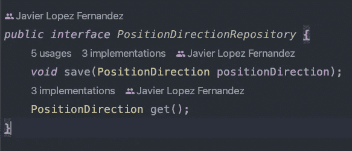
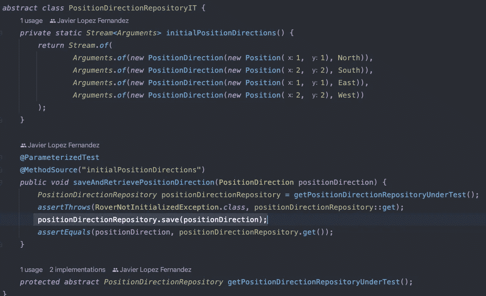
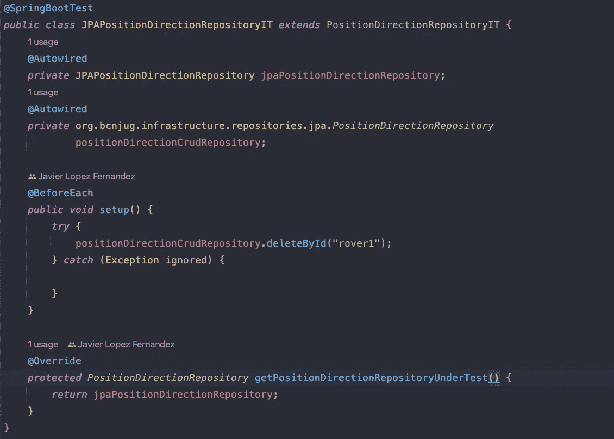
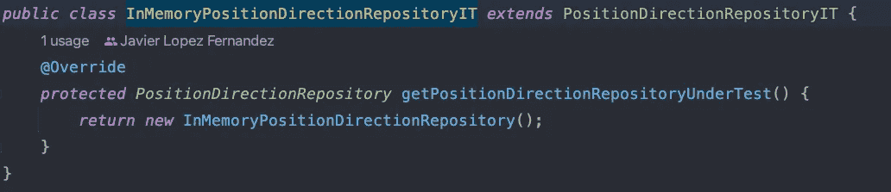

# 合同测试和测试替身

> 原文：<https://blog.devgenius.io/contract-testing-and-test-doubles-5d87b3321f1d?source=collection_archive---------3----------------------->

当我们谈到契约测试时，人们倾向于认为这是通过 HTTP 进行对话的服务之间的事情。契约测试远不止于此，它是一种确保你的软件的每一部分都与其他部分正常工作而无需支付创建 e2e 测试的成本的方法。

[pixabay](https://pixabay.com/es/photos/locomotora-de-vapor-locomotora-tren-106005/)

> 在力学中，齿轮从不单独工作。它们直接(布置在[齿轮系](https://en.wikipedia.org/wiki/Gear_train)中)或通过联轴器传递力。类似地，软件组件总是依赖的，交换消息或者改变可观察的状态。
> [不破契约链](https://marcingryszko.medium.com/dont-break-the-contract-chain-9d4459cd24a5)

[测试替身](/when-to-use-test-doubles-dba905a9069f?sk=16715ba4b4751a4017bfc38711d552a5)是真实组件的替代品，模仿其他组件的工作方式。但是我们如何验证这是真的发生了，这是契约测试试图解决的问题。

## 什么是合同？

> **合同**是双方或多方之间具有法律效力的协议，它创建、定义并管理双方之间的相互权利和义务。合同通常涉及货物、服务、金钱的转移，或在未来某个日期转移其中任何一项的承诺。如果发生违约，受害方可以寻求司法补救，如损害赔偿或解除合同。合同法是与合同有关的义务法的领域，其基础是协议必须得到履行的原则。
> [维基百科](https://en.wikipedia.org/wiki/Contract)

事实上，如果你想一想，当你使用一个测试替身时，有三个部分，那个测试替身的客户端(被测试的服务 SUT)，真正的实现和替身本身。
客户对其合作者做出了不同的假设，这些假设将通过双重测试进行验证。因为我们的测试使用了测试 double 来检查我们的 SUT。

这就是不喜欢使用测试替身的开发人员总是放在桌子上做集成测试的问题。事实上，你只测试双打，合同测试有助于你避免这个问题。无论如何，由于这是一组新的测试，我们应该尽量减少我们需要用合同测试检查的集成数量，这就是为什么我在我的层之间使用它们。

## 综合测试

> 集成测试是一个骗局——一个自我复制的病毒，威胁着你的代码库、你的项目和你的团队，给他们带来无尽的痛苦和折磨。
> [**综合测试是骗局**](https://blog.thecodewhisperer.com/permalink/integrated-tests-are-a-scam)

E2E 测试是集成测试，让我们最小化它们，使它们不相关。朝着这个方向努力的一个方法是使用合同测试来代替它们，另一个方法是[在设计我们的系统时考虑到这一点](/distributed-monolith-1d2d9f86a68f?sk=7b489fa66af30f9946142485df6784d6)。

## 自顶向下设计

然后我们需要做一些事情来检查真实的实现和测试 double 的行为是否相同。这两件事都将实现我们的 SUT 感兴趣的行为。
假设我们进行自顶向下的设计，我们将在创建真正的实现之前创建我们的测试 double(因为我们希望对我们的上层组件有早期的反馈)。
我们的 test double 实际上是我们想要创建的行为的另一个实现，一个简单且容易的实现。拥有一个行为的两个实现的最好方法是创建一个接口。该接口也将由真正的实现来实现。

我们的测试 double 的输入和输出需要对照实际的实现进行检查，这是我们的契约测试。

让我们以一个存储库为例来保存和检索数据库中的位置和方向，这是本例的界面:

然后，让我们创建一个契约测试，以确保真实的实现和测试副本的行为是相同的:

这是一个抽象类，包含每个实现需要通过的所有测试，每个不同的实现(测试加倍，真实的实现将扩展此类以解释如何创建 PositionDirectionRepository)。

是的，我对我的“InMemoryPositionDirectionRepository”进行了测试，它实际上是“PositionDirectionRepository”接口的“伪”实现。但是这些契约测试验证了我的假实现和我的真实实现通过了同一套测试。

这些测试是根据我的客户(界面的消费者)的需求创建的。
但是为什么要用这个来代替 E2E 测试呢？

## 好的测试

让我们记住理解一个测试的良好特性的首要原则:

*   快的
*   孤立/独立
*   可重复的
*   自我验证
*   彻底的

契约测试只是验证连接点的测试，在连接点上我们将使用 doubles。我们说过我们会尽量减少测试替身的使用，我们会尽量只在代码的不同层使用它们。看来合同测试比 e2e 更快、[更少的古怪](/flakiness-in-tests-b586c056e0a8?sk=22ad01266811dbe0f43f4aa997ac26e1)(自我验证)和更容易设置，你也可以更快地编写它们，并使用它们来减少你的反馈循环。
除此之外，失败的契约测试将总是解释契约的哪一部分被破坏，以及它是在双重测试中还是在实际实现中被破坏(更加孤立)。

> 肯特·贝克:“我是为有效的代码而不是测试获得报酬的”
> [stackoverflow](https://stackoverflow.com/questions/153234/how-deep-are-your-unit-tests/153565#153565)

进行大量的测试，一次又一次地测试完全相同的代码，进行大量的设置以使测试达到应用程序的正确状态，这没有多大价值。这是我喜欢契约测试胜过 e2e 的原因之一，因为它们帮助我编写构建我的应用程序的最小测试集。

事实上，仅在您控制的代码层之间使用 test-doubles 的决定为您提供了一种使用测试反馈来设计代码的方法。

> 如果您还不知道使用什么 db 或者最终的 rest-endpoint 是什么，那么可以使用 test doubles 来委托将来的决策。Doubles 将帮助您创建这些概念的包装器，这些概念将您(在一定程度上)与所有对构建您的业务逻辑不重要的特定决策隔离开来。
> 
> 使用 doubles 来降低生产代码的复杂性，从而减少您必须在 SUT 中创建的测试数量。
> 
> 有些开发人员试图避免使用测试替身，他们试图用真实的库和基础设施来测试一切。我不喜欢这种方法，因为大量集成或 e2e 测试的结果是低反馈循环(非常慢的流水线)。当测试反馈循环缓慢时，人们倾向于创建[大批量](/batching-1e23cc939710?sk=e4244dcaaa7cdd2ea676f07c6f0314d3)。
> [何时使用测试替身](/when-to-use-test-doubles-dba905a9069f?sk=16715ba4b4751a4017bfc38711d552a5)